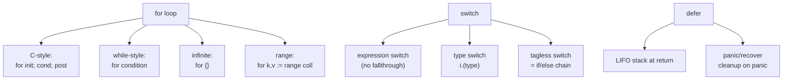

# Go Control Flow

> [!abstract] TL;DR
> Go has only one loop keyword (`for`) but expresses while, do-while, and range-based iteration through it. `if` and `switch` support an optional init statement. `defer` stacks function calls to run at return time and enables robust cleanup patterns. `panic`/`recover` are the exception mechanism but should be used sparingly.

---

## if / else

Go's `if` does not require parentheses around the condition, but braces are mandatory. The **init statement** executes before the condition and scopes a variable to the `if`/`else` block:

```go
// Simple if
if x > 0 {
    fmt.Println("positive")
}

// Init statement — err is scoped to the if/else block
if err := doWork(); err != nil {
    log.Fatal(err)
}
// err is not accessible here

// if-else chain
if score >= 90 {
    grade = "A"
} else if score >= 80 {
    grade = "B"
} else {
    grade = "C"
}
```

---

## for — The Only Loop

Go uses `for` for all iteration forms:

```go
// 1. Classic C-style for loop
for i := 0; i < 10; i++ {
    fmt.Println(i)
}

// 2. While-style (condition only)
for n < limit {
    n *= 2
}

// 3. Infinite loop
for {
    select {
    case msg := <-ch:
        process(msg)
    case <-done:
        return
    }
}

// 4. range over slice — index, value
for i, v := range []string{"a", "b", "c"} {
    fmt.Printf("%d: %s\n", i, v)
}

// 5. range over map — key, value (iteration order is random)
for k, v := range map[string]int{"a": 1, "b": 2} {
    fmt.Printf("%s=%d\n", k, v)
}

// 6. range over string — index (byte offset), rune (Unicode code point)
for i, r := range "Hello, 世界" {
    fmt.Printf("%d %c\n", i, r)
}

// 7. range over channel — reads until channel closed
for msg := range ch {
    process(msg)
}
```

---

## switch

Go's `switch` does **not** fall through by default (no `break` needed). `fallthrough` explicitly continues to the next case. The `switch` itself supports an init statement:

```go
// Expression switch
switch day {
case "Saturday", "Sunday":
    fmt.Println("weekend")
case "Monday":
    fmt.Println("start of week")
default:
    fmt.Println("weekday")
}

// Init statement in switch
switch os := runtime.GOOS; os {
case "linux":
    fmt.Println("Linux")
case "darwin":
    fmt.Println("macOS")
default:
    fmt.Println(os)
}

// Tagless switch — equivalent to if/else chain
switch {
case x < 0:
    fmt.Println("negative")
case x == 0:
    fmt.Println("zero")
default:
    fmt.Println("positive")
}

// Type switch — see [[Interfaces_in_Go]]
switch v := i.(type) {
case int:
    fmt.Printf("int: %d\n", v)
case string:
    fmt.Printf("string: %q\n", v)
default:
    fmt.Printf("unknown: %T\n", v)
}
```

---

## defer

`defer` pushes a function call onto a LIFO stack; the stack runs when the surrounding function returns — whether normally or via panic.

```go
func readFile(path string) ([]byte, error) {
    f, err := os.Open(path)
    if err != nil {
        return nil, err
    }
    defer f.Close()   // runs when readFile returns, even on error

    return io.ReadAll(f)
}

// Multiple defers — LIFO order
func demo() {
    defer fmt.Println("third")  // runs last
    defer fmt.Println("second")
    defer fmt.Println("first")  // runs first
    fmt.Println("body")
}
// Output: body, first, second, third

// Defer with a loop — common bug: defer inside a loop accumulates
// Use a closure or named function to scope the defer
for _, f := range files {
    f := f   // capture loop variable (pre-Go 1.22)
    func() {
        defer f.Close()
        process(f)
    }()
}
```

**panic / recover pattern** — `recover()` inside a deferred function catches a panic:

```go
func safeDiv(a, b int) (result int, err error) {
    defer func() {
        if r := recover(); r != nil {
            err = fmt.Errorf("recovered panic: %v", r)
        }
    }()
    return a / b, nil   // panics if b == 0
}
```

---

## Flow Diagram



---

## Implementation Example

```go
package main

import (
    "errors"
    "fmt"
    "os"
)

func classify(n int) string {
    switch {
    case n < 0:
        return "negative"
    case n == 0:
        return "zero"
    case n < 10:
        return "small"
    default:
        return "large"
    }
}

func processFile(path string) error {
    f, err := os.Open(path)
    if err != nil {
        return fmt.Errorf("open %s: %w", path, err)
    }
    defer f.Close()   // guaranteed cleanup

    // Init-statement if
    if info, err := f.Stat(); err == nil {
        fmt.Printf("size: %d bytes\n", info.Size())
    }
    return nil
}

func safeSqrt(n float64) (result float64, err error) {
    defer func() {
        if r := recover(); r != nil {
            err = errors.New("unexpected panic")
        }
    }()
    if n < 0 {
        panic("negative input")
    }
    // Manual sqrt for demo
    result = n // placeholder
    return
}

func main() {
    for i := -1; i <= 2; i++ {
        fmt.Printf("%d is %s\n", i, classify(i))
    }
    if err := processFile("go.mod"); err != nil {
        fmt.Println("error:", err)
    }
}
```

---

## Common Pitfalls

- **Defer inside a loop**: Deferred calls accumulate until the function returns, not the loop iteration. For per-iteration cleanup, use an anonymous function or a helper.
- **Loop variable capture in goroutines** (pre-Go 1.22): `go func() { fmt.Println(i) }()` captures the variable `i`, not its value. By Go 1.22, each loop iteration creates a new variable. In older code, use `i := i` to shadow.
- **`fallthrough` is unconditional**: It does not check the next case's condition — it always executes the next case body.
- **`goto` is valid but avoid it**: It cannot jump into a block where a new variable comes into scope.

---

## Review Questions

1. Write a `for` loop that behaves like `do { ... } while (condition)` — the body executes at least once.
2. What is the output order of multiple `defer` statements? Give an example with three defers.
3. Why is `defer f.Close()` placed immediately after checking the `err` from `os.Open`, rather than after?
4. Explain what `fallthrough` does in a Go `switch` and why it differs from C's default behavior.

---

#Go #Golang #ControlFlow #Defer #Switch #Fundamentals
