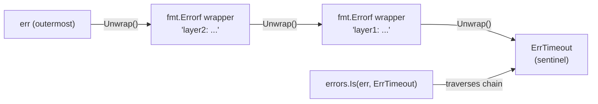

# Go Error Handling

> [!abstract] TL;DR
> Go treats errors as values via the `error` interface — functions return `(result, error)` and callers check explicitly. `fmt.Errorf` with `%w` wraps errors to preserve the chain. `errors.Is` checks for specific sentinel errors anywhere in the chain; `errors.As` extracts a typed error. `panic`/`recover` are for truly unexpected states, not routine error handling.

---

## The error Interface

`error` is a built-in interface with one method:

```go
type error interface {
    Error() string
}
```

Any type implementing `Error() string` satisfies `error`. The convention is to return `nil` for success and a non-nil `error` for failure. Callers check the error immediately:

```go
result, err := os.Open("file.txt")
if err != nil {
    // handle
}
```

---

## Creating Errors

```go
import (
    "errors"
    "fmt"
)

// errors.New — simple static message
var ErrNotFound = errors.New("not found")

// fmt.Errorf — formatted message, supports %w for wrapping
func findUser(id int) (*User, error) {
    if id <= 0 {
        return nil, fmt.Errorf("findUser: invalid id %d", id)
    }
    user, err := db.Query(id)
    if err != nil {
        return nil, fmt.Errorf("findUser %d: %w", id, err)   // wrap with %w
    }
    return user, nil
}
```

---

## Error Wrapping and Unwrapping

`%w` in `fmt.Errorf` wraps the original error so the chain is preserved. This lets callers inspect the chain:

```go
// errors.Is — checks if any error in the chain matches the target
var ErrTimeout = errors.New("timeout")

err := fmt.Errorf("layer2: %w", fmt.Errorf("layer1: %w", ErrTimeout))
fmt.Println(errors.Is(err, ErrTimeout))   // true — finds it in the chain

// errors.As — extracts a typed error from the chain
type ValidationError struct {
    Field   string
    Message string
}
func (e *ValidationError) Error() string {
    return fmt.Sprintf("validation: %s — %s", e.Field, e.Message)
}

var ve *ValidationError
if errors.As(err, &ve) {
    fmt.Printf("invalid field: %s\n", ve.Field)
}
```



---

## Sentinel Errors

Sentinel errors are package-level `var` errors used for comparison. They are part of a package's public API:

```go
// Standard library sentinels you'll encounter constantly
io.EOF              // end of file during read
os.ErrNotExist      // file does not exist
context.Canceled    // context was canceled
context.DeadlineExceeded

// Your own sentinel errors
var (
    ErrNotFound   = errors.New("not found")
    ErrUnauthorized = errors.New("unauthorized")
)

// Caller checks with errors.Is, not ==
// (== fails if the error was wrapped; errors.Is traverses the chain)
if errors.Is(err, ErrNotFound) {
    http.Error(w, "not found", http.StatusNotFound)
}
```

---

## Custom Error Types

Custom error types carry structured data that callers can extract:

```go
type HTTPError struct {
    Code    int
    Message string
}

func (e *HTTPError) Error() string {
    return fmt.Sprintf("HTTP %d: %s", e.Code, e.Message)
}

func fetchData(url string) ([]byte, error) {
    resp, err := http.Get(url)
    if err != nil {
        return nil, fmt.Errorf("fetchData: %w", err)
    }
    if resp.StatusCode >= 400 {
        return nil, &HTTPError{Code: resp.StatusCode, Message: resp.Status}
    }
    return io.ReadAll(resp.Body)
}

// Extract the concrete type
var he *HTTPError
if errors.As(err, &he) {
    fmt.Printf("status code: %d\n", he.Code)
}
```

---

## panic and recover

`panic` terminates normal execution and unwinds the stack, running deferred functions. `recover` inside a deferred function catches the panic:

```go
// panic: use for truly unexpected states, not routine errors
func mustParse(s string) int {
    n, err := strconv.Atoi(s)
    if err != nil {
        panic(fmt.Sprintf("mustParse: %q is not an integer", s))
    }
    return n
}

// recover: typically used at the top of a goroutine or HTTP handler
func safeHandler(h http.HandlerFunc) http.HandlerFunc {
    return func(w http.ResponseWriter, r *http.Request) {
        defer func() {
            if err := recover(); err != nil {
                log.Printf("panic: %v\n%s", err, debug.Stack())
                http.Error(w, "internal error", http.StatusInternalServerError)
            }
        }()
        h(w, r)
    }
}
```

**When to panic vs return error:**

| Situation | panic or error? |
|---|---|
| Invalid function argument (programming error) | `panic` |
| Unrecoverable state (corrupt invariant) | `panic` |
| Expected failure (file not found, network timeout) | `error` |
| Parse failure of user input | `error` |
| Initialization that must succeed (e.g., `regexp.MustCompile`) | `panic` |

---

## Implementation Example

```go
package main

import (
    "errors"
    "fmt"
    "strconv"
)

var ErrNegative = errors.New("negative number")

type ParseError struct {
    Input string
    Err   error
}

func (e *ParseError) Error() string {
    return fmt.Sprintf("parse %q: %v", e.Input, e.Err)
}

func (e *ParseError) Unwrap() error { return e.Err }

func parsePositive(s string) (int, error) {
    n, err := strconv.Atoi(s)
    if err != nil {
        return 0, &ParseError{Input: s, Err: fmt.Errorf("not an integer: %w", err)}
    }
    if n < 0 {
        return 0, &ParseError{Input: s, Err: fmt.Errorf("%w: got %d", ErrNegative, n)}
    }
    return n, nil
}

func main() {
    inputs := []string{"42", "-5", "abc", "100"}
    for _, in := range inputs {
        n, err := parsePositive(in)
        if err != nil {
            var pe *ParseError
            if errors.As(err, &pe) {
                fmt.Printf("ParseError for %q\n", pe.Input)
            }
            if errors.Is(err, ErrNegative) {
                fmt.Printf("  reason: negative\n")
            }
            continue
        }
        fmt.Printf("ok: %d\n", n)
    }
}
```

---

## Common Pitfalls

- **Comparing errors with `==`**: If the error was wrapped, `err == ErrNotFound` will be false even though the wrapped chain contains it. Always use `errors.Is`.
- **Swallowing errors**: `_, _ = doSomething()` silently drops both the result and error. At minimum log it.
- **`errors.New` vs sentinel var**: Declare sentinels as `var` (not `const`) so they are addressable for `errors.As`.
- **Panicking in library code**: Libraries should never `panic` for errors callers might reasonably encounter. Only panic for programmer mistakes (e.g., nil required argument).
- **Returning `*MyError` vs `error`**: Never return a concrete `*MyError` where an `error` interface is expected unless the value is truly nil — a `(*MyError)(nil)` is not nil as an `error`.

---

## Review Questions

1. What is the difference between `errors.Is` and `errors.As`? Give a use case for each.
2. Why is `return nil, myErr` safe but `return nil, (*MyErrorType)(nil)` dangerous?
3. Design a `retry` function that wraps an operation, retries up to N times, and wraps each attempt's error in the chain.
4. When is `panic` appropriate in a Go library? Give two examples.

---

#Go #Golang #ErrorHandling #Errors #Panic #Sentinel #Fundamentals
