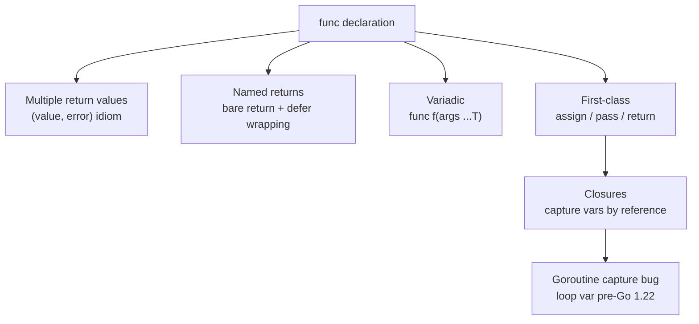

# Go Functions

> [!abstract] TL;DR
> Go functions are first-class values: they can be assigned to variables, passed as arguments, and returned from other functions. Multiple return values are idiomatic — the final return value is conventionally an `error`. Named return values enable clean defer-based cleanup. Closures capture variables by reference, which is a common source of goroutine bugs. Variadic functions accept zero or more trailing arguments.

---

## Function Basics

```go
// Basic function — all parameters and return types explicit
func add(a, b int) int {
    return a + b
}

// Multiple parameters of same type can share type annotation
func minMax(a, b int) (int, int) {
    if a < b {
        return a, b
    }
    return b, a
}

// Calling with multiple return values
lo, hi := minMax(7, 3)
```

---

## Multiple Return Values

Go's idiomatic pattern is `(value, error)` — callers must handle the error explicitly:

```go
import (
    "fmt"
    "strconv"
)

func divide(a, b float64) (float64, error) {
    if b == 0 {
        return 0, fmt.Errorf("divide by zero: a=%v", a)
    }
    return a / b, nil
}

result, err := divide(10.0, 3.0)
if err != nil {
    log.Fatal(err)
}
fmt.Printf("%.4f\n", result)

// Discard a return value with blank identifier
result, _ = divide(10.0, 2.0)   // ignoring error intentionally
```

---

## Named Return Values

Named returns define the return variables in the signature. A **bare `return`** returns the current values of the named variables. Useful with defer for error annotation:

```go
func readConfig(path string) (cfg Config, err error) {
    // defer can read and modify named return 'err'
    defer func() {
        if err != nil {
            err = fmt.Errorf("readConfig(%s): %w", path, err)
        }
    }()

    data, err := os.ReadFile(path)
    if err != nil {
        return   // bare return: cfg is zero value, err is set
    }
    err = json.Unmarshal(data, &cfg)
    return       // bare return: cfg is populated, err is nil or not
}
```

> [!warning] Avoid bare returns in long functions — they obscure what is being returned. Reserve them for short functions or defer-based error wrapping.

---

## Variadic Functions

A variadic function accepts zero or more arguments of the final type. Inside the function, the parameter is a slice:

```go
func sum(nums ...int) int {
    total := 0
    for _, n := range nums {
        total += n
    }
    return total
}

sum(1, 2, 3)          // 6
sum()                  // 0
nums := []int{1,2,3}
sum(nums...)           // spread slice into varargs — the ... operator
```

`fmt.Println`, `fmt.Sprintf`, and `append` are all variadic.

---

## First-Class Functions and Function Types

Functions are values in Go. You can assign them, pass them, and store them in data structures:

```go
// Function type declaration
type Predicate func(int) bool
type Transformer func(string) string

// Higher-order function
func filter(nums []int, keep Predicate) []int {
    var result []int
    for _, n := range nums {
        if keep(n) {
            result = append(result, n)
        }
    }
    return result
}

isEven := func(n int) bool { return n%2 == 0 }
evens := filter([]int{1, 2, 3, 4, 5}, isEven)

// Functions in a map — dispatch table
handlers := map[string]func(string) string{
    "upper": strings.ToUpper,
    "lower": strings.ToLower,
    "trim":  strings.TrimSpace,
}
result := handlers["upper"]("hello")   // "HELLO"
```

---

## Closures

A closure is a function that references variables from its enclosing scope. The closure captures the **variable itself** (by reference), not its value at creation time:

```go
// Counter closure — each call shares the same 'count' variable
func makeCounter() func() int {
    count := 0
    return func() int {
        count++
        return count
    }
}

c1 := makeCounter()
c2 := makeCounter()
fmt.Println(c1(), c1(), c1())   // 1 2 3
fmt.Println(c2())               // 1 (independent counter)

// Goroutine + closure capture bug (pre-Go 1.22)
for i := 0; i < 3; i++ {
    i := i   // shadow the loop variable to capture current value
    go func() {
        fmt.Println(i)   // safe: uses local i, not the loop variable
    }()
}
```

---

## Flow Diagram



---

## Implementation Example

```go
package main

import (
    "fmt"
    "strings"
)

// Middleware pattern using first-class functions
type Handler func(string) string

func withLogging(h Handler, prefix string) Handler {
    return func(input string) string {
        fmt.Printf("[%s] input: %q\n", prefix, input)
        result := h(input)
        fmt.Printf("[%s] output: %q\n", prefix, result)
        return result
    }
}

func withTrim(h Handler) Handler {
    return func(input string) string {
        return h(strings.TrimSpace(input))
    }
}

func main() {
    base := Handler(strings.ToUpper)
    pipeline := withLogging(withTrim(base), "transform")
    pipeline("  hello world  ")

    // Closure-based memoize
    cache := map[int]int{}
    var fib func(n int) int
    fib = func(n int) int {
        if n <= 1 {
            return n
        }
        if v, ok := cache[n]; ok {
            return v
        }
        result := fib(n-1) + fib(n-2)
        cache[n] = result
        return result
    }
    fmt.Println(fib(40))   // 102334155

    // Variadic sum
    sum := func(nums ...int) int {
        total := 0
        for _, n := range nums {
            total += n
        }
        return total
    }
    nums := []int{1, 2, 3, 4, 5}
    fmt.Println(sum(nums...))   // 15
}
```

---

## Common Pitfalls

- **Goroutine closure capture**: All goroutines in a loop that close over the loop variable share the same variable. Shadow it with `x := x` or pass it as an argument.
- **Bare returns in long functions**: Hard to read — always use explicit returns except in very short functions.
- **Nil function values**: Calling a `nil` function variable panics. Guard with `if fn != nil { fn() }`.
- **Variadic spread**: You can only spread a slice with `...` — you cannot spread an array without converting to a slice first: `arr[:]`.

---

## Review Questions

1. Write a `memoize` function that takes a `func(int) int` and returns a new function that caches results.
2. Explain the goroutine closure capture bug and show the fix using both the shadow variable technique and the argument-passing technique.
3. What is the difference between a named return and a regular return? When is the bare `return` safe to use?
4. Why is `fmt.Println(sum(nums...))` correct but `fmt.Println(sum(arr...))` (where `arr` is `[3]int`) a compile error?

---

#Go #Golang #Functions #Closures #Variadic #FirstClass #Fundamentals
