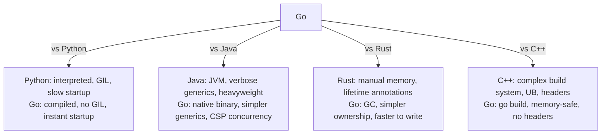

# Go Overview

> [!abstract] TL;DR
> Go (Golang) is a statically typed, compiled language designed at Google for simplicity, fast compilation, and built-in concurrency. It compiles to a single native binary, uses a concurrent garbage collector, and ships a zero-value philosophy that eliminates uninitialized memory bugs. Its minimal syntax and powerful standard library make it the dominant language for cloud infrastructure, APIs, and CLI tooling.

---

## Why Go Exists

Go was designed in 2007 by Robert Griesemer, Rob Pike, and Ken Thompson at Google to solve real engineering pain: C++ build times measured in minutes, Java verbosity and JVM startup overhead, Python dynamic-typing bugs in large codebases, and the general lack of a language that handled modern multicore hardware without ceremony.

The result is a language with a deliberately small specification (~100 pages) that reads in a weekend, yet covers the full systems-programming space.

---

## Go vs Other Languages



| Aspect | Go | Python | Java | Rust |
|---|---|---|---|---|
| Compilation | Native binary | Interpreted | JVM bytecode | Native binary |
| Memory safety | GC | GC | GC | Ownership/lifetimes |
| Concurrency | Goroutines + channels | GIL/asyncio | Threads/virtual threads | async/await + ownership |
| Startup time | ~2ms | ~50ms | ~200ms+ | ~2ms |
| Learning curve | Low | Low | Medium | High |
| Best for | APIs, CLIs, infra | ML, scripting | Enterprise, Android | Systems, embedded |

---

## Compilation Model

`go build` produces a **statically linked native binary** — no runtime interpreter, no shared library dependency (by default). This means:

- **Single binary deployment**: copy one file to a Linux server, it runs.
- **Fast builds**: the compiler is designed for parallel, incremental compilation. A 100k-line project builds in seconds.
- **Cross-compilation**: set `GOOS` and `GOARCH` env vars, run `go build`.

```bash
# Build for Linux from macOS/Windows
GOOS=linux GOARCH=amd64 go build -o myapp-linux ./cmd/myapp

# Run without building
go run main.go

# Build with version info baked in
go build -ldflags="-X main.Version=1.2.3" ./...
```

---

## Zero Values and the Blank Identifier

Every declared variable in Go is initialized to its **zero value** automatically — no uninitialized memory:

| Type | Zero value |
|---|---|
| `int`, `float64` | `0` |
| `bool` | `false` |
| `string` | `""` |
| pointer, slice, map, channel, func | `nil` |
| struct | all fields at their zero values |

The **blank identifier** `_` discards values the compiler would otherwise require you to use:

```go
// Discard error (deliberate — you've considered it)
val, _ := strconv.Atoi("42")

// Discard loop index
for _, v := range items { fmt.Println(v) }

// Import for side effects only (e.g. database driver registration)
import _ "github.com/lib/pq"
```

---

## Package System

Every `.go` file belongs to a package. The `main` package with a `main()` function is the entry point. Packages map to directories — one directory, one package name.

```go
package main

import (
    "fmt"
    "os"
    "time"

    "github.com/myorg/mylib"  // third-party module path
)

func main() {
    fmt.Println("Go", runtime.Version())
    os.Exit(0)
}
```

Exported identifiers start with a capital letter. `fmt.Println` is exported; `fmt.isSpace` is not. This is enforced by the compiler, not just convention.

---

## Garbage Collector

Go's GC is a concurrent, tri-color mark-and-sweep collector running alongside your program. Typical stop-the-world pauses are under 1ms. Key tuning knob: `GOGC` (default 100 — GC triggers when heap doubles). For latency-sensitive apps, `GOGC=50` trades more frequent collections for lower peak memory.

Go 1.18+ added a soft memory limit via `GOMEMLIMIT`:
```bash
GOMEMLIMIT=512MiB ./myapp   # GC becomes more aggressive before hitting the limit
```

---

## Implementation Example

```go
package main

import (
    "fmt"
    "runtime"
)

func main() {
    // Zero value demonstration
    var count int          // 0
    var name string        // ""
    var active bool        // false
    var scores []float64   // nil slice

    fmt.Printf("count=%d name=%q active=%v scores=%v\n",
        count, name, active, scores)

    // Blank identifier — discard loop index
    langs := []string{"Go", "Rust", "Python"}
    for _, lang := range langs {
        fmt.Println(lang)
    }

    fmt.Println("GOMAXPROCS:", runtime.GOMAXPROCS(0))
    fmt.Println("NumCPU:", runtime.NumCPU())
}
```

---

## Common Pitfalls

- **Unused imports**: Go refuses to compile if you import a package and never use it. This is enforced, not a warning.
- **Unused variables**: Local variables declared but never read are also a compile error. Use `_` if you need to discard.
- **Circular imports**: Go does not allow package A to import package B if B imports A. Restructure into a third package.
- **`go run` vs `go build`**: `go run` compiles and runs in a temp dir — useful for scripts, but leaves no binary artifact. Use `go build` for anything going to production.

---

## Review Questions

1. What does Go's zero-value philosophy eliminate at the language level, and how does it differ from Python's approach?
2. Explain why Go produces a statically linked binary and what operational benefit this provides in containerized deployments.
3. When would you use `GOMEMLIMIT` vs `GOGC` to tune the garbage collector?
4. What happens at compile time if you declare `x := 5` but never use `x`?

---

#Go #Golang #Overview #Fundamentals
