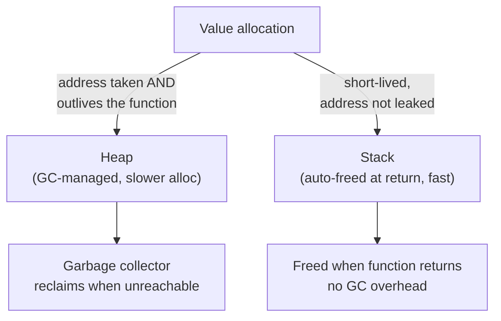

# Go Pointers and Memory

> [!abstract] TL;DR
> Go has pointers (`&` to take address, `*` to dereference) but no pointer arithmetic. `new(T)` allocates a zeroed T and returns `*T`; `make` initializes slice/map/channel headers. The compiler's escape analysis decides whether a value lives on the stack (fast, auto-freed) or heap (GC-managed). Value receivers copy; pointer receivers alias — choose based on mutation needs and size.

---

## Pointer Basics

```go
x := 42
p := &x        // p is *int — holds the address of x
fmt.Println(p)  // 0xc000014080 (some address)
fmt.Println(*p) // 42 — dereference: read through the pointer
*p = 100        // dereference: write through the pointer
fmt.Println(x)  // 100 — x was mutated via p

// Nil pointer — zero value of any pointer type
var q *int
fmt.Println(q == nil)   // true
// *q = 5  — would panic: nil pointer dereference
```

> [!danger] No pointer arithmetic in Go. You cannot do `p++` to advance to the next int. Use slices for indexed access. The `unsafe` package is the escape hatch — rarely needed.

---

## new() vs make()

These two allocation functions are often confused:

| Function | What it allocates | Returns | Used for |
|---|---|---|---|
| `new(T)` | A zeroed T | `*T` | Any type — mostly structs |
| `make(T, args)` | Initialized internal structure | `T` (not a pointer) | slice, map, channel only |

```go
// new — allocates a zero-value int, returns *int
p := new(int)    // *p == 0
*p = 42

// Equivalent to:
var x int
p = &x

// make — initializes a slice header (len, cap, backing array)
s := make([]int, 5, 10)      // len=5, cap=10, all zeros
m := make(map[string]int)    // empty map, ready to write
ch := make(chan int, 100)     // buffered channel

// Composite literal (most common for structs)
type Point struct{ X, Y float64 }
pt := &Point{X: 1, Y: 2}    // allocates Point, returns *Point
```

---

## Value vs Pointer Receivers

Methods with **value receivers** operate on a copy. Methods with **pointer receivers** alias the original struct. They have different capabilities and constraints:

```go
type Counter struct {
    count int
}

// Value receiver — cannot mutate the original
func (c Counter) Value() int {
    return c.count
}

// Pointer receiver — can mutate, more efficient for large structs
func (c *Counter) Increment() {
    c.count++
}

func (c *Counter) Reset() {
    c.count = 0
}
```

**Rules:**
- If any method needs to mutate the receiver → use pointer receivers for ALL methods on that type (consistency).
- If the struct is large → use pointer receiver to avoid copying.
- Small, immutable value types (e.g., `time.Time`, coordinates) → value receivers are fine.
- Pointer receivers allow calling on nil (useful for optional/list node patterns).

```go
c := Counter{}
c.Increment()   // Go auto-takes address: (&c).Increment()
fmt.Println(c.Value())   // 1
```

---

## Escape Analysis

The Go compiler decides whether a value lives on the **stack** or **heap** via escape analysis:



**Causes of heap escape:**
1. Taking the address of a local and returning it.
2. Storing a value in an interface (boxing).
3. Sending a value to a goroutine that outlives the current function.
4. Values that are too large for the stack.

```bash
# See escape decisions during compilation
go build -gcflags="-m" ./...

# Output example:
# ./main.go:12:9: &x escapes to heap
# ./main.go:20:13: p does not escape
```

Avoiding unnecessary heap allocation (e.g., by reusing objects with `sync.Pool`, avoiding interface boxing in hot paths) is a key Go performance technique. See [[Go_Performance]].

---

## Implementation Example

```go
package main

import "fmt"

type Node struct {
    Val  int
    Next *Node
}

// Returns a *Node — allocated on heap because it escapes the function
func newNode(val int) *Node {
    return &Node{Val: val}
}

// Linked list insertion using pointer-to-pointer
func prepend(head **Node, val int) {
    n := newNode(val)
    n.Next = *head
    *head = n
}

func printList(head *Node) {
    for head != nil {
        fmt.Printf("%d ", head.Val)
        head = head.Next
    }
    fmt.Println()
}

// Nil receiver pattern — method can be called on nil pointer safely
func (n *Node) String() string {
    if n == nil {
        return "<nil>"
    }
    return fmt.Sprintf("%d->%s", n.Val, n.Next.String())
}

func main() {
    var head *Node
    prepend(&head, 3)
    prepend(&head, 2)
    prepend(&head, 1)
    printList(head)       // 1 2 3
    fmt.Println(head.String())   // 1->2->3-><nil>

    // Pointer to struct vs copy
    p := &Node{Val: 42}
    q := *p            // q is a COPY of the Node struct
    q.Val = 99
    fmt.Println(p.Val, q.Val)   // 42 99 — p unchanged
}
```

---

## Common Pitfalls

- **Nil pointer dereference**: Check for nil before dereferencing. A common pattern is `if p != nil { use(*p) }`.
- **Mismatched receiver types**: If you define `func (c *Counter) Inc()`, you cannot call it on a non-addressable value (e.g., a map value: `m["key"].Inc()` is a compile error).
- **`new` vs `make` confusion**: `new([]int)` returns `*[]int` pointing to a nil slice — not useful. Use `make([]int, n)` to get a ready-to-use slice.
- **Premature optimization of escape**: Trust the compiler. Only audit escapes when pprof shows allocation pressure in a specific hot path.

---

## Review Questions

1. Explain the difference between `new(Counter)` and `&Counter{}`. Which is more idiomatic?
2. You have a `type BigStruct [1024]byte`. Should methods on it use value or pointer receivers? Why?
3. When does a local variable allocated with `:=` escape to the heap? Name three causes.
4. Why does `m["key"].Field = 1` (where `m` is a `map[string]SomeStruct`) fail to compile?

---

#Go #Golang #Pointers #Memory #EscapeAnalysis #Fundamentals
