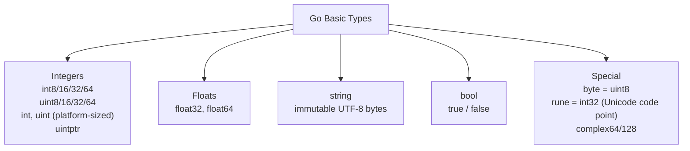

# Go Types and Variables

> [!abstract] TL;DR
> Go is statically typed with type inference. Variables can be declared with `var`, `:=` short declaration, or as package-level constants with `const`. Basic types include sized integers, floats, `string`, `bool`, `byte` (uint8), and `rune` (int32). The `iota` enumerator enables clean enum patterns. Type conversions are always explicit — no implicit numeric widening.

---

## Variable Declaration Forms

Go provides three ways to declare variables, each with a specific use:

```go
// 1. Full var declaration — used at package scope or when zero value is meaningful
var count int          // zero value = 0
var name string        // zero value = ""
var enabled bool       // zero value = false
var ratio float64 = 3.14

// 2. Short declaration — inside functions only, requires at least one new variable
x := 42
msg := "hello"
pi := 3.14159

// 3. Block declaration — groups related vars, common for package-level
var (
    Host    = "localhost"
    Port    = 8080
    Timeout = 30
)
```

> [!warning] Short declaration `:=` is not allowed at package scope. Use `var` for package-level variables.

---

## Basic Types



**Platform-sized types:**
- `int`/`uint` are 32-bit on 32-bit platforms, 64-bit on 64-bit platforms. Use them for general integer work.
- `int64` when you need a guaranteed 64-bit range (e.g., timestamps, file offsets).
- `byte` (alias for `uint8`) is the natural type for raw binary data.
- `rune` (alias for `int32`) represents a Unicode code point. Iterating a `string` with `range` yields `rune` values, not bytes.

---

## Type Inference and Type Conversions

Go infers the type of a `:=` expression from the right-hand side. Integer literals default to `int`, float literals to `float64`, string literals to `string`.

**All type conversions are explicit** — no implicit widening or narrowing:

```go
var i int = 42
var f float64 = float64(i)   // explicit: int → float64
var u uint = uint(f)          // explicit: float64 → uint (truncates)

// String conversions
s := string(rune(65))         // "A" — rune to string
n, err := strconv.Atoi("42")  // string to int — can fail, returns error
str := strconv.Itoa(n)        // int to string — always succeeds
b := []byte("hello")          // string to []byte — copy
str2 := string(b)             // []byte to string — copy
```

> [!danger] `string(42)` does NOT produce `"42"` — it produces the Unicode character U+002A (`"*"`). Always use `strconv.Itoa` or `fmt.Sprintf("%d", n)` for integer-to-string conversion.

---

## Constants and iota

Constants are evaluated at compile time. They can be untyped (flexible) or typed (strict):

```go
const Pi = 3.14159          // untyped float constant — adapts to context
const MaxSize int = 1024    // typed — only usable where int is expected

// iota: auto-incrementing integer counter, reset to 0 in each const block
type Weekday int
const (
    Sunday Weekday = iota   // 0
    Monday                   // 1
    Tuesday                  // 2
    Wednesday                // 3
    Thursday                 // 4
    Friday                   // 5
    Saturday                 // 6
)

// iota in expressions
type ByteSize float64
const (
    _           = iota               // discard 0
    KB ByteSize = 1 << (10 * iota)  // 1 << 10 = 1024
    MB                               // 1 << 20
    GB                               // 1 << 30
    TB                               // 1 << 40
)

// Bitmask flags
type Permission uint
const (
    Read    Permission = 1 << iota  // 1
    Write                            // 2
    Execute                          // 4
)
```

---

## Composite Literals

Composite literals initialize structs, arrays, slices, and maps in one expression:

```go
type Point struct{ X, Y float64 }

// Struct literal
p := Point{X: 3.0, Y: 4.0}
p2 := Point{3.0, 4.0}   // positional — fragile if fields reorder

// Slice literal
primes := []int{2, 3, 5, 7, 11}

// Map literal
grades := map[string]int{
    "Alice": 95,
    "Bob":   87,
}

// Array literal (fixed size, rarely used directly)
coords := [3]float64{1.0, 2.0, 3.0}
```

---

## Implementation Example

```go
package main

import (
    "fmt"
    "strconv"
    "unicode/utf8"
)

type Direction int

const (
    North Direction = iota
    East
    South
    West
)

func (d Direction) String() string {
    return [...]string{"North", "East", "South", "West"}[d]
}

func main() {
    // Type inference
    x := 100
    ratio := 0.75
    msg := "こんにちは"

    // rune vs byte distinction
    fmt.Println("byte length:", len(msg))                       // 15 (UTF-8 bytes)
    fmt.Println("rune length:", utf8.RuneCountInString(msg))    // 5 (characters)

    // Iterating over runes
    for i, r := range msg {
        fmt.Printf("index=%d rune=%c codepoint=U+%04X\n", i, r, r)
    }

    // Explicit conversion
    f := float64(x) * ratio
    fmt.Println(strconv.FormatFloat(f, 'f', 2, 64))

    // iota enum
    d := North
    fmt.Println(d, int(d))   // North 0

    // Bitmask
    type Perm uint
    const (
        Read  Perm = 1 << iota // 1
        Write                   // 2
        Exec                    // 4
    )
    userPerm := Read | Write
    fmt.Printf("can read: %v, can exec: %v\n",
        userPerm&Read != 0, userPerm&Exec != 0)
}
```

---

## Common Pitfalls

- **`string(intVal)` is not number-to-string**: Use `strconv.Itoa` or `fmt.Sprintf`.
- **`int` vs `int64`**: Mixing them requires explicit cast. `len()` returns `int`, not `int64`, causing friction when working with large indices.
- **Shadowing with `:=`**: In nested scopes, `:=` creates a new variable that shadows the outer one. The outer variable is unchanged.
- **Untyped constants behave like arbitrary precision**: `const Big = 1 << 62` compiles even if `int` is 32-bit — the value is only checked when used in a typed context.

---

## Review Questions

1. What is the zero value for a `map[string]int`? What happens if you try to write to it?
2. Explain why `string(65)` produces `"A"` rather than `"65"`.
3. Using `iota`, write a `FileMode` type that represents `Read`, `Write`, `Exec` as bitmask flags.
4. Why does Go require explicit type conversions between `int` and `float64` when most other languages allow implicit widening?

---

#Go #Golang #Types #Variables #Constants #iota #Fundamentals
