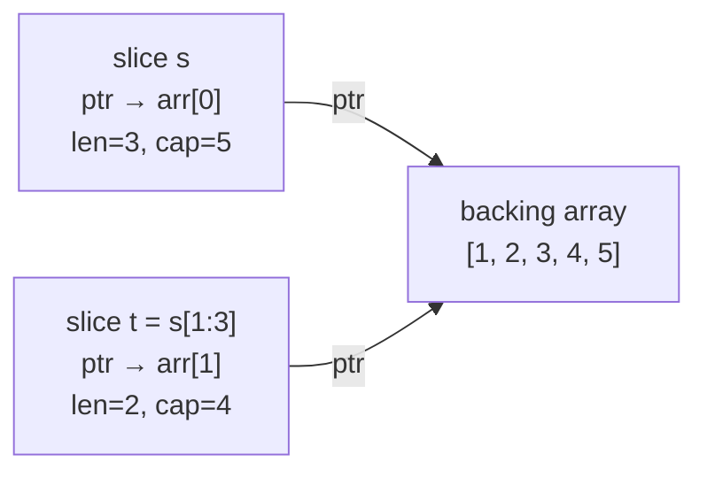

# Go Collections

> [!abstract] TL;DR
> Go's primary collections are slices (dynamic arrays with a header of pointer/len/cap) and maps (hash tables). Arrays are fixed-size and rarely used directly. Slices share underlying arrays unless copied — this is the source of aliasing bugs. Maps are reference types, not thread-safe, and have non-deterministic iteration order. `range` iterates over all collection types including channels and strings.

---

## Arrays vs Slices

**Arrays** are fixed-size, value types — copying an array copies all elements:

```go
var a [5]int           // [0 0 0 0 0] — zero value
b := [3]string{"x", "y", "z"}
c := [...]int{1, 2, 3, 4}   // compiler counts: [4]int

// Arrays are comparable
[3]int{1,2,3} == [3]int{1,2,3}   // true
```

**Slices** are dynamic views into an underlying array, described by a 3-word header: `(pointer, length, capacity)`:

```go
s := []int{1, 2, 3}          // slice literal
s2 := make([]int, 5)         // len=5, cap=5, all zeros
s3 := make([]int, 3, 10)     // len=3, cap=10

// Slice of an array
arr := [5]int{1,2,3,4,5}
slice := arr[1:4]            // [2 3 4] — shares arr's memory!
slice[0] = 99                // modifies arr[1]

// Appending
s = append(s, 4, 5)         // may allocate a new backing array if cap exceeded
```

---

## Slice Header and Aliasing



**Mutation via alias:**
```go
a := []int{1, 2, 3, 4, 5}
b := a[1:3]        // b = [2, 3], shares backing array with a
b[0] = 99          // a[1] is now 99!
fmt.Println(a)     // [1 99 3 4 5]

// To avoid aliasing, copy
c := make([]int, len(b))
copy(c, b)         // c is independent
```

---

## Slice Tricks

```go
// Append one slice to another
a = append(a, b...)

// Delete element at index i (order-preserving)
a = append(a[:i], a[i+1:]...)

// Delete element at index i (fast, unordered — replaces with last)
a[i] = a[len(a)-1]
a = a[:len(a)-1]

// Insert at index i
a = append(a[:i+1], a[i:]...)
a[i] = newValue

// Copy a slice safely
clone := append([]int(nil), original...)
// or
clone := make([]int, len(original))
copy(clone, original)

// 2D slice
matrix := make([][]int, rows)
for i := range matrix {
    matrix[i] = make([]int, cols)
}
```

---

## Maps

Maps are hash tables — reference types, always pass by reference:

```go
// Creation
m := make(map[string]int)
m2 := map[string]int{"a": 1, "b": 2}   // map literal

// Write
m["key"] = 42

// Read with comma-ok — distinguish missing key from zero value
v, ok := m["key"]
if !ok {
    // key does not exist
}

// Delete
delete(m, "key")

// Iteration — random order!
for k, v := range m {
    fmt.Printf("%s: %d\n", k, v)
}

// Length
fmt.Println(len(m))

// Nil map — safe to read (returns zero value), panics on write
var nilMap map[string]int
_ = nilMap["x"]   // safe: returns 0
nilMap["x"] = 1   // panic: assignment to entry in nil map
```

---

## Map Patterns

```go
// Counting occurrences
words := strings.Fields("the quick brown fox the quick")
freq := make(map[string]int)
for _, w := range words {
    freq[w]++   // safe: missing key returns 0
}

// Set (using map[T]struct{} — struct{} uses zero bytes)
seen := make(map[string]struct{})
seen["alice"] = struct{}{}
_, exists := seen["alice"]   // true

// Grouping
type Person struct{ Name, Dept string }
people := []Person{{"Alice", "Eng"}, {"Bob", "HR"}, {"Carol", "Eng"}}
byDept := make(map[string][]Person)
for _, p := range people {
    byDept[p.Dept] = append(byDept[p.Dept], p)
}

// Nested map
nested := map[string]map[string]int{
    "alice": {"score": 95, "rank": 1},
}
// Check inner map before writing to nested maps
if nested["bob"] == nil {
    nested["bob"] = make(map[string]int)
}
nested["bob"]["score"] = 87
```

---

## range Over Different Types

```go
// Slice — index, value
for i, v := range []int{1, 2, 3} {}

// Map — key, value (random order)
for k, v := range map[string]int{} {}

// String — byte offset, rune (Unicode code point)
for i, r := range "Hello, 世界" {}

// Channel — receive until closed
for msg := range ch {}

// range over integer (Go 1.22+)
for i := range 5 {   // i = 0,1,2,3,4
    fmt.Println(i)
}
```

---

## Implementation Example

```go
package main

import (
    "fmt"
    "sort"
    "strings"
)

func wordFrequency(text string) map[string]int {
    freq := make(map[string]int)
    for _, word := range strings.Fields(strings.ToLower(text)) {
        freq[word]++
    }
    return freq
}

func topN(freq map[string]int, n int) []string {
    type kv struct {
        key   string
        count int
    }
    var pairs []kv
    for k, v := range freq {
        pairs = append(pairs, kv{k, v})
    }
    sort.Slice(pairs, func(i, j int) bool {
        if pairs[i].count == pairs[j].count {
            return pairs[i].key < pairs[j].key
        }
        return pairs[i].count > pairs[j].count
    })
    result := make([]string, 0, n)
    for i := 0; i < n && i < len(pairs); i++ {
        result = append(result, fmt.Sprintf("%s:%d", pairs[i].key, pairs[i].count))
    }
    return result
}

func main() {
    text := "go is great go is fast go is simple"
    freq := wordFrequency(text)
    fmt.Println(topN(freq, 3))   // [go:3 is:3 fast:1]

    // Slice aliasing demo
    a := []int{1, 2, 3, 4, 5}
    b := a[1:3]
    b[0] = 99
    fmt.Println(a)   // [1 99 3 4 5]

    // Safe copy
    c := make([]int, len(b))
    copy(c, b)
    c[0] = 0
    fmt.Println(b)   // [99 3] — unchanged
}
```

---

## Common Pitfalls

- **Writing to a nil map panics**: Always `make` a map before writing. Reading from a nil map is safe.
- **Map iteration order is random**: Never rely on order. Sort keys explicitly when order matters.
- **Slice aliasing after append**: If `append` does NOT grow the slice (cap is sufficient), the new element modifies the shared backing array — a subtle bug.
- **`len(nil slice)` is 0**: Safe to range over a nil slice. But `append` to a nil slice works: it returns a new slice.

---

## Review Questions

1. What is a slice header? If `a := []int{1,2,3,4,5}` and `b := a[1:3]`, draw the memory layout showing both headers and the backing array.
2. Why does map iteration order vary across runs? (Hint: look at Go's deliberate randomization.)
3. Write a function `difference(a, b []string) []string` that returns elements in `a` not in `b` in O(n+m) time using a map as a set.
4. After `b := append(a, 99)`, is `a` modified? Explain when yes and when no.

---

#Go #Golang #Slices #Maps #Arrays #Collections #range
