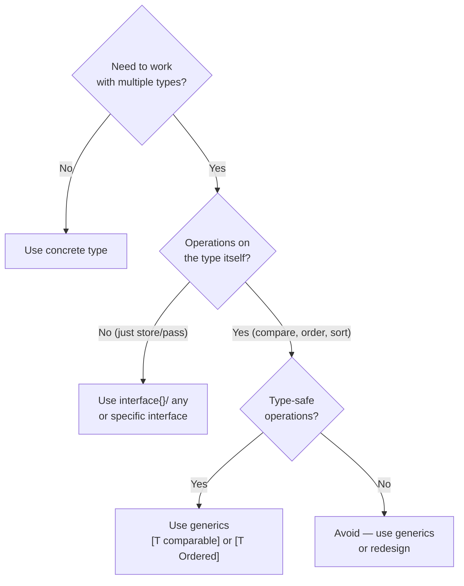

# Go Generics

> [!abstract] TL;DR
> Go 1.18 introduced generics via type parameters in square brackets. A type parameter is constrained by an interface that defines what operations are allowed. `comparable` enables `==`/`!=`. Union type constraints (`int | float64 | string`) allow ordered operations. The `slices` and `maps` packages (Go 1.21+) provide generic utilities. Use generics to eliminate `interface{}` repetition and type-assertion casting in container code.

---

## Why Generics

Before generics, reusable container code required `interface{}` and runtime type assertions:

```go
// Pre-generics: verbose and unsafe
func Contains(slice []interface{}, item interface{}) bool {
    for _, v := range slice {
        if v == item { return true }
    }
    return false
}
// Caller: Contains([]interface{}{1,2,3}, 2) — boxing overhead

// With generics: type-safe, no boxing for comparable types
func Contains[T comparable](slice []T, item T) bool {
    for _, v := range slice {
        if v == item { return true }
    }
    return false
}
// Caller: Contains([]int{1,2,3}, 2)   — no interface conversion
```

---

## Type Parameters Syntax

```go
// Generic function — T is a type parameter constrained by comparable
func Map[T, U any](slice []T, fn func(T) U) []U {
    result := make([]U, len(slice))
    for i, v := range slice {
        result[i] = fn(v)
    }
    return result
}

// Multiple type parameters
func Zip[T, U any](a []T, b []U) []struct{ A T; B U } {
    n := min(len(a), len(b))
    result := make([]struct{ A T; B U }, n)
    for i := range n {
        result[i] = struct{ A T; B U }{A: a[i], B: b[i]}
    }
    return result
}

// Type inference — compiler infers T from arguments
doubled := Map([]int{1, 2, 3}, func(x int) int { return x * 2 })
strs := Map([]int{1, 2, 3}, strconv.Itoa)
```

---

## Type Constraints

Constraints are interfaces that restrict what types a type parameter can be:

```go
// comparable — supports == and != (built-in)
// any = interface{} — no restrictions

// Union type constraint — only the listed types
type Number interface {
    int | int8 | int16 | int32 | int64 |
    uint | uint8 | uint16 | uint32 | uint64 |
    float32 | float64
}

// ~ means "underlying type is T" — allows type aliases
type Ordered interface {
    ~int | ~float64 | ~string
}

func Min[T Ordered](a, b T) T {
    if a < b {
        return a
    }
    return b
}

// Interface constraint with methods
type Stringer interface {
    String() string
}

func PrintAll[T Stringer](items []T) {
    for _, item := range items {
        fmt.Println(item.String())
    }
}
```

---

## Generic Types

Types (structs) can also have type parameters:

```go
// Generic Stack
type Stack[T any] struct {
    items []T
}

func (s *Stack[T]) Push(item T) {
    s.items = append(s.items, item)
}

func (s *Stack[T]) Pop() (T, bool) {
    var zero T
    if len(s.items) == 0 {
        return zero, false
    }
    n := len(s.items) - 1
    item := s.items[n]
    s.items = s.items[:n]
    return item, true
}

func (s *Stack[T]) Len() int { return len(s.items) }

// Usage
intStack := &Stack[int]{}
intStack.Push(1)
intStack.Push(2)
v, ok := intStack.Pop()   // v=2, ok=true
```

---

## slices and maps Packages (Go 1.21+)

The `slices` and `maps` packages provide generic utilities that used to require loops:

```go
import (
    "slices"
    "maps"
)

nums := []int{3, 1, 4, 1, 5, 9, 2, 6}

slices.Sort(nums)                          // in-place sort
idx, found := slices.BinarySearch(nums, 5) // binary search
slices.Contains(nums, 4)                  // true
slices.Reverse(nums)                      // in-place reverse
slices.Compact(nums)                      // remove consecutive duplicates
unique := slices.Compact(slices.Clone(nums))

// maps utilities
m := map[string]int{"a": 1, "b": 2}
keys := slices.Sorted(maps.Keys(m))       // sorted key slice
maps.Copy(dst, src)                        // merge maps
maps.DeleteFunc(m, func(k string, v int) bool {
    return v < 2
})
```

---

## When to Use Generics vs interface{}



---

## Implementation Example

```go
package main

import (
    "fmt"
    "slices"
)

// Generic Result type — encapsulates success or failure
type Result[T any] struct {
    value T
    err   error
}

func Ok[T any](v T) Result[T]       { return Result[T]{value: v} }
func Err[T any](err error) Result[T] { return Result[T]{err: err} }

func (r Result[T]) Unwrap() (T, error) { return r.value, r.err }

func (r Result[T]) OrElse(def T) T {
    if r.err != nil {
        return def
    }
    return r.value
}

// Generic filter
func Filter[T any](slice []T, pred func(T) bool) []T {
    var result []T
    for _, v := range slice {
        if pred(v) {
            result = append(result, v)
        }
    }
    return result
}

// Generic groupBy
func GroupBy[T any, K comparable](slice []T, key func(T) K) map[K][]T {
    groups := make(map[K][]T)
    for _, v := range slice {
        k := key(v)
        groups[k] = append(groups[k], v)
    }
    return groups
}

func main() {
    nums := []int{1, 2, 3, 4, 5, 6, 7, 8, 9, 10}
    evens := Filter(nums, func(n int) bool { return n%2 == 0 })
    fmt.Println(evens)   // [2 4 6 8 10]

    words := []string{"cat", "car", "dog", "door", "can"}
    byFirst := GroupBy(words, func(s string) byte { return s[0] })
    keys := make([]byte, 0, len(byFirst))
    for k := range byFirst { keys = append(keys, k) }
    slices.Sort(keys)
    for _, k := range keys {
        fmt.Printf("%c: %v\n", k, byFirst[k])
    }

    r := Ok(42)
    fmt.Println(r.OrElse(-1))   // 42
}
```

---

## Common Pitfalls

- **Type parameters don't support operators by default**: `v1 + v2` requires the `Number` or `Ordered` constraint.
- **Cannot use a generic type parameter as a map key without `comparable`**: `map[T]V` requires `T comparable`.
- **Generic methods on generic types**: You cannot add additional type parameters to a method — only to the type itself.
- **Overusing generics**: Don't generify code that only has one or two callers. The verbosity trade-off isn't worth it.

---

## Review Questions

1. What is the `~` tilde operator in a type constraint, and why is it needed?
2. Write a generic `Set[T comparable]` type with `Add`, `Contains`, and `Remove` methods.
3. When should you use `interface{}` instead of a type parameter?
4. Can you define a method with its own type parameter on a generic struct? Why or why not?

---

#Go #Golang #Generics #TypeParameters #TypeConstraints
