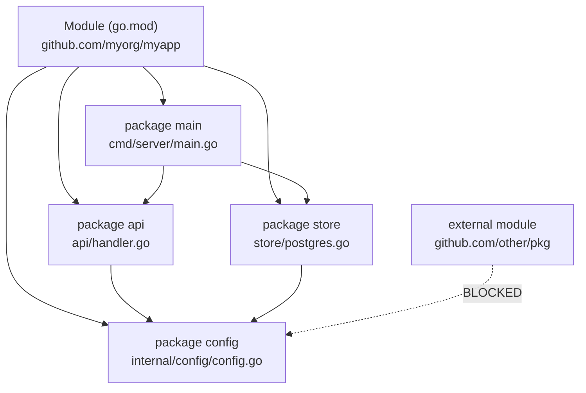

# Go Packages and Modules

> [!abstract] TL;DR
> A Go **package** is a directory of `.go` files sharing a `package` declaration. A **module** is a tree of packages versioned together, declared in `go.mod`. Exported identifiers start with uppercase. The `init()` function runs once at import time. `go mod tidy` reconciles dependencies. Internal packages can only be imported by code within the parent directory tree.

---

## Package Basics

Every `.go` file declares its package at the top. All files in the same directory must share the same package name. The package name is conventionally the last element of the import path:

```
project/
├── go.mod
├── main.go          package main
├── api/
│   ├── handler.go   package api
│   └── middleware.go package api
├── store/
│   └── postgres.go  package store
└── internal/
    └── config/
        └── config.go package config
```

```go
// main.go
package main

import (
    "fmt"
    "os"

    "github.com/myorg/myapp/api"    // import path = module path + directory path
    "github.com/myorg/myapp/store"
)

func main() {
    store.Connect(os.Getenv("DB_URL"))
    api.ListenAndServe(":8080")
    fmt.Println("done")
}
```

---

## Exported vs Unexported

Go uses naming as the visibility mechanism — no `public`/`private` keywords:

```go
package store

// Exported — accessible from outside the package
type User struct {
    ID    int
    Name  string
    email string   // unexported — only accessible within the store package
}

func NewUser(name, email string) *User {
    return &User{Name: name, email: email}
}

// Unexported — helper, not part of the public API
func validateEmail(email string) bool {
    return strings.Contains(email, "@")
}
```

---

## init() Function

`init()` runs automatically after all package-level variables are initialized, and before `main()`. Each file can have multiple `init()` functions. Use for:
- Registering drivers (e.g., `database/sql` driver registration)
- Validating configuration at startup
- Initializing package-level state

```go
package store

import "database/sql"
import _ "github.com/lib/pq"   // blank import — triggers pq's init() which registers the driver

var db *sql.DB

func init() {
    // package-level setup
}
```

> [!warning] Avoid complex logic in `init()`. It runs at import time, making it hard to test and control. Prefer explicit initialization functions called from `main`.

---

## go.mod and Module System

```
module github.com/myorg/myapp

go 1.22

require (
    github.com/gin-gonic/gin v1.9.1
    gorm.io/gorm v1.25.5
    gorm.io/driver/postgres v1.5.4
)

require (
    // indirect dependencies managed automatically
    github.com/bytedance/sonic v1.9.1 // indirect
)

// replace: redirect a dependency to a local path (dev mode)
replace github.com/myorg/mylib => ../mylib
```

**Common commands:**

```bash
go mod init github.com/myorg/myapp   # create go.mod
go get github.com/gin-gonic/gin@v1.9.1  # add/upgrade dependency
go get github.com/some/pkg@none         # remove a dependency
go mod tidy                              # remove unused, add missing
go mod vendor                            # copy dependencies to vendor/
go mod download                          # download to module cache
go list -m all                           # list all dependencies
```

---

## Semantic Versioning and Major Versions

Go modules follow semantic versioning. A v2+ major version change requires a different import path:

```go
// v1 import
import "github.com/some/pkg"

// v2 import — different module path, different major version
import "github.com/some/pkg/v2"
```

This allows v1 and v2 to coexist in the same binary.

---

## Internal Packages

Files in a directory named `internal` can only be imported by code rooted at the parent of `internal`:

```
myapp/
├── go.mod           module github.com/myorg/myapp
├── cmd/
│   └── server/
│       └── main.go  can import internal/config
├── internal/
│   └── config/
│       └── config.go  package config
└── pkg/
    └── api/
        └── handler.go  can import internal/config
                         (parent: myapp — same module root)
```

External packages `github.com/otherorg/something` cannot import `github.com/myorg/myapp/internal/config`. This enforces package privacy without Go visibility rules.

---

## Workspace Mode (go.work)

Workspaces let you develop multiple modules simultaneously without using `replace` directives:

```bash
go work init ./myapp ./mylib   # creates go.work
go work use ./another-module    # add a module to the workspace
```

```
// go.work
go 1.22

use (
    ./myapp
    ./mylib
)
```

Ideal for monorepos or when developing a library alongside its consumer.

---

## Package Diagram



---

## Implementation Example

```go
// store/user.go
package store

import (
    "context"
    "fmt"
)

type User struct {
    ID   int
    Name string
}

type UserStore interface {
    Get(ctx context.Context, id int) (*User, error)
    Create(ctx context.Context, u *User) error
}

type memoryStore struct {
    users map[int]*User
    next  int
}

func NewMemoryStore() UserStore {
    return &memoryStore{users: make(map[int]*User), next: 1}
}

func (s *memoryStore) Get(_ context.Context, id int) (*User, error) {
    u, ok := s.users[id]
    if !ok {
        return nil, fmt.Errorf("user %d: not found", id)
    }
    return u, nil
}

func (s *memoryStore) Create(_ context.Context, u *User) error {
    u.ID = s.next
    s.next++
    s.users[u.ID] = u
    return nil
}
```

---

## Common Pitfalls

- **Circular imports**: Package A importing B and B importing A is a compile error. Introduce an interface in a third package to break the cycle.
- **`go mod tidy` vs committing**: Always run `go mod tidy` and commit `go.sum` changes before pushing. `go.sum` contains cryptographic hashes of downloaded modules.
- **Vendor directory**: If `vendor/` exists, `go build` uses it by default. Keep it updated with `go mod vendor` after any dependency change.
- **`init()` execution order**: The order of `init()` calls across packages follows the import graph, but the order within a package (multiple `init()` in one package) follows source file lexicographic order — brittle. Avoid depending on it.

---

## Review Questions

1. What makes a function or type exported in Go? How does this compare to Java's `public`/`private`?
2. If package A imports package B and package B imports package A, what happens? How do you break the cycle?
3. What is the difference between `go mod tidy` and `go mod vendor`?
4. Explain the purpose of internal packages and give a real-world use case.

---

#Go #Golang #Packages #Modules #gomod #Dependencies
