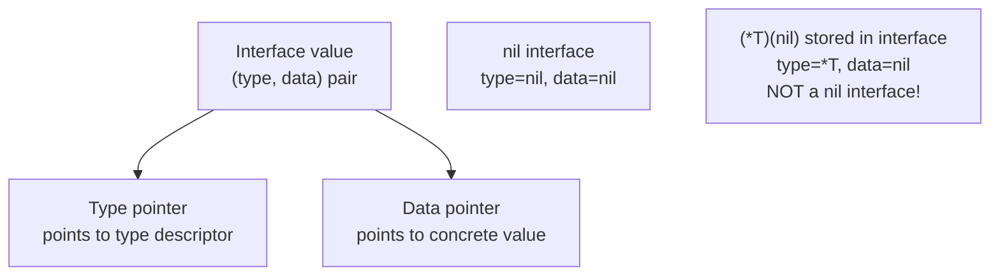

# Interfaces in Go

> [!abstract] TL;DR
> Go interfaces are satisfied **implicitly** — no `implements` keyword. Any type that has the required methods automatically satisfies the interface. This enables decoupled, testable code: your function accepts `io.Reader` and works with files, HTTP bodies, or test buffers without modification. The empty interface (`any`) accepts all types. Type assertions and type switches safely recover concrete types from interface values.

---

## Implicit Satisfaction

```go
type Stringer interface {
    String() string
}

type Temperature struct {
    Celsius float64
}

// Temperature satisfies Stringer implicitly — no declaration needed
func (t Temperature) String() string {
    return fmt.Sprintf("%.1f°C", t.Celsius)
}

// Any function accepting Stringer works with Temperature
func printValue(s Stringer) {
    fmt.Println(s.String())
}

temp := Temperature{Celsius: 23.5}
printValue(temp)   // "23.5°C"
```

This decouples the producer (Temperature) from the consumer (printValue) — they don't need to know about each other.

---

## The Empty Interface (any)

`any` is an alias for `interface{}` — it accepts any value. Use sparingly; prefer typed interfaces:

```go
func printAnything(v any) {
    fmt.Printf("%T: %v\n", v, v)
}

printAnything(42)
printAnything("hello")
printAnything([]int{1, 2, 3})

// map[string]any is common for JSON blobs or configuration
config := map[string]any{
    "host":    "localhost",
    "port":    8080,
    "debug":   true,
}
```

---

## Type Assertion and Type Switch

Recover the concrete type from an interface value:

```go
var w io.Writer = os.Stdout

// Single type assertion — panics if w is not *os.File
f := w.(*os.File)

// Comma-ok form — safe, no panic
f, ok := w.(*os.File)
if ok {
    fmt.Println("is a file:", f.Name())
}

// Type switch — check multiple types
func describe(i any) {
    switch v := i.(type) {
    case int:
        fmt.Printf("int: %d\n", v)
    case string:
        fmt.Printf("string: %q (len=%d)\n", v, len(v))
    case []byte:
        fmt.Printf("bytes: %d bytes\n", len(v))
    case error:
        fmt.Printf("error: %v\n", v)
    case nil:
        fmt.Println("nil")
    default:
        fmt.Printf("unknown: %T\n", v)
    }
}
```

---

## Key Standard Library Interfaces

These small interfaces form the backbone of Go's composable I/O system:

```go
// io.Reader — anything you can read bytes from
type Reader interface {
    Read(p []byte) (n int, err error)
}
// Implemented by: os.File, http.Request.Body, bytes.Buffer, strings.Reader,
//                 gzip.Reader, bufio.Reader, net.Conn, ...

// io.Writer — anything you can write bytes to
type Writer interface {
    Write(p []byte) (n int, err error)
}
// Implemented by: os.File, http.ResponseWriter, bytes.Buffer, bufio.Writer, ...

// io.ReadWriter, io.ReadCloser, io.ReadWriteCloser — common combinations

// fmt.Stringer — controls how a value prints with %v
type Stringer interface {
    String() string
}

// error — the error interface
type error interface {
    Error() string
}

// sort.Interface — makes any slice sortable
type Interface interface {
    Len() int
    Less(i, j int) bool
    Swap(i, j int)
}

// http.Handler — handles an HTTP request
type Handler interface {
    ServeHTTP(ResponseWriter, *Request)
}
```

---

## Interface Composition

Interfaces can embed other interfaces to form larger contracts:

```go
// Standard library examples
type ReadWriter interface {
    Reader
    Writer
}

type ReadWriteCloser interface {
    Reader
    Writer
    Closer
}

// Your own composition
type Repository interface {
    Finder
    Creator
    Updater
    Deleter
}

type Finder interface {
    FindByID(ctx context.Context, id int) (*Entity, error)
    FindAll(ctx context.Context) ([]*Entity, error)
}
```

**Interface segregation principle**: Prefer small, focused interfaces (1-3 methods) over large "fat" interfaces. Functions should accept only the interface methods they actually use.

---

## Interface Internals



> [!danger] A nil pointer stored in an interface is NOT a nil interface. `var p *MyError = nil; var err error = p; err != nil` is true because the interface has a type component even though the data is nil. This is the source of the classic nil interface bug.

---

## Implementation Example

```go
package main

import (
    "fmt"
    "io"
    "strings"
)

// Small interface — only ask for what you use
type Counter interface {
    Count() int
}

type WordCounter struct{ n int }
func (w *WordCounter) Write(p []byte) (int, error) {
    w.n += len(strings.Fields(string(p)))
    return len(p), nil
}
func (w *WordCounter) Count() int { return w.n }

type ByteCounter struct{ n int }
func (b *ByteCounter) Write(p []byte) (int, error) {
    b.n += len(p)
    return len(p), nil
}
func (b *ByteCounter) Count() int { return b.n }

// Accepts io.Writer — works with any writer
func writeData(w io.Writer, data string) {
    fmt.Fprint(w, data)
}

// Accepts Counter — minimal interface
func printCount(c Counter, label string) {
    fmt.Printf("%s: %d\n", label, c.Count())
}

func main() {
    text := "The quick brown fox jumps over the lazy dog"

    wc := &WordCounter{}
    bc := &ByteCounter{}

    writeData(wc, text)
    writeData(bc, text)

    printCount(wc, "words")  // words: 9
    printCount(bc, "bytes")  // bytes: 43

    // Both satisfy io.Writer AND Counter — demonstrated separately
    var w io.Writer = wc
    fmt.Fprintf(w, " extra words")
    printCount(wc, "after more writes")  // words: 11
}
```

---

## Common Pitfalls

- **Nil interface vs nil concrete pointer**: Assign `nil` directly, not a typed nil. Return `return nil` not `return (*MyError)(nil)` when the interface return type is `error`.
- **Large interfaces**: Don't replicate `interface { Read; Write; Seek; Close; Stat; ... }` in your own code. Accept `io.Reader` if you only read.
- **Interface boxing overhead**: Storing a value in an interface involves a heap allocation when the value does not fit in a pointer. Avoid in hot paths.
- **Concrete type in function signature when interface suffices**: A function taking `*os.File` instead of `io.Reader` makes testing impossible without a real file.

---

## Review Questions

1. Explain why Go's implicit interface satisfaction is architecturally powerful compared to Java's explicit `implements`.
2. What is the nil interface bug? Write code that demonstrates it and code that avoids it.
3. Why should you prefer `io.Reader` over `*os.File` as a function parameter type?
4. Design a `Storage` interface following interface segregation that separates read and write concerns.

---

#Go #Golang #Interfaces #TypeAssertion #TypeSwitch #ioReader #SOLID
