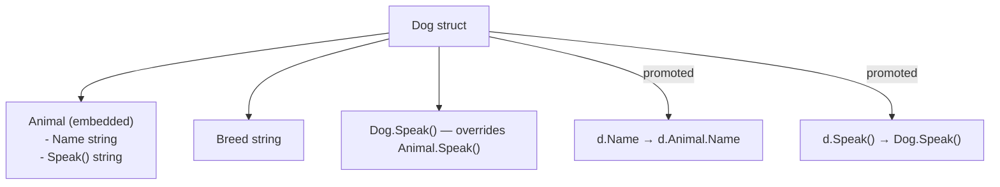

# Structs and Methods in Go

> [!abstract] TL;DR
> Go uses structs as its primary data grouping mechanism — there are no classes. Methods are functions with a receiver attached to a type. Embedding (not inheritance) composes behavior: an embedded type's fields and methods are promoted to the outer struct. Struct tags annotate fields for JSON marshaling, database mapping, and validation frameworks.

---

## Struct Declaration and Initialization

```go
type User struct {
    ID        int
    Name      string
    Email     string
    CreatedAt time.Time
    Active    bool
}

// Named field initialization (preferred — resilient to field reordering)
u := User{
    ID:    1,
    Name:  "Alice",
    Email: "alice@example.com",
}

// Pointer to struct — allocated on heap
pu := &User{ID: 2, Name: "Bob"}

// Accessing fields via pointer — auto-dereferenced
fmt.Println(pu.Name)   // same as (*pu).Name

// Anonymous struct — useful for one-off shapes (e.g., JSON responses)
point := struct {
    X, Y float64
}{X: 1.5, Y: 2.5}
```

---

## Methods

Methods are functions with a receiver type declared between `func` and the method name:

```go
type Rectangle struct {
    Width, Height float64
}

// Value receiver — works on a copy, does not mutate
func (r Rectangle) Area() float64 {
    return r.Width * r.Height
}

func (r Rectangle) Perimeter() float64 {
    return 2 * (r.Width + r.Height)
}

// Pointer receiver — can mutate the struct
func (r *Rectangle) Scale(factor float64) {
    r.Width *= factor
    r.Height *= factor
}

r := Rectangle{Width: 3, Height: 4}
fmt.Println(r.Area())       // 12
r.Scale(2)
fmt.Println(r.Width)        // 6
```

---

## Embedding — Composition Over Inheritance

Go replaces inheritance with **embedding**: include a type by name without a field name. The embedded type's exported fields and methods are **promoted** to the outer type:

```go
type Animal struct {
    Name string
}

func (a Animal) Speak() string {
    return a.Name + " makes a sound"
}

type Dog struct {
    Animal        // embedded — no field name
    Breed string
}

func (d Dog) Speak() string {
    return d.Name + " barks"   // Dog.Speak overrides Animal.Speak
}

d := Dog{
    Animal: Animal{Name: "Rex"},
    Breed:  "Labrador",
}
fmt.Println(d.Name)         // promoted: d.Animal.Name
fmt.Println(d.Speak())      // "Rex barks" — Dog's method takes precedence
fmt.Println(d.Animal.Speak())  // "Rex makes a sound" — explicit call
```

**Embedding interfaces** in structs is another pattern — see [[Interfaces_in_Go]].

---

## Struct Tags

Struct tags are backtick-quoted key-value strings attached to fields. The `encoding/json`, `database/sql`, ORM libraries, and validation frameworks read them via reflection:

```go
type Product struct {
    ID          int       `json:"id" db:"id"`
    Name        string    `json:"name" db:"name" validate:"required,min=2"`
    Price       float64   `json:"price,omitempty" db:"price"`
    Description string    `json:"-"`             // excluded from JSON
    CreatedAt   time.Time `json:"created_at" db:"created_at"`
}

// JSON marshaling uses the tags
p := Product{ID: 1, Name: "Widget", Price: 9.99}
data, _ := json.Marshal(p)
// {"id":1,"name":"Widget","price":9.99,"created_at":"0001-01-01T00:00:00Z"}
```

Tag conventions:
- `json:"field_name"` — JSON key name
- `json:",omitempty"` — omit field if zero value
- `json:"-"` — always omit
- `db:"column_name"` — SQL column mapping (sqlx/GORM)
- `validate:"required"` — validation rules (go-playground/validator)

---

## Anonymous Fields and Struct Composition



---

## Implementation Example

```go
package main

import (
    "encoding/json"
    "fmt"
    "time"
)

type Address struct {
    Street string `json:"street"`
    City   string `json:"city"`
    Zip    string `json:"zip"`
}

func (a Address) String() string {
    return fmt.Sprintf("%s, %s %s", a.Street, a.City, a.Zip)
}

type Employee struct {
    ID        int       `json:"id"`
    Name      string    `json:"name"`
    Address             // embedded — Address fields promoted
    HireDate  time.Time `json:"hire_date"`
    Manager   *Employee `json:"manager,omitempty"`
}

func (e *Employee) YearsOfService() int {
    return int(time.Since(e.HireDate).Hours() / 8760)
}

func main() {
    mgr := &Employee{
        ID:       1,
        Name:     "Carol",
        Address:  Address{Street: "100 Main St", City: "Springfield", Zip: "62701"},
        HireDate: time.Now().AddDate(-10, 0, 0),
    }

    emp := &Employee{
        ID:       2,
        Name:     "Dave",
        Address:  Address{Street: "200 Elm St", City: "Shelbyville", Zip: "62565"},
        HireDate: time.Now().AddDate(-2, 0, 0),
        Manager:  mgr,
    }

    // Promoted fields and methods
    fmt.Println(emp.City)             // emp.Address.City
    fmt.Println(emp.String())         // emp.Address.String()
    fmt.Println(emp.YearsOfService()) // 2

    data, _ := json.MarshalIndent(emp, "", "  ")
    fmt.Println(string(data))
}
```

---

## Common Pitfalls

- **Embedding vs field**: `type Dog struct { Animal }` is embedding; `type Dog struct { animal Animal }` is a regular (unexported) field. Only embedding promotes methods.
- **Method set and interfaces**: A `*T` method set includes both value and pointer receiver methods. A `T` value set includes only value receiver methods. Storing a struct in an interface variable may not include pointer receiver methods.
- **Copying a struct with a pointer field**: Copying `src := User{Photo: someSlice}; dst := src` makes `dst.Photo` point to the same underlying array. Mutating via `dst` affects `src`.
- **Struct tags must be valid**: A malformed tag (e.g., `json: "name"` with a space) is silently ignored by reflection. Use `go vet` to catch this.

---

## Review Questions

1. What is the difference between embedding and inheritance? What can you NOT do with embedding that you can with inheritance?
2. Explain why `json:",omitempty"` on a `time.Time` field may not behave as expected.
3. Given `type A struct{}`, `func (A) M() {}`, and `type B struct { A }` — does `B{}` implement an interface requiring `M()`?
4. When you copy a struct value, what happens to pointer fields inside it?

---

#Go #Golang #Structs #Methods #Embedding #StructTags
