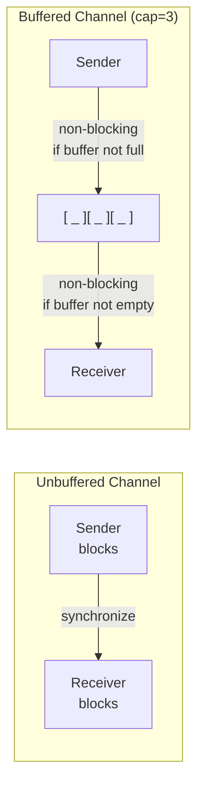

# Channels in Go

> [!abstract] TL;DR
> Channels are typed conduits for goroutine communication following CSP (Communicating Sequential Processes). Unbuffered channels synchronize sender and receiver — both block until the other is ready. Buffered channels decouple them up to the buffer capacity. `select` multiplexes over multiple channel operations. A nil channel blocks forever in both send and receive — this is a useful select trick. `close()` signals "no more values"; range over a channel drains it until closed.

---

## Channel Basics

```go
// Create channels
ch := make(chan int)         // unbuffered
bch := make(chan string, 10) // buffered, capacity 10

// Send
ch <- 42                    // blocks until another goroutine receives

// Receive
v := <-ch                   // blocks until a value is sent
v, ok := <-ch               // ok=false when channel is closed and drained

// Direction in function signatures — compile-time enforcement
func producer(out chan<- int) { out <- 42 }    // send-only
func consumer(in <-chan int) { v := <-in; _ = v }  // receive-only
```

---

## Buffered vs Unbuffered



**Unbuffered**: sends and receives rendezvous — the sender blocks until the receiver is ready, and vice versa. Used for synchronization and handoff.

**Buffered**: sends don't block until the buffer is full; receives don't block while buffer has items. Used for decoupling producer and consumer rates.

```go
// Unbuffered — synchronization primitive
done := make(chan struct{})
go func() {
    doWork()
    close(done)   // signal completion
}()
<-done   // wait for completion

// Buffered — rate decoupling
jobs := make(chan Job, 100)   // producer can enqueue 100 jobs before blocking
go producer(jobs)
for i := range 5 {
    go worker(jobs)
}
```

---

## close() and Drain Pattern

`close(ch)` signals that no more values will be sent. Receivers detect this:

```go
// close signals done
func generate(out chan<- int, nums ...int) {
    for _, n := range nums {
        out <- n
    }
    close(out)   // tells receivers there's nothing more to send
}

// range drains until close
func printAll(in <-chan int) {
    for v := range in {   // exits when in is closed and empty
        fmt.Println(v)
    }
}

// Manual drain with comma-ok
for {
    v, ok := <-ch
    if !ok {
        break   // channel closed and drained
    }
    process(v)
}
```

> [!danger] Sending to a closed channel panics. Closing an already-closed channel panics. Only the sender should close a channel. If multiple goroutines send, use a WaitGroup to close after all senders finish.

---

## select Statement

`select` waits on multiple channel operations simultaneously — whichever is ready first proceeds:

```go
select {
case v := <-ch1:
    fmt.Println("from ch1:", v)
case v := <-ch2:
    fmt.Println("from ch2:", v)
case ch3 <- result:
    fmt.Println("sent to ch3")
case <-ctx.Done():
    fmt.Println("context canceled")
    return
default:
    // non-blocking — runs if no channel is ready
    fmt.Println("no channels ready")
}
```

**Nil channel in select**: A nil channel is never ready — it is permanently disabled in a `select`. This is useful for disabling a case dynamically:

```go
// Merge two channels, disable one when it's exhausted
for {
    select {
    case v, ok := <-ch1:
        if !ok { ch1 = nil; continue }
        process(v)
    case v, ok := <-ch2:
        if !ok { ch2 = nil; continue }
        process(v)
    }
    if ch1 == nil && ch2 == nil {
        return
    }
}
```

---

## Timeout and Cancellation Patterns

```go
// Timeout via time.After
select {
case result := <-ch:
    use(result)
case <-time.After(5 * time.Second):
    fmt.Println("timed out")
}

// Done channel pattern — cancellation signal
func doWork(done <-chan struct{}) {
    for {
        select {
        case <-done:
            return
        default:
            // do work
        }
    }
}

// Context-based cancellation (preferred over raw done channel)
func doWorkCtx(ctx context.Context) {
    for {
        select {
        case <-ctx.Done():
            return
        default:
            // do work
        }
    }
}
```

---

## Implementation Example

```go
package main

import (
    "context"
    "fmt"
    "time"
)

// Pipeline: generate → square → print
func generate(ctx context.Context, nums ...int) <-chan int {
    out := make(chan int)
    go func() {
        defer close(out)
        for _, n := range nums {
            select {
            case out <- n:
            case <-ctx.Done():
                return
            }
        }
    }()
    return out
}

func square(ctx context.Context, in <-chan int) <-chan int {
    out := make(chan int)
    go func() {
        defer close(out)
        for v := range in {
            select {
            case out <- v * v:
            case <-ctx.Done():
                return
            }
        }
    }()
    return out
}

// Fan-in: merge multiple channels into one
func merge(ctx context.Context, channels ...<-chan int) <-chan int {
    out := make(chan int)
    go func() {
        defer close(out)
        for _, ch := range channels {
            for v := range ch {
                select {
                case out <- v:
                case <-ctx.Done():
                    return
                }
            }
        }
    }()
    return out
}

func main() {
    ctx, cancel := context.WithTimeout(context.Background(), 5*time.Second)
    defer cancel()

    nums := generate(ctx, 1, 2, 3, 4, 5)
    squared := square(ctx, nums)

    for v := range squared {
        fmt.Println(v)   // 1 4 9 16 25
    }
}
```

---

## Common Pitfalls

- **Sending to a closed channel**: Always let the sender close. Use `sync.WaitGroup` when multiple goroutines send to the same channel.
- **Deadlock from mismatched send/receive**: `ch := make(chan int); ch <- 1` — single goroutine sending to an unbuffered channel with nobody receiving = deadlock.
- **Goroutine leak from unbounded buffered channel**: An unbuffered channel OR a full buffered channel blocks the sender goroutine — if the receiver exits early, the sender leaks.
- **`time.After` leaks**: `time.After(d)` creates a timer that cannot be garbage collected until it fires. In a loop or long-running function, use `time.NewTimer` and call `Stop()`.

---

## Review Questions

1. What is the difference between an unbuffered and buffered channel? When would you choose each?
2. What happens when you receive from a closed channel? From a nil channel?
3. Describe the nil channel trick in `select` and give a use case.
4. Why is `time.After` inside a `select` in a tight loop a memory leak? Show the fix using `time.NewTimer`.

---

#Go #Golang #Channels #Concurrency #Select #CSP #Buffered
