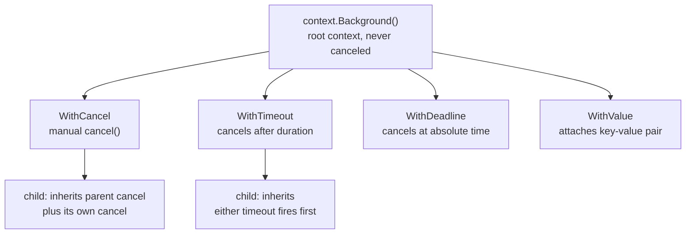

# Context Package in Go

> [!abstract] TL;DR
> `context.Context` is Go's standard mechanism for carrying cancellation signals, deadlines, and request-scoped values through call stacks and across goroutines. A context flows downward — from HTTP handler to database query to external API call. When the root context is canceled (timeout, client disconnect), all derived contexts are canceled automatically, enabling coordinated cleanup.

---

## Context Hierarchy



Each derived context forms a tree. Canceling a parent automatically cancels all descendants.

---

## Creating Contexts

```go
import "context"

// Root contexts — used only at the top level
ctx := context.Background()   // for main, tests, top-level server
ctx := context.TODO()         // placeholder — signals "replace this later"

// WithCancel — manual cancellation
ctx, cancel := context.WithCancel(parent)
defer cancel()   // ALWAYS call cancel to release resources — even if not canceled

// WithTimeout — auto-cancel after duration
ctx, cancel := context.WithTimeout(parent, 5*time.Second)
defer cancel()

// WithDeadline — auto-cancel at absolute time
deadline := time.Now().Add(5 * time.Second)
ctx, cancel := context.WithDeadline(parent, deadline)
defer cancel()

// WithValue — attach request-scoped data
type contextKey string
const userKey contextKey = "user"

ctx = context.WithValue(ctx, userKey, currentUser)
user := ctx.Value(userKey).(*User)   // type assertion required
```

---

## Using Context in Functions

Convention: `ctx context.Context` is always the **first parameter**:

```go
func (s *Service) GetUser(ctx context.Context, id int) (*User, error) {
    // Check cancellation before expensive work
    if err := ctx.Err(); err != nil {
        return nil, err
    }

    // Pass context to all downstream calls
    row := s.db.QueryRowContext(ctx, "SELECT * FROM users WHERE id=$1", id)
    var u User
    if err := row.Scan(&u.ID, &u.Name); err != nil {
        return nil, fmt.Errorf("GetUser %d: %w", id, err)
    }
    return &u, nil
}

// HTTP handler — context from request carries client deadline
func userHandler(w http.ResponseWriter, r *http.Request) {
    ctx := r.Context()   // already set by net/http; canceled if client disconnects

    user, err := svc.GetUser(ctx, extractID(r))
    if errors.Is(err, context.Canceled) {
        return   // client disconnected
    }
    if err != nil {
        http.Error(w, err.Error(), http.StatusInternalServerError)
        return
    }
    json.NewEncoder(w).Encode(user)
}
```

---

## Checking Context Cancellation

```go
// ctx.Done() returns a channel that closes when context is canceled
select {
case <-ctx.Done():
    return ctx.Err()   // context.Canceled or context.DeadlineExceeded
default:
    // continue
}

// ctx.Err() — nil if not yet canceled
if err := ctx.Err(); err != nil {
    return err
}

// ctx.Deadline() — zero time if no deadline
if deadline, ok := ctx.Deadline(); ok {
    fmt.Println("expires at:", deadline)
}

// In a goroutine loop
func worker(ctx context.Context, jobs <-chan Job) {
    for {
        select {
        case job, ok := <-jobs:
            if !ok {
                return
            }
            processJob(ctx, job)
        case <-ctx.Done():
            log.Printf("worker stopping: %v", ctx.Err())
            return
        }
    }
}
```

---

## Context Values — Best Practices

`WithValue` should only store request-scoped data that crosses API boundaries, not function parameters:

```go
// Good uses of context values:
// - Request ID for logging/tracing
// - Authentication/user info from middleware
// - Trace span propagation

// BAD: passing business logic parameters via context
// ctx = context.WithValue(ctx, "userID", 42)  // use function arguments instead

// GOOD: request-scoped metadata
type reqIDKey struct{}

func withRequestID(ctx context.Context, reqID string) context.Context {
    return context.WithValue(ctx, reqIDKey{}, reqID)
}

func requestIDFrom(ctx context.Context) string {
    if id, ok := ctx.Value(reqIDKey{}).(string); ok {
        return id
    }
    return ""
}
```

Use an **unexported struct type** as the key (not a string) to prevent key collisions between packages.

---

## Implementation Example

```go
package main

import (
    "context"
    "fmt"
    "time"
)

func slowQuery(ctx context.Context, query string) (string, error) {
    // Simulate work with multiple stages — check context between each
    result := make(chan string, 1)
    go func() {
        time.Sleep(200 * time.Millisecond)   // simulate DB query
        result <- "data for: " + query
    }()

    select {
    case r := <-result:
        return r, nil
    case <-ctx.Done():
        return "", fmt.Errorf("slowQuery: %w", ctx.Err())
    }
}

func pipeline(ctx context.Context, queries []string) ([]string, error) {
    results := make([]string, 0, len(queries))
    for _, q := range queries {
        r, err := slowQuery(ctx, q)
        if err != nil {
            return results, fmt.Errorf("pipeline stopped: %w", err)
        }
        results = append(results, r)
    }
    return results, nil
}

func main() {
    // Case 1: success
    ctx := context.Background()
    ctx1, cancel1 := context.WithTimeout(ctx, 5*time.Second)
    defer cancel1()
    results, _ := pipeline(ctx1, []string{"q1", "q2", "q3"})
    fmt.Println("success:", results)

    // Case 2: timeout
    ctx2, cancel2 := context.WithTimeout(ctx, 300*time.Millisecond)
    defer cancel2()
    results, err := pipeline(ctx2, []string{"q1", "q2", "q3"})
    fmt.Printf("timeout: %v, partial results: %v\n", err, results)
}
```

---

## Common Pitfalls

- **Forgetting `defer cancel()`**: Every `WithCancel`/`WithTimeout`/`WithDeadline` must have its `cancel()` called to release internal resources, even if the context is never actually canceled.
- **Storing contexts in structs**: Contexts are meant to be passed through function calls, not stored in struct fields (though `http.Request` is a notable exception).
- **Passing `nil` context**: Never pass `nil` as a context. Use `context.TODO()` or `context.Background()` as placeholders.
- **String keys for context values**: Two packages using the same string key will collide. Always use an unexported struct type as the key.

---

## Review Questions

1. What is the difference between `context.Background()` and `context.TODO()`?
2. Why must `cancel()` always be deferred even when a timeout will fire eventually?
3. Explain how context propagates cancellation to a database query in a chain: HTTP Handler → Service → Repository → `sql.QueryRowContext`.
4. Why should context keys be unexported struct types rather than strings?

---

#Go #Golang #Context #Cancellation #Deadline #Concurrency
