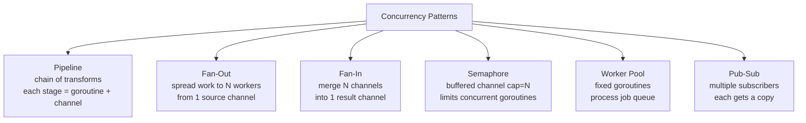

# Go Concurrency Patterns

> [!abstract] TL;DR
> Go concurrency patterns compose goroutines and channels into reusable structures. The pipeline pattern chains stages. Fan-out distributes work across goroutines; fan-in merges their results. A buffered channel acts as a semaphore to bound parallelism. Worker pools reuse goroutines for many tasks. All patterns should incorporate context cancellation for graceful shutdown.

---

## Pipeline Pattern

Each pipeline stage is a goroutine that reads from an input channel, transforms, and sends to an output channel:

```go
func generator(ctx context.Context, nums ...int) <-chan int {
    out := make(chan int)
    go func() {
        defer close(out)
        for _, n := range nums {
            select {
            case out <- n:
            case <-ctx.Done():
                return
            }
        }
    }()
    return out
}

func multiply(ctx context.Context, in <-chan int, factor int) <-chan int {
    out := make(chan int)
    go func() {
        defer close(out)
        for v := range in {
            select {
            case out <- v * factor:
            case <-ctx.Done():
                return
            }
        }
    }()
    return out
}

// Usage: generator → multiply → multiply
ctx := context.Background()
nums := generator(ctx, 1, 2, 3, 4, 5)
doubled := multiply(ctx, nums, 2)
tripled := multiply(ctx, doubled, 3)
for v := range tripled {
    fmt.Println(v)   // 6 12 18 24 30
}
```

---

## Fan-Out / Fan-In

Fan-out distributes work from one channel to N goroutines. Fan-in merges N channels into one:

```go
// Fan-out: distribute input across N workers
func fanOut(ctx context.Context, in <-chan int, workers int) []<-chan int {
    channels := make([]<-chan int, workers)
    for i := range workers {
        ch := make(chan int)
        channels[i] = ch
        go func() {
            defer close(ch)
            for v := range in {
                select {
                case ch <- process(v):
                case <-ctx.Done():
                    return
                }
            }
        }()
    }
    return channels
}

// Fan-in: merge N channels into one
func fanIn(ctx context.Context, channels ...<-chan int) <-chan int {
    var wg sync.WaitGroup
    merged := make(chan int, len(channels))

    output := func(c <-chan int) {
        defer wg.Done()
        for v := range c {
            select {
            case merged <- v:
            case <-ctx.Done():
                return
            }
        }
    }

    wg.Add(len(channels))
    for _, c := range channels {
        go output(c)
    }

    go func() {
        wg.Wait()
        close(merged)
    }()

    return merged
}
```

---

## Semaphore via Buffered Channel

A buffered channel of capacity N acts as a semaphore — at most N goroutines hold a slot:

```go
const maxConcurrent = 10

sem := make(chan struct{}, maxConcurrent)

var wg sync.WaitGroup
for _, url := range urls {
    wg.Add(1)
    go func(url string) {
        defer wg.Done()
        sem <- struct{}{}        // acquire: blocks if sem is full
        defer func() { <-sem }() // release on return

        result, err := fetchURL(url)
        // ... handle
    }(url)
}
wg.Wait()
```

---

## Worker Pool

A fixed pool of goroutines processes an unbounded job stream:

```go
type Job struct {
    ID    int
    Input string
}

type Result struct {
    JobID  int
    Output string
    Err    error
}

func startWorkerPool(ctx context.Context, jobs <-chan Job, numWorkers int) <-chan Result {
    results := make(chan Result, numWorkers)
    var wg sync.WaitGroup

    for range numWorkers {
        wg.Add(1)
        go func() {
            defer wg.Done()
            for {
                select {
                case job, ok := <-jobs:
                    if !ok {
                        return
                    }
                    output, err := processJob(ctx, job)
                    results <- Result{JobID: job.ID, Output: output, Err: err}
                case <-ctx.Done():
                    return
                }
            }
        }()
    }

    go func() {
        wg.Wait()
        close(results)
    }()

    return results
}
```

---

## Pattern Comparison



---

## Implementation Example — Full Worker Pool

```go
package main

import (
    "context"
    "fmt"
    "sync"
    "time"
)

func processJob(ctx context.Context, id int) (string, error) {
    select {
    case <-time.After(50 * time.Millisecond):
        return fmt.Sprintf("result_%d", id), nil
    case <-ctx.Done():
        return "", ctx.Err()
    }
}

func main() {
    ctx, cancel := context.WithTimeout(context.Background(), 2*time.Second)
    defer cancel()

    jobs := make(chan int, 20)
    results := make(chan string, 20)
    var wg sync.WaitGroup

    const numWorkers = 5
    for range numWorkers {
        wg.Add(1)
        go func() {
            defer wg.Done()
            for id := range jobs {
                r, err := processJob(ctx, id)
                if err != nil {
                    fmt.Printf("worker: job %d canceled\n", id)
                    continue
                }
                results <- r
            }
        }()
    }

    // Submit 20 jobs
    for i := range 20 {
        jobs <- i
    }
    close(jobs)   // signal no more jobs

    // Collect results
    go func() {
        wg.Wait()
        close(results)
    }()

    for r := range results {
        fmt.Println(r)
    }
}
```

---

## Common Pitfalls

- **Closing the wrong end of a pipeline**: Only the goroutine that sends to a channel should close it. Closing from outside causes a panic.
- **Goroutine leak in fan-in**: If the merged channel is full and nobody is reading, fan-in goroutines block forever. Use context cancellation as an escape.
- **Worker pool deadlock**: If `results` channel is full and workers are blocked sending results, but the consumer hasn't started yet — deadlock. Use buffered results channel or start consumer first.
- **Range over open channel**: `for v := range ch` blocks if `ch` is never closed. Always close channels when no more values will be sent.

---

## Review Questions

1. Explain the difference between fan-out and a worker pool. When would you use one vs the other?
2. How does a buffered channel implement a semaphore? What happens when the buffer is full?
3. In the pipeline pattern, what happens to all downstream stages when the context is canceled?
4. Design a "timeout each stage" variant of the pipeline where each stage has its own per-item timeout.

---

#Go #Golang #ConcurrencyPatterns #Pipeline #FanOut #WorkerPool #Semaphore
