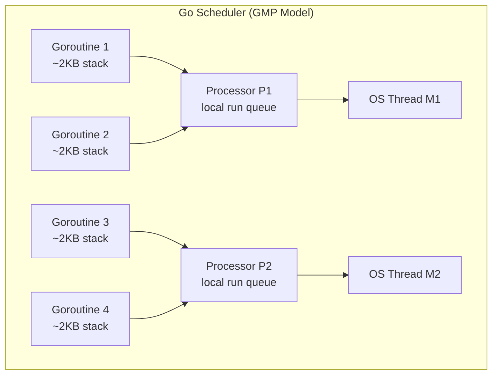

# Goroutines and the Go Scheduler

> [!abstract] TL;DR
> Goroutines are lightweight cooperative threads managed by the Go runtime. They start at ~2KB of stack (vs ~8MB for OS threads), grow dynamically, and are scheduled onto OS threads by the Go M:N scheduler. `GOMAXPROCS` controls the number of OS threads running Go code simultaneously. Goroutine leaks — goroutines that are created but never terminate — are a major production bug class.

---

## Creating Goroutines

Any function call prefixed with `go` runs in a new goroutine:

```go
go fmt.Println("runs concurrently")

go func() {
    // anonymous function as goroutine
    result := expensiveComputation()
    ch <- result
}()

// Goroutine with arguments — pass by value to avoid closure capture bugs
for i := range items {
    go func(item Item) {   // item is a copy
        process(item)
    }(items[i])
}
```

The `main` goroutine does NOT wait for other goroutines — if `main` returns, all goroutines are killed. Use `sync.WaitGroup` or channels to coordinate.

---

## M:N Threading Model



**GMP model:**
- **G** (Goroutine): The actual goroutine and its stack.
- **M** (Machine): An OS thread. Executes Go code.
- **P** (Processor): A scheduling context. Holds a local run queue of goroutines. `GOMAXPROCS` = number of P's.

When a goroutine blocks on a syscall, the P detaches from M and attaches to another M (or parks). This allows other goroutines to keep running.

---

## GOMAXPROCS

`GOMAXPROCS` is the number of OS threads that can execute Go user code simultaneously:

```go
import "runtime"

runtime.GOMAXPROCS(4)          // explicitly set
n := runtime.GOMAXPROCS(0)     // 0 = query without changing; returns current value
```

Default: equal to `runtime.NumCPU()`. Setting it lower limits parallelism; setting it higher than CPU cores wastes context-switch overhead.

---

## Goroutine Cost vs OS Thread

| Aspect | Goroutine | OS Thread |
|---|---|---|
| Initial stack | ~2KB (grows as needed up to 1GB) | ~8MB (fixed) |
| Creation time | ~1 microsecond | ~5 microseconds |
| Context switch | ~100–200 ns | ~1–2 microseconds |
| Max practical count | Hundreds of thousands | Thousands |
| Blocking | Cooperatively scheduled | Preemptive |

This is why Go can handle 100,000+ concurrent connections in a single process.

---

## Goroutine Leaks

A goroutine leak occurs when a goroutine is started but has no path to termination. Leaks accumulate memory and goroutines until the process runs out of resources.

**Common leak patterns and fixes:**

```go
// LEAK: goroutine blocked on receive, nobody will ever send
go func() {
    msg := <-ch   // blocks forever if ch is never sent to or closed
    process(msg)
}()

// FIX: use context for cancellation
go func() {
    select {
    case msg := <-ch:
        process(msg)
    case <-ctx.Done():
        return   // goroutine exits when context is canceled
    }
}()

// LEAK: goroutine blocked on send, nobody is receiving
go func() {
    result := compute()
    ch <- result   // blocks forever if nobody reads from ch
}()

// FIX: use buffered channel OR ensure receiver exists OR use select with done
go func() {
    result := compute()
    select {
    case ch <- result:
    case <-ctx.Done():
    }
}()
```

**Detecting leaks:**

```bash
# goleak — test-time leak detection
go test -v ./...   # goleak.VerifyNone integrates with testing.M

# pprof goroutine profile
go tool pprof http://localhost:6060/debug/pprof/goroutine
```

---

## Implementation Example

```go
package main

import (
    "context"
    "fmt"
    "sync"
    "time"
)

func fanOut(ctx context.Context, input <-chan int, workers int) []<-chan int {
    outputs := make([]<-chan int, workers)
    for i := range workers {
        out := make(chan int)
        outputs[i] = out
        go func() {
            defer close(out)
            for {
                select {
                case v, ok := <-input:
                    if !ok {
                        return
                    }
                    // process and forward
                    select {
                    case out <- v * v:
                    case <-ctx.Done():
                        return
                    }
                case <-ctx.Done():
                    return
                }
            }
        }()
    }
    return outputs
}

func main() {
    ctx, cancel := context.WithTimeout(context.Background(), 2*time.Second)
    defer cancel()

    // WaitGroup to wait for goroutines
    var wg sync.WaitGroup
    results := make(chan int, 100)

    for i := range 5 {
        wg.Add(1)
        go func(id int) {
            defer wg.Done()
            select {
            case results <- id * id:
            case <-ctx.Done():
            }
        }(i)
    }

    // Close results when all workers done
    go func() {
        wg.Wait()
        close(results)
    }()

    for r := range results {
        fmt.Println(r)
    }
}
```

---

## Common Pitfalls

- **No synchronization with `main`**: `go f()` followed by program end kills the goroutine silently. Always sync with WaitGroup or channel.
- **Goroutine leak via blocked channel**: The most common leak. Always pair sends with receives, and add context cancellation.
- **Loop variable capture** (pre-Go 1.22): `for i, v := range items { go func() { use(i, v) }() }` captures the loop variable. Pass as argument.
- **`runtime.Gosched()`**: Yields the processor but does NOT block — the goroutine immediately re-enters the run queue. Rarely needed; prefer channels for coordination.

---

## Review Questions

1. What does GOMAXPROCS control? Would setting it to 1 make Go programs single-threaded?
2. Describe three ways a goroutine can leak. For each, give the fix.
3. How does the Go scheduler handle a goroutine that blocks on a network syscall?
4. Why does Go use 2KB starting stack size for goroutines? What happens when the goroutine needs more stack?

---

#Go #Golang #Goroutines #Scheduler #Concurrency #GOMAXPROCS
