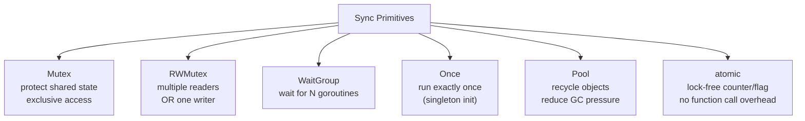

# Sync Primitives in Go

> [!abstract] TL;DR
> The `sync` package provides Mutex, RWMutex, WaitGroup, Once, and Pool for coordinating goroutines through shared memory. `sync/atomic` provides lock-free operations on integers and pointers. The race detector (`go test -race`) identifies data races at runtime. Prefer channels for orchestration and sync primitives for shared state protection.

---

## sync.Mutex and sync.RWMutex

`Mutex` provides mutual exclusion — only one goroutine can hold the lock at a time:

```go
type SafeCounter struct {
    mu    sync.Mutex
    count int
}

func (c *SafeCounter) Inc() {
    c.mu.Lock()
    defer c.mu.Unlock()
    c.count++
}

func (c *SafeCounter) Value() int {
    c.mu.Lock()
    defer c.mu.Unlock()
    return c.count
}
```

`RWMutex` allows multiple concurrent readers OR one exclusive writer:

```go
type Cache struct {
    mu   sync.RWMutex
    data map[string]string
}

func (c *Cache) Get(key string) (string, bool) {
    c.mu.RLock()           // multiple goroutines can hold RLock simultaneously
    defer c.mu.RUnlock()
    v, ok := c.data[key]
    return v, ok
}

func (c *Cache) Set(key, value string) {
    c.mu.Lock()            // exclusive write lock — no readers or writers
    defer c.mu.Unlock()
    c.data[key] = value
}
```

---

## sync.WaitGroup

WaitGroup waits for a collection of goroutines to finish:

```go
var wg sync.WaitGroup

urls := []string{"url1", "url2", "url3"}
results := make([]string, len(urls))

for i, url := range urls {
    wg.Add(1)
    go func(i int, url string) {
        defer wg.Done()
        results[i] = fetch(url)   // safe: each goroutine writes to a unique index
    }(i, url)
}

wg.Wait()   // blocks until all Done() calls match Add() calls
fmt.Println(results)
```

> [!warning] Always call `wg.Add(1)` before launching the goroutine, not inside it — a race condition between `Add` and `Wait` can cause `Wait` to return early.

---

## sync.Once

`Once` guarantees exactly one execution of a function, regardless of how many goroutines call it:

```go
var (
    instance *Database
    once     sync.Once
)

func GetDatabase(dsn string) *Database {
    once.Do(func() {
        instance = &Database{}
        instance.Connect(dsn)
    })
    return instance
}

// once.Do is safe to call from multiple goroutines
// The function runs exactly once, even with concurrent callers
// All callers block until the function returns
```

---

## sync.Pool

`Pool` provides a free list of temporary objects to reduce GC pressure in hot paths:

```go
var bufPool = sync.Pool{
    New: func() any {
        return bytes.NewBuffer(make([]byte, 0, 1024))
    },
}

func handler(w http.ResponseWriter, r *http.Request) {
    buf := bufPool.Get().(*bytes.Buffer)
    buf.Reset()            // IMPORTANT: reset before use — previous content remains
    defer bufPool.Put(buf)

    // use buf for response building
    fmt.Fprintf(buf, "Hello, %s!", r.URL.Query().Get("name"))
    w.Write(buf.Bytes())
}
```

> [!warning] Pool objects can be reclaimed by the GC at any time. Never store state in a Pool object that must persist between GC cycles.

---

## sync/atomic — Lock-Free Operations

`sync/atomic` provides atomic operations on basic types — lower overhead than a mutex for simple counters:

```go
import "sync/atomic"

var counter int64

// Atomic operations — safe for concurrent access
atomic.AddInt64(&counter, 1)
atomic.AddInt64(&counter, -1)
v := atomic.LoadInt64(&counter)
atomic.StoreInt64(&counter, 42)

// Compare-and-swap — basis for lock-free algorithms
swapped := atomic.CompareAndSwapInt64(&counter, 0, 1)   // if counter==0, set to 1

// atomic.Value — store/load any value atomically (for config hot-reload)
var config atomic.Value
config.Store(currentConfig)
cfg := config.Load().(Config)   // type assertion required
```

---

## Race Detector

The race detector instruments memory accesses at runtime and reports races:

```bash
go test -race ./...
go run -race main.go
go build -race -o app-race ./...
```

Example race output:
```
WARNING: DATA RACE
Write at 0x00c0000b4010 by goroutine 7:
  main.(*SafeCounter).Inc()
      /tmp/main.go:14 +0x44
Read at 0x00c0000b4010 by goroutine 8:
  main.(*SafeCounter).Value()
      /tmp/main.go:21 +0x38
```

**The race detector has ~5x performance overhead** — use it in tests, not production binaries.

---

## Primitive Comparison



---

## Implementation Example

```go
package main

import (
    "fmt"
    "sync"
    "sync/atomic"
)

// Thread-safe LRU-like cache using RWMutex
type Store[K comparable, V any] struct {
    mu   sync.RWMutex
    data map[K]V
}

func NewStore[K comparable, V any]() *Store[K, V] {
    return &Store[K, V]{data: make(map[K]V)}
}

func (s *Store[K, V]) Set(k K, v V) {
    s.mu.Lock()
    defer s.mu.Unlock()
    s.data[k] = v
}

func (s *Store[K, V]) Get(k K) (V, bool) {
    s.mu.RLock()
    defer s.mu.RUnlock()
    v, ok := s.data[k]
    return v, ok
}

func main() {
    store := NewStore[string, int]()
    var wg sync.WaitGroup
    var ops atomic.Int64

    for i := range 100 {
        wg.Add(1)
        go func(i int) {
            defer wg.Done()
            store.Set(fmt.Sprintf("key%d", i%10), i)
            ops.Add(1)
        }(i)
    }

    wg.Wait()
    fmt.Printf("completed %d ops\n", ops.Load())
    fmt.Printf("store size: %d\n", len(store.data))
}
```

---

## Common Pitfalls

- **Copying a mutex**: `sync.Mutex` must not be copied after first use. Pass structs containing mutexes by pointer. Use `go vet` — it detects this.
- **`defer mu.Unlock()` for panics**: Always use `defer mu.Unlock()` — if the function panics without defer, the mutex stays locked forever.
- **`wg.Add` inside the goroutine**: If `wg.Wait()` is called concurrently, it may see zero count before the goroutine calls `Add` — race condition. Always `Add` before launching.
- **`sync.Pool` with reset**: Always reset a pooled buffer before use — previous content may be stale data from another goroutine.

---

## Review Questions

1. When would you use `sync.RWMutex` instead of `sync.Mutex`? What is the trade-off?
2. Explain the `sync.Once` use case. What happens if the function passed to `Do` panics?
3. What does the race detector do? Why is `-race` not used in production binaries?
4. Why does `atomic.AddInt64` not need a mutex? What operations can it NOT replace a mutex for?

---

#Go #Golang #Sync #Mutex #WaitGroup #Atomic #Concurrency #RaceDetector
