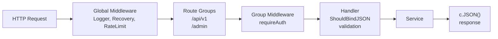

# Gin Framework

> [!abstract] TL;DR
> Gin is Go's most popular HTTP framework — a thin, high-performance layer over `net/http` with automatic JSON binding, validation, path parameter extraction, route groups, and composable middleware. It uses a radix tree router for O(log n) routing. `gin.Context` wraps `http.Request` and `http.ResponseWriter` with helper methods for JSON/form binding, response rendering, and middleware communication.

---

## Router Setup

```go
import "github.com/gin-gonic/gin"

// Default router — includes Logger and Recovery middleware
r := gin.Default()

// Custom router — no default middleware
r = gin.New()
r.Use(gin.Logger(), gin.Recovery())

// Routes
r.GET("/ping", pingHandler)
r.POST("/users", createUser)
r.PUT("/users/:id", updateUser)
r.DELETE("/users/:id", deleteUser)
r.GET("/files/*path", fileServer)   // wildcard

// Run
r.Run(":8080")   // shorthand for http.ListenAndServe

// Or with a custom http.Server for timeouts
srv := &http.Server{
    Addr:         ":8080",
    Handler:      r,
    ReadTimeout:  10 * time.Second,
    WriteTimeout: 30 * time.Second,
}
```

---

## Path Parameters and Query Parameters

```go
// :id — required path parameter
func getUser(c *gin.Context) {
    id, err := strconv.Atoi(c.Param("id"))
    if err != nil {
        c.JSON(http.StatusBadRequest, gin.H{"error": "invalid id"})
        return
    }
    // ...
}

// Query parameters
func listUsers(c *gin.Context) {
    page, _ := strconv.Atoi(c.DefaultQuery("page", "1"))
    limit, _ := strconv.Atoi(c.DefaultQuery("limit", "20"))
    search := c.Query("search")   // "" if not present
    _ = page; _ = limit; _ = search
}
```

---

## JSON Binding and Validation

Gin integrates `go-playground/validator` for struct validation:

```go
type CreateUserRequest struct {
    Name     string `json:"name"     binding:"required,min=2,max=50"`
    Email    string `json:"email"    binding:"required,email"`
    Age      int    `json:"age"      binding:"required,gte=18,lte=120"`
    Password string `json:"password" binding:"required,min=8"`
}

func createUser(c *gin.Context) {
    var req CreateUserRequest
    if err := c.ShouldBindJSON(&req); err != nil {
        c.JSON(http.StatusBadRequest, gin.H{"error": err.Error()})
        return
    }
    // req is validated and populated
    user, err := svc.CreateUser(c.Request.Context(), req)
    if err != nil {
        c.JSON(http.StatusInternalServerError, gin.H{"error": "internal error"})
        return
    }
    c.JSON(http.StatusCreated, user)
}
```

**Binding methods:**

| Method | Use case |
|---|---|
| `ShouldBindJSON` | JSON body — returns error, no auto-response |
| `ShouldBindQuery` | Query parameters |
| `ShouldBind` | Content-Type-aware (JSON, form, XML) |
| `BindJSON` | JSON body — sends 400 automatically on error |

---

## Route Groups

Route groups prefix paths and share middleware:

```go
// API versioning
v1 := r.Group("/api/v1")
{
    v1.GET("/users", listUsers)
    v1.POST("/users", createUser)

    users := v1.Group("/users/:id")
    users.Use(requireAuth())   // auth only for user-specific routes
    {
        users.GET("", getUser)
        users.PUT("", updateUser)
        users.DELETE("", deleteUser)
    }
}

// Admin group with additional middleware
admin := r.Group("/admin")
admin.Use(requireAuth(), requireRole("admin"))
{
    admin.GET("/stats", adminStats)
    admin.DELETE("/users/:id", adminDeleteUser)
}
```

---

## Custom Middleware

```go
// Middleware returns gin.HandlerFunc
func withRequestID() gin.HandlerFunc {
    return func(c *gin.Context) {
        id := c.GetHeader("X-Request-ID")
        if id == "" {
            id = uuid.New().String()
        }
        c.Set("requestID", id)          // store in context for downstream handlers
        c.Header("X-Request-ID", id)    // echo in response
        c.Next()                         // call the next handler
        // Post-handler code runs here
    }
}

func withRateLimit(rps int) gin.HandlerFunc {
    limiter := rate.NewLimiter(rate.Limit(rps), rps)
    return func(c *gin.Context) {
        if !limiter.Allow() {
            c.AbortWithStatusJSON(http.StatusTooManyRequests, gin.H{
                "error": "rate limit exceeded",
            })
            return   // c.Abort() stops the chain; c.Next() continues it
        }
        c.Next()
    }
}

r.Use(withRequestID())
r.Use(withRateLimit(100))
```

---

## Error Handling

```go
// Centralized error handler
type AppError struct {
    Code    int
    Message string
}

func (e *AppError) Error() string { return e.Message }

func errorHandler() gin.HandlerFunc {
    return func(c *gin.Context) {
        c.Next()
        if len(c.Errors) > 0 {
            err := c.Errors.Last()
            if appErr, ok := err.Err.(*AppError); ok {
                c.JSON(appErr.Code, gin.H{"error": appErr.Message})
                return
            }
            c.JSON(http.StatusInternalServerError, gin.H{"error": "internal error"})
        }
    }
}

// Handler attaches error instead of writing response directly
func getItem(c *gin.Context) {
    item, err := svc.GetItem(c.Request.Context(), c.Param("id"))
    if errors.Is(err, store.ErrNotFound) {
        c.Error(&AppError{Code: 404, Message: "item not found"})
        return
    }
    if err != nil {
        c.Error(err)
        return
    }
    c.JSON(http.StatusOK, item)
}
```

---

## Architecture Diagram



---

## Implementation Example

```go
package main

import (
    "net/http"
    "github.com/gin-gonic/gin"
)

type Todo struct {
    ID    int    `json:"id"`
    Title string `json:"title" binding:"required"`
    Done  bool   `json:"done"`
}

var todos []Todo
var nextID = 1

func main() {
    r := gin.Default()

    r.GET("/todos", func(c *gin.Context) {
        c.JSON(http.StatusOK, todos)
    })

    r.POST("/todos", func(c *gin.Context) {
        var t Todo
        if err := c.ShouldBindJSON(&t); err != nil {
            c.JSON(http.StatusBadRequest, gin.H{"error": err.Error()})
            return
        }
        t.ID = nextID
        nextID++
        todos = append(todos, t)
        c.JSON(http.StatusCreated, t)
    })

    r.PATCH("/todos/:id/done", func(c *gin.Context) {
        id := c.Param("id")
        for i, t := range todos {
            if strconv.Itoa(t.ID) == id {
                todos[i].Done = true
                c.JSON(http.StatusOK, todos[i])
                return
            }
        }
        c.JSON(http.StatusNotFound, gin.H{"error": "not found"})
    })

    r.Run(":8080")
}
```

---

## Common Pitfalls

- **`c.Abort` vs `return`**: Calling `c.Abort()` stops subsequent handlers in the chain. Just `return` only exits the current handler — other handlers in the chain still run.
- **Reading body twice**: `c.ShouldBindJSON` reads and closes `r.Body`. Subsequent reads return empty. Use `c.GetRawData()` if you need the body again.
- **gin.Mode in production**: Default mode is "debug" — logs routes on startup. Set `GIN_MODE=release` in production to suppress debug output.
- **Not setting timeouts**: `r.Run(":8080")` uses default `http.Server` with no timeouts. Always create a custom server.

---

## Review Questions

1. What is the difference between `c.ShouldBindJSON` and `c.BindJSON`?
2. Explain how Gin's middleware chain works. What does `c.Abort()` do?
3. How do route groups reduce code duplication for authentication?
4. Why is the radix tree router faster than a linear slice of registered routes?

---

#Go #Golang #Gin #Web #Framework #REST #Middleware
