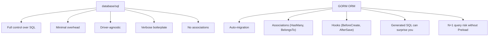

# Go Database Access

> [!abstract] TL;DR
> `database/sql` is Go's standard database abstraction — a connection pool with driver-agnostic SQL execution, prepared statements, and transactions. Always use context-aware methods (`QueryContext`, `ExecContext`) for cancellation propagation. GORM provides ORM-level abstraction over multiple databases with struct-based models, associations, and auto-migrations. `pgx` is the high-performance native PostgreSQL driver.

---

## database/sql Fundamentals

```go
import (
    "database/sql"
    _ "github.com/lib/pq"   // registers the postgres driver via init()
)

// Open creates the pool — it does NOT connect yet
db, err := sql.Open("postgres", os.Getenv("DATABASE_URL"))
if err != nil {
    log.Fatal(err)
}
defer db.Close()

// Configure pool
db.SetMaxOpenConns(25)                  // max concurrent connections
db.SetMaxIdleConns(10)                  // connections kept open when idle
db.SetConnMaxLifetime(5 * time.Minute)  // recycle connections to avoid stale state

// Verify connectivity
if err := db.PingContext(ctx); err != nil {
    log.Fatal("db unreachable:", err)
}
```

---

## Query Patterns

```go
type User struct {
    ID    int
    Name  string
    Email string
}

// Single row
func getUser(ctx context.Context, db *sql.DB, id int) (*User, error) {
    var u User
    err := db.QueryRowContext(ctx,
        "SELECT id, name, email FROM users WHERE id = $1", id,
    ).Scan(&u.ID, &u.Name, &u.Email)

    if errors.Is(err, sql.ErrNoRows) {
        return nil, fmt.Errorf("user %d: %w", id, ErrNotFound)
    }
    if err != nil {
        return nil, fmt.Errorf("getUser: %w", err)
    }
    return &u, nil
}

// Multiple rows
func listUsers(ctx context.Context, db *sql.DB) ([]*User, error) {
    rows, err := db.QueryContext(ctx, "SELECT id, name, email FROM users ORDER BY id")
    if err != nil {
        return nil, fmt.Errorf("listUsers: %w", err)
    }
    defer rows.Close()   // IMPORTANT: always close rows

    var users []*User
    for rows.Next() {
        var u User
        if err := rows.Scan(&u.ID, &u.Name, &u.Email); err != nil {
            return nil, fmt.Errorf("scan: %w", err)
        }
        users = append(users, &u)
    }
    return users, rows.Err()   // check for iteration errors
}

// Exec (INSERT/UPDATE/DELETE)
func createUser(ctx context.Context, db *sql.DB, name, email string) (int, error) {
    var id int
    err := db.QueryRowContext(ctx,
        "INSERT INTO users(name, email) VALUES($1, $2) RETURNING id",
        name, email,
    ).Scan(&id)
    return id, err
}
```

---

## Transactions

```go
func transferFunds(ctx context.Context, db *sql.DB, fromID, toID, amount int) error {
    tx, err := db.BeginTx(ctx, &sql.TxOptions{Isolation: sql.LevelReadCommitted})
    if err != nil {
        return fmt.Errorf("begin tx: %w", err)
    }
    defer tx.Rollback()   // no-op if already committed

    if _, err := tx.ExecContext(ctx,
        "UPDATE accounts SET balance = balance - $1 WHERE id = $2",
        amount, fromID,
    ); err != nil {
        return fmt.Errorf("debit: %w", err)
    }

    if _, err := tx.ExecContext(ctx,
        "UPDATE accounts SET balance = balance + $1 WHERE id = $2",
        amount, toID,
    ); err != nil {
        return fmt.Errorf("credit: %w", err)
    }

    return tx.Commit()
}
```

---

## GORM

GORM is a full-featured ORM supporting PostgreSQL, MySQL, SQLite, SQL Server:

```go
import (
    "gorm.io/gorm"
    "gorm.io/driver/postgres"
)

// Model definition — struct tags control behavior
type Product struct {
    gorm.Model                    // ID, CreatedAt, UpdatedAt, DeletedAt (soft delete)
    Name        string            `gorm:"not null;size:100"`
    Price       float64           `gorm:"not null"`
    Category    string            `gorm:"index"`
    Description string            `gorm:"type:text"`
}

db, err := gorm.Open(postgres.Open(dsn), &gorm.Config{})

// Auto migrate
db.AutoMigrate(&Product{})

// CRUD
// Create
db.Create(&Product{Name: "Widget", Price: 9.99, Category: "gadgets"})

// Read
var p Product
db.First(&p, 1)                              // by primary key
db.First(&p, "name = ?", "Widget")
db.Where("price > ? AND category = ?", 5.0, "gadgets").Find(&products)
db.WithContext(ctx).First(&p, id)            // context-aware

// Update
db.Save(&p)                                  // full update
db.Model(&p).Update("price", 12.99)
db.Model(&p).Updates(Product{Price: 12.99, Name: "Super Widget"})

// Delete (soft delete with gorm.Model)
db.Delete(&p, 1)

// Preload associations
type Order struct {
    gorm.Model
    UserID uint
    User   User
    Items  []OrderItem
}
db.Preload("Items").Preload("User").Find(&orders)
```

---

## GORM vs database/sql



---

## Implementation Example

```go
package main

import (
    "context"
    "database/sql"
    "fmt"
    "log"
    "os"

    _ "github.com/lib/pq"
)

type Task struct {
    ID    int
    Title string
    Done  bool
}

type TaskStore struct{ db *sql.DB }

func NewTaskStore(db *sql.DB) *TaskStore { return &TaskStore{db: db} }

func (s *TaskStore) Create(ctx context.Context, title string) (*Task, error) {
    t := &Task{Title: title}
    err := s.db.QueryRowContext(ctx,
        "INSERT INTO tasks(title, done) VALUES($1, false) RETURNING id",
        title,
    ).Scan(&t.ID)
    return t, err
}

func (s *TaskStore) Complete(ctx context.Context, id int) error {
    res, err := s.db.ExecContext(ctx,
        "UPDATE tasks SET done = true WHERE id = $1", id)
    if err != nil {
        return err
    }
    n, _ := res.RowsAffected()
    if n == 0 {
        return fmt.Errorf("task %d: not found", id)
    }
    return nil
}

func main() {
    db, err := sql.Open("postgres", os.Getenv("DATABASE_URL"))
    if err != nil {
        log.Fatal(err)
    }
    store := NewTaskStore(db)
    ctx := context.Background()
    t, _ := store.Create(ctx, "Learn Go")
    _ = store.Complete(ctx, t.ID)
}
```

---

## Common Pitfalls

- **Not closing `rows`**: `rows.Close()` releases the connection back to the pool. Missing `defer rows.Close()` exhausts the pool under load.
- **`rows.Err()` not checked**: Errors during iteration are stored in `rows.Err()`, not returned from `rows.Scan()`. Always check `rows.Err()` after the loop.
- **N+1 query with GORM**: `db.Find(&orders)` followed by `for _, o := range orders { db.Find(&o.Items) }` makes N+1 queries. Use `db.Preload("Items").Find(&orders)`.
- **sql.ErrNoRows vs other errors**: `QueryRowContext.Scan` returns `sql.ErrNoRows` when no row matches. Check this specifically to distinguish "not found" from database errors.

---

## Review Questions

1. Why do you need `defer rows.Close()` AND `rows.Err()` after iterating query results?
2. Explain the `defer tx.Rollback()` pattern in transactions. When does it execute? What happens if you've already called `Commit()`?
3. What is the N+1 query problem in GORM? Show the fix.
4. Why use `SetMaxOpenConns` and `SetConnMaxLifetime` on a `sql.DB`?

---

#Go #Golang #Database #SQL #GORM #PostgreSQL #ORM #Transactions
