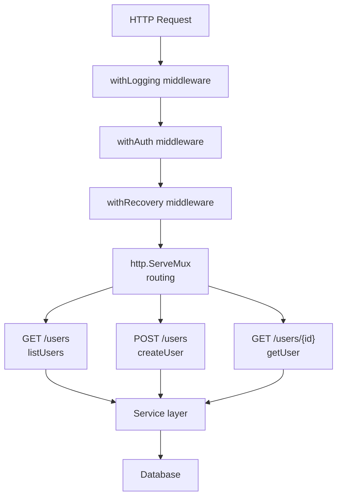

# Go HTTP Server

> [!abstract] TL;DR
> `net/http` is Go's built-in HTTP package. `http.Handler` is the core interface — anything with `ServeHTTP(w, r)` is a handler. Middleware is a function that wraps a handler with cross-cutting concerns (logging, auth, recovery). The standard `http.ServeMux` (Go 1.22+) supports method+path routing. Graceful shutdown drains in-flight requests before stopping.

---

## Handler Interface and HandlerFunc

```go
// The core interface
type Handler interface {
    ServeHTTP(ResponseWriter, *Request)
}

// Any function matching this signature can be used as a handler
type HandlerFunc func(ResponseWriter, *Request)
func (f HandlerFunc) ServeHTTP(w ResponseWriter, r *Request) { f(w, r) }

// Register handlers
mux := http.NewServeMux()

// Go 1.22+: method+path routing built in
mux.HandleFunc("GET /users", listUsers)
mux.HandleFunc("POST /users", createUser)
mux.HandleFunc("GET /users/{id}", getUser)
mux.HandleFunc("DELETE /users/{id}", deleteUser)

// Path variable extraction (Go 1.22+)
func getUser(w http.ResponseWriter, r *http.Request) {
    id := r.PathValue("id")   // from {id} placeholder
    // ...
}
```

---

## Middleware Pattern

Middleware wraps an `http.Handler` with pre/post processing. It is composable because it returns an `http.Handler`:

```go
// Middleware type
type Middleware func(http.Handler) http.Handler

// Logging middleware
func withLogging(next http.Handler) http.Handler {
    return http.HandlerFunc(func(w http.ResponseWriter, r *http.Request) {
        start := time.Now()
        next.ServeHTTP(w, r)
        log.Printf("%s %s %v", r.Method, r.URL.Path, time.Since(start))
    })
}

// Auth middleware
func withAuth(next http.Handler) http.Handler {
    return http.HandlerFunc(func(w http.ResponseWriter, r *http.Request) {
        token := r.Header.Get("Authorization")
        if !isValidToken(token) {
            http.Error(w, "unauthorized", http.StatusUnauthorized)
            return
        }
        next.ServeHTTP(w, r)
    })
}

// Recovery middleware — catch panics from handlers
func withRecovery(next http.Handler) http.Handler {
    return http.HandlerFunc(func(w http.ResponseWriter, r *http.Request) {
        defer func() {
            if err := recover(); err != nil {
                log.Printf("panic: %v\n%s", err, debug.Stack())
                http.Error(w, "internal error", http.StatusInternalServerError)
            }
        }()
        next.ServeHTTP(w, r)
    })
}

// Chain middleware (applied right-to-left — withLogging runs first)
handler := withLogging(withAuth(withRecovery(mux)))
```

---

## Request Parsing

```go
func createUser(w http.ResponseWriter, r *http.Request) {
    // JSON body
    var req struct {
        Name  string `json:"name"`
        Email string `json:"email"`
    }
    if err := json.NewDecoder(r.Body).Decode(&req); err != nil {
        http.Error(w, "invalid JSON", http.StatusBadRequest)
        return
    }
    defer r.Body.Close()

    // Query parameters
    page := r.URL.Query().Get("page")
    if page == "" { page = "1" }

    // Form data
    if err := r.ParseForm(); err != nil {
        http.Error(w, "invalid form", http.StatusBadRequest)
        return
    }
    name := r.FormValue("name")
    _ = name

    // Multipart form (file upload)
    if err := r.ParseMultipartForm(10 << 20); err != nil {
        http.Error(w, "invalid multipart", http.StatusBadRequest)
        return
    }
    file, header, err := r.FormFile("avatar")
    if err == nil {
        defer file.Close()
        _ = header.Filename
    }
}
```

---

## Response Writing

```go
func respond(w http.ResponseWriter, status int, data any) {
    w.Header().Set("Content-Type", "application/json")
    w.WriteHeader(status)   // must be called AFTER setting headers
    json.NewEncoder(w).Encode(data)
}

// Streaming response (chunked transfer encoding)
func streamHandler(w http.ResponseWriter, r *http.Request) {
    flusher, ok := w.(http.Flusher)
    if !ok {
        http.Error(w, "streaming not supported", http.StatusInternalServerError)
        return
    }
    w.Header().Set("Content-Type", "text/event-stream")
    for i := range 10 {
        fmt.Fprintf(w, "data: %d\n\n", i)
        flusher.Flush()
        time.Sleep(100 * time.Millisecond)
    }
}
```

---

## Server Configuration and Graceful Shutdown

```go
func main() {
    mux := http.NewServeMux()
    mux.HandleFunc("GET /health", func(w http.ResponseWriter, r *http.Request) {
        json.NewEncoder(w).Encode(map[string]string{"status": "ok"})
    })

    srv := &http.Server{
        Addr:         ":8080",
        Handler:      withLogging(withRecovery(mux)),
        ReadTimeout:  10 * time.Second,    // time to read the full request
        WriteTimeout: 30 * time.Second,    // time to write the full response
        IdleTimeout:  120 * time.Second,   // keep-alive idle timeout
        MaxHeaderBytes: 1 << 20,           // 1MB header limit
    }

    // Start server in goroutine
    go func() {
        log.Printf("listening on %s", srv.Addr)
        if err := srv.ListenAndServe(); err != http.ErrServerClosed {
            log.Fatalf("server error: %v", err)
        }
    }()

    // Graceful shutdown
    quit := make(chan os.Signal, 1)
    signal.Notify(quit, syscall.SIGINT, syscall.SIGTERM)
    <-quit

    ctx, cancel := context.WithTimeout(context.Background(), 30*time.Second)
    defer cancel()
    if err := srv.Shutdown(ctx); err != nil {
        log.Printf("shutdown error: %v", err)
    }
    log.Println("server stopped")
}
```

---

## Architecture Diagram



---

## Implementation Example

```go
package main

import (
    "encoding/json"
    "log"
    "net/http"
    "strconv"
    "time"
)

type Task struct {
    ID    int    `json:"id"`
    Title string `json:"title"`
}

var tasks = []Task{{1, "Learn Go"}, {2, "Build API"}}

func main() {
    mux := http.NewServeMux()

    mux.HandleFunc("GET /tasks", func(w http.ResponseWriter, r *http.Request) {
        w.Header().Set("Content-Type", "application/json")
        json.NewEncoder(w).Encode(tasks)
    })

    mux.HandleFunc("GET /tasks/{id}", func(w http.ResponseWriter, r *http.Request) {
        id, err := strconv.Atoi(r.PathValue("id"))
        if err != nil {
            http.Error(w, "invalid id", http.StatusBadRequest)
            return
        }
        for _, t := range tasks {
            if t.ID == id {
                w.Header().Set("Content-Type", "application/json")
                json.NewEncoder(w).Encode(t)
                return
            }
        }
        http.Error(w, "not found", http.StatusNotFound)
    })

    srv := &http.Server{
        Addr:         ":8080",
        Handler:      withLogging(mux),
        ReadTimeout:  10 * time.Second,
        WriteTimeout: 10 * time.Second,
    }
    log.Fatal(srv.ListenAndServe())
}

func withLogging(next http.Handler) http.Handler {
    return http.HandlerFunc(func(w http.ResponseWriter, r *http.Request) {
        start := time.Now()
        next.ServeHTTP(w, r)
        log.Printf("%s %s %v", r.Method, r.URL.Path, time.Since(start))
    })
}
```

---

## Common Pitfalls

- **`w.WriteHeader` after write**: Once you call `w.Write`, headers are sent. Calling `w.WriteHeader` afterward is ignored (superfluous call warning in logs).
- **Not closing request body**: Always `defer r.Body.Close()` in handlers to release the connection to the pool.
- **No timeouts on the server**: A server without `ReadTimeout`/`WriteTimeout` is vulnerable to slow-loris attacks.
- **Using `http.DefaultServeMux`**: `http.HandleFunc` registers on the package-level default mux. Other packages (e.g., pprof via `_` import) also register there. Always create your own `http.NewServeMux()`.

---

## Review Questions

1. What is the `http.Handler` interface? How does `http.HandlerFunc` implement it?
2. Explain middleware chaining. If `A(B(C(mux)))` — in what order do A, B, C execute?
3. Why should production HTTP servers always set `ReadTimeout` and `WriteTimeout`?
4. What does `srv.Shutdown(ctx)` do differently from `srv.Close()`?

---

#Go #Golang #HTTP #Server #Middleware #Web #GracefulShutdown
