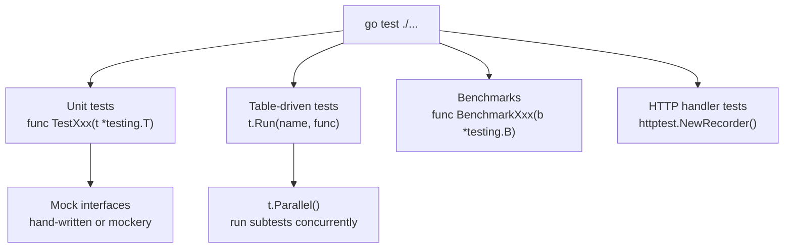

# Go Testing

> [!abstract] TL;DR
> Go's `testing` package is built into the toolchain — no frameworks required. Tests live in `_test.go` files alongside source code. Table-driven tests with subtests via `t.Run` are idiomatic. `httptest` enables HTTP handler testing without a real server. `testing.B` functions benchmark. Testify provides assertion helpers; mock interfaces with hand-written fakes or `mockery`.

---

## Test Basics

```go
// math_test.go — lives alongside math.go
package math

import "testing"

func TestAdd(t *testing.T) {
    got := Add(2, 3)
    want := 5
    if got != want {
        t.Errorf("Add(2, 3) = %d; want %d", got, want)
    }
}

// Run tests
// go test ./...              run all tests
// go test -v ./...           verbose output
// go test -run TestAdd ./... run tests matching pattern
// go test -count=1 ./...     disable test caching
// go test -race ./...        enable race detector
```

---

## Table-Driven Tests

The idiomatic Go testing pattern — one test function, many cases:

```go
func TestDivide(t *testing.T) {
    tests := []struct {
        name    string
        a, b    float64
        want    float64
        wantErr bool
    }{
        {name: "basic", a: 10, b: 2, want: 5},
        {name: "float", a: 10, b: 3, want: 3.333},
        {name: "divide by zero", a: 5, b: 0, wantErr: true},
        {name: "negative", a: -10, b: 2, want: -5},
    }

    for _, tt := range tests {
        t.Run(tt.name, func(t *testing.T) {
            got, err := Divide(tt.a, tt.b)
            if (err != nil) != tt.wantErr {
                t.Errorf("Divide(%v, %v) error = %v, wantErr %v",
                    tt.a, tt.b, err, tt.wantErr)
                return
            }
            if !tt.wantErr {
                if math.Abs(got-tt.want) > 0.001 {
                    t.Errorf("Divide(%v, %v) = %v, want %v",
                        tt.a, tt.b, got, tt.want)
                }
            }
        })
    }
}
```

Each `t.Run` creates a subtest that can be run independently: `go test -run TestDivide/divide_by_zero`.

---

## Test Helpers and Cleanup

```go
// t.Helper() marks this function as a helper — failures point to the caller
func assertEqual(t *testing.T, got, want any) {
    t.Helper()
    if got != want {
        t.Errorf("got %v; want %v", got, want)
    }
}

// t.Cleanup() runs after the test (even if it fails)
func setupDB(t *testing.T) *sql.DB {
    t.Helper()
    db, err := sql.Open("sqlite3", ":memory:")
    if err != nil {
        t.Fatal(err)
    }
    t.Cleanup(func() { db.Close() })
    return db
}

// t.TempDir() creates a temp directory cleaned up after the test
func TestReadFile(t *testing.T) {
    dir := t.TempDir()
    path := filepath.Join(dir, "test.txt")
    os.WriteFile(path, []byte("hello"), 0644)
    // ...
}
```

---

## Testing HTTP Handlers

`httptest` creates a test server or recorder without a real network:

```go
import (
    "net/http"
    "net/http/httptest"
    "testing"
)

func TestGetUser(t *testing.T) {
    // Use ResponseRecorder — no real network
    req := httptest.NewRequest("GET", "/users/1", nil)
    rec := httptest.NewRecorder()

    handler := NewUserHandler(mockStore)
    handler.ServeHTTP(rec, req)

    res := rec.Result()
    if res.StatusCode != http.StatusOK {
        t.Errorf("status = %d; want %d", res.StatusCode, http.StatusOK)
    }
    var user User
    json.NewDecoder(res.Body).Decode(&user)
    if user.ID != 1 {
        t.Errorf("user.ID = %d; want 1", user.ID)
    }
}

// Testing middleware requires the full chain
func TestWithAuth(t *testing.T) {
    handler := withAuth(http.HandlerFunc(func(w http.ResponseWriter, r *http.Request) {
        w.WriteHeader(http.StatusOK)
    }))

    t.Run("missing token", func(t *testing.T) {
        req := httptest.NewRequest("GET", "/", nil)
        rec := httptest.NewRecorder()
        handler.ServeHTTP(rec, req)
        assertEqual(t, rec.Code, http.StatusUnauthorized)
    })

    t.Run("valid token", func(t *testing.T) {
        req := httptest.NewRequest("GET", "/", nil)
        req.Header.Set("Authorization", "Bearer valid-token")
        rec := httptest.NewRecorder()
        handler.ServeHTTP(rec, req)
        assertEqual(t, rec.Code, http.StatusOK)
    })
}
```

---

## Mock Interfaces

Go's implicit interface satisfaction makes mocking simple — implement the interface in the test file:

```go
// Production interface (in store package)
type UserStore interface {
    Get(ctx context.Context, id int) (*User, error)
    Create(ctx context.Context, u CreateUserInput) (*User, error)
}

// Mock (in test file)
type mockUserStore struct {
    users map[int]*User
}

func (m *mockUserStore) Get(_ context.Context, id int) (*User, error) {
    u, ok := m.users[id]
    if !ok {
        return nil, ErrNotFound
    }
    return u, nil
}

func (m *mockUserStore) Create(_ context.Context, input CreateUserInput) (*User, error) {
    u := &User{ID: len(m.users) + 1, Name: input.Name}
    m.users[u.ID] = u
    return u, nil
}

// testify/mock for more complex scenarios
type MockStore struct {
    mock.Mock
}
func (m *MockStore) Get(ctx context.Context, id int) (*User, error) {
    args := m.Called(ctx, id)
    return args.Get(0).(*User), args.Error(1)
}
```

---

## Benchmarks

```go
func BenchmarkAdd(b *testing.B) {
    // b.N is the number of iterations — set automatically by the runner
    for range b.N {
        Add(2, 3)
    }
}

func BenchmarkSliceAppend(b *testing.B) {
    b.ReportAllocs()   // show allocations per op
    for range b.N {
        s := make([]int, 0, 1000)
        for i := range 1000 {
            s = append(s, i)
        }
    }
}

// Run benchmarks
// go test -bench=. -benchmem ./...
// go test -bench=BenchmarkAdd -benchtime=10s ./...
```

---

## Testing Diagram



---

## Common Pitfalls

- **`t.Fatal` in goroutines**: Calling `t.Fatal` or `t.Error` from a goroutine that is not the test goroutine causes a panic. Use a channel or `sync.WaitGroup` to report results back to the test goroutine.
- **Test caching**: Go caches passing tests. Add `-count=1` to force re-run. Tests with external dependencies (real DB, network) should use `t.Setenv` or build tags.
- **Order-sensitive table tests**: Tests should be independent. If test case N depends on test case N-1 having run, use `t.Run` sequential subtests, not separate slice entries.
- **`t.Cleanup` vs `defer`**: `t.Cleanup` is preferred over `defer` in helper functions — `defer` in a helper runs when the helper returns, not when the test ends.

---

## Review Questions

1. Why are table-driven tests preferred over writing a separate test function per case?
2. What does `t.Helper()` do? Why is it important in test helper functions?
3. Explain why implicit interface satisfaction makes mocking in Go easier than in Java or C#.
4. When would `httptest.NewServer` be more appropriate than `httptest.NewRecorder`?

---

#Go #Golang #Testing #TableDriven #Benchmarks #httptest #Mocks #TDD
