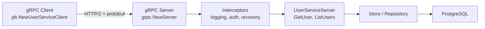

# Go gRPC

> [!abstract] TL;DR
> gRPC is a high-performance RPC framework using Protocol Buffers as the wire format over HTTP/2. Define services in `.proto` files; `protoc-gen-go` generates type-safe Go code. gRPC supports unary RPC, server/client streaming, and bidirectional streaming. Interceptors are the middleware equivalent. Use `google.golang.org/grpc/status` for structured error codes.

---

## Protocol Buffers Basics

```protobuf
// user.proto
syntax = "proto3";
package user.v1;
option go_package = "github.com/myorg/myapp/gen/user/v1;userv1";

// Service definition
service UserService {
  rpc GetUser (GetUserRequest) returns (GetUserResponse);
  rpc ListUsers (ListUsersRequest) returns (stream UserEvent);  // server streaming
  rpc CreateUser (stream CreateUserRequest) returns (CreateUserResponse);  // client streaming
  rpc Chat (stream ChatMessage) returns (stream ChatMessage);  // bidirectional
}

message GetUserRequest {
  int64 id = 1;
}

message GetUserResponse {
  User user = 1;
}

message User {
  int64  id    = 1;
  string name  = 2;
  string email = 3;
}
```

**Generate Go code:**
```bash
protoc --go_out=. --go_opt=paths=source_relative \
       --go-grpc_out=. --go-grpc_opt=paths=source_relative \
       user.proto
```

---

## gRPC Server

```go
import (
    "google.golang.org/grpc"
    "google.golang.org/grpc/codes"
    "google.golang.org/grpc/status"
    pb "github.com/myorg/myapp/gen/user/v1"
)

type userServer struct {
    pb.UnimplementedUserServiceServer   // embed for forward compatibility
    store UserStore
}

// Unary RPC — request/response
func (s *userServer) GetUser(ctx context.Context, req *pb.GetUserRequest) (*pb.GetUserResponse, error) {
    if req.Id <= 0 {
        return nil, status.Errorf(codes.InvalidArgument, "id must be positive, got %d", req.Id)
    }
    user, err := s.store.Get(ctx, int(req.Id))
    if errors.Is(err, ErrNotFound) {
        return nil, status.Errorf(codes.NotFound, "user %d not found", req.Id)
    }
    if err != nil {
        return nil, status.Errorf(codes.Internal, "get user: %v", err)
    }
    return &pb.GetUserResponse{
        User: &pb.User{Id: int64(user.ID), Name: user.Name, Email: user.Email},
    }, nil
}

// Server-streaming RPC
func (s *userServer) ListUsers(req *pb.ListUsersRequest, stream pb.UserService_ListUsersServer) error {
    users, err := s.store.List(stream.Context())
    if err != nil {
        return status.Errorf(codes.Internal, "list: %v", err)
    }
    for _, u := range users {
        if err := stream.Send(&pb.UserEvent{User: toProto(u)}); err != nil {
            return err   // client disconnected
        }
    }
    return nil
}

func main() {
    lis, err := net.Listen("tcp", ":50051")
    if err != nil {
        log.Fatal(err)
    }

    srv := grpc.NewServer(
        grpc.ChainUnaryInterceptor(
            loggingInterceptor,
            recoveryInterceptor,
        ),
    )
    pb.RegisterUserServiceServer(srv, &userServer{store: newStore()})
    reflection.Register(srv)   // for grpcurl and debugging tools

    log.Println("gRPC server on :50051")
    log.Fatal(srv.Serve(lis))
}
```

---

## gRPC Client

```go
conn, err := grpc.NewClient("localhost:50051",
    grpc.WithTransportCredentials(insecure.NewCredentials()),   // dev only
    grpc.WithDefaultCallOptions(grpc.MaxCallRecvMsgSize(10<<20)),
)
if err != nil {
    log.Fatal(err)
}
defer conn.Close()

client := pb.NewUserServiceClient(conn)

// Unary call
ctx, cancel := context.WithTimeout(context.Background(), 5*time.Second)
defer cancel()
resp, err := client.GetUser(ctx, &pb.GetUserRequest{Id: 1})
if err != nil {
    st, _ := status.FromError(err)
    fmt.Printf("code=%s msg=%s\n", st.Code(), st.Message())
}

// Server-streaming call
stream, err := client.ListUsers(ctx, &pb.ListUsersRequest{})
for {
    event, err := stream.Recv()
    if errors.Is(err, io.EOF) { break }
    if err != nil { log.Fatal(err) }
    fmt.Println(event.User.Name)
}
```

---

## Interceptors (Middleware)

```go
// Unary interceptor — wraps every unary RPC
func loggingInterceptor(
    ctx context.Context,
    req any,
    info *grpc.UnaryServerInfo,
    handler grpc.UnaryHandler,
) (any, error) {
    start := time.Now()
    resp, err := handler(ctx, req)
    log.Printf("method=%s duration=%v err=%v",
        info.FullMethod, time.Since(start), err)
    return resp, err
}

func recoveryInterceptor(
    ctx context.Context,
    req any,
    info *grpc.UnaryServerInfo,
    handler grpc.UnaryHandler,
) (resp any, err error) {
    defer func() {
        if r := recover(); r != nil {
            log.Printf("panic: %v", r)
            err = status.Errorf(codes.Internal, "internal error")
        }
    }()
    return handler(ctx, req)
}
```

---

## Architecture Diagram



---

## gRPC Status Codes

| Code | Use case |
|---|---|
| `codes.OK` | Success |
| `codes.InvalidArgument` | Bad input (like HTTP 400) |
| `codes.NotFound` | Resource not found (like HTTP 404) |
| `codes.AlreadyExists` | Conflict (like HTTP 409) |
| `codes.Unauthenticated` | Missing/invalid credentials (like HTTP 401) |
| `codes.PermissionDenied` | Insufficient permissions (like HTTP 403) |
| `codes.Internal` | Server error (like HTTP 500) |
| `codes.Unavailable` | Service temporarily down (like HTTP 503) |
| `codes.DeadlineExceeded` | Context deadline exceeded |

---

## Implementation Example

```go
// Server setup with TLS (production)
creds, err := credentials.NewServerTLSFromFile("cert.pem", "key.pem")
srv := grpc.NewServer(
    grpc.Creds(creds),
    grpc.ChainUnaryInterceptor(
        // Auth: extract JWT, inject user into ctx
        func(ctx context.Context, req any, info *grpc.UnaryServerInfo, handler grpc.UnaryHandler) (any, error) {
            md, _ := metadata.FromIncomingContext(ctx)
            tokens := md.Get("authorization")
            if len(tokens) == 0 {
                return nil, status.Error(codes.Unauthenticated, "missing token")
            }
            // validate token...
            return handler(ctx, req)
        },
    ),
    grpc.MaxConcurrentStreams(1000),
)
```

---

## Common Pitfalls

- **Missing `UnimplementedXxxServer` embedding**: Without embedding, adding a new RPC to the proto breaks all servers at compile time. The embed provides a default that returns `codes.Unimplemented`.
- **`grpc.Dial` is deprecated**: Use `grpc.NewClient` (Go gRPC v1.68+). `Dial` connects lazily; the new API is explicit about when the connection is established.
- **Not closing the server-stream on error**: If `stream.Send` returns an error, the client has disconnected — stop sending and return the error.
- **Context propagation**: Always pass `stream.Context()` (not `context.Background()`) to downstream calls so client cancellation propagates.

---

## Review Questions

1. What is the difference between unary, server-streaming, and bidirectional gRPC calls?
2. How do gRPC interceptors differ from HTTP middleware?
3. Why embed `UnimplementedUserServiceServer` in your server struct?
4. Map gRPC status codes to HTTP status codes for: NotFound, InvalidArgument, Internal, Unauthenticated.

---

#Go #Golang #gRPC #Protobuf #Microservices #RPC #Streaming
