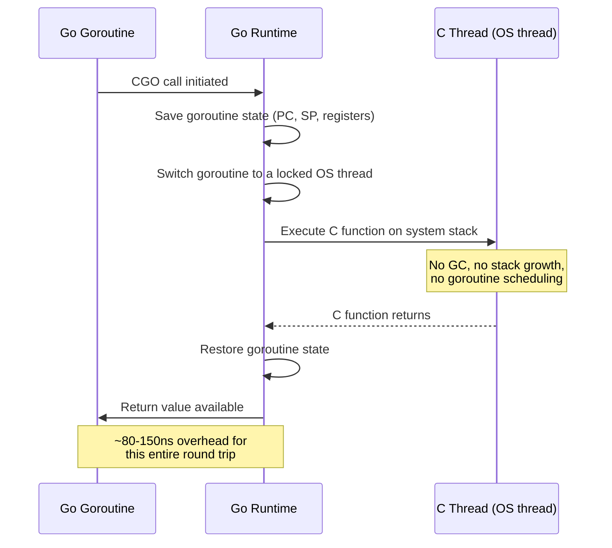

# Go CGO

> [!abstract] TL;DR
> CGO lets Go programs call C functions and be called from C, enabling use of existing C libraries (SQLite, OpenSSL, CUDA, etc.). The cost is high: ~100ns overhead per CGO call, broken cross-compilation, complex memory management (Go GC and C `malloc` do not cooperate), and difficult debugging. For read-only library loading, `purego` uses `dlopen`/`dlsym` without the full CGO toolchain. Use CGO when you must wrap a C library that cannot be rewritten; avoid it for performance-critical inner loops.

---

## Analogy: Calling a Contractor

CGO is like calling a contractor (C code) from your office (Go) — you can do it, but there is overhead scheduling the meeting (goroutine stack switching, GC root registration), you have to speak a different language (C types, manual memory management), and the contractor does not follow your safety rules (no garbage collection, no bounds checking, no goroutine stack growth). For a one-off task the contractor is invaluable; for everyday work, hiring a full-time employee (rewriting in Go) is usually better.

---

## CGO Basics

CGO is activated by importing the special pseudo-package `"C"`:

```go
package main

// The comment immediately before `import "C"` is the CGO preamble.
// It is treated as raw C code — you can include headers, define functions,
// and set linker flags here.
/*
#include <stdio.h>
#include <stdlib.h>
#include <string.h>

// You can also define C functions inline in the preamble
static int add(int a, int b) {
    return a + b;
}
*/
import "C"  // must be alone — no grouped import with other packages

import "fmt"

func main() {
    result := C.add(C.int(10), C.int(32))
    fmt.Println(int(result)) // 42
}
```

```bash
# CGO is enabled by default; disable with:
CGO_ENABLED=0 go build ./...

# Check whether CGO is enabled
go env CGO_ENABLED

# Build with CGO (the default)
go build ./...
```

**Linker flags for external C libraries:**

```go
// Link against libsqlite3 and libm
/*
#cgo LDFLAGS: -lsqlite3 -lm
#cgo CFLAGS: -O2 -Wall
#include <sqlite3.h>
*/
import "C"
```

**Platform-specific CGO flags:**

```go
/*
#cgo linux LDFLAGS: -ldl
#cgo darwin LDFLAGS: -framework CoreFoundation
#cgo windows LDFLAGS: -lws2_32
*/
import "C"
```

---

## Calling C from Go

### Basic Data Type Mapping

| Go type | C type |
|---|---|
| `C.int` | `int` |
| `C.long` | `long` |
| `C.char` | `char` |
| `C.uchar` | `unsigned char` |
| `C.size_t` | `size_t` |
| `C.double` | `double` |
| `*C.char` | `char*` (C string) |
| `unsafe.Pointer` | `void*` |

### String Conversion

The critical pair: Go strings are `(ptr, length)` byte slices with no null terminator; C strings are null-terminated `char*`. You must convert explicitly — and free the C string when done:

```go
package main

/*
#include <string.h>
#include <stdlib.h>

// Count occurrences of a char in a C string
int count_char(const char* s, char c) {
    int count = 0;
    while (*s) {
        if (*s == c) count++;
        s++;
    }
    return count;
}
*/
import "C"

import (
    "fmt"
    "unsafe"
)

func CountChar(s string, c byte) int {
    // C.CString allocates a new C string with malloc — must free it
    cs := C.CString(s)
    defer C.free(unsafe.Pointer(cs))  // ALWAYS defer free immediately after CString

    result := C.count_char(cs, C.char(c))
    return int(result)
}

func GoStringExample() {
    // Go -> C
    goStr := "hello, world"
    cStr  := C.CString(goStr)         // malloc'd copy, null-terminated
    defer C.free(unsafe.Pointer(cStr))

    // C -> Go
    // C.GoString converts a null-terminated C string to a Go string (copies the bytes)
    backToGo := C.GoString(cStr)       // "hello, world"

    // C -> Go with explicit length (for strings that may contain null bytes)
    goBytes := C.GoBytes(unsafe.Pointer(cStr), C.int(len(goStr)))
    _ = goBytes

    fmt.Println(backToGo)
}

func main() {
    fmt.Println(CountChar("banana", 'a')) // 3
}
```

### Passing Structs

```go
/*
#include <stdint.h>

typedef struct {
    int32_t x;
    int32_t y;
} Point;

double distance(Point a, Point b) {
    double dx = a.x - b.x;
    double dy = a.y - b.y;
    return __builtin_sqrt(dx*dx + dy*dy);
}
*/
import "C"
import "fmt"

func main() {
    a := C.Point{x: 0, y: 0}
    b := C.Point{x: 3, y: 4}
    d := C.distance(a, b)
    fmt.Printf("distance: %.2f\n", float64(d)) // 5.00
}
```

### Error Handling with `errno`

```go
/*
#include <errno.h>
#include <stdio.h>
*/
import "C"
import (
    "fmt"
    "syscall"
    "unsafe"
)

func openFile(path string) error {
    cs := C.CString(path)
    defer C.free(unsafe.Pointer(cs))

    // Many C functions set errno on failure
    // CGO provides a way to read errno after the call
    _, err := C.fopen(cs, C.CString("r"))
    if err != nil {
        // err is a *syscall.Errno
        return fmt.Errorf("fopen: %w", err)
    }
    return nil
}
```

---

## Calling Go from C

Use the `//export` directive to make a Go function callable from C. The exported function must be in a `main` package (or a package built as a C shared library):

```go
package main

import "C"
import "fmt"

// The name after //export becomes the C function name.
// The signature must only use CGO-compatible types.

//export GoAdd
func GoAdd(a, b C.int) C.int {
    return a + b
}

//export GoGreet
func GoGreet(name *C.char) *C.char {
    goName := C.GoString(name)
    result := fmt.Sprintf("Hello, %s!", goName)
    // C.CString allocates — the C caller must free this
    return C.CString(result)
}

func main() {} // required for shared library build
```

```bash
# Build as a C shared library
go build -buildmode=c-shared -o libgo.so ./main.go
# Produces: libgo.so and libgo.h

# Build as a C archive (for static linking)
go build -buildmode=c-archive -o libgo.a ./main.go
```

Generated `libgo.h` (automatically created):

```c
/* Code generated by cmd/cgo; DO NOT EDIT. */
extern GoInt GoAdd(GoInt a, GoInt b);
extern char* GoGreet(char* name);
```

C program using the shared library:

```c
#include "libgo.h"
#include <stdio.h>
#include <stdlib.h>

int main() {
    GoInt sum = GoAdd(10, 32);
    printf("GoAdd(10, 32) = %lld\n", sum);

    char* greeting = GoGreet("World");
    printf("%s\n", greeting);
    free(greeting);  // must free — GoGreet calls C.CString internally
    return 0;
}
```

---

## CGO Performance Overhead

Each CGO call incurs fixed overhead because Go goroutines have segmented/growable stacks while C requires a fixed-size stack. The runtime must:

1. Save Go goroutine state
2. Switch to a system thread stack
3. Execute the C function
4. Switch back and restore goroutine state

**Measured overhead (AMD64, Go 1.22):**

| Operation | Time |
|---|---|
| Go function call | ~1 ns |
| CGO call (empty C function) | ~80-150 ns |
| CGO call + C.CString + C.free | ~200-400 ns |
| CGO call with string round-trip | ~500-1000 ns |

**Implication:** CGO is fine for calls that do substantial work (parsing, compression, crypto) but catastrophic for tight loops. If you need to call a C function millions of times per second, consider:
- Batching multiple operations into a single CGO call
- Using a pure-Go reimplementation
- Using `purego` if the library is dynamically loaded (avoids goroutine stack switch)

---

## Passing Data: `unsafe.Pointer` and Pointer Rules

Go's GC can move objects in memory (in future GC versions) and the C side has no knowledge of Go's GC roots. The **CGO pointer passing rules** prevent memory corruption:

**Rule:** Go code may pass a Go pointer to C only if the Go memory to which it points does not contain any Go pointers.

```go
// LEGAL: passing a pointer to a Go-allocated struct with no Go pointers inside
type Vec3 struct{ X, Y, Z float64 }
v := Vec3{1, 2, 3}
C.processVec((*C.double)(unsafe.Pointer(&v)))  // safe: no Go pointers in Vec3

// ILLEGAL: passing a Go pointer that contains another Go pointer
type Node struct{ Value int; Next *Node }
n := &Node{Value: 1}
// C.processNode(unsafe.Pointer(n))  // ILLEGAL: n.Next is a Go pointer

// Fix: pin the data with runtime.Pinner (Go 1.21+)
var pinner runtime.Pinner
pinner.Pin(n)
defer pinner.Unpin()
// Now n is pinned — GC will not move it during C call
C.processNode(unsafe.Pointer(n))
```

**`uintptr` gotcha:** Never store a Go pointer in a `uintptr` across a CGO call — the GC may move the object between the `uintptr` capture and the CGO call, leaving you with a dangling pointer:

```go
// WRONG
p := uintptr(unsafe.Pointer(&myStruct))
C.someFunc(C.uintptr_t(p))  // myStruct may have moved

// CORRECT: pass unsafe.Pointer directly in the same expression
C.someFunc(unsafe.Pointer(&myStruct))  // Go guarantees liveness during the call
```

---

## Build Constraints and CGO

When `CGO_ENABLED=0`, the build tag `cgo` is absent. Files that use CGO will fail to compile. Guard them with build tags:

```go
//go:build cgo

package mylib

// CGO implementation
import "C"
```

```go
//go:build !cgo

package mylib

// Pure-Go fallback implementation
import "errors"

func SomeFunction() error {
    return errors.New("this build was compiled without CGO support")
}
```

Cross-compilation with CGO requires the target's C compiler:

```bash
# This FAILS for cross-compilation to linux/amd64 from macOS
GOOS=linux GOARCH=amd64 go build ./...  # error: no C compiler found

# Solutions:
# 1. Disable CGO
CGO_ENABLED=0 GOOS=linux GOARCH=amd64 go build ./...

# 2. Use a cross-compiler (e.g., musl-cross or docker)
CC=x86_64-linux-musl-gcc CGO_ENABLED=1 GOOS=linux GOARCH=amd64 go build ./...

# 3. Use Docker for the build environment
docker run --rm -v $(pwd):/src golang:1.22 go build -o /src/app-linux ./...
```

---

## Alternatives to CGO

### purego: dlopen/dlsym Without CGO

`purego` calls shared libraries using `syscall`-level `dlopen`/`dlsym`. No C compiler required, cross-compilation works, and binary remains CGO-free:

```go
import (
    "github.com/ebitengine/purego"
    "runtime"
)

var libssl uintptr

func init() {
    var err error
    switch runtime.GOOS {
    case "darwin":
        libssl, err = purego.Dlopen("libssl.dylib", purego.RTLD_NOW|purego.RTLD_GLOBAL)
    case "linux":
        libssl, err = purego.Dlopen("libssl.so.3", purego.RTLD_NOW|purego.RTLD_GLOBAL)
    }
    if err != nil {
        panic(err)
    }
}

// Declare Go function signatures for C symbols
var sslVersion func() string

func init() {
    purego.RegisterLibFunc(&sslVersion, libssl, "OpenSSL_version_str")
}

func main() {
    fmt.Println(sslVersion()) // e.g. "OpenSSL 3.0.2 15 Mar 2022"
}
```

**purego limitations:** Cannot call functions that require C struct layout compatibility or variadic C functions easily. Best for simple function calls where the ABI is stable.

### wazero: WASM Sandbox Instead of C

Compile the C library to WASM, then run it via wazero — complete isolation, no C compiler needed:

```go
import (
    "github.com/tetratelabs/wazero"
    "os"
)

func main() {
    ctx := context.Background()
    r := wazero.NewRuntime(ctx)
    defer r.Close(ctx)

    wasmBytes, _ := os.ReadFile("mylib.wasm")
    mod, _ := r.InstantiateWithConfig(ctx, wasmBytes,
        wazero.NewModuleConfig().WithStdout(os.Stdout))

    add := mod.ExportedFunction("add")
    results, _ := add.Call(ctx, 10, 32)
    fmt.Println(results[0]) // 42
}
```

---

## CGO Call Flow Diagram



---

## Trade-offs: CGO vs Alternatives

| Approach | Cross-Compile | Perf Overhead | C Compiler Needed | Memory Safety | Best For |
|---|---|---|---|---|---|
| CGO | No (without musl cross) | ~100-500ns/call | Yes, for target | Manual (C rules) | Deep C library integration |
| purego (dlopen) | Yes | ~10-20ns/call | No | Go-managed args | Calling stable shared libraries |
| wazero (WASM) | Yes | ~50-200ns/call | No (WASM compiler) | Sandboxed | Untrusted code, plugins |
| Rewrite in Go | Yes | 0 | No | Full GC safety | Long-term maintenance |
| Subprocess (exec.Cmd) | Yes | Fork overhead | No | Full isolation | One-shot invocations |

---

## Common Pitfalls

- **Memory leaks from forgetting `C.free`**: `C.CString`, `C.CBytes`, and any C function that returns `malloc`'d memory must be freed with `C.free(unsafe.Pointer(ptr))`. Always `defer C.free` immediately after the allocation — never wait until end of function. Forgetting this in a server loop creates unbounded memory growth.

- **Cross-compilation breaks with CGO**: The default `CGO_ENABLED=1` means any `import "C"` in your dependency tree breaks `GOOS=linux GOARCH=amd64 go build` on macOS unless you have a cross-compiler. Use `CGO_ENABLED=0` or build inside a Linux Docker container.

- **No goroutine stack growth in C**: Go goroutines start with a small stack (8KB) that grows dynamically. C code runs on the system thread's stack (typically 8MB, fixed). Deeply recursive C code can stack overflow without warning. C code also cannot block on channel operations or call most Go runtime functions.

- **Go pointer pinning rule**: Passing a Go pointer that contains another Go pointer to C is illegal and detected at runtime with `GOEXPERIMENT=cgocheck2` (enabled by default in `go test`). The fix is either to flatten the data into a C-owned buffer or use `runtime.Pinner` (Go 1.21+).

- **`//export` and the preamble conflict**: You cannot define C functions in the preamble of the same file that uses `//export`. Split the CGO preamble code into a separate `.go` file (or a `.c` file in the package directory).

---

## Review Questions

1. Why does `CGO_ENABLED=0` break builds that use `import "C"`, and what are two strategies to enable cross-compilation for packages that require CGO?
2. Explain what `C.CString` does under the hood, why you must call `C.free` on its result, and what kind of bug occurs if you forget.
3. What is the CGO pointer-passing rule, and why does it exist? How does `runtime.Pinner` (Go 1.21+) help when you need to pass a complex Go struct to C?
4. When would you choose `purego` over full CGO, and what are `purego`'s limitations?

---

#Go #Golang #CGO #C #Interop #FFI #purego #CrossCompile #MemoryManagement #unsafe
