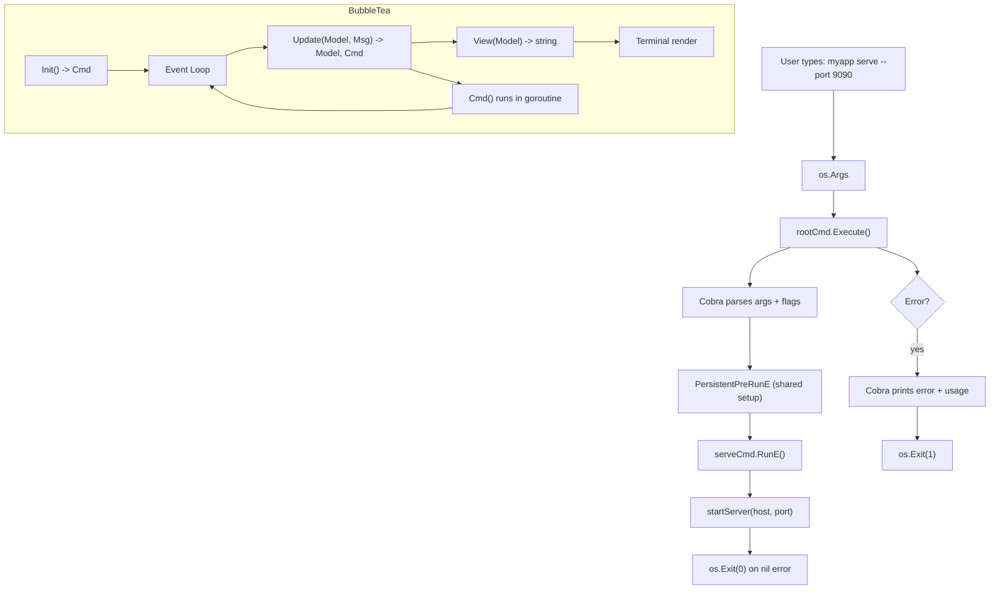

# Go CLI Development

> [!abstract] TL;DR
> Go's standard `flag` package handles simple single-command tools, while Cobra provides a full framework for multi-command CLIs with persistent flags, subcommand trees, and shell completion. For interactive terminal UIs, BubbleTea implements the Elm Architecture (Model/Update/View) giving you a structured reactive TUI. Choose the tool that matches your CLI's complexity: `flag` for scripts, Cobra for CLIs that ship to users, BubbleTea for rich interactive experiences.

---

## Analogy: Swiss Army Knife

Building a CLI in Go is like building a Swiss Army knife — the `flag` package gives you a basic blade, Cobra gives you a full multi-tool with blades, scissors, and a saw, and BubbleTea gives you a touch-screen multi-tool. The basic blade is sufficient for cutting string; the multi-tool handles survival situations; and the touch-screen model provides a guided experience for complex operations.

---

## The `flag` Package

The standard library `flag` package handles straightforward single-level commands. It is zero-dependency and always available.

```go
package main

import (
    "flag"
    "fmt"
    "os"
)

func main() {
    // Define flags — returns a pointer to the value
    host    := flag.String("host", "localhost", "server hostname")
    port    := flag.Int("port", 8080, "server port")
    verbose := flag.Bool("verbose", false, "enable verbose logging")
    timeout := flag.Duration("timeout", 30*time.Second, "request timeout")

    // Parse must be called after all flags are defined, before accessing values
    flag.Parse()

    // Positional arguments after flags
    args := flag.Args()  // []string

    if *verbose {
        fmt.Printf("Connecting to %s:%d\n", *host, *port)
        fmt.Printf("Timeout: %s\n", *timeout)
        fmt.Printf("Positional args: %v\n", args)
    }

    if len(args) == 0 {
        fmt.Fprintln(os.Stderr, "usage: myapp [flags] <input-file>")
        flag.Usage()
        os.Exit(1)
    }
}
```

```bash
# Usage
./myapp -host=api.example.com -port=443 -verbose input.txt
./myapp --host api.example.com --verbose=true input.txt
```

**Custom FlagSet for subcommands** — the standard `flag` package supports multiple `FlagSet`s, which is how you can fake subcommands:

```go
serve := flag.NewFlagSet("serve", flag.ExitOnError)
servePort := serve.Int("port", 8080, "listen port")

migrate := flag.NewFlagSet("migrate", flag.ExitOnError)
migrateDir := migrate.String("dir", "./migrations", "migrations directory")

if len(os.Args) < 2 {
    fmt.Println("expected 'serve' or 'migrate' subcommands")
    os.Exit(1)
}

switch os.Args[1] {
case "serve":
    serve.Parse(os.Args[2:])
    runServer(*servePort)
case "migrate":
    migrate.Parse(os.Args[2:])
    runMigrate(*migrateDir)
default:
    fmt.Printf("unknown subcommand: %s\n", os.Args[1])
    os.Exit(1)
}
```

---

## Cobra Framework

Cobra is the standard choice for production Go CLIs (kubectl, gh, docker, helm all use it). It provides persistent flags, automatic help generation, shell completion, and a clean command tree.

### Installation

```bash
go get github.com/spf13/cobra@latest
go install github.com/spf13/cobra-cli@latest  # code generator
```

### Command Structure

```go
package main

import (
    "fmt"
    "os"
    "github.com/spf13/cobra"
)

// rootCmd is the entry point for the entire CLI
var rootCmd = &cobra.Command{
    Use:   "myapp",
    Short: "A sample application",
    Long:  `myapp is a CLI tool that demonstrates Cobra's features.`,
    // PersistentPreRunE runs before every subcommand — use for shared setup
    PersistentPreRunE: func(cmd *cobra.Command, args []string) error {
        verbose, _ := cmd.Flags().GetBool("verbose")
        if verbose {
            fmt.Println("verbose mode enabled")
        }
        return nil
    },
}

// serveCmd is a subcommand: myapp serve
var serveCmd = &cobra.Command{
    Use:   "serve",
    Short: "Start the HTTP server",
    Long:  `Start the HTTP server on the given host and port.`,
    Args:  cobra.NoArgs,  // validation: no positional args allowed
    RunE: func(cmd *cobra.Command, args []string) error {
        port, _ := cmd.Flags().GetInt("port")
        host, _ := cmd.Flags().GetString("host")
        fmt.Printf("Starting server on %s:%d\n", host, port)
        // return an error to signal failure (non-zero exit code)
        return startServer(host, port)
    },
}

// migrateCmd: myapp migrate
var migrateCmd = &cobra.Command{
    Use:   "migrate [direction]",
    Short: "Run database migrations",
    Args:  cobra.ExactArgs(1),  // exactly one positional arg
    ValidArgs: []string{"up", "down"},
    RunE: func(cmd *cobra.Command, args []string) error {
        dir := args[0]
        steps, _ := cmd.Flags().GetInt("steps")
        return runMigrations(dir, steps)
    },
}

func init() {
    // Persistent flags — available on rootCmd AND all subcommands
    rootCmd.PersistentFlags().Bool("verbose", false, "enable verbose output")
    rootCmd.PersistentFlags().String("config", "", "config file path")

    // Local flags — available only on serveCmd
    serveCmd.Flags().Int("port", 8080, "HTTP port to listen on")
    serveCmd.Flags().String("host", "0.0.0.0", "hostname to bind")

    // Mark a flag as required
    serveCmd.MarkFlagRequired("port")

    // Local flags for migrate
    migrateCmd.Flags().Int("steps", 0, "number of migration steps (0 = all)")

    // Register subcommands under root
    rootCmd.AddCommand(serveCmd)
    rootCmd.AddCommand(migrateCmd)
}

func main() {
    if err := rootCmd.Execute(); err != nil {
        // Cobra already prints the error; just exit
        os.Exit(1)
    }
}
```

### Cobra-CLI Code Generator

```bash
# Initialize a new cobra project
cobra-cli init myapp
cd myapp

# Add a subcommand (creates cmd/serve.go automatically)
cobra-cli add serve
cobra-cli add migrate

# Add a nested subcommand: myapp migrate up
cobra-cli add up -p migrateCmd
```

Generated file structure:

```
myapp/
  cmd/
    root.go      # rootCmd + init()
    serve.go     # serveCmd + init() with AddCommand
    migrate.go   # migrateCmd
  main.go        # calls cmd.Execute()
```

### Args Validators

```go
cobra.NoArgs           // no positional args
cobra.ArbitraryArgs    // any number of args
cobra.ExactArgs(n)     // exactly n args
cobra.MinimumNArgs(n)  // at least n args
cobra.MaximumNArgs(n)  // at most n args
cobra.RangeArgs(n, m)  // between n and m args
cobra.OnlyValidArgs    // args must be in ValidArgs slice
```

### Shell Completion

Cobra generates shell completion scripts automatically:

```bash
myapp completion bash  > /etc/bash_completion.d/myapp
myapp completion zsh   > "${fpath[1]}/_myapp"
myapp completion fish  > ~/.config/fish/completions/myapp.fish
```

---

## urfave/cli v2

A lighter-weight alternative to Cobra. Preferred by some teams for its more functional style:

```go
package main

import (
    "fmt"
    "log"
    "os"
    "github.com/urfave/cli/v2"
)

func main() {
    app := &cli.App{
        Name:  "myapp",
        Usage: "a sample CLI",
        Flags: []cli.Flag{
            &cli.BoolFlag{Name: "verbose", Aliases: []string{"v"}},
        },
        Commands: []*cli.Command{
            {
                Name:  "serve",
                Usage: "start the HTTP server",
                Flags: []cli.Flag{
                    &cli.IntFlag{Name: "port", Value: 8080},
                },
                Action: func(c *cli.Context) error {
                    port := c.Int("port")
                    fmt.Printf("Serving on port %d\n", port)
                    return nil
                },
            },
        },
    }

    if err := app.Run(os.Args); err != nil {
        log.Fatal(err)
    }
}
```

---

## BubbleTea TUI

BubbleTea implements The Elm Architecture (TEA): your application is a pure function `(Model, Msg) -> (Model, Cmd)`. All state lives in `Model`; `Update` handles events; `View` renders to a string.

### The Elm Architecture in Go

```go
package main

import (
    "fmt"

    tea "github.com/charmbracelet/bubbletea"
)

// Model holds all application state
type model struct {
    choices  []string
    cursor   int
    selected map[int]struct{}
}

func initialModel() model {
    return model{
        choices:  []string{"Buy carrots", "Buy celery", "Buy kohlrabi"},
        selected: make(map[int]struct{}),
    }
}

// Msg represents events — keyboard input, timer ticks, HTTP responses, etc.
// tea.KeyMsg is the built-in message for key presses.

// Update handles every incoming Msg and returns the new model + any Cmd to run
func (m model) Update(msg tea.Msg) (tea.Model, tea.Cmd) {
    switch msg := msg.(type) {
    case tea.KeyMsg:
        switch msg.String() {
        case "ctrl+c", "q":
            return m, tea.Quit  // tea.Quit is a built-in Cmd that exits

        case "up", "k":
            if m.cursor > 0 {
                m.cursor--
            }

        case "down", "j":
            if m.cursor < len(m.choices)-1 {
                m.cursor++
            }

        case " ":
            // Toggle selection
            if _, ok := m.selected[m.cursor]; ok {
                delete(m.selected, m.cursor)
            } else {
                m.selected[m.cursor] = struct{}{}
            }
        }
    }
    return m, nil  // nil Cmd means no side effects
}

// View renders the model to a string — this is what the user sees
func (m model) View() string {
    s := "What should we buy at the market?\n\n"

    for i, choice := range m.choices {
        cursor := " "
        if m.cursor == i {
            cursor = ">"
        }
        checked := " "
        if _, ok := m.selected[i]; ok {
            checked = "x"
        }
        s += fmt.Sprintf("%s [%s] %s\n", cursor, checked, choice)
    }

    s += "\nPress q to quit.\n"
    return s
}

// Init runs once on startup and returns an optional initial Cmd
func (m model) Init() tea.Cmd {
    return nil  // nothing to do on startup
}

func main() {
    p := tea.NewProgram(initialModel())
    if _, err := p.Run(); err != nil {
        fmt.Printf("Error: %v\n", err)
    }
}
```

### tea.Cmd for Async Work

`tea.Cmd` is a function `func() tea.Msg` — it runs off the main goroutine and delivers a `Msg` back to `Update`. This is how you do non-blocking I/O:

```go
// A Cmd that fetches data and returns a custom Msg
type fetchResultMsg struct {
    data []byte
    err  error
}

func fetchData(url string) tea.Cmd {
    return func() tea.Msg {
        // runs in a goroutine managed by BubbleTea
        resp, err := http.Get(url)
        if err != nil {
            return fetchResultMsg{err: err}
        }
        defer resp.Body.Close()
        data, _ := io.ReadAll(resp.Body)
        return fetchResultMsg{data: data}
    }
}

// In Init(), kick off the fetch
func (m model) Init() tea.Cmd {
    return fetchData("https://api.example.com/items")
}

// In Update(), handle the result
func (m model) Update(msg tea.Msg) (tea.Model, tea.Cmd) {
    switch msg := msg.(type) {
    case fetchResultMsg:
        if msg.err != nil {
            m.err = msg.err
            return m, nil
        }
        m.data = msg.data
        return m, nil
    }
    return m, nil
}
```

### Lip Gloss for Styling

```go
import "github.com/charmbracelet/lipgloss"

var (
    titleStyle = lipgloss.NewStyle().
        Bold(true).
        Foreground(lipgloss.Color("#FAFAFA")).
        Background(lipgloss.Color("#7D56F4")).
        PaddingLeft(2).PaddingRight(2)

    selectedStyle = lipgloss.NewStyle().
        Foreground(lipgloss.Color("#7D56F4")).
        Bold(true)
)

func (m model) View() string {
    return titleStyle.Render("My TUI App") + "\n\n" + selectedStyle.Render("> item")
}
```

---

## Command Flow Diagram



---

## Trade-offs Comparison

| Feature | `flag` (stdlib) | Cobra | urfave/cli v2 | BubbleTea |
|---|---|---|---|---|
| Dependencies | None | spf13/cobra + pflag | urfave/cli | charmbracelet/bubbletea |
| Subcommands | Manual FlagSet | First-class, nested | First-class | N/A (TUI, not CLI router) |
| Persistent flags | No | Yes | Via `Before` hook | N/A |
| Shell completion | No | Yes (auto-generated) | Manual | N/A |
| Help generation | Basic | Rich (auto) | Rich (auto) | N/A |
| Learning curve | Minimal | Low-Medium | Low | Medium (TEA pattern) |
| Best for | Scripts, simple tools | Production CLIs | Simpler alternatives to Cobra | Interactive TUIs |
| Used by | Many stdlib tools | kubectl, gh, helm, hugo | Wire, some Hashicorp tools | k9s, lazygit-style tools |
| Binary size impact | 0 | ~1MB | ~500KB | ~2MB with styling |

---

## Common Pitfalls

- **Forgetting `flag.Parse()`**: All flag values remain at their zero-value defaults if you forget to call `flag.Parse()` before reading them. Cobra handles this automatically, but stdlib `flag` does not.

- **Cobra `init()` registration**: Every command must call `rootCmd.AddCommand(subCmd)` inside an `init()` function in its own file. Forgetting this means the subcommand silently does not exist. The `cobra-cli add` generator does this correctly — follow that pattern.

- **`RunE` vs `Run`**: Always prefer `RunE` over `Run`. `Run` cannot return errors, so your only option for signaling failure is `os.Exit()`, which skips deferred cleanup. `RunE` returning a non-nil error causes `Execute()` to return that error and automatically prints it.

- **`PersistentPreRunE` gotcha**: If a subcommand defines its own `PreRunE`, the parent's `PersistentPreRunE` does NOT run automatically — you must call the parent's function manually or use `cobra.CheckErr` patterns. Consider using `TraverseChildren: true` on the root command.

- **BubbleTea blocking `Cmd`s**: If your `tea.Cmd` function blocks (e.g., never returns), the TUI freezes. Always make Cmds return quickly and use channels or goroutines internally if the work is long-running.

- **urfave/cli v1 vs v2**: The import path changed from `github.com/urfave/cli` to `github.com/urfave/cli/v2`. The APIs are similar but not identical — ensure your dependencies and docs match the correct version.

---

## Review Questions

1. What is the difference between a persistent flag and a local flag in Cobra, and when would you use each?
2. Explain The Elm Architecture (TEA) as implemented by BubbleTea: what are `Model`, `Update`, and `View`, and what are their responsibilities?
3. In Cobra, why should you prefer `RunE` over `Run`? What happens when `RunE` returns a non-nil error?
4. How does a `tea.Cmd` allow BubbleTea to perform non-blocking I/O (such as an HTTP request) without blocking the UI event loop?

---

#Go #Golang #CLI #Cobra #BubbleTea #TUI #flag #ElmArchitecture #urfave
