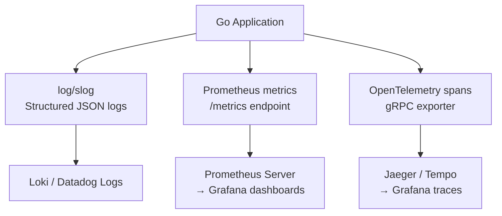

# Go Observability

> [!abstract] TL;DR
> Observability in Go is built on three pillars: **logs** (events), **metrics** (counts/rates/distributions), **traces** (request flow). Go 1.21 introduced `log/slog` for structured, leveled logging. `prometheus/client_golang` exports Prometheus metrics. `go.opentelemetry.io/otel` provides distributed tracing and context propagation. Healthcheck endpoints expose service readiness for orchestrators.

---

## Structured Logging with slog (Go 1.21+)

`log/slog` replaces ad-hoc `log.Printf` with structured, leveled logging:

```go
import "log/slog"

// Default logger (writes JSON to stderr in production)
logger := slog.New(slog.NewJSONHandler(os.Stderr, &slog.HandlerOptions{
    Level: slog.LevelInfo,
}))
slog.SetDefault(logger)

// Structured log entries — use attributes, not format strings
slog.Info("request started",
    slog.String("method", r.Method),
    slog.String("path", r.URL.Path),
    slog.String("request_id", requestIDFrom(r.Context())),
)

slog.Warn("database slow",
    slog.Duration("latency", elapsed),
    slog.Int("rows", rowCount),
)

slog.Error("payment failed",
    slog.String("order_id", orderID),
    slog.Any("error", err),
)

// Logger with context (adds fixed fields to all log entries)
reqLogger := logger.With(
    slog.String("request_id", requestID),
    slog.String("user_id", userID),
)
reqLogger.Info("processing order")
reqLogger.Info("order shipped")
```

---

## Prometheus Metrics with client_golang

```go
import (
    "github.com/prometheus/client_golang/prometheus"
    "github.com/prometheus/client_golang/prometheus/promauto"
    "github.com/prometheus/client_golang/prometheus/promhttp"
)

// Define metrics at package level
var (
    httpRequestsTotal = promauto.NewCounterVec(
        prometheus.CounterOpts{
            Name: "http_requests_total",
            Help: "Total number of HTTP requests",
        },
        []string{"method", "path", "status"},
    )

    httpRequestDuration = promauto.NewHistogramVec(
        prometheus.HistogramOpts{
            Name:    "http_request_duration_seconds",
            Help:    "HTTP request duration in seconds",
            Buckets: prometheus.DefBuckets,   // .005, .01, .025, .05, .1, .25, .5, 1, 2.5, 5, 10
        },
        []string{"method", "path"},
    )

    activeConnections = promauto.NewGauge(prometheus.GaugeOpts{
        Name: "active_connections",
        Help: "Number of currently active connections",
    })

    orderValue = promauto.NewHistogram(prometheus.HistogramOpts{
        Name:    "order_value_dollars",
        Help:    "Distribution of order values",
        Buckets: []float64{1, 5, 10, 25, 50, 100, 250, 500, 1000},
    })
)

// Metrics middleware
func withMetrics(next http.Handler) http.Handler {
    return http.HandlerFunc(func(w http.ResponseWriter, r *http.Request) {
        start := time.Now()
        rec := &statusRecorder{ResponseWriter: w, statusCode: 200}
        next.ServeHTTP(rec, r)
        duration := time.Since(start).Seconds()

        httpRequestsTotal.WithLabelValues(
            r.Method, r.URL.Path, strconv.Itoa(rec.statusCode),
        ).Inc()
        httpRequestDuration.WithLabelValues(r.Method, r.URL.Path).Observe(duration)
    })
}

// Expose metrics endpoint
mux.Handle("GET /metrics", promhttp.Handler())
```

---

## OpenTelemetry Tracing

```go
import (
    "go.opentelemetry.io/otel"
    "go.opentelemetry.io/otel/exporters/otlp/otlptrace/otlptracegrpc"
    "go.opentelemetry.io/otel/sdk/trace"
    semconv "go.opentelemetry.io/otel/semconv/v1.21.0"
)

var tracer = otel.Tracer("myapp")

// Initialize the tracing provider (call once at startup)
func initTracing(ctx context.Context, serviceName string) (*sdktrace.TracerProvider, error) {
    exporter, err := otlptracegrpc.New(ctx,
        otlptracegrpc.WithEndpoint("otel-collector:4317"),
        otlptracegrpc.WithInsecure(),
    )
    if err != nil {
        return nil, err
    }

    tp := sdktrace.NewTracerProvider(
        sdktrace.WithBatcher(exporter),
        sdktrace.WithResource(resource.NewWithAttributes(
            semconv.SchemaURL,
            semconv.ServiceName(serviceName),
        )),
    )
    otel.SetTracerProvider(tp)
    return tp, nil
}

// Instrument a function — spans appear in Jaeger/Tempo
func (s *Service) processOrder(ctx context.Context, orderID string) error {
    ctx, span := tracer.Start(ctx, "processOrder",
        trace.WithAttributes(attribute.String("order.id", orderID)),
    )
    defer span.End()

    // Child span for DB call
    ctx, dbSpan := tracer.Start(ctx, "db.fetchOrder")
    order, err := s.db.FetchOrder(ctx, orderID)
    dbSpan.End()
    if err != nil {
        span.RecordError(err)
        span.SetStatus(codes.Error, err.Error())
        return err
    }

    span.SetAttributes(attribute.Float64("order.value", order.Total))
    return s.fulfillOrder(ctx, order)
}
```

---

## Healthcheck Endpoints

```go
type HealthStatus struct {
    Status   string            `json:"status"`
    Checks   map[string]string `json:"checks"`
    Version  string            `json:"version"`
    Uptime   string            `json:"uptime"`
}

var startTime = time.Now()

func healthHandler(db *sql.DB) http.HandlerFunc {
    return func(w http.ResponseWriter, r *http.Request) {
        checks := make(map[string]string)
        allOK := true

        // Check database
        ctx, cancel := context.WithTimeout(r.Context(), 2*time.Second)
        defer cancel()
        if err := db.PingContext(ctx); err != nil {
            checks["database"] = "unhealthy: " + err.Error()
            allOK = false
        } else {
            checks["database"] = "healthy"
        }

        status := "healthy"
        code := http.StatusOK
        if !allOK {
            status = "unhealthy"
            code = http.StatusServiceUnavailable
        }

        w.Header().Set("Content-Type", "application/json")
        w.WriteHeader(code)
        json.NewEncoder(w).Encode(HealthStatus{
            Status:  status,
            Checks:  checks,
            Version: Version,
            Uptime:  time.Since(startTime).String(),
        })
    }
}
```

---

## Observability Architecture



---

## Common Pitfalls

- **High cardinality labels**: Prometheus label values that have many unique values (user IDs, order IDs, URLs with path params) create millions of time series and crash Prometheus. Use path templates (`/users/:id`), not actual IDs.
- **Not ending spans**: `defer span.End()` immediately after `tracer.Start`. An unclosed span never appears in the trace backend.
- **Logging errors without context**: `slog.Error("failed")` is nearly useless in production. Include the operation, relevant IDs, and the error value.
- **Missing health differentiation**: `/healthz` (liveness — is the process running?) and `/readyz` (readiness — is it ready to serve?) should be separate endpoints for Kubernetes.

---

## Review Questions

1. What are the three pillars of observability and what does each answer?
2. Why is high-cardinality label data dangerous in Prometheus?
3. How does OpenTelemetry context propagation work across service boundaries?
4. What is the difference between a liveness probe and a readiness probe in Kubernetes? How should your `/health` endpoint respond during startup?

---

#Go #Golang #Observability #Logging #Metrics #Tracing #Prometheus #OpenTelemetry #slog
