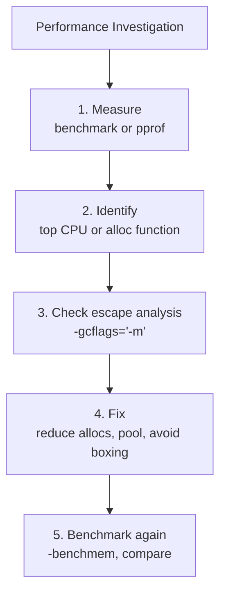

# Go Performance

> [!abstract] TL;DR
> Go performance work follows the same principle as all optimization: measure first, then fix. `pprof` profiles CPU usage, memory allocations, goroutine counts, and blocking. Escape analysis shows what allocates on the heap. `sync.Pool` recycles objects to reduce GC pressure. `strings.Builder` avoids quadratic string concatenation. Always benchmark before and after changes.

---

## Profiling with pprof

**Step 1 — enable the pprof HTTP endpoint:**

```go
import _ "net/http/pprof"   // registers /debug/pprof/* routes on http.DefaultServeMux

go func() {
    log.Println(http.ListenAndServe("localhost:6060", nil))
}()
```

**Step 2 — collect a profile:**

```bash
# CPU profile (30 seconds)
go tool pprof http://localhost:6060/debug/pprof/profile?seconds=30

# Memory profile (heap allocations)
go tool pprof http://localhost:6060/debug/pprof/heap

# Goroutine profile (current goroutines)
go tool pprof http://localhost:6060/debug/pprof/goroutine

# Blocking profile (where goroutines block)
go tool pprof http://localhost:6060/debug/pprof/block
```

**Step 3 — explore in interactive mode or web UI:**

```bash
# Interactive CLI
(pprof) top10         # top 10 functions by self time
(pprof) web           # open flame graph in browser (requires graphviz)
(pprof) list myFunc   # annotate source lines of myFunc

# Direct web UI (requires Go 1.10+)
go tool pprof -http=:8080 cpu.prof
```

---

## Benchmark-Based Profiling

```go
func BenchmarkProcessData(b *testing.B) {
    data := generateTestData(1000)
    b.ResetTimer()   // don't count setup time
    b.ReportAllocs() // show allocs/op and B/op

    for range b.N {
        processData(data)
    }
}
```

```bash
# Run benchmarks and generate a profile
go test -bench=BenchmarkProcessData -benchmem \
    -cpuprofile=cpu.prof \
    -memprofile=mem.prof \
    ./...

go tool pprof cpu.prof
go tool pprof mem.prof
```

---

## Escape Analysis

The compiler decides at compile time whether a value lives on the stack (fast) or heap (GC-managed). Use `-gcflags="-m"` to see decisions:

```bash
go build -gcflags="-m -l" ./...
# Output:
# ./main.go:15:9: &x escapes to heap
# ./main.go:22:13: p does not escape
# ./main.go:30:20: inlining call to fmt.Sprintf
```

**Common escape triggers:**
- Returning a pointer to a local variable
- Storing in an interface (`any`) — interface boxing
- Sending to a goroutine via channel
- Appending to a slice that grows beyond its capacity
- Closures capturing variables

**Reducing allocations:**

```go
// BEFORE: each call allocates a string
func formatName(first, last string) string {
    return first + " " + last   // allocates two intermediate strings
}

// AFTER: strings.Builder — single allocation
func formatName(first, last string) string {
    var b strings.Builder
    b.Grow(len(first) + 1 + len(last))   // pre-allocate
    b.WriteString(first)
    b.WriteByte(' ')
    b.WriteString(last)
    return b.String()
}

// For fmt.Sprintf — use fmt.Fprintf to a buffer when in a hot path
var buf bytes.Buffer
fmt.Fprintf(&buf, "%s %s", first, last)
result := buf.String()
```

---

## sync.Pool for GC Pressure

`sync.Pool` lets you recycle temporary objects across goroutines, reducing GC work:

```go
var jsonBufPool = sync.Pool{
    New: func() any {
        return new(bytes.Buffer)
    },
}

func marshalJSON(v any) ([]byte, error) {
    buf := jsonBufPool.Get().(*bytes.Buffer)
    buf.Reset()
    defer jsonBufPool.Put(buf)

    if err := json.NewEncoder(buf).Encode(v); err != nil {
        return nil, err
    }
    // Copy out because the pool may reuse buf on next Get
    result := make([]byte, buf.Len())
    copy(result, buf.Bytes())
    return result, nil
}
```

---

## String vs []byte

Conversions between `string` and `[]byte` copy the data (strings are immutable). In hot paths, work in `[]byte`:

```go
// Slow: converts string to []byte each iteration
for _, line := range lines {
    if strings.HasPrefix(line, "ERROR") { ... }
}

// Faster: use bytes.HasPrefix to avoid conversion if line is already []byte
for _, line := range byteLines {
    if bytes.HasPrefix(line, []byte("ERROR")) { ... }
}

// Fastest for repeated pattern: compile a regexp once
var errPattern = regexp.MustCompile(`^ERROR`)
for _, line := range lines {
    if errPattern.MatchString(line) { ... }
}
```

---

## Flamegraph



---

## Implementation Example

```go
package main

import (
    "bytes"
    "strings"
    "sync"
    "testing"
)

// Slow version — allocates for every call
func joinSlow(parts []string) string {
    result := ""
    for _, p := range parts {
        result += p + ","
    }
    return result
}

// Fast version — single allocation
func joinFast(parts []string) string {
    var b strings.Builder
    total := 0
    for _, p := range parts {
        total += len(p) + 1
    }
    b.Grow(total)
    for i, p := range parts {
        b.WriteString(p)
        if i < len(parts)-1 {
            b.WriteByte(',')
        }
    }
    return b.String()
}

// Pooled buffer version for extremely hot paths
var pool = sync.Pool{New: func() any { return new(bytes.Buffer) }}

func joinPooled(parts []string) string {
    buf := pool.Get().(*bytes.Buffer)
    buf.Reset()
    defer pool.Put(buf)
    for i, p := range parts {
        buf.WriteString(p)
        if i < len(parts)-1 {
            buf.WriteByte(',')
        }
    }
    return buf.String()
}

func BenchmarkJoinSlow(b *testing.B) {
    parts := make([]string, 100)
    for i := range parts { parts[i] = "part" }
    b.ReportAllocs()
    for range b.N { joinSlow(parts) }
}

func BenchmarkJoinFast(b *testing.B) {
    parts := make([]string, 100)
    for i := range parts { parts[i] = "part" }
    b.ReportAllocs()
    for range b.N { joinFast(parts) }
}
```

---

## Common Pitfalls

- **Optimizing before measuring**: Profile first. Optimization without measurement often targets the wrong code path.
- **`sync.Pool` on objects with finalizers**: Pool drops items between GC cycles. If your pooled object has a finalizer, it may run while the object is "alive" in the pool — avoid.
- **Benchmarking without `b.ResetTimer`**: Setup time (creating test data, opening files) inflates benchmark numbers. Call `b.ResetTimer()` after setup.
- **Ignoring the result in benchmarks**: The compiler may optimize away a computation with no observable effect. Assign the result to a package-level variable: `var globalResult = computeResult()`.

---

## Review Questions

1. Explain the three-step pprof workflow: enable, collect, analyze. What does a flame graph show?
2. Why does boxing a value into `interface{}` cause a heap allocation? When is this a performance problem?
3. When would `sync.Pool` NOT reduce GC pressure (hint: think about when objects escape the pool)?
4. Write a benchmark comparing `strings.Builder` vs `+` concatenation for joining 1,000 strings.

---

#Go #Golang #Performance #pprof #Benchmarks #EscapeAnalysis #SyncPool #Optimization
