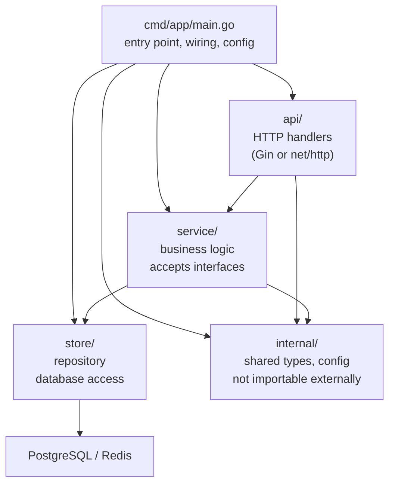

# Go Production Patterns

> [!abstract] TL;DR
> Production Go services need graceful shutdown, externalized configuration via environment variables, Docker multi-stage builds for minimal images, and structured dependency wiring. `signal.NotifyContext` simplifies shutdown signal handling. The 12-factor app principles map cleanly to Go conventions. Dependency injection via constructor functions (or `wire` for large codebases) keeps services testable.

---

## Graceful Shutdown

A production server must drain in-flight requests before stopping:

```go
import (
    "context"
    "net/http"
    "os/signal"
    "syscall"
    "time"
)

func main() {
    srv := &http.Server{Addr: ":8080", Handler: buildRouter()}

    // signal.NotifyContext (Go 1.16+) — context canceled on SIGINT/SIGTERM
    ctx, stop := signal.NotifyContext(context.Background(),
        syscall.SIGINT, syscall.SIGTERM)
    defer stop()

    // Start server in background goroutine
    serverErr := make(chan error, 1)
    go func() {
        slog.Info("server starting", "addr", srv.Addr)
        if err := srv.ListenAndServe(); err != http.ErrServerClosed {
            serverErr <- err
        }
    }()

    // Wait for signal or server error
    select {
    case err := <-serverErr:
        slog.Error("server failed", "err", err)
        os.Exit(1)
    case <-ctx.Done():
        stop()   // release signal.Notify resources
    }

    // Graceful shutdown — drain in-flight requests within 30 seconds
    shutdownCtx, cancel := context.WithTimeout(context.Background(), 30*time.Second)
    defer cancel()

    slog.Info("server shutting down")
    if err := srv.Shutdown(shutdownCtx); err != nil {
        slog.Error("shutdown error", "err", err)
        os.Exit(1)
    }
    slog.Info("server stopped")
}
```

---

## 12-Factor Config via Environment Variables

```go
import "os"

type Config struct {
    // Database
    DatabaseURL     string
    MaxDBConns      int
    DBConnLifetime  time.Duration

    // Server
    Port            int
    ReadTimeout     time.Duration
    WriteTimeout    time.Duration

    // Feature flags
    EnableMetrics   bool
    LogLevel        string
}

func configFromEnv() (Config, error) {
    port, err := strconv.Atoi(getEnvOr("PORT", "8080"))
    if err != nil {
        return Config{}, fmt.Errorf("PORT: %w", err)
    }
    return Config{
        DatabaseURL:    requireEnv("DATABASE_URL"),   // fail-fast on missing required vars
        MaxDBConns:     envInt("DB_MAX_CONNS", 25),
        Port:           port,
        ReadTimeout:    envDuration("READ_TIMEOUT", 10*time.Second),
        EnableMetrics:  os.Getenv("ENABLE_METRICS") == "true",
        LogLevel:       getEnvOr("LOG_LEVEL", "info"),
    }, nil
}

func requireEnv(key string) string {
    v := os.Getenv(key)
    if v == "" {
        panic(fmt.Sprintf("required environment variable %s is not set", key))
    }
    return v
}

func getEnvOr(key, def string) string {
    if v := os.Getenv(key); v != "" { return v }
    return def
}
```

---

## Multi-Stage Docker Build

```dockerfile
# syntax=docker/dockerfile:1

# Stage 1: Build
FROM golang:1.22-alpine AS builder
WORKDIR /src

# Download dependencies first — cached unless go.mod/go.sum changes
COPY go.mod go.sum ./
RUN go mod download

# Copy source and build
COPY . .
RUN CGO_ENABLED=0 GOOS=linux go build \
    -ldflags="-s -w -X main.Version=$(git describe --tags --always)" \
    -o /bin/app \
    ./cmd/app

# Stage 2: Minimal runtime image
FROM gcr.io/distroless/static-debian12:nonroot
# OR: FROM scratch (absolute minimal — no shell at all)
# OR: FROM alpine:3.19 (if you need a shell for debugging)

WORKDIR /app
COPY --from=builder /bin/app .
# Copy TLS certs if needed (distroless includes them; scratch does not)

EXPOSE 8080
USER nonroot
ENTRYPOINT ["/app/app"]
```

**Size comparison:**
- `golang:1.22` base image: ~900MB
- With `distroless/static`: ~15–30MB
- With `scratch`: ~10–20MB (Go binary only)

---

## Dependency Injection Patterns

**Constructor injection** — the simplest and most idiomatic Go DI:

```go
// Each layer accepts its dependencies as interfaces
type UserService struct {
    store  UserStore
    mailer Mailer
    logger *slog.Logger
}

func NewUserService(store UserStore, mailer Mailer, logger *slog.Logger) *UserService {
    return &UserService{store: store, mailer: mailer, logger: logger}
}

// Wire everything in main()
func main() {
    cfg, _ := configFromEnv()
    logger := buildLogger(cfg.LogLevel)

    db := connectDB(cfg.DatabaseURL)
    userStore := store.NewUserStore(db)
    mailer := email.NewSMTPMailer(cfg.SMTPHost)
    userSvc := service.NewUserService(userStore, mailer, logger)
    handler := api.NewUserHandler(userSvc, logger)

    // ... build router, start server
}
```

**google/wire** — compile-time DI code generator for large codebases:

```go
// wire.go
//go:build wireinject
package main

import "github.com/google/wire"

func initApp(cfg Config) (*App, error) {
    wire.Build(
        store.NewUserStore,
        service.NewUserService,
        api.NewUserHandler,
        NewApp,
    )
    return nil, nil
}
```

```bash
wire ./...   # generates wire_gen.go with the wiring code
```

---

## Application Structure (Layered Architecture)



---

## Implementation Example

```go
// cmd/app/main.go
package main

import (
    "context"
    "log/slog"
    "net/http"
    "os"
    "os/signal"
    "syscall"
    "time"
)

var Version = "dev"

func main() {
    logger := slog.New(slog.NewJSONHandler(os.Stdout, &slog.HandlerOptions{
        Level: slog.LevelInfo,
    }))
    slog.SetDefault(logger)

    cfg, err := configFromEnv()
    if err != nil {
        logger.Error("config error", "err", err)
        os.Exit(1)
    }

    app, err := initApp(cfg, logger)
    if err != nil {
        logger.Error("init error", "err", err)
        os.Exit(1)
    }

    ctx, stop := signal.NotifyContext(context.Background(), syscall.SIGINT, syscall.SIGTERM)
    defer stop()

    if err := app.Run(ctx); err != nil {
        logger.Error("runtime error", "err", err)
        os.Exit(1)
    }
    logger.Info("shutdown complete", "version", Version)
}
```

---

## Common Pitfalls

- **Not flushing logs on exit**: If using a buffered log writer, `defer logger.Sync()` (zap) or ensure the HTTP response is flushed before shutdown.
- **Hard-coded config**: Config values in source code can't be changed without redeploying. Use environment variables or a config file mounted at runtime.
- **`COPY . .` before dependency download in Dockerfile**: If source code changes invalidate the module download layer, every rebuild downloads all dependencies. Always `COPY go.mod go.sum ./; RUN go mod download` first.
- **Not handling `http.ErrServerClosed`**: `srv.ListenAndServe()` returns `http.ErrServerClosed` when `Shutdown` is called — this is normal, not an error. Check explicitly.

---

## Review Questions

1. What is the difference between `srv.Shutdown(ctx)` and `srv.Close()`?
2. Explain why `CGO_ENABLED=0` is important in a Dockerfile multi-stage build.
3. Why does constructor injection (passing interfaces to `New...` functions) make Go code more testable than using global singletons?
4. Explain the two-stage Docker build and why the runtime image is much smaller than the builder image.

---

#Go #Golang #Production #Docker #GracefulShutdown #DependencyInjection #12Factor
