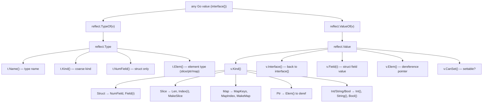

# Go Reflection

> [!abstract] TL;DR
> The `reflect` package lets you inspect and manipulate Go values at runtime — reading struct field names, types, and tags; calling methods dynamically; and building values of unknown type. Reflection is powerful but slow (~10-100x slower than direct access) and bypasses compile-time type safety. Prefer generics or code generation for performance-critical paths; use reflection for framework-level code (JSON encoders, ORMs, test helpers) where flexibility outweighs cost.

---

## Analogy: X-Ray Machine

Reflection is like an X-ray machine for your data — it lets you look inside a struct at runtime without knowing its type at compile time, revealing the internal structure of any value passed to you. But just as you would not use an X-ray machine to count your fingers every morning, you would not reach for reflection in hot paths: the machine is slow, expensive, and exposes you to radiation (runtime panics) if used carelessly. Use it for diagnostics and framework code, not everyday logic.

---

## `reflect.TypeOf` vs `reflect.ValueOf`

These are the two entry points into the reflection system:

```go
package main

import (
    "fmt"
    "reflect"
)

type User struct {
    Name  string `json:"name"`
    Age   int    `json:"age"`
    Email string `json:"email,omitempty"`
}

func main() {
    u := User{Name: "Alice", Age: 30, Email: "alice@example.com"}

    // reflect.TypeOf returns a reflect.Type — describes the type itself
    t := reflect.TypeOf(u)
    fmt.Println(t)           // main.User
    fmt.Println(t.Name())    // User
    fmt.Println(t.PkgPath()) // main
    fmt.Println(t.Kind())    // struct

    // reflect.ValueOf returns a reflect.Value — wraps the actual value
    v := reflect.ValueOf(u)
    fmt.Println(v)           // {Alice 30 alice@example.com}
    fmt.Println(v.Type())    // main.User (Type() on a Value gives the same as TypeOf)
    fmt.Println(v.Kind())    // struct
    fmt.Println(v.Field(0))  // Alice  (first field value)

    // Extracting the underlying value back to a Go type
    name := v.Field(0).String()  // "Alice"
    age  := v.Field(1).Int()     // 30 (always int64)
    _ = name
    _ = age
}
```

**Key distinction:**
- `reflect.Type` answers "what kind of thing is this?" — name, fields, methods, element types.
- `reflect.Value` answers "what is the actual value?" — and lets you read or write it.

---

## reflect.Kind

`Kind` is a coarse-grained category of the type. Unlike `Type` (which distinguishes `int` from `MyInt`), `Kind` is a fixed enumeration:

```go
import "reflect"

// All Kind constants:
// Invalid, Bool, Int, Int8, Int16, Int32, Int64,
// Uint, Uint8, Uint16, Uint32, Uint64, Uintptr,
// Float32, Float64, Complex64, Complex128,
// Array, Chan, Func, Interface, Map, Pointer, Slice, String, Struct, UnsafePointer

func describe(i interface{}) {
    v := reflect.ValueOf(i)
    switch v.Kind() {
    case reflect.Struct:
        fmt.Printf("struct with %d fields\n", v.NumField())
    case reflect.Slice:
        fmt.Printf("slice of %s, len=%d cap=%d\n", v.Type().Elem(), v.Len(), v.Cap())
    case reflect.Map:
        fmt.Printf("map with %d keys\n", v.Len())
    case reflect.Ptr:
        fmt.Printf("pointer to %s\n", v.Type().Elem())
    case reflect.Int, reflect.Int8, reflect.Int16, reflect.Int32, reflect.Int64:
        fmt.Printf("integer: %d\n", v.Int())
    case reflect.String:
        fmt.Printf("string: %q\n", v.String())
    default:
        fmt.Printf("kind: %s\n", v.Kind())
    }
}
```

`Type` vs `Kind` in practice:

```go
type MyInt int
var x MyInt = 42

t := reflect.TypeOf(x)
fmt.Println(t)        // main.MyInt  (the named type)
fmt.Println(t.Kind()) // int         (the underlying kind)
```

---

## Navigating Struct Fields

```go
func inspectStruct(s interface{}) {
    v := reflect.ValueOf(s)
    t := reflect.TypeOf(s)

    // Dereference pointer if needed
    if v.Kind() == reflect.Ptr {
        v = v.Elem()
        t = t.Elem()
    }

    if v.Kind() != reflect.Struct {
        fmt.Println("not a struct")
        return
    }

    fmt.Printf("Type: %s (%d fields)\n", t.Name(), t.NumField())

    for i := 0; i < t.NumField(); i++ {
        field := t.Field(i)      // reflect.StructField — describes the field
        value := v.Field(i)      // reflect.Value — the field's value

        jsonTag := field.Tag.Get("json")    // read struct tag
        dbTag   := field.Tag.Get("db")

        fmt.Printf(
            "  [%d] %s (%s) json=%q db=%q value=%v exported=%v\n",
            i,
            field.Name,
            field.Type,
            jsonTag,
            dbTag,
            value.Interface(),  // panics on unexported fields
            field.IsExported(),
        )
    }
}

type Product struct {
    ID    int    `json:"id" db:"product_id"`
    Name  string `json:"name" db:"product_name"`
    price float64 // unexported — field.IsExported() == false
}

func main() {
    p := Product{ID: 1, Name: "Widget"}
    inspectStruct(p)
}
```

**Parsing struct tags manually:**

```go
// reflect.StructTag is just a string with helper methods
tag := reflect.TypeOf(User{}).Field(0).Tag
jsonKey, opts := parseTag(tag.Get("json"))

func parseTag(s string) (name string, opts string) {
    parts := strings.SplitN(s, ",", 2)
    if len(parts) == 1 {
        return parts[0], ""
    }
    return parts[0], parts[1] // e.g. "omitempty"
}
```

---

## Setting Values via Reflection

To modify a value through reflection, you need an **addressable** value (a pointer), and the field must be **exported**:

```go
func setField(obj interface{}, fieldName string, value interface{}) error {
    // Must pass a pointer: &myStruct
    v := reflect.ValueOf(obj)
    if v.Kind() != reflect.Ptr || v.IsNil() {
        return fmt.Errorf("obj must be a non-nil pointer")
    }

    // Elem() dereferences the pointer to get the struct value
    v = v.Elem()
    if v.Kind() != reflect.Struct {
        return fmt.Errorf("obj must point to a struct")
    }

    field := v.FieldByName(fieldName)
    if !field.IsValid() {
        return fmt.Errorf("no field %q", fieldName)
    }
    if !field.CanSet() {
        return fmt.Errorf("field %q cannot be set (unexported?)", fieldName)
    }

    // The value being set must be assignable to the field's type
    newVal := reflect.ValueOf(value)
    if !newVal.Type().AssignableTo(field.Type()) {
        return fmt.Errorf("type mismatch: cannot assign %s to %s", newVal.Type(), field.Type())
    }

    field.Set(newVal)
    return nil
}

func main() {
    u := User{Name: "Alice", Age: 30}
    setField(&u, "Name", "Bob")  // u.Name is now "Bob"
    setField(&u, "Age", 25)      // u.Age is now 25
    fmt.Println(u)               // {Bob 25 }
}
```

**`CanSet()` rules:**
- Must be addressed via a pointer (`reflect.ValueOf(&x).Elem()`)
- Field must be exported (uppercase first letter)
- Slices/maps can be set at the slice level but not the array level for unexported types

---

## Practical Example: Mini JSON-like Serializer

A stripped-down struct-to-map serializer using reflection — illustrates how encoding/json works internally:

```go
package main

import (
    "fmt"
    "reflect"
    "strings"
)

// ToMap converts a struct to map[string]interface{} using json tags
func ToMap(s interface{}) (map[string]interface{}, error) {
    v := reflect.ValueOf(s)
    t := reflect.TypeOf(s)

    if v.Kind() == reflect.Ptr {
        v = v.Elem()
        t = t.Elem()
    }
    if v.Kind() != reflect.Struct {
        return nil, fmt.Errorf("ToMap: expected struct, got %s", v.Kind())
    }

    result := make(map[string]interface{}, t.NumField())

    for i := 0; i < t.NumField(); i++ {
        field := t.Field(i)
        value := v.Field(i)

        if !field.IsExported() {
            continue // skip unexported fields
        }

        key := field.Name
        tag := field.Tag.Get("json")
        if tag != "" {
            parts := strings.SplitN(tag, ",", 2)
            if parts[0] == "-" {
                continue // json:"-" means skip
            }
            if parts[0] != "" {
                key = parts[0]
            }
            // Handle omitempty
            if len(parts) > 1 && parts[1] == "omitempty" {
                if value.IsZero() {
                    continue
                }
            }
        }

        result[key] = value.Interface()
    }
    return result, nil
}

type Article struct {
    ID      int    `json:"id"`
    Title   string `json:"title"`
    Draft   bool   `json:"draft,omitempty"`
    secret  string // unexported — skipped
}

func main() {
    a := Article{ID: 42, Title: "Reflection in Go", Draft: false}
    m, _ := ToMap(a)
    fmt.Println(m) // map[id:42 title:Reflection in Go]  (draft omitted, secret skipped)
}
```

---

## Practical Example: Deep Copy via Reflection

```go
// DeepCopy creates a deep copy of any value using reflection.
// For production use, prefer github.com/mohae/deepcopy or encoding/gob.
func DeepCopy(src interface{}) interface{} {
    srcVal := reflect.ValueOf(src)
    return deepCopyValue(srcVal).Interface()
}

func deepCopyValue(src reflect.Value) reflect.Value {
    switch src.Kind() {
    case reflect.Ptr:
        if src.IsNil() {
            return reflect.Zero(src.Type())
        }
        dst := reflect.New(src.Type().Elem())
        dst.Elem().Set(deepCopyValue(src.Elem()))
        return dst

    case reflect.Struct:
        dst := reflect.New(src.Type()).Elem()
        for i := 0; i < src.NumField(); i++ {
            if src.Type().Field(i).IsExported() {
                dst.Field(i).Set(deepCopyValue(src.Field(i)))
            }
        }
        return dst

    case reflect.Slice:
        if src.IsNil() {
            return reflect.Zero(src.Type())
        }
        dst := reflect.MakeSlice(src.Type(), src.Len(), src.Cap())
        for i := 0; i < src.Len(); i++ {
            dst.Index(i).Set(deepCopyValue(src.Index(i)))
        }
        return dst

    case reflect.Map:
        if src.IsNil() {
            return reflect.Zero(src.Type())
        }
        dst := reflect.MakeMap(src.Type())
        for _, key := range src.MapKeys() {
            dst.SetMapIndex(deepCopyValue(key), deepCopyValue(src.MapIndex(key)))
        }
        return dst

    default:
        // Primitive types (int, string, bool, float, etc.) are value types
        dst := reflect.New(src.Type()).Elem()
        dst.Set(src)
        return dst
    }
}
```

---

## `reflect.New`, `reflect.MakeSlice`, `reflect.MakeMap`

These create new values of a given type without a compile-time concrete type:

```go
// reflect.New — equivalent to new(T) for a dynamically determined T
func createInstance(t reflect.Type) interface{} {
    // t must be a struct type; New returns *T
    ptr := reflect.New(t)   // *T, zero-initialized
    return ptr.Interface()
}

// Typical use: creating a target for JSON unmarshalling
func unmarshalInto(t reflect.Type, data []byte) (interface{}, error) {
    ptr := reflect.New(t)
    err := json.Unmarshal(data, ptr.Interface())
    return ptr.Elem().Interface(), err
}

// reflect.MakeSlice — equivalent to make([]T, len, cap)
sliceType := reflect.TypeOf([]int{})
s := reflect.MakeSlice(sliceType, 0, 10) // []int with len=0, cap=10
s = reflect.Append(s, reflect.ValueOf(1), reflect.ValueOf(2))

// reflect.MakeMap — equivalent to make(map[K]V)
mapType := reflect.TypeOf(map[string]int{})
m := reflect.MakeMap(mapType)
m.SetMapIndex(reflect.ValueOf("answer"), reflect.ValueOf(42))
```

---

## TypeOf / ValueOf Flow Diagram



---

## Trade-offs: Reflection vs Alternatives

| Approach | Performance | Type Safety | Flexibility | Best For |
|---|---|---|---|---|
| Direct access | Fastest (inlined) | Compile-time | Low (types known) | Normal application code |
| Generics (`[T any]`) | Near-direct (monomorphized) | Compile-time | Medium (constrained) | Type-parameterized algorithms |
| Reflection | ~10-100x slower | Runtime panics | High (any type) | Frameworks, ORMs, codec libraries |
| Code generation (`stringer`, `protoc`, `go generate`) | Same as direct | Compile-time | Medium (templates) | Enum strings, proto, mocks |
| Interface methods | Slight vtable overhead | Compile-time | Medium (interface contract) | Polymorphism without reflection |

**Benchmark context:** On a modern x86-64 machine:
- Direct struct field read: ~1 ns
- reflect.Value.Field(i).Interface(): ~15-50 ns
- Iterating all fields of a 10-field struct via reflection: ~200-500 ns

---

## Common Pitfalls

- **Panicking on unexported fields**: `v.Field(i).Interface()` panics if field `i` is unexported. Always check `t.Field(i).IsExported()` before calling `.Interface()`. To access unexported fields (for debugging only), use `unsafe.Pointer` — but this is not recommended in production code.

- **Forgetting `Elem()` on pointers**: If you pass `&myStruct` to a function accepting `interface{}`, `reflect.ValueOf(v).Kind()` is `reflect.Ptr`, not `reflect.Struct`. Always call `v.Elem()` to dereference before operating on the struct. Forgetting this is the single most common reflection bug.

- **`CanSet()` = false on value copies**: `reflect.ValueOf(x)` where `x` is not a pointer gives you a copy. Copies are not addressable, so `CanSet()` returns false. Always pass a pointer when you intend to modify: `reflect.ValueOf(&x).Elem()`.

- **Using reflection in hot paths**: Reflection bypasses all compiler optimizations. A JSON encoder using reflection for every field access will be dramatically slower than a code-generated encoder (which is why `encoding/json/v2` and `jsoniter` exist). Cache `reflect.Type` values and pre-compute field offsets when possible.

- **Type assertions vs reflect**: If you know you're dealing with a small set of types, a type switch is dramatically faster and safer than reflection. Use reflection only when the set of types is genuinely open-ended.

---

## Review Questions

1. What is the difference between `reflect.Kind` and `reflect.Type`? Give a concrete example where they differ (e.g., a named type like `type MyInt int`).
2. Why does `reflect.Value.CanSet()` return false when you pass a struct by value instead of by pointer? How do you fix this?
3. Walk through what happens step-by-step when you call `reflect.ValueOf(&user).Elem().FieldByName("Name").SetString("Bob")`.
4. When should you prefer code generation (via `go generate`) over runtime reflection, and what are the trade-offs of each?

---

#Go #Golang #Reflection #reflect #StructTags #Metaprogramming #TypeOf #ValueOf #Kind
