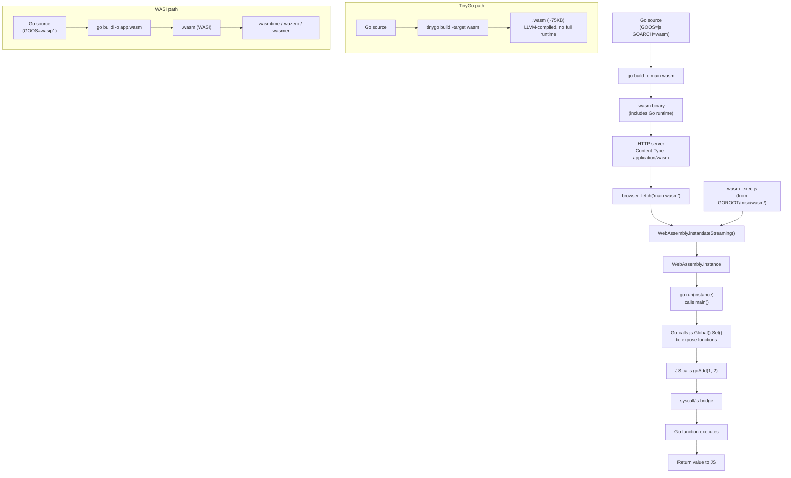

# Go WebAssembly

> [!abstract] TL;DR
> Go compiles to WebAssembly via `GOOS=js GOARCH=wasm` (for browser) or `GOOS=wasip1 GOARCH=wasm` (for WASI runtimes outside the browser). The `syscall/js` package provides a bridge between Go and JavaScript, letting Go functions be called from JS and vice versa. Standard Go WASM binaries are large (2-10 MB, runtime included); TinyGo produces kilobyte-sized binaries with a reduced standard library. WASM is ideal for CPU-intensive logic in the browser, portable plugins, and edge computing.

---

## Analogy: Packing Your Workshop

Compiling Go to WASM is like packing your whole workshop into a shipping container — everything you need goes with you (the Go runtime, GC, goroutines), but the container is big (standard Go: 2-10 MB). TinyGo is like a smaller toolbox: it only packs what you will actually use, giving you a container measured in kilobytes, but it leaves behind some advanced tools (full `reflect`, certain stdlib packages). Choose the full workshop when you need every tool; choose the toolbox when size and startup time are the priority.

---

## Compiling Go to WASM

### Browser Target: `GOOS=js GOARCH=wasm`

```bash
# Compile a Go program to WASM for browser use
GOOS=js GOARCH=wasm go build -o main.wasm ./cmd/wasm

# The wasm_exec.js support file ships with Go — copy it to your web root
cp "$(go env GOROOT)/misc/wasm/wasm_exec.js" ./web/

# Check the binary size
ls -lh main.wasm   # typically 2-10 MB for a real program
```

### WASI Target: `GOOS=wasip1 GOARCH=wasm` (Go 1.21+)

```bash
# Compile for WASI — runs outside the browser in wasmtime, wazero, etc.
GOOS=wasip1 GOARCH=wasm go build -o main.wasm ./cmd/wasi

# Run with wasmtime
wasmtime main.wasm

# Run with wazero CLI
wazero run main.wasm
```

WASI programs look like normal Go programs — no `syscall/js` or browser glue needed:

```go
//go:build wasip1

package main

import (
    "bufio"
    "fmt"
    "os"
)

func main() {
    fmt.Println("Hello from WASI!")
    scanner := bufio.NewScanner(os.Stdin)
    for scanner.Scan() {
        fmt.Println("Got:", scanner.Text())
    }
}
```

---

## Loading WASM in the Browser

### HTML + JavaScript Boilerplate

```html
<!DOCTYPE html>
<html>
<head><meta charset="utf-8"><title>Go WASM</title></head>
<body>
<script src="wasm_exec.js"></script>
<script>
    const go = new Go(); // from wasm_exec.js — sets up the Go runtime environment

    // Modern way: streaming instantiation (no need to buffer the whole file)
    WebAssembly.instantiateStreaming(fetch("main.wasm"), go.importObject)
        .then((result) => {
            go.run(result.instance); // starts the Go program (calls main())
        });
</script>

<button onclick="greet()">Greet</button>
<div id="output"></div>
</body>
</html>
```

**Why `wasm_exec.js` must match the Go compiler version:** The JS glue file implements the Go runtime's syscall interface (`go:linkname` syscalls for file I/O, time, etc.). A mismatch causes cryptic runtime errors on startup. Always copy `wasm_exec.js` fresh from `$GOROOT/misc/wasm/` when upgrading Go.

---

## The `syscall/js` Package

`syscall/js` is only available when `GOOS=js`. It exposes the browser's JavaScript environment to Go:

### Core Types and Functions

```go
import "syscall/js"

// js.Global() — the browser's `window` object
global := js.Global()

// js.ValueOf() — convert a Go value to a js.Value
n    := js.ValueOf(42)         // js number
s    := js.ValueOf("hello")    // js string
b    := js.ValueOf(true)       // js boolean
arr  := js.ValueOf([]interface{}{1, "two", 3.0}) // js Array

// Reading JS properties
console  := global.Get("console")
document := global.Get("document")
body     := document.Get("body")

// Setting JS properties
global.Get("document").Get("title").Set("", "My Go WASM App")

// Calling JS functions
console.Call("log", "Hello from Go!")
alert := global.Get("alert")
alert.Invoke("Alert from Go!")

// Reading values back to Go
title := document.Get("title").String()  // .String(), .Int(), .Float(), .Bool()
```

### Exposing Go Functions to JavaScript with `js.FuncOf`

```go
// js.FuncOf wraps a Go function as a JavaScript function value.
// The Go function runs on the Go WASM goroutine, not a JS callback thread.
func main() {
    // Create a JS-callable wrapper for our Go function
    addFunc := js.FuncOf(func(this js.Value, args []js.Value) interface{} {
        if len(args) != 2 {
            return js.ValueOf("error: expected 2 arguments")
        }
        a := args[0].Float()
        b := args[1].Float()
        return js.ValueOf(a + b)
    })
    defer addFunc.Release() // IMPORTANT: release when no longer needed

    // Expose the function on the global window object
    js.Global().Set("goAdd", addFunc)

    // Keep the Go program alive — main() returning exits the WASM module
    // Use a channel block to prevent main from returning
    select {} // block forever; JS calls will invoke addFunc via the event loop
}
```

Then in JavaScript:

```javascript
// After go.run() completes, goAdd is available globally
const result = goAdd(10, 32);
console.log(result); // 42
```

---

## Full Example: Go WASM Image Processing

A realistic example — Go processes an image array from JavaScript:

```go
//go:build js

package main

import (
    "math"
    "syscall/js"
)

// grayscale converts RGBA pixel data to grayscale in-place.
// imageData is a Uint8ClampedArray (from canvas.getImageData)
func grayscale(this js.Value, args []js.Value) interface{} {
    if len(args) == 0 {
        return nil
    }
    data   := args[0] // js Uint8ClampedArray
    length := data.Length()

    // Read all pixel data into a Go byte slice
    pixels := make([]byte, length)
    js.CopyBytesToGo(pixels, data)

    // Process in Go — CPU-bound work that benefits from WASM
    for i := 0; i < length; i += 4 {
        r    := float64(pixels[i])
        g    := float64(pixels[i+1])
        b    := float64(pixels[i+2])
        gray := byte(math.Round(0.299*r + 0.587*g + 0.114*b))
        pixels[i]   = gray
        pixels[i+1] = gray
        pixels[i+2] = gray
        // pixels[i+3] = alpha — unchanged
    }

    // Write back to the JS Uint8ClampedArray
    js.CopyBytesToJS(data, pixels)
    return nil
}

func main() {
    grayscaleFn := js.FuncOf(grayscale)
    defer grayscaleFn.Release()

    js.Global().Set("goGrayscale", grayscaleFn)
    select {} // keep alive
}
```

JavaScript side:

```javascript
const canvas    = document.getElementById("myCanvas");
const ctx       = canvas.getContext("2d");
const imageData = ctx.getImageData(0, 0, canvas.width, canvas.height);

goGrayscale(imageData.data); // mutates imageData.data in-place via CopyBytesToJS

ctx.putImageData(imageData, 0, 0);
```

### `js.CopyBytesToGo` and `js.CopyBytesToJS`

These are the efficient bulk-copy functions for typed arrays — far faster than reading/writing element by element with `.Index()`:

```go
// Go 1.13+
n := js.CopyBytesToGo(goSlice, jsUint8Array)   // returns bytes copied
n  = js.CopyBytesToJS(jsUint8Array, goSlice)
```

---

## TinyGo for WASM

TinyGo is a Go compiler for embedded systems and WASM that uses LLVM instead of the official Go compiler. It produces dramatically smaller binaries by:

- Not bundling the full Go runtime
- Using a simpler GC (conservative mark-sweep instead of tri-color)
- Only including stdlib packages actually used (tree-shaking)

### Size Comparison

```bash
# Standard Go WASM — hello world
GOOS=js GOARCH=wasm go build -o hello-std.wasm ./hello
ls -lh hello-std.wasm   # ~2.3 MB

# TinyGo WASM — same hello world
tinygo build -o hello-tiny.wasm -target wasm ./hello
ls -lh hello-tiny.wasm  # ~75 KB (~30x smaller)

# TinyGo WASI
tinygo build -o hello.wasm -target wasip1 ./hello
ls -lh hello.wasm       # ~12 KB
```

### TinyGo Limitations

TinyGo does not support the full Go standard library or all language features:

| Feature | Standard Go WASM | TinyGo WASM |
|---|---|---|
| `reflect` | Full | Partial (basic kinds only) |
| `encoding/json` | Full | Partial (some marshalling fails) |
| `net/http` | Full (via JS fetch bridge) | Limited |
| goroutines | Full with scheduler | Supported (coroutine-based) |
| CGO | No | No |
| `sync` | Full | Mostly supported |
| `math/big` | Full | Supported |

### When to Use TinyGo

- Cloudflare Workers / Fastly Compute (strict size limits, <1 MB)
- IoT / microcontroller targets (also supports ARM Cortex-M)
- Edge functions where cold-start latency matters
- WASM plugins where binary size is user-facing (NPM packages, browser extensions)

---

## Go 1.21+ WASI Target

WASI (WebAssembly System Interface) standardizes OS-level syscalls for WASM runtimes outside the browser. Go 1.21 added first-class support:

```bash
# Build for WASI
GOOS=wasip1 GOARCH=wasm go build -o app.wasm .

# Run in different runtimes
wasmtime app.wasm
wasmer   app.wasm
wazero run app.wasm
```

```go
// Server-side WASM plugin host using wazero
package main

import (
    "bytes"
    "context"
    "os"
    "github.com/tetratelabs/wazero"
    "github.com/tetratelabs/wazero/imports/wasi_snapshot_preview1"
)

func runWASIPlugin(wasmFile string, input []byte) ([]byte, error) {
    ctx := context.Background()

    r := wazero.NewRuntime(ctx)
    defer r.Close(ctx)

    // Instantiate the WASI environment
    wasi_snapshot_preview1.MustInstantiate(ctx, r)

    wasmBytes, err := os.ReadFile(wasmFile)
    if err != nil {
        return nil, err
    }

    var outputBuf bytes.Buffer
    config := wazero.NewModuleConfig().
        WithStdin(bytes.NewReader(input)).
        WithStdout(&outputBuf).
        WithStderr(os.Stderr)

    _, err = r.InstantiateWithConfig(ctx, wasmBytes, config)
    return outputBuf.Bytes(), err
}
```

**WASM use cases in production:**

- **Cloudflare Workers / Fastly Compute**: compile business logic to WASM, deploy at the edge; no cold-start overhead
- **Figma**: C++ rendering engine compiled to WASM, running in browser at near-native speed
- **Browser-side crypto**: run Go's `crypto/sha256` in WASM instead of a JS reimplementation
- **Plugin systems**: untrusted user code sandboxed in WASM (wazero, wasmtime enforce memory isolation)

---

## Build and Load Flow Diagram



---

## Trade-offs: Standard Go WASM vs TinyGo vs Rust/wasm-bindgen

| Dimension | Standard Go WASM | TinyGo WASM | Rust + wasm-bindgen |
|---|---|---|---|
| Binary size (hello world) | ~2.3 MB | ~75 KB | ~20 KB |
| Binary size (real app) | 3-10 MB | 200-800 KB | 50-500 KB |
| Full stdlib support | Yes | Partial (~70%) | N/A (Rust stdlib) |
| Goroutine support | Yes (full scheduler) | Yes (coroutines) | Async/await only |
| GC | Go GC (tri-color) | Conservative GC | None (ownership model) |
| JS interop ergonomics | `syscall/js` (verbose) | `syscall/js` (verbose) | `wasm-bindgen` (auto-generated) |
| Cold-start time | Slow (runtime init) | Fast | Very fast |
| Ecosystem maturity | Stable (Go 1.11+) | Stable (active) | Most mature for WASM |
| Best for | Porting Go libraries to web | Edge/IoT/size-constrained | New projects needing lean WASM |

---

## Common Pitfalls

- **Large binary size**: Standard Go WASM includes the entire Go runtime — even "hello world" is 2+ MB. Mitigations: use `wasm-opt` from Binaryen (`wasm-opt -Oz -o out.wasm in.wasm` can reduce size 10-20%); use TinyGo; or serve with Brotli/gzip compression (WASM compresses very well, roughly 5-10x ratio).

- **Goroutine model vs browser single-thread model**: The browser's JavaScript runtime is single-threaded. Go's goroutines in WASM are scheduled cooperatively on that one thread via the event loop — they do NOT run in parallel. A blocking goroutine (e.g., `time.Sleep`, channel receive with no sender) freezes the UI. Structure blocking operations with goroutines and JS callback patterns.

- **Blocking calls freeze the UI**: Calling `time.Sleep` or blocking on a channel in the main goroutine will hang the browser tab. Wrap blocking operations in goroutines and signal completion via a `js.FuncOf` callback or a Promise bridge.

- **`js.FuncOf` memory leak — must call `Release()`**: Every `js.FuncOf` call allocates a Go function wrapper that is kept alive by the JS garbage collector. Failing to call `fn.Release()` when the function is no longer needed leaks both Go and JS memory indefinitely. Pattern: `defer fn.Release()` for functions used only during `main()` setup; call `fn.Release()` explicitly for dynamically created callbacks.

- **`wasm_exec.js` version mismatch**: The `wasm_exec.js` bundled with Go 1.21 will NOT work with a binary compiled by Go 1.22 (or vice versa). This is a common source of cryptic `TypeError: go.importObject` errors. Always re-copy `wasm_exec.js` from `$(go env GOROOT)/misc/wasm/wasm_exec.js` after upgrading Go.

- **`-ldflags "-s -w"` does not help much**: The standard Go WASM binary size is dominated by the runtime, not debug symbols. Stripping (`-s -w`) saves only 10-15%. The real size lever is TinyGo or post-processing with `wasm-opt`.

---

## Review Questions

1. What are the two `GOOS`/`GOARCH` combinations for compiling Go to WebAssembly, and when would you use each one?
2. Explain the lifecycle of a `js.FuncOf` wrapper: when is it created, when must `Release()` be called, and what bug occurs if you forget?
3. Why can goroutines in a browser WASM binary not run in true parallel, and what is the consequence of a blocking channel receive in a goroutine if no other goroutine is runnable?
4. What are the main trade-offs between compiling your Go program with the standard Go compiler versus TinyGo for a WASM target?

---

#Go #Golang #WebAssembly #WASM #WASI #TinyGo #syscall_js #Browser #Edge #wasm_exec
