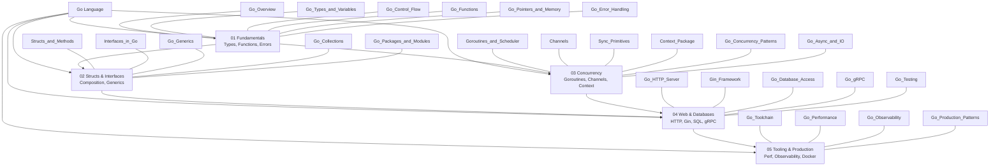

# Go (Golang) — Master Map of Content

> [!abstract] About This Vault
> 26 notes across 5 sections covering the complete Go ecosystem — from language fundamentals through concurrency, web APIs, databases, and production operations. Designed for backend engineers and systems programmers moving to Go or deepening their expertise.

---

## Concept Map

---

## Sections at a Glance

| Section | Notes | Key Topics |
|---|---|---|
| [[#01 Fundamentals]] | 6 | Types, control flow, functions, pointers, error handling |
| [[#02 Structs and Interfaces]] | 5 | Composition, interfaces, generics, collections, modules |
| [[#03 Concurrency]] | 6 | Goroutines, channels, sync, context, patterns, I/O |
| [[#04 Web and Databases]] | 5 | HTTP server, Gin, SQL, gRPC, testing |
| [[#05 Tooling and Production]] | 4 | Toolchain, profiling, observability, Docker |

---

## Learning Paths

### Path A — Backend Developer

> For engineers building REST APIs and microservices with Go

1. [[Go_Overview]] — understand Go's design philosophy
2. [[Go_Types_and_Variables]] — type system and zero values
3. [[Go_Control_Flow]] — if, for, switch, defer
4. [[Go_Functions]] — multiple returns, closures
5. [[Go_Error_Handling]] — errors.Is/As, wrapping
6. [[Go_Collections]] — slices and maps in depth
7. [[Go_HTTP_Server]] — net/http, middleware, graceful shutdown
8. [[Gin_Framework]] — routing, binding, validation
9. [[Go_Database_Access]] — database/sql and GORM
10. [[Go_Testing]] — table-driven tests, httptest, mocks

### Path B — Systems / Concurrency Engineer

> For engineers focused on high-throughput, concurrent systems

1. [[Go_Overview]] — compilation model, scheduler overview
2. [[Go_Types_and_Variables]] — value semantics
3. [[Go_Functions]] — closures, first-class functions
4. [[Go_Pointers_and_Memory]] — stack vs heap, escape analysis
5. [[Goroutines_and_Scheduler]] — GMP model, GOMAXPROCS, leaks
6. [[Channels]] — buffered/unbuffered, select, nil channel trick
7. [[Sync_Primitives]] — Mutex, WaitGroup, Pool, atomic
8. [[Context_Package]] — cancellation and deadlines
9. [[Go_Concurrency_Patterns]] — pipeline, fan-out, worker pool
10. [[Go_Performance]] — pprof, benchmarks, escape analysis

### Path C — Microservices / Cloud Engineer

> For engineers deploying Go services in Kubernetes/cloud environments

1. [[Go_HTTP_Server]] — production-grade HTTP server
2. [[Go_gRPC]] — Protocol Buffers, streaming, interceptors
3. [[Go_Database_Access]] — connection pooling, transactions, GORM
4. [[Context_Package]] — propagating cancellation across services
5. [[Go_Observability]] — slog, Prometheus, OpenTelemetry
6. [[Go_Toolchain]] — cross-compilation, build tags, golangci-lint
7. [[Go_Production_Patterns]] — graceful shutdown, Docker, DI
8. [[Go_Performance]] — profiling, sync.Pool, GC tuning
9. [[Go_Testing]] — integration tests, httptest, mocks
10. [[Go_Packages_and_Modules]] — module system, versioning

---

## Section MOC Index

### 01 Fundamentals

> The core language — master these before moving to any other section.

| Note | Difficulty | Summary |
|---|---|---|
| [[Go_Overview]] | Beginner | Go vs Python/Java/Rust, compilation model, GC, zero values, blank identifier |
| [[Go_Types_and_Variables]] | Beginner | var/:=/const, basic types, iota, type conversions, composite literals |
| [[Go_Control_Flow]] | Beginner | if with init, for (3 forms + range), switch, defer (LIFO), panic/recover |
| [[Go_Functions]] | Beginner | Multiple returns, named returns, variadic, first-class, closures |
| [[Go_Pointers_and_Memory]] | Intermediate | &/*,  new vs make, value vs pointer receivers, escape analysis |
| [[Go_Error_Handling]] | Intermediate | error interface, %w wrapping, errors.Is/As, sentinel errors, panic |

### 02 Structs and Interfaces

> Go's object system — composition over inheritance, implicit interfaces.

| Note | Difficulty | Summary |
|---|---|---|
| [[Structs_and_Methods]] | Beginner | Struct declaration, embedding, struct tags (json/db), method sets |
| [[Interfaces_in_Go]] | Intermediate | Implicit satisfaction, type assertion, type switch, stdlib interfaces |
| [[Go_Generics]] | Intermediate | Type parameters, constraints, ~tilde, generic types, slices/maps packages |
| [[Go_Collections]] | Beginner | Arrays vs slices (header/aliasing), maps, range, slice tricks |
| [[Go_Packages_and_Modules]] | Beginner | Package visibility, init(), go.mod, go get, internal, workspace |

### 03 Concurrency

> Go's killer feature — lightweight goroutines + channel-based communication.

| Note | Difficulty | Summary |
|---|---|---|
| [[Goroutines_and_Scheduler]] | Intermediate | GMP model, GOMAXPROCS, goroutine cost vs thread, leak detection |
| [[Channels]] | Intermediate | Buffered/unbuffered, channel direction, select, nil channel trick, close |
| [[Sync_Primitives]] | Intermediate | Mutex, RWMutex, WaitGroup, Once, Pool, atomic, race detector |
| [[Context_Package]] | Intermediate | WithCancel/Timeout/Deadline/Value, propagation, HTTP handlers, gRPC |
| [[Go_Concurrency_Patterns]] | Advanced | Pipeline, fan-out/in, semaphore, worker pool, done channel |
| [[Go_Async_and_IO]] | Intermediate | io.Reader/Writer, bufio, file ops, filepath, net/http server |

### 04 Web and Databases

> Building production APIs — HTTP, REST, gRPC, SQL, and testing.

| Note | Difficulty | Summary |
|---|---|---|
| [[Go_HTTP_Server]] | Intermediate | ServeMux (Go 1.22+), middleware chaining, request parsing, graceful shutdown |
| [[Gin_Framework]] | Intermediate | Router, route groups, JSON binding+validation, middleware, error handling |
| [[Go_Database_Access]] | Intermediate | database/sql pool, transactions, GORM CRUD, associations, N+1 |
| [[Go_gRPC]] | Advanced | Protobuf, unary/streaming RPC, interceptors, status codes |
| [[Go_Testing]] | Intermediate | Table-driven tests, t.Run subtests, httptest, mocks, benchmarks |

### 05 Tooling and Production

> Shipping Go to production — quality, performance, observability.

| Note | Difficulty | Summary |
|---|---|---|
| [[Go_Toolchain]] | Intermediate | go vet, golangci-lint, build tags, cross-compilation, go:generate |
| [[Go_Performance]] | Advanced | pprof (CPU/heap), escape analysis, sync.Pool, strings.Builder |
| [[Go_Observability]] | Advanced | slog structured logging, Prometheus metrics, OpenTelemetry tracing, healthchecks |
| [[Go_Production_Patterns]] | Advanced | Graceful shutdown, 12-factor config, multi-stage Docker, dependency injection |

---

## Key Go Concepts Quick Reference

| Concept | Where to find it |
|---|---|
| Goroutine leak detection | [[Goroutines_and_Scheduler]] |
| `errors.Is` vs `errors.As` | [[Go_Error_Handling]] |
| Slice aliasing and copying | [[Go_Collections]] |
| Interface nil bug | [[Interfaces_in_Go]] |
| `sync.Pool` for GC pressure | [[Sync_Primitives]] and [[Go_Performance]] |
| context.WithTimeout pattern | [[Context_Package]] |
| Middleware chaining | [[Go_HTTP_Server]] and [[Gin_Framework]] |
| Prometheus high-cardinality pitfall | [[Go_Observability]] |
| Escape analysis flags | [[Go_Performance]] |
| Multi-stage Docker for Go | [[Go_Production_Patterns]] |

---

#Go #Golang #MOC #MasterMOC
