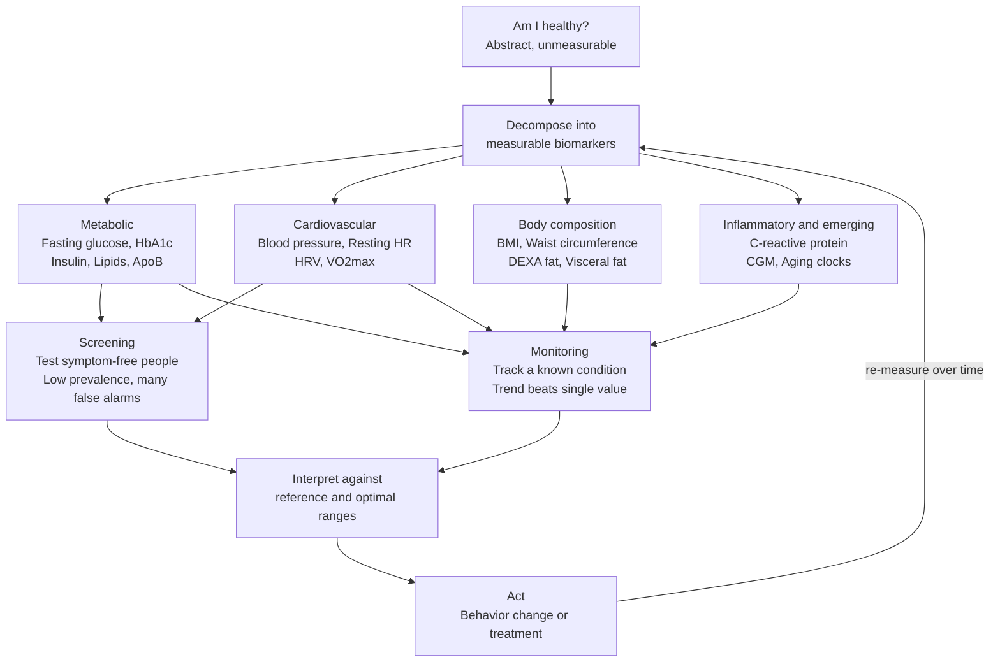

# 🩺 Biomarkers and Measuring Health

> [!abstract] TL;DR
> A **biomarker** is any measurable signal from the body — a blood value, a blood pressure, a body-fat percentage, a heart-rate trace — that stands in for something you cannot see directly: "how healthy am I, and where am I heading?" Biomarkers turn the abstract question of health into numbers you can track, but the numbers are only useful once you understand what they indicate, that "normal" is a distribution rather than a line, and — most importantly — that the same test behaves completely differently when used to **screen** a healthy population versus **monitor** a sick one. The statistics of testing (sensitivity, specificity, and how disease **prevalence** drives false positives) are as important as the biology, because a very accurate test can still be mostly wrong when the thing it looks for is rare.

---

## Intuition

**Analogy:** Biomarkers are the **dashboard warning lights and gauges of the body**. Your car does not wait for the engine to seize before telling you something is wrong: a temperature gauge creeps up, an oil-pressure light flickers, the fuel gauge drops. Each is a cheap, measurable proxy for an expensive, hidden internal state. A good driver reads *trends* on the gauges (is the temperature climbing on every long drive?) rather than panicking at a single flicker, and knows that a warning light is a *prompt to investigate*, not a diagnosis by itself.

The body works the same way. Fasting glucose, blood pressure, resting heart rate, and inflammatory markers are gauges that move *before* you feel symptoms — a rising HbA1c warns of diabetes years before thirst and fatigue arrive. But like a faulty dashboard, a health test can flash a warning when nothing is wrong (a **false positive**), and the rarer the real problem, the more of those false alarms you get. Learning to measure health is learning both to read the gauges and to distrust them intelligently.

---

## How It Works

### Core Mechanics

1. **From question to signal.** "Am I healthy?" is not measurable. So we decompose health into physiological systems and pick a cheap, reliable proxy for each: metabolic function, cardiovascular fitness, body composition, and inflammation. Each biomarker is a *bet* that this number correlates with an outcome we actually care about (heart attack, diabetes, early death).

2. **Metabolic markers** report how the body handles fuel. **Fasting glucose** is a snapshot; **HbA1c** is glycated hemoglobin, a three-month running average of blood sugar; **fasting insulin** exposes insulin resistance years before glucose rises. The **lipid panel** reports LDL, HDL, and triglycerides — but the modern debate is that LDL *cholesterol mass* is a weaker signal than **ApoB**, the count of atherogenic particles, because one ApoB particle carries variable cholesterol, so particle *number* predicts cardiovascular risk better than cholesterol *amount*.

3. **Cardiovascular markers** report the state of the pump and pipes. **Blood pressure** is the pressure against arterial walls; **resting heart rate** and **heart-rate variability (HRV)** — the beat-to-beat variation reflecting autonomic balance — track recovery and stress. **VO2max**, the maximum rate of oxygen use during exercise, is one of the single strongest predictors of all-cause mortality, often outperforming smoking status or blood pressure.

4. **Body-composition markers** ask *what* you are made of, not just what you weigh. **BMI** is cheap but blind — it cannot tell muscle from fat and mislabels athletes as "obese." **Waist circumference** and **DEXA body-fat scans** localize fat, and **visceral fat** (the metabolically active fat wrapped around organs) is far more dangerous than the same mass under the skin.

5. **Inflammatory markers** like **C-reactive protein (CRP / hs-CRP)** flag chronic low-grade inflammation that underlies heart disease and many chronic conditions.

6. **Screening vs monitoring — the single most important distinction.** The *same* biomarker means different things depending on who is measured. **Screening** applies a test to symptom-free people to catch hidden disease early; because disease is rare in that group, most positive results are false alarms. **Monitoring** tracks a *known* condition over time, where the trend matters more than any single value and false positives are far less likely. Confusing the two — treating a screening result as a diagnosis — is where most measurement harm originates.

7. **Reference range vs optimal range.** A "normal" lab range is usually the middle 95% of a *reference population* — which in wealthy nations is not a healthy population. Being "in range" can mean "average for a sick society," not "optimal." And normal is *individual*: one person's healthy resting heart rate is another's tachycardia.

### Flow / Architecture



---

## Key Concepts

### Secondary

- **Biomarker** — an objectively measurable characteristic used as an indicator of a biological state, risk, or process. It substitutes a hidden variable (arterial plaque, insulin resistance) with an observable one (ApoB, HbA1c).
- **Screening vs diagnosis vs monitoring** — screening looks for hidden disease in the well; diagnosis confirms disease in the symptomatic; monitoring tracks a known condition. The same test performs very differently in each role.
- **Reference range vs optimal range** — "in range" means typical for the reference population, not necessarily healthy. Optimal ranges are tighter and outcome-based (e.g., an HbA1c "in range" but near the diabetic threshold is not optimal).
- **The metabolic panel** — fasting glucose (a snapshot), HbA1c (a three-month sugar average), and the lipid panel (LDL, HDL, triglycerides). First-line, cheap, and widely available.
- **Blood pressure and resting heart rate** — the two cheapest, highest-value cardiovascular gauges; both are strong, well-validated predictors of long-term risk.
- **BMI and its limitations** — weight over height squared. Population-useful, individually crude: it ignores muscle-versus-fat and fat *location*, misclassifying muscular people and missing "skinny-fat" visceral adiposity.

### Undergraduate

- **ApoB and the cholesterol debate** — LDL cholesterol measures *mass* of cholesterol; ApoB counts *particles*, each of which can lodge in an artery wall. Since particles vary in cholesterol content, particle number (ApoB) is the more mechanistically faithful risk marker, which is why it is increasingly preferred over LDL-C alone.
- **Heart-rate variability (HRV)** — the variation in time between heartbeats, a window onto autonomic (sympathetic vs parasympathetic) balance. Higher HRV generally signals better recovery and cardiovascular fitness; it is noisy day-to-day and best read as a personal trend.
- **VO2max as a mortality predictor** — maximal oxygen uptake during exercise. Large cohort studies rank it among the strongest modifiable predictors of longevity; moving from the bottom to a higher fitness quartile is associated with dramatic mortality reduction — the clearest bridge from *exercise* to measurable health.
- **Visceral fat and DEXA** — DEXA and imaging separate fat from lean mass and, crucially, visceral fat (around organs, metabolically active, pro-inflammatory) from subcutaneous fat. Waist circumference is a cheap proxy for visceral fat.
- **hs-CRP and chronic inflammation** — high-sensitivity C-reactive protein detects the low-grade inflammation implicated in atherosclerosis; it adds predictive value on top of lipids but is non-specific (rises with any infection or injury).
- **Sensitivity, specificity, PPV, NPV** — sensitivity is the fraction of truly sick people who test positive; specificity is the fraction of truly well people who test negative. But the number a patient actually cares about is the **positive predictive value (PPV)**: given a positive result, what is the probability of actually being sick? PPV depends on **prevalence**, not just on the test.
- **Continuous glucose monitors (CGMs)** — wearable sensors that stream interstitial glucose, turning a single fasting snapshot into a continuous curve and revealing individual responses to food, sleep, and stress.

### Graduate

- **The base-rate problem** — this is Bayes' theorem applied to medicine. When disease prevalence is low, even a highly specific test yields more false positives than true positives, because false positives are drawn from the vast healthy majority while true positives come from the tiny sick minority. PPV can be shockingly low despite excellent sensitivity and specificity — the mathematical core of over-screening harm. See [[Bayesian_Reasoning]] and the identical structure of forensic-evidence errors in [[Evidence_and_Proof]].
- **Lead-time and length-time bias** — screening can *appear* to extend survival without changing when anyone dies. **Lead-time bias**: detecting a disease earlier moves the diagnosis date backward, inflating measured "survival time" even if death occurs on the same day. **Length-time bias**: screening preferentially catches slow-growing, indolent disease (which spends longer in a detectable-but-asymptomatic window), making screened cohorts look healthier for reasons that have nothing to do with treatment.
- **Overdiagnosis and overtreatment** — the detection of "disease" that would never have caused symptoms in the person's lifetime (e.g., some indolent thyroid and prostate cancers). Overdiagnosis is invisible to the individual — you cannot know your tumor was harmless — yet it drives biopsies, surgeries, and anxiety with no benefit. This is the central ethical hazard of screening the healthy.
- **Biological aging clocks** — emerging composite biomarkers that estimate *biological* rather than chronological age. Epigenetic clocks (Horvath, GrimAge, PhenoAge) read DNA-methylation patterns; others combine standard labs. They promise a single summary of aging trajectory but face validation and causality questions — do they *measure* aging or merely correlate with it? Links to [[Aging_and_Longevity]].
- **Signal versus noise in self-tracking** — measurement error, biological day-to-day variation, and **regression to the mean** conspire to make single readings unreliable. Wearables measure some things well (step count, sleep duration, resting HR trends) and others poorly (sleep *stages*, absolute HRV, calorie burn). Personalized N-of-1 baselines and trend analysis beat comparison to population norms.
- **Correlation versus causation in personal data** — self-tracking generates dense observational data riddled with confounders (you sleep worse *and* drink more on stressful weeks — stress is the common cause). Without controlled manipulation, "my HRV drops when I eat late" may be confounding, reverse causation, or coincidence. This is why personal experiments need pre-registration and, ideally, randomized self-trials.

---

## Python Demo

```python
# The base-rate problem in health screening.
# A "good" test applied to a healthy (low-prevalence) population still yields
# mostly FALSE positives. PPV is just Bayes' posterior: P(disease | positive).
import numpy as np
import matplotlib.pyplot as plt

SENSITIVITY = 0.90   # P(test positive | disease)     -> true-positive rate
SPECIFICITY = 0.95   # P(test negative | no disease)   -> true-negative rate


def positive_predictive_value(prevalence, sens, spec):
    """P(disease | positive test) via Bayes' theorem."""
    true_pos = sens * prevalence
    false_pos = (1.0 - spec) * (1.0 - prevalence)
    return true_pos / (true_pos + false_pos)


# --- Concrete scenario: mass-screen 100,000 symptom-free people at 1% prevalence
N = 100_000
prev = 0.01
sick = N * prev
well = N - sick
tp = SENSITIVITY * sick                 # true positives (real cases caught)
fn = sick - tp                          # false negatives (missed cases)
fp = (1.0 - SPECIFICITY) * well         # false positives (false alarms)
tn = well - fp                          # true negatives
ppv = tp / (tp + fp)

print(f"Screening {N:,} people at {prev:.1%} prevalence")
print(f"  True positives : {tp:8.0f}")
print(f"  False positives: {fp:8.0f}")
print(f"  PPV = P(sick | positive) = {ppv:.1%}")
print(f"  => {fp / tp:.1f} false alarms for every real case found")

# --- PPV as a function of prevalence -----------------------------------------
prev_grid = np.logspace(-4, -0.3, 400)   # ~0.01% up to ~50%
ppv_grid = positive_predictive_value(prev_grid, SENSITIVITY, SPECIFICITY)

fig, (ax1, ax2) = plt.subplots(1, 2, figsize=(13, 5))

ax1.semilogx(prev_grid, ppv_grid, color="steelblue", linewidth=2.5)
ax1.axhline(0.5, color="crimson", linestyle="--", linewidth=1.4,
            label="coin-flip PPV = 0.5")
ax1.scatter([prev], [ppv], color="darkorange", s=90, zorder=5,
            label=f"screen at 1% prevalence -> PPV {ppv:.0%}")
ax1.set_xlabel("Disease prevalence (log scale)")
ax1.set_ylabel("Positive predictive value")
ax1.set_title("Why screening healthy people misleads\nSensitivity 0.90, Specificity 0.95")
ax1.set_ylim(0, 1)
ax1.legend()
ax1.grid(alpha=0.3, which="both")

# --- Outcome breakdown of the 100,000-person screen --------------------------
labels = ["True\npositive", "False\npositive", "True\nnegative", "False\nnegative"]
counts = [tp, fp, tn, fn]
colors = ["seagreen", "crimson", "lightsteelblue", "goldenrod"]
bars = ax2.bar(labels, counts, color=colors)
ax2.set_ylabel("People (log scale)")
ax2.set_title(f"Outcomes of screening {N:,} at 1% prevalence")
ax2.set_yscale("log")
for b, c in zip(bars, counts):
    ax2.text(b.get_x() + b.get_width() / 2, b.get_height() * 1.05,
             f"{c:,.0f}", ha="center", va="bottom", fontsize=9)
ax2.grid(alpha=0.3, axis="y")

plt.tight_layout()
plt.savefig("screening_base_rate.png", dpi=110, bbox_inches="tight")
plt.show()
```

**What it shows:** With a genuinely good test (90% sensitivity, 95% specificity), screening a population where only 1% are sick yields a PPV of about **15%** — meaning roughly **five false alarms for every real case caught**. The PPV curve reveals the mechanism directly: the metric that patients care about depends on **prevalence**, not just on the test. This is Bayesian reasoning in clinical form — the positive predictive value *is* the posterior P(disease | positive), and the prevalence *is* the prior. The same base-rate trap that makes over-screening ethically fraught also produces the prosecutor's fallacy in courtrooms (see [[Bayesian_Reasoning]] and [[Evidence_and_Proof]]).

---

## Real-World Applications

1. **Cardiovascular risk calculators** — tools like the Framingham and pooled-cohort risk scores combine blood pressure, lipids, age, and smoking into a single 10-year event probability, guiding whether to start statins. Modern practice increasingly adds ApoB and coronary artery calcium scoring to refine borderline cases.
2. **Diabetes screening and prevention** — HbA1c thresholds define prediabetes and diabetes, and CGMs now let individuals see how specific meals spike their glucose, converting an annual lab value into daily, actionable feedback that can drive behavior change.
3. **National screening programs** — mammography, colonoscopy, and prostate PSA testing are all governed by the base-rate math above. Guideline bodies raise the starting age (raising prevalence, and thus PPV) precisely to avoid drowning younger, lower-prevalence groups in false positives and overdiagnosis.
4. **Wearables and the quantified-self movement** — Apple Watch, Oura, Whoop, and Fitbit stream resting heart rate, HRV, sleep, and activity. They excel at trends (a rising resting HR often precedes illness) and mislead on absolutes (calorie and sleep-stage estimates). Used as trend detectors rather than diagnostic instruments, they are genuinely useful.
5. **Longevity and preventive clinics** — practices built around comprehensive panels, DEXA scans, VO2max testing, and emerging aging clocks aim to catch metabolic and cardiovascular decline decades early — powerful in principle, but exposed to the over-testing pitfalls this note describes.

---

## Common Pitfalls

- **Treating a screening result as a diagnosis** — a positive screen in a low-prevalence group is usually a false alarm; it warrants a confirmatory test, not treatment or panic. Ignoring prevalence is the base-rate fallacy in clinical clothing.
- **Confusing "in range" with "optimal"** — reference ranges describe a typical (often unhealthy) population. Sitting at the edge of "normal" can already be a warning trend, not reassurance.
- **Over-interpreting a single measurement** — biology is noisy and regresses to the mean. One high blood pressure or low HRV reading means little; trends across many measurements under consistent conditions mean a lot.
- **Chasing wearable noise** — obsessing over daily HRV swings or sleep-stage percentages that the device cannot measure accurately produces anxiety, not health. Know which metrics your device measures well.
- **Mistaking correlation for causation in self-data** — "my sleep score drops when I read late" may be confounded by stress or reverse-caused. Personal data is observational; strong causal claims need controlled, repeated self-experiments.
- **The overdiagnosis trap** — finding "disease" that would never have harmed you leads to real harm from biopsies, surgery, and anxiety. More testing is not automatically more health; screening the healthy has costs, not just benefits.
- **Optimizing the metric instead of the outcome** — driving a biomarker to a "good" number through means that do not improve the underlying outcome (Goodhart's law for health) is a subtle but common error.

---

## Related Concepts

- [[Health_and_Wellbeing_Overview]] — the parent orientation note; biomarkers are the measurement layer beneath the broad concept of wellbeing. *(sibling note in this vault)*
- [[Metabolism_and_Energy_Balance]] — the physiology that metabolic markers (glucose, HbA1c, insulin, lipids) are measuring proxies for. *(sibling note in this vault)*
- [[Aging_and_Longevity]] — VO2max, ApoB, and epigenetic aging clocks are the biomarkers longevity science tracks; this note supplies the measurement toolkit. *(sibling note in this vault)*
- [[Bayesian_Reasoning]] — PPV is literally Bayes' posterior and prevalence is the prior; the base-rate problem in screening is the same theorem that governs belief updating.
- [[Evidence_and_Proof]] — the courtroom parallel: the prosecutor's fallacy is base-rate neglect applied to forensic evidence, the exact structure as a false-positive screening result.
- [[Bayesian_Statistics]] — the formal machinery for updating priors with data, generalizing the single PPV calculation to full posterior distributions.
- [[Statistical_Inference]] — sensitivity, specificity, and confidence in test performance sit on the same inferential foundations as estimation and error control.
- [[Causal_Reasoning]] — the correlation-versus-causation problem in personal health data is a causal-inference problem: confounding, reverse causation, and the need for intervention.
- [[Regression_and_Correlation]] — the statistical basis for how biomarkers predict outcomes, and why correlation between a marker and mortality does not prove the marker causes it.
- [[Cognitive_Biases_and_Heuristics]] — base-rate neglect is the cognitive bias that makes over-screening feel intuitively reasonable.
- [[Aging_and_Regeneration]] — the biology of aging that aging-clock biomarkers attempt to summarize into a single number.
- [[Health_Inequality_and_Medical_Sociology]] — reference "normal" ranges are population artifacts, and access to screening and testing is unevenly distributed.

---

## Review Questions

### Secondary

1. Explain the difference between a **reference range** and an **optimal range** for a biomarker like HbA1c. Why can a result be "in range" yet still be a warning sign?
2. Why is **BMI** useful for populations but misleading for individuals? Name two measurements that give a better picture of body composition and say what each adds.
3. Give an example of a biomarker that changes *before* symptoms appear, and explain why measuring it early could matter.

### Undergraduate

1. A test has 90% sensitivity and 95% specificity. Without computing exactly, explain qualitatively why its **positive predictive value** is high when used to diagnose symptomatic patients but low when used to screen a healthy population. Which quantity changed, and why does it dominate?
2. Contrast **lead-time bias** and **length-time bias**. How could a screening program report longer "survival" without any patient actually living longer?
3. Why is **ApoB** argued to be a better cardiovascular risk marker than **LDL cholesterol**? Frame your answer in terms of particle number versus cholesterol mass.

### Graduate

1. A longevity clinic offers a 50-marker "full body" panel to asymptomatic clients. Using the base-rate argument and the concept of **overdiagnosis**, construct the strongest case *against* this practice — then the strongest case *for* it. Where does the balance actually lie, and on what does it depend?
2. Epigenetic **aging clocks** correlate strongly with mortality. Design an argument (and the study you would need) to distinguish whether a clock *measures* biological aging causally versus merely *predicts* outcomes. Why does the distinction matter for anyone trying to "improve" their clock?
3. A person tracks HRV, sleep, and diet with a wearable and concludes "late meals wreck my recovery." Identify at least three ways this observational inference could be wrong (confounding, reverse causation, measurement noise, regression to the mean), and describe an N-of-1 experimental design that would actually test the claim.

---

## Sources

- [Vickers, A. J., & Elkin, E. B. "Decision Curve Analysis." *Medical Decision Making*, 2006](https://pubmed.ncbi.nlm.nih.gov/17099194/)
- [Welch, H. G., Schwartz, L., & Woloshin, S. *Overdiagnosed: Making People Sick in the Pursuit of Health*. Beacon Press, 2011](https://www.beacon.org/Overdiagnosed-P1010.aspx)
- [Sniderman, A. D., et al. "Apolipoprotein B Particles and Cardiovascular Disease: A Narrative Review." *JAMA Cardiology*, 2019](https://pubmed.ncbi.nlm.nih.gov/31721979/)
- [Ross, R., et al. "Importance of Assessing Cardiorespiratory Fitness in Clinical Practice." *Circulation* (AHA Scientific Statement), 2016](https://www.ahajournals.org/doi/10.1161/CIR.0000000000000461)
- [Grimshaw, J., et al. "Screening: Evidence and Practice." *BMJ* / UK National Screening Committee criteria](https://www.gov.uk/government/publications/evidence-review-criteria-national-screening-programmes)

---

#health #biomarkers #screening #diagnostics #quantified-self
