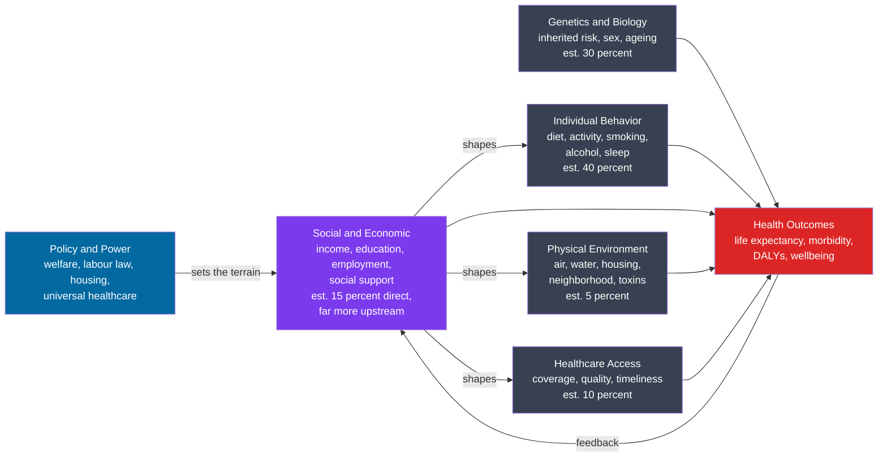

# 🌍 Determinants of Health

> [!abstract] TL;DR
> The **determinants of health** are the factors that make whole populations and individuals healthy or sick — genetics, individual behavior, the social and economic environment, the physical environment, and healthcare access. The counterintuitive finding of modern population health is that **medical care is one of the smaller contributors**; most of the variation in who lives long and well is set upstream, by the conditions in which people are born, grow, live, work, and age. Health follows a continuous **social gradient**: at every step up the socioeconomic ladder, health improves. Because many of these gaps are avoidable and unfairly distributed, they are matters of **equity and ethics**, not just biology.

---

## Intuition

**Analogy:** Your health is shaped less by what happens in the doctor's office than by your **zip code, your wallet, your plate, and your habits**. Ask why a person had a heart attack, and the immediate answer is a blocked artery. Ask why the artery blocked, and you reach cholesterol, blood pressure, smoking. But ask *why those* — and you arrive at the job with no control and long hours, the neighborhood with no safe place to walk and only fast food, the paycheck that ran out before the month did, the childhood spent in a damp apartment. These upstream conditions are the **"causes of the causes."** The clinic treats the last link in a long chain that was mostly forged before the patient ever arrived.

Think of health like the yield of a farm. You can buy the best seeds (genes) and hire an excellent doctor to tend a sick plant (healthcare), but the harvest is decided mostly by the **soil, the water, the weather, and how the field is worked** every day for years — the social and physical environment and daily behavior. Fixing one wilting plant matters, but it will never substitute for good soil.

---

## How It Works

### Core Mechanics

Population health researchers group the determinants into five broad, interacting categories. A widely cited set of rough estimates for their contribution to premature death (McGinnis, Williams-Russo & Knickman 2002; Schroeder 2007) illustrates the surprising balance:

1. **Individual behavior — roughly 40 percent.** Diet, physical activity, tobacco, alcohol, sleep, risky behavior. The single largest modifiable bucket — but, crucially, behaviors are *socially patterned*, not freely chosen in a vacuum.
2. **Genetics and biology — roughly 30 percent.** Inherited disease risk, sex, ageing. Fixed background risk, though its *expression* is tuned by environment and epigenetics.
3. **Social and economic circumstances — roughly 15 percent directly, but far more indirectly.** Income, education, employment, and social support. These are *upstream*: they largely determine the behavioral, environmental, and healthcare buckets, so their true weight exceeds their direct share.
4. **Physical environment — roughly 5 percent.** Air and water quality, housing, toxins, neighborhood safety, the built environment.
5. **Healthcare access — roughly 10 percent.** Coverage, quality, and timeliness of medical care. Real, but far smaller than public intuition (and health budgets) assume.

Three organizing ideas make sense of this list:

- **Social determinants of health (SDOH)** — the WHO Commission on Social Determinants of Health (2008) framed the social and economic conditions as the "causes of the causes." They act *through* behavior, environment, and access rather than instead of them.
- **The social gradient** — the Whitehall studies of British civil servants (Marmot) showed health improving in a smooth staircase with rank. This is not a poor-versus-rich threshold; even second-from-the-top does worse than the top. The mechanism is partly the **biology of status and chronic stress**: low control and effort-reward imbalance keep the HPA axis and stress hormones chronically activated, raising allostatic load.
- **The life-course perspective** — exposures accumulate and even prenatal conditions leave lifelong marks (the Developmental Origins of Health and Disease / DOHaD hypothesis; fetal programming). Health at 60 reflects advantages and insults reaching back to the womb.

Two competing lenses sit behind all of this. The **biomedical model** treats disease as a malfunction of the body to be fixed with drugs and surgery. The **biopsychosocial model** (Engel 1977) insists that biological, psychological, and social factors *interact* to produce health and illness — the framework that makes the determinants above legible as a system rather than a list.

### Flow / Architecture



The arrows are the key insight: the social and economic layer is not just *one bucket* — it is the terrain that shapes the behavior, environment, and healthcare buckets. Ill health then feeds back to erode income and opportunity, closing a reproductive loop across generations.

---

## Key Concepts

### Secondary Level

- **Determinants of health** are simply "the things that keep you healthy or make you sick." They are wider than doctors and hospitals.
- **The big five categories:** how you live (behavior), what you inherited (genes), how much money and support you have (social and economic), where you live (physical environment), and the care you can get (healthcare).
- **Surprise:** healthcare is a *smaller* slice than most people think. Where you were born and how you live day to day matter more.
- **Social gradient:** on average, the richer and more educated a group is, the healthier it is — and this holds at every step, not just at the very bottom.

### Undergraduate Level

- **Social determinants of health (SDOH):** the WHO Commission's framing of income, education, employment, housing, and social support as the "causes of the causes" — upstream forces that produce the downstream risk factors clinicians treat. Link to structural inequality in [[Poverty_Social_Mobility_and_Life_Chances]] and [[Health_Inequality_and_Medical_Sociology]].
- **The Whitehall studies (Marmot):** longitudinal studies of British civil servants that eliminated absolute poverty and still found a continuous mortality gradient by employment grade. Autonomy and control at work, not just money, tracked health.
- **Health inequalities vs inequities:** an *inequality* is any difference in health; an *inequity* is a difference that is **avoidable, unnecessary, and unfair** — a normative, ethical judgment (see [[Justice_in_Health_and_Resource_Allocation]]).
- **Biopsychosocial model (Engel 1977):** health as the emergent product of interacting biological, psychological, and social systems, contrasted with the narrow biomedical model that isolates the body.
- **Population health measures:** **life expectancy** (average years lived), **DALYs** (disability-adjusted life years — years of healthy life lost to death *and* disability), and **HALE** (health-adjusted life expectancy — years lived in good health). These let us compare the *burden* of disease across populations and quantify how much upstream factors move the needle.

### Graduate Level

- **The biology of status and chronic stress:** low socioeconomic position and low job control produce sustained activation of the HPA axis and sympathetic nervous system, raising **allostatic load** — cumulative physiological wear. This is a plausible mechanism converting social rank into cardiovascular and metabolic disease, and it connects the social to the biological (see [[Stress_and_Coping]]).
- **Life-course epidemiology and DOHaD / fetal programming:** prenatal and early-life exposures (maternal nutrition, stress, toxins) set developmental trajectories that manifest as adult disease risk. **Epigenetic** mechanisms — DNA methylation, histone modification — are candidate molecular mediators that embed environment into the genome without changing the sequence ([[Epigenetics_DNA_Methylation_and_Histone_Modification]]).
- **The exposome and environmental health:** the totality of environmental exposures across a lifetime — chemical, physical, psychosocial — as the complement to the genome. Environmental burdens are unequally distributed, tying determinants to [[Environmental_Justice_and_Sustainability]].
- **The limits of behavior-change framing:** telling people to "just eat better and exercise" assumes agency that structural constraints (food deserts, precarious work, unsafe streets, marketing) undercut. Interventions aimed only at individual behavior tend to widen inequities because the already-advantaged act on advice more easily — the phenomenon of **intervention-generated inequality**.
- **Fundamental cause theory (Link & Phelan):** socioeconomic status is a *fundamental* cause of disease because it commands flexible resources — money, knowledge, power, prestige, beneficial social ties — that protect health *regardless* of which specific diseases and risk factors dominate an era. This is why curing one disease rarely closes the gradient: the resources re-deploy to the next frontier.

---

## Python Demo

```python
# Determinants of health: (1) the relative contribution of each category,
# (2) diminishing returns of medical care vs upstream determinants, and
# (3) the social gradient of health. numpy + matplotlib only.
import numpy as np
import matplotlib.pyplot as plt

# --- 1. Relative contributions (rough published estimates) -------------
# Source: McGinnis, Williams-Russo & Knickman (2002); Schroeder (2007).
categories = ["Behavior", "Genetics", "Social &\nEconomic",
              "Environment", "Healthcare"]
shares = np.array([0.40, 0.30, 0.15, 0.05, 0.10])
colors = ["#dc2626", "#374151", "#7c3aed", "#0369a1", "#059669"]

# --- 2. Diminishing returns: extra health per unit of investment --------
# Both curves are concave, but medical care saturates fast (acute care,
# vaccines already captured) while upstream investment has a higher ceiling.
investment = np.linspace(0, 10, 200)
medical  = 1.0 * (1 - np.exp(-1.3 * investment))   # quick saturation
upstream = 1.7 * (1 - np.exp(-0.45 * investment))  # slower, larger ceiling

# --- 3. Social gradient: health rises monotonically with SES ------------
# Stylized after the Whitehall staircase (Marmot). rank 1 = lowest SES.
ses_rank = np.arange(1, 8)
life_exp = 69 + 2.4 * ses_rank - 0.08 * ses_rank**2   # monotone increasing
assert np.all(np.diff(life_exp) > 0), "gradient must be monotonic"

# --- Plot ---------------------------------------------------------------
fig, ax = plt.subplots(1, 3, figsize=(15, 4.5))

# Panel 1: contribution bars
ax[0].bar(categories, shares * 100, color=colors)
ax[0].set_title("Contribution to Health Outcomes")
ax[0].set_ylabel("Share of variation (percent)")
for i, v in enumerate(shares):
    ax[0].text(i, v * 100 + 1, f"{int(v*100)}", ha="center", fontweight="bold")
ax[0].axhline(0, color="black", linewidth=0.8)

# Panel 2: diminishing returns
ax[1].plot(investment, medical,  label="Medical care", color="#059669", lw=2.5)
ax[1].plot(investment, upstream, label="Upstream social / behavioral",
           color="#7c3aed", lw=2.5)
ax[1].set_title("Marginal Returns on Investment")
ax[1].set_xlabel("Relative investment")
ax[1].set_ylabel("Health gained")
ax[1].legend()
ax[1].annotate("medical care\nsaturates early",
               xy=(3, medical[np.argmin(np.abs(investment-3))]),
               xytext=(4.5, 0.4),
               arrowprops=dict(arrowstyle="->", color="#059669"))

# Panel 3: social gradient
ax[2].plot(ses_rank, life_exp, "o-", color="#7c3aed", lw=2.5, markersize=9)
ax[2].set_title("The Social Gradient of Health")
ax[2].set_xlabel("Socioeconomic position (1 = lowest, 7 = highest)")
ax[2].set_ylabel("Life expectancy (years)")
ax[2].set_xticks(ses_rank)
ax[2].grid(alpha=0.3)

plt.tight_layout()
plt.savefig("determinants_of_health.png", dpi=120)
print("Total contribution shares sum to:", shares.sum())          # 1.0
print("Life expectancy gap top vs bottom:",
      round(life_exp[-1] - life_exp[0], 1), "years")
```

**What it shows.** Panel 1 makes the counterintuitive point visible: behavior and genetics dominate the direct accounting while healthcare is only about a tenth — yet the social bucket is the upstream driver of the others. Panel 2 shows *why* pouring ever more money into medical care yields diminishing returns while investment in upstream determinants has a higher ceiling. Panel 3 reproduces the **social gradient**: life expectancy climbs monotonically with socioeconomic position, a staircase rather than a cliff.

---

## Real-World Applications

- **National health strategy (the Marmot Review, UK 2010).** "Fair Society, Healthy Lives" translated the social-gradient evidence into policy, arguing for **proportionate universalism** — universal action scaled to need — rather than targeting only the poorest. It reframed health as a whole-of-government issue spanning education, housing, and early childhood, not a Department-of-Health silo.
- **Healthcare systems screening for SDOH.** Providers such as Kaiser Permanente and NHS trusts now screen patients for food insecurity, housing instability, and social isolation, then refer to social services — treating the "causes of the causes" alongside the presenting complaint.
- **Health impact assessment (HIA).** Transport, zoning, and housing decisions are evaluated for downstream health effects (air quality, walkability, green space), operationalizing the environmental determinant in urban planning.
- **Global targets.** The WHO uses **DALYs** and **HALE** to set priorities and track the Sustainable Development Goals, quantifying how much disease burden is preventable through upstream action such as clean water, sanitation, and tobacco control.

---

## Common Pitfalls

- **Equating health with healthcare.** The most common error is assuming more doctors and hospitals is the main lever. Medical care is essential but is a minority contributor; over-investing there while ignoring housing, income, and behavior yields diminishing returns.
- **Blaming individuals for structural risk.** "Just choose to be healthy" ignores that behaviors are socially patterned by food environments, work schedules, marketing, and stress. Behavior-only interventions can *widen* inequities because the advantaged act on advice more easily.
- **Confusing inequality with inequity.** Not every health difference is unjust — some (age-related decline) are unavoidable. The ethical claim attaches only to differences that are avoidable and unfairly distributed. Sloppy use of the terms muddies the policy argument.
- **Reading contribution shares as fixed and additive.** The rough "40/30/15/5/10" figures are estimates of average contribution to premature death, not deterministic destinies. The social bucket's *direct* share understates its true weight because it operates through the other buckets.
- **Ignoring the life course.** Focusing only on adult behavior misses that much adult disease risk is programmed in early life and even prenatally — interventions timed too late fight uphill against embedded biology.
- **Reifying genetics as unchangeable fate.** Genes set risk, but their expression is modulated by environment and epigenetics; "it's genetic" is rarely the end of the story.

---

## Related Concepts

- [[Health_Inequality_and_Medical_Sociology]] — the sociological treatment of the social gradient, the Whitehall studies, and medicalization; the closest companion to this note.
- [[Poverty_Social_Mobility_and_Life_Chances]] — how income, class, and mobility structure the "life chances" that become health outcomes.
- [[Social_Class_and_Stratification]] — the stratification machinery that generates the socioeconomic positions the gradient runs along.
- [[Justice_in_Health_and_Resource_Allocation]] — the bioethics of what makes a health difference *unfair*, and how to allocate scarce health resources justly.
- [[Environmental_Justice_and_Sustainability]] — the unequal distribution of environmental burdens (air, water, toxins) that constitutes the physical-environment determinant.
- [[Distributive_Justice_and_Inequality]] — the broader theories of fair distribution that ground health-equity claims.
- [[Epigenetics_DNA_Methylation_and_Histone_Modification]] — the molecular mechanism by which early-life and environmental exposures embed into biology (the life-course link).
- [[Stress_and_Coping]] — the psychology and physiology of chronic stress that mediates status into disease (the biology of the gradient).
- [[Biological_Basis_of_Behavior]] — the biological pole of the biopsychosocial model that this note integrates with the social.
- [[Intersectionality]] — how overlapping axes of disadvantage compound to shape exposure and health.

---

## Review Questions

1. **Conceptual.** Explain the phrase "causes of the causes." Using the heart-attack example, trace a downstream clinical event back through at least three upstream determinants, and state which category each belongs to.
2. **Scenario.** A health minister has a fixed budget and proposes to spend all of it on new hospital equipment to cut premature deaths. Given the estimated contribution shares and the diminishing-returns argument, what alternative allocation would you advise, and what evidence (Whitehall, McGinnis) supports it?
3. **Trade-off / evaluative.** The social gradient means health improves at *every* step of the socioeconomic ladder, not just above a poverty line. Why does this finding argue against purely poverty-targeted programs, and what does "proportionate universalism" propose instead? What is the ethical distinction between a health *inequality* and a health *inequity* in your answer?

---

## Sources

- WHO Commission on Social Determinants of Health (2008). *Closing the Gap in a Generation: Health Equity Through Action on the Social Determinants of Health.* World Health Organization. [https://www.who.int/publications/i/item/WHO-IER-CSDH-08.1](https://www.who.int/publications/i/item/WHO-IER-CSDH-08.1)
- Marmot, M. G., et al. (1991). "Health inequalities among British civil servants: the Whitehall II study." *The Lancet*, 337(8754), 1387–1393.
- McGinnis, J. M., Williams-Russo, P., & Knickman, J. R. (2002). "The case for more active policy attention to health promotion." *Health Affairs*, 21(2), 78–93.
- Engel, G. L. (1977). "The need for a new medical model: a challenge for biomedicine." *Science*, 196(4286), 129–136.
- Schroeder, S. A. (2007). "We Can Do Better — Improving the Health of the American People." *New England Journal of Medicine*, 357(12), 1221–1228.
- Marmot, M. (2010). *Fair Society, Healthy Lives: The Marmot Review.* Institute of Health Equity. [https://www.instituteofhealthequity.org/resources-reports/fair-society-healthy-lives-the-marmot-review](https://www.instituteofhealthequity.org/resources-reports/fair-society-healthy-lives-the-marmot-review)

---

#health #determinants-of-health #social-determinants #health-equity #biopsychosocial
