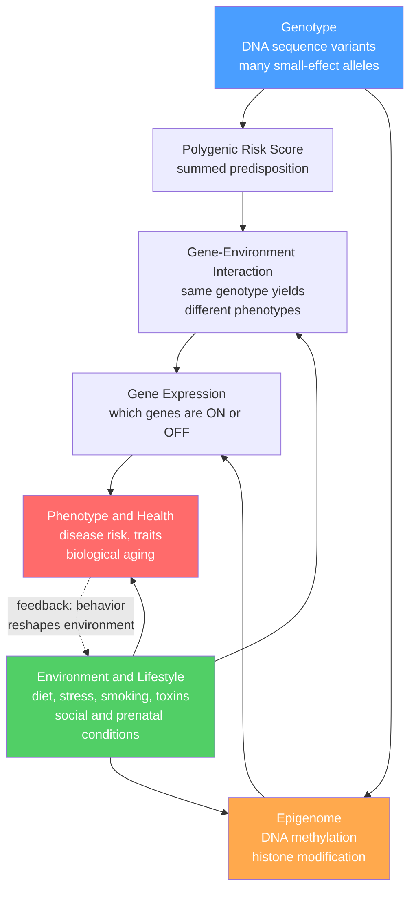

# 🧬 Genes, Environment and Epigenetics in Health

> [!abstract] TL;DR
> Your DNA does not dictate your health — it sets a range of possibilities that your environment, behavior, and development shape into an actual outcome. Genes and environment are not competing explanations (nature *vs* nurture) but a single intertwined system (nature *via* nurture): most health traits are **polygenic** (many genes of tiny effect), their expression is tuned by **epigenetic** marks that lifestyle writes onto the genome, and **heritability** is a slippery population statistic that is routinely misread as personal genetic destiny.

---

## Intuition

**Analogy: genes load the gun, environment pulls the trigger.**

A loaded gun on a shelf harms no one. The bullets (your inherited alleles) set what is *possible* — but whether anything actually fires depends on whether a finger (your diet, stress, sleep, toxins, wealth, early-life development) ever reaches the trigger. Two people can carry the identical "loaded" genotype and end up completely different: one develops the disease, the other never does, because they lived in different environments.

Push the analogy one step further and you reach **epigenetics**: the environment does not just pull triggers, it can also *rearrange which chambers are even loaded*. Smoking, famine, chronic stress, and diet leave chemical marks on the genome that switch genes louder or quieter — without changing a single letter of the DNA sequence — and some of those marks persist for years or across a generation. The sequence is the hardware; the epigenome is the configuration file that the environment keeps editing.

The single most important corrective this note teaches: **"a gene for X" is almost always a misleading phrase.** There is rarely a gene *for* heart disease or depression; there are gene *variants that shift risk*, and that shift is only meaningful inside a particular environment.

---

## How It Works

### From genotype to health outcome

1. **Genotype** — You inherit two copies of ~20,000 genes plus millions of common variants (SNPs). For most health traits, no single variant matters much; risk is the *sum* of hundreds or thousands of small-effect alleles. That sum, distilled to one number, is a **polygenic risk score (PRS)**.
2. **Environment and lifestyle** — Diet, physical activity, tobacco, alcohol, air quality, infection, stress, socioeconomic status, and prenatal conditions all act on the body directly *and* modulate how genes behave.
3. **Epigenome** — Environmental signals are transduced into **DNA methylation** (adding methyl groups that usually silence a gene) and **histone modifications** (repackaging chromatin to open or close regions). This layer decides *which* genes are switched ON or OFF in each cell, moment to moment.
4. **Gene expression → phenotype** — The genotype filtered through the epigenome and the environment produces the actual observable trait: cholesterol level, insulin sensitivity, blood pressure, biological age, disease onset.
5. **Feedback** — Health outcomes change behavior and environment (a diagnosis changes your diet; illness changes your job), so the arrow is not one-way.

### Three interlocking phenomena

- **Gene-environment interaction (GxE):** the *effect* of a genotype depends on the environment (and vice versa). The textbook case is **PKU** (phenylketonuria): the same two mutant alleles cause severe brain damage on a normal diet but produce a healthy child on a phenylalanine-restricted diet. Genetics is 100% causal *and* environment is 100% preventive — both at once. Lactase persistence (adult "lactose tolerance") is another: the genotype only matters in a dairy-consuming culture.
- **Gene-environment correlation (rGE):** genes and environments are not independently assigned. People with athletic genes seek out sports (active rGE); parents who pass on musical genes also provide a musical home (passive rGE). This entangles "nature" and "nurture" so tightly that heritability statistics absorb some environmental effects.
- **Epigenetic programming:** early-life environment can set expression patterns that last a lifetime — the basis of **DOHaD** (Developmental Origins of Health and Disease).



---

## Key Concepts

### Secondary Level

- **Nature *via* nurture, not versus.** Almost every health trait needs both a genetic predisposition and an environmental trigger. Asking "is it genes or environment?" is like asking whether the area of a rectangle is due to its length or its width.
- **Polygenic means "many genes."** Height, blood pressure, diabetes risk, and depression are each influenced by hundreds to thousands of genes, each nudging risk by a fraction of a percent. This is why they run in families without following simple dominant/recessive patterns.
- **Epigenetics = software, not hardware.** The DNA letters stay fixed, but chemical "sticky notes" (methyl groups) can silence or activate genes in response to how you live.
- **Identical twins diverge.** Monozygotic twins share 100% of DNA yet differ in disease onset, appearance, and biological age as they accumulate different environmental and epigenetic histories — living proof the genome is not destiny.

### Undergraduate Level

- **Heritability ($h^2$) — what it is and is NOT.** Heritability is the proportion of *phenotypic variance in a population* attributable to *genetic variance*: $h^2 = \frac{V_G}{V_P}$. Four things it does **not** mean:
  1. It is **not** "how genetic" one person's trait is. Heritability is a property of a population, not an individual. A trait can be 90% heritable and still fully preventable (again, PKU).
  2. It is **not** fixed. Heritability is **context-dependent** — it rises when the environment is uniform (little $V_E$, so genes explain most of the remaining variance) and falls when the environment varies widely. Height heritability is higher in well-fed populations than in ones with variable nutrition.
  3. It says **nothing about between-group differences.** A trait can be highly heritable within each of two groups while the *gap between* groups is entirely environmental.
  4. High heritability does **not** imply low malleability. (See [[Quantitative_Genetics_and_Heritability]] for the variance-partitioning math.)
- **Polygenic risk scores (PRS): promise and limits.** A PRS sums an individual's risk alleles weighted by GWAS effect sizes (see [[Complex_Trait_Genetics_and_GWAS]]). Promise: cheap, computable at birth, can stratify populations. Severe limits: (a) most PRS explain only a small fraction of trait variance; (b) they are trained mostly on **European-ancestry** cohorts and **transfer poorly** to other ancestries, risking health inequity; (c) they predict *population* risk, not individual fate; (d) they ignore environment, which often dominates modifiable risk.
- **The diathesis-stress model.** Many disorders arise when a genetic *diathesis* (vulnerability) meets environmental *stress*. Neither alone suffices — a direct clinical expression of GxE (link [[Biological_Basis_of_Behavior]]).
- **DNA methylation and histone modification** are the two workhorse epigenetic mechanisms; diet (methyl donors like folate), smoking (well-mapped methylation signatures), and chronic stress (cortisol-linked changes) all leave measurable marks. (Mechanisms: [[Epigenetics_DNA_Methylation_and_Histone_Modification]].)

### Graduate Level

- **DOHaD and the Dutch Hunger Winter.** The 1944–45 Dutch famine is the canonical natural experiment: individuals whose mothers were starved during early gestation showed, decades later, higher rates of obesity, cardiovascular disease, and altered metabolism — and persistent **methylation differences at the *IGF2* locus** compared to unexposed siblings. Prenatal environment "programmed" lifelong risk, and the epigenetic mark was still detectable 60 years on. This reframes many "genetic" diseases as *developmental* ones.
- **Missing heritability.** GWAS-identified variants typically explain far less variance than twin-study heritability predicts. Proposed resolutions: rare variants, GxE, gene-gene epistasis, inflated twin estimates (shared environment mistaken for genes), and non-additive effects. The gap itself is a caution against over-reading either method.
- **The epigenetic clock and biological aging.** Horvath and Hannum clocks estimate **biological age** from methylation levels at a few hundred CpG sites, often predicting mortality and disease better than chronological age. Accelerated epigenetic age tracks smoking, obesity, and stress, and is being explored as a modifiable biomarker of the *pace of aging* (link [[Aging_and_Genome_Instability]]).
- **Nutrigenomics and pharmacogenomics — hype vs reality.** *Nutrigenomics* (tailoring diet to genotype) is mostly premature: outside monogenic conditions (PKU, lactose, celiac/HLA), direct-to-consumer "DNA diets" lack rigorous outcome evidence. *Pharmacogenomics* is genuinely clinical: variants in *CYP2C19* (clopidogrel), *TPMT/NUDT15* (thiopurines), *HLA-B\*57:01* (abacavir), and *VKORC1/CYP2C9* (warfarin) change drug response and are actioned in guidelines (link [[Pharmacogenomics_and_Personalized_Medicine]]).
- **Transgenerational epigenetic inheritance in humans** is real but limited and contested: most marks are erased and reset each generation; robust human evidence is thin compared to plants and worms. Claims should be read cautiously.

---

## Python Demo

```python
# Gene-Environment interaction and the CONTEXT-DEPENDENCE of heritability.
#
# Trait model:  Y = 5 + b_G * (1 + k * E) * G  +  b_E * E  +  noise
#   G = standardized polygenic risk score (sum of many small-effect alleles)
#   E = environmental adversity in [0, 1]  (0 = protective, 1 = harmful)
#   k = GxE strength: genes matter MORE when the environment is harmful
#
# We show: (a) the SAME genotype yields very different outcomes across
# environments (the interaction), and (b) heritability is not a constant --
# the share of variance explained by genes shrinks as the environment varies.

import numpy as np
import matplotlib.pyplot as plt

rng = np.random.default_rng(42)

# ---- model parameters ----
N       = 4000
b_G     = 1.0    # baseline genetic effect
b_E     = 2.0    # main environmental effect
k       = 2.5    # gene-environment interaction strength
sigma   = 1.0    # residual noise SD

# ---- build a polygenic risk score from 200 small-effect loci (CLT -> ~Normal) ----
n_loci      = 200
allele_freq = 0.30
genotypes   = rng.binomial(2, allele_freq, size=(N, n_loci))       # 0/1/2 copies
effects     = rng.normal(0, 1, n_loci) / np.sqrt(n_loci)           # tiny effects
G_raw       = genotypes @ effects
G           = (G_raw - G_raw.mean()) / G_raw.std()                 # standardized PRS

def simulate(G, E, rng):
    genetic_component = b_G * (1 + k * E) * G     # note: slope depends on E -> GxE
    env_component     = b_E * E
    noise             = rng.normal(0, sigma, size=np.shape(G))
    Y = 5.0 + genetic_component + env_component + noise
    return Y, genetic_component

fig, ax = plt.subplots(1, 3, figsize=(16, 4.6))

# ===== (a) SAME genotype axis, TWO environments: the interaction =====
g_axis      = np.linspace(-3, 3, 100)
y_protect   = 5.0 + b_G * (1 + k * 0.0) * g_axis + b_E * 0.0   # E = 0 (protective)
y_harmful   = 5.0 + b_G * (1 + k * 1.0) * g_axis + b_E * 1.0   # E = 1 (harmful)
ax[0].plot(g_axis, y_protect, lw=2.5, color="#2e8b57", label="Protective environment")
ax[0].plot(g_axis, y_harmful, lw=2.5, color="#c0392b", label="Harmful environment")
ax[0].axvline(1.5, ls="--", color="gray")
ax[0].annotate("same genotype,\ndifferent outcome",
               xy=(1.5, np.interp(1.5, g_axis, y_harmful)), xytext=(-2.6, 12),
               arrowprops=dict(arrowstyle="->"))
ax[0].set_title("(a) Gene-environment interaction")
ax[0].set_xlabel("Genetic risk score  G")
ax[0].set_ylabel("Predicted trait / risk  Y")
ax[0].legend(loc="upper left", fontsize=8)

# ===== (b) SAME high-risk genotype, distribution across two environments =====
G_fixed = 2.0                      # one high-genetic-risk individual, cloned
E_prot  = np.clip(rng.normal(0.1, 0.05, N), 0, 1)
E_harm  = np.clip(rng.normal(0.9, 0.05, N), 0, 1)
Y_prot, _ = simulate(np.full(N, G_fixed), E_prot, rng)
Y_harm, _ = simulate(np.full(N, G_fixed), E_harm, rng)
ax[1].hist(Y_prot, bins=40, alpha=0.7, color="#2e8b57", label="Protective env")
ax[1].hist(Y_harm, bins=40, alpha=0.7, color="#c0392b", label="Harmful env")
ax[1].set_title("(b) One high-risk genotype,\ntwo environments")
ax[1].set_xlabel("Outcome  Y")
ax[1].set_ylabel("Count")
ax[1].legend(fontsize=8)

# ===== (c) heritability shifts as environmental VARIANCE grows =====
env_sds = np.linspace(0.0, 1.2, 25)
herit   = []
for e_sd in env_sds:
    E = np.clip(rng.normal(0.5, e_sd, N), 0, 1)
    Y, gc = simulate(G, E, rng)
    h2 = np.var(gc) / np.var(Y)     # share of variance from the genetic component
    herit.append(h2)
ax[2].plot(env_sds, herit, "o-", color="#2c3e50")
ax[2].set_title("(c) Heritability is context-dependent")
ax[2].set_xlabel("Environmental variability (SD of E)")
ax[2].set_ylabel(r"Heritability  $h^2 = V_G / V_P$")
ax[2].set_ylim(0, 1)

plt.tight_layout()
plt.savefig("genes_environment_heritability.png", dpi=110)
print(f"Heritability in a UNIFORM environment : {herit[0]:.2f}")
print(f"Heritability in a VARIABLE environment: {herit[-1]:.2f}")
```

**What the plots teach.** Panel (a): the two environment lines have *different slopes* — the payoff of a given genetic risk score depends on the environment, so no single number captures "the effect of the gene." Panel (b): one identical high-risk genotype produces two totally different outcome distributions purely because of environment. Panel (c): the *same genes* explain most variance when everyone lives in a uniform environment and progressively *less* variance as environments diverge — heritability is a snapshot of a population in a setting, not a fixed genetic fraction.

---

## Real-World Applications

- **Clinical pharmacogenomics.** Preemptive genotyping of *CYP2C19*, *TPMT/NUDT15*, and *HLA-B\*57:01* changes real prescribing today — dose, drug choice, and avoiding lethal hypersensitivity reactions.
- **Newborn screening (PKU, MCAD, hypothyroidism).** The purest applied GxE: detect a high-risk genotype at birth and change the *environment* (diet) to erase the phenotype.
- **Cascade screening for familial hypercholesterolemia and BRCA.** Here a single high-penetrance variant *does* justify individual-level action (statins early, enhanced surveillance, risk-reducing surgery).
- **Polygenic risk stratification.** PRS pilots flag people who might benefit from earlier statins or cancer screening — but only as one input alongside classic risk factors, and with explicit caution about ancestry bias.
- **Lifestyle and epigenetic reversibility.** Smoking-associated methylation marks partly reverse after quitting; exercise and diet reshape metabolic gene expression — the biological basis for "your genes are not your fate."
- **Epigenetic-clock trials.** "Pace of aging" methylation biomarkers are being used as intermediate endpoints in longevity and caloric-restriction studies.

---

## Common Pitfalls

- **Genetic determinism ("a gene for X").** The most damaging fallacy. Reporting a variant as *causing* a disease erases the environment that co-determines it and breeds fatalism. Almost all common-disease variants only shift probability.
- **Misreading heritability as personal or fixed.** "Depression is 40% heritable" does **not** mean your depression is 40% genetic, nor that it is 40% unchangeable. It is a population-variance statistic tied to a specific environment.
- **Between-group leaps.** Assuming a highly heritable trait implies genetic causes for group differences. Within-group heritability is silent about between-group gaps (Lewontin's seed-in-two-soils argument).
- **Overhyped nutrigenomics.** Direct-to-consumer "eat for your DNA" tests mostly outrun the evidence; treat non-monogenic dietary genotyping as marketing, not medicine.
- **PRS ancestry bias.** Deploying European-trained scores on other populations can *widen* health inequities; a low PRS can falsely reassure.
- **Correlation ≠ causation in epigenetics.** A methylation difference associated with disease may be a *consequence* (or a confound of cell-type mixture or smoking), not a cause. Reverse causation is rampant.
- **Over-claiming transgenerational inheritance.** Most epigenetic marks are wiped and reset each generation; robust human transgenerational evidence is scarce.

---

## Related Concepts

- [[Quantitative_Genetics_and_Heritability]] — the variance-partitioning math ($V_G$, $V_E$, $h^2$) behind everything this note applies to health.
- [[Complex_Trait_Genetics_and_GWAS]] — how the effect sizes powering polygenic risk scores are discovered, and why most trait variance stays "missing."
- [[Epigenetics_DNA_Methylation_and_Histone_Modification]] — the molecular machinery of methylation and histone marks that translate environment into gene expression.
- [[Pharmacogenomics_and_Personalized_Medicine]] — the most clinically mature form of genotype-guided care.
- [[Aging_and_Genome_Instability]] — the genomic and epigenetic mechanisms underlying the epigenetic clock and biological aging.
- [[Biological_Basis_of_Behavior]] — the diathesis-stress and gene-environment framing applied to brain and behavior.

---

## Review Questions

1. **(Conceptual)** Explain why the statement "PKU is a genetic disease that is 100% preventable" is not a contradiction. What does this reveal about the relationship between causation and heritability?
2. **(Applied scenario)** A newspaper reports "scientists find height is 80% heritable, so nutrition programs won't help short populations." Identify two distinct errors in this reasoning and explain what heritability actually licenses you to conclude.
3. **(Trade-off / evaluation)** A startup offers a $200 polygenic risk score for heart disease and a matching "DNA-personalized diet." As a clinician, which of the two products would you take seriously and why? List the specific limitations you would disclose to a patient about the PRS, including the equity concern.

---

## Sources

- Turkheimer, E. (2000). *Three Laws of Behavior Genetics and What They Mean.* Current Directions in Psychological Science, 9(5), 160-164.
- Heijmans, B. T., et al. (2008). *Persistent epigenetic differences associated with prenatal exposure to famine in humans* (Dutch Hunger Winter, IGF2 methylation). PNAS, 105(44), 17046-17049.
- Barker, D. J. P. (2004). *The Developmental Origins of Adult Disease.* Journal of the American College of Nutrition, 23(6), 588S-595S.
- Horvath, S. (2013). *DNA methylation age of human tissues and cell types* (the epigenetic clock). Genome Biology, 14(10), R115.
- Torkamani, A., Wineinger, N. E., & Topol, E. J. (2018). *The personal and clinical utility of polygenic risk scores.* Nature Reviews Genetics, 19(9), 581-590.

---

#health #genetics #epigenetics #gene-environment #personalized-health
