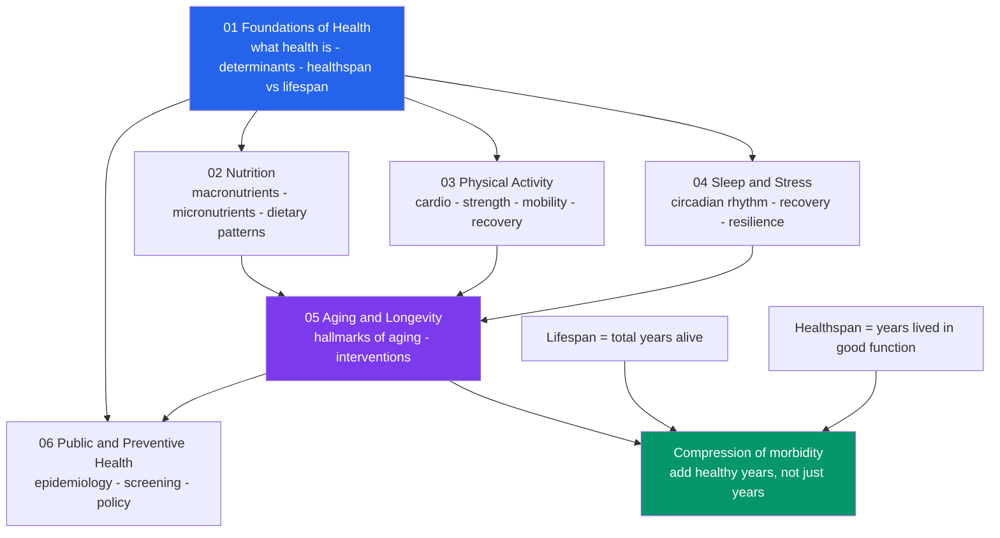

# 🌱 Health and Wellbeing Overview

> [!abstract] TL;DR
> **Health is not merely the absence of disease** — it is the capacity to function, adapt, and flourish across physical, mental, and social dimensions. This vault treats health as **applied human science**: it takes the *mechanisms* from Biology, Neuroscience, and Psychology and asks the practical question, *how do we actually live longer and better?* The organizing idea of modern health science is **healthspan, not lifespan** — the goal is to add healthy, functional years and **compress morbidity** into a short window at the end of life, rather than simply extending the total years alive. The controllable levers are a short list: **nutrition, physical activity, sleep, stress management, social connection, and avoiding harms.** The hard part is not naming them but knowing what is actually *true* — because lifestyle science is riddled with confounding, weak observational studies, and hype.

## Intuition

**Analogy: your body is a complex machine you can never switch off and can never replace.**

Imagine a machine that must run continuously for eight or nine decades with no scheduled shutdown, no spare unit on standby, and no factory reset. You cannot swap the engine; you can only maintain it *while it runs*. Two very different standards apply to such a machine. The first is **"not broken"** — it still turns on, it hasn't failed catastrophically. The second is **"running well"** — quiet, efficient, responsive, with reserve capacity to handle a sudden load. Conventional medicine is largely built around the first standard: it waits for a warning light (a symptom, a diagnosis) and then repairs the fault. Health science, as this vault frames it, is about the second standard: **the ongoing maintenance that keeps reserve capacity high so the warning lights never come on.**

The gap between "not broken" and "running well" is exactly the gap between the **absence of disease** and **positive health**. A person can have no diagnosed illness and still be exhausted, weak, anxious, and metabolically fragile — technically "not broken," but running badly. The whole point of the maintenance mindset is that most of the wear you accumulate is a function of how the machine is *operated day to day* — how it is fuelled, how hard and how regularly it moves, and whether it gets time to cool down and repair.

---

## How It Works

### From "absence of disease" to positive, function-based health

The most cited definition comes from the **World Health Organization (1948)**: health is *"a state of complete physical, mental and social well-being and not merely the absence of disease or infirmity."* Its lasting contribution was to break the purely biomedical view and put **mental** and **social** wellbeing on equal footing with the physical. But the definition has a well-known flaw: the word **"complete."** By that standard, almost nobody is healthy — anyone managing a chronic but well-controlled condition (diabetes, treated hypertension) is defined as unhealthy, and the definition medicalizes normal life. It also fits poorly with an aging population where chronic conditions are the norm rather than the exception.

Modern proposals replace *complete wellbeing* with **function and adaptation**. Machteld Huber's **"positive health"** reframes health as *"the ability to adapt and to self-manage in the face of social, physical, and emotional challenges."* This shifts the focus from a static, perfect state to a **dynamic capacity**: what matters is not whether you have zero problems, but whether you can absorb stressors and recover — a property closely related to **resilience** and **homeostatic reserve**.

### The dimensions of health — the biopsychosocial model

Health is multi-dimensional, and the dimensions are **coupled**, not independent:

1. **Physical** — cardiovascular, metabolic, musculoskeletal, immune function.
2. **Mental / cognitive** — attention, mood regulation, absence of disabling psychological disorder.
3. **Emotional** — the ability to experience and regulate feelings.
4. **Social** — relationships, belonging, and social support; one of the *strongest* predictors of mortality.

George Engel's **biopsychosocial model** (1977) is the framework that binds these together: outcomes emerge from the interaction of **biological** factors (genes, physiology), **psychological** factors (behavior, beliefs, coping), and **social** factors (relationships, income, environment). Loneliness raises cardiovascular risk; depression worsens metabolic disease; chronic pain drives anxiety. You cannot cleanly separate the "physical" from the "mental" body.

### Healthspan vs lifespan — the central framing

- **Lifespan** = total years alive.
- **Healthspan** = years lived in good function, free of significant disability and disease.

For most of the 20th century, gains came from extending lifespan (sanitation, vaccines, antibiotics). But adding years of frailty is a hollow victory. James Fries' **"compression of morbidity"** hypothesis (1980) reframed the goal: if we can push the *onset* of chronic disability later while the maximum lifespan stays relatively fixed, we **compress** the period of sickness into a short window at the end of life. The aim is a long plateau of high function followed by a rapid terminal decline — **more good years, not just more years.** This is the north star of the entire vault, and the Python demo below models it directly.

### The epidemiological transition — why the leading killers changed

A century ago, the leading causes of death were **infectious**: pneumonia, tuberculosis, diarrheal disease. The **epidemiological transition** describes the shift, as societies develop, toward **chronic, non-communicable diseases (NCDs)** as the dominant burden: **cardiovascular disease, cancer, and metabolic disease** (type 2 diabetes, obesity-linked conditions). The crucial implication for this vault: today's leading killers are **heavily lifestyle-driven**. Smoking, poor diet, physical inactivity, and excess alcohol are behind a large share of NCD burden — which means a large share is, in principle, **preventable** through the pillars below.

### The pillars of health this vault covers

The controllable levers are few and well-established:

- **Nutrition** — what and how much you eat.
- **Physical activity** — cardiovascular training, strength, and mobility.
- **Sleep** — the master recovery process (see [[Sleep_and_Circadian_Rhythms]]).
- **Stress management** — regulating the load and allowing recovery (see [[Stress_and_Coping]]).
- **Social connection** — relationships as a biological, not just emotional, need.
- **Avoiding harms** — tobacco, excess alcohol, and other exposures.

### The evidence problem — why lifestyle science is hard

Health advice whipsaws (eggs good, eggs bad, eggs good again) for structural reasons, and understanding *why* is a core skill this vault insists on:

- **Confounding.** People who take vitamins or drink red wine differ systematically from those who don't (wealthier, more health-conscious). The behavior gets credit that belongs to the confounder.
- **Observational vs experimental.** Most nutrition evidence is **observational** (surveys, cohorts) and can only show *correlation*. **Randomized controlled trials (RCTs)** can establish causation but are hard, expensive, and often impractical for diet over decades.
- **Replication and hype.** Small studies, flexible analysis, and press-release science produce headline claims that fail to replicate. See [[Scientific_Reasoning_and_Method]] for the reasoning tools to filter signal from noise.

### Prevention vs treatment, and personalized vs population health

Two structural shifts define modern practice. First, **from reactive treatment to proactive prevention** — intervening on risk factors *before* disease manifests, because prevention is usually cheaper and preserves function. Second, the tension between **population health** (interventions applied broadly, e.g., public guidelines, food policy — small per-person effect, huge aggregate effect) and **personalized health** (tailoring to an individual's genetics, biomarkers, and context). Both are needed; they answer different questions.

### The vault map



---

## Key Concepts

**Secondary (explain to anyone):**
- **Health is more than not being sick** — it includes feeling and functioning well (physical, mental, social).
- **Healthspan vs lifespan** — the goal is more *good* years, not just more total years.
- **The six pillars** — nutrition, movement, sleep, stress, connection, avoiding harms.
- **Prevention beats cure** — most chronic disease is easier to prevent than to treat.

**Undergraduate (needs some science background):**
- **WHO definition and its critique** — "complete wellbeing" is unattainable and medicalizes normal life; hence function-based and "positive health" definitions.
- **Biopsychosocial model** — outcomes arise from interacting biological, psychological, and social factors.
- **Epidemiological transition** — dominant disease burden shifted from infectious to chronic non-communicable disease as societies developed.
- **Compression of morbidity** — pushing disability onset later so the sick period shrinks toward the end of life.
- **Confounding and observational vs RCT evidence** — why most diet claims are weak.

**Graduate (systems-level thinking):**
- **Resilience and homeostatic reserve** — health as dynamic adaptive capacity, not a static state; reserve buffers stressors before failure.
- **Allostatic load** — the cumulative physiological cost of chronic stress and repeated adaptation.
- **Population vs personalized health** — the tension between broadly-applied guidelines (small individual effect, large aggregate benefit) and precision approaches.
- **The exposome and social determinants** — health as the integral of lifelong environmental and social exposures, often dominating individual behavior.
- **Healthy-adjusted life expectancy (HALE) and DALYs** — quantitative metrics that value quality-weighted years, operationalizing healthspan for policy.

---

## Python Demo

```python
# Healthspan vs lifespan: model a "vitality / function" trajectory across the
# whole life and contrast two futures with the SAME machine but different
# maintenance. We compute healthspan = years spent above a functional threshold,
# and morbidity = years alive but below it. The punchline: more good years beats
# more total years.
import numpy as np
import matplotlib.pyplot as plt

age = np.linspace(0, 100, 2001)          # fine age grid, 0 to 100 years

def function_curve(a, midpoint, steepness):
    # Logistic decline: ~100 units of function early, sigmoid drop with age.
    return 100.0 / (1.0 + np.exp((a - midpoint) / steepness))

# Scenario A - "prolonged morbidity": decline starts early and is gradual.
# The person actually lives LONGER in total, but spends decades in decline.
funcA = function_curve(age, midpoint=62, steepness=14)

# Scenario B - "compression of morbidity": high plateau, then rapid terminal
# decline. Fewer total years, but far more good ones.
funcB = function_curve(age, midpoint=78, steepness=4)

THRESHOLD = 70.0   # functional-independence line (able to live a full life)
DEATH     = 10.0   # below this we treat the person as no longer alive

def summarize(func, label):
    alive = func >= DEATH
    healthy = func >= THRESHOLD
    lifespan  = age[alive].max()                       # last age still alive
    healthspan = age[healthy].max() if healthy.any() else 0.0
    morbidity = lifespan - healthspan                  # years alive but declined
    print(f"{label:22s} lifespan={lifespan:5.1f} yr | "
          f"healthspan={healthspan:5.1f} yr | morbidity={morbidity:5.1f} yr")
    return lifespan, healthspan

print("Functional threshold =", THRESHOLD, "units\n")
lifeA, healthA = summarize(funcA, "A prolonged morbidity")
lifeB, healthB = summarize(funcB, "B compressed morbidity")

# ---- Plot ----
fig, ax = plt.subplots(figsize=(10, 5.5))
ax.plot(age, funcA, color="#d97706", lw=2.5, label="A: prolonged morbidity")
ax.plot(age, funcB, color="#059669", lw=2.5, label="B: compressed morbidity")
ax.axhline(THRESHOLD, color="#334155", ls="--", lw=1.2)
ax.text(1, THRESHOLD + 1.5, "functional threshold", color="#334155", fontsize=9)

# Shade each healthspan (years above threshold).
ax.fill_between(age, THRESHOLD, funcA, where=funcA >= THRESHOLD,
                color="#d97706", alpha=0.15)
ax.fill_between(age, THRESHOLD, funcB, where=funcB >= THRESHOLD,
                color="#059669", alpha=0.20)

ax.set_xlabel("Age (years)")
ax.set_ylabel("Physiological function / vitality")
ax.set_title("Healthspan vs Lifespan: more good years, not just more years")
ax.set_xlim(0, 100); ax.set_ylim(0, 105)
ax.legend(loc="lower left"); ax.grid(alpha=0.25)
plt.tight_layout()
plt.show()

# Typical output:
#   A prolonged morbidity  lifespan= 92.8 yr | healthspan= 50.1 yr | morbidity= 42.7 yr
#   B compressed morbidity lifespan= 86.8 yr | healthspan= 74.6 yr | morbidity= 12.2 yr
# Scenario A lives ~6 years LONGER yet spends ~43 years in decline;
# Scenario B lives fewer total years but enjoys ~25 more HEALTHY years.
# The goal of health science is curve B: a long plateau, then a short drop.
```

The model makes the abstract framing concrete: a longer *lifespan* (Scenario A) can be strictly worse than a shorter one (Scenario B) once you weight years by function. Every pillar in this vault is, in effect, an attempt to bend your personal curve toward the green trajectory — keep the plateau high and long, then compress the decline.

---

## Real-World Applications

- **Blue Zones research** (Buettner) — populations in Okinawa, Sardinia, and Ikaria show unusually long *healthspans*, credited to shared lifestyle patterns (plant-forward diets, constant natural movement, strong social ties, purpose) rather than any single supplement or drug — a real-world illustration of the pillars acting together.
- **Public health metrics** — the WHO and the Global Burden of Disease project report **DALYs** (disability-adjusted life years) and **HALE** (healthy life expectancy), operationalizing healthspan so governments can compare interventions by *quality-weighted* years gained, not just deaths averted.
- **Preventive medicine and screening** — cancer screening (colonoscopy, mammography), blood-pressure and lipid management, and vaccination shift the system from reactive treatment toward catching or preventing disease before it costs function.
- **Wearables and continuous monitoring** — devices tracking sleep, heart-rate variability, activity, and continuous glucose bring **personalized health** to individuals, letting people see how the pillars move their own biomarkers.
- **Lifestyle-medicine programs** — structured interventions (e.g., intensive diet-and-exercise programs) have demonstrably **prevented or delayed type 2 diabetes** in high-risk adults, outperforming medication in landmark trials — direct evidence that behavior change alters disease trajectories.

---

## Common Pitfalls

- **Confusing "not sick" with "healthy."** No diagnosis is a low bar; it ignores fitness, metabolic reserve, mood, and function. Aim for *running well*, not merely *not broken*.
- **Chasing lifespan over healthspan.** Interventions that add frail years while function declines are the wrong target. Optimize for the plateau, not the total.
- **Treating correlation as causation.** The single most common error in reading health news — an observational association (coffee drinkers live longer) is repackaged as a causal claim. See [[Scientific_Reasoning_and_Method]].
- **Silver-bullet thinking.** No supplement, superfood, or biohack substitutes for the boring, high-leverage pillars. Effects that sound too clean usually are.
- **Ignoring the social dimension.** Loneliness and weak social ties carry mortality risk comparable to smoking, yet get treated as "soft." The biopsychosocial model is not optional.
- **Individualizing structural problems.** Blaming personal willpower while ignoring determinants (food environment, income, access, stress) — behavior happens inside an environment that shapes it.
- **Over-personalizing on weak data.** Expensive tailored plans built on unvalidated biomarkers can create false precision; population-level basics deliver most of the benefit first.

---

## Related Concepts

- [[Happiness_and_Wellbeing]] — the psychological, subjective side of wellbeing (subjective wellbeing, PERMA); this note's mental and emotional dimensions build directly on it.
- [[Stress_and_Coping]] — stress management is one of the six pillars; chronic stress and allostatic load are core mechanisms of the mind-body link.
- [[Sleep_and_Circadian_Rhythms]] — sleep as the master recovery process and a foundational health pillar.
- [[Aging_and_Regeneration]] — the biological mechanisms (hallmarks of aging, senescence) that the healthspan-vs-lifespan framing sits on top of.
- [[Homeostasis_and_the_Nervous_System]] — homeostasis and reserve capacity are the physiological basis of resilience and "positive health."
- [[Cancer_and_the_Cell_Cycle]] — cancer is a leading cause of death in the epidemiological transition; the biological detail behind a chronic-disease killer.
- [[Positive_Psychology]] — the flourishing-and-strengths tradition that parallels "positive health" in the psychological domain.
- [[Lifespan_Development]] — how physical and cognitive function change across the whole lifespan.
- [[Scientific_Reasoning_and_Method]] — the reasoning toolkit for evaluating the confounded, hype-prone evidence base of lifestyle science.
- [[Evolutionary_Mismatch]] — why modern environments (abundant calories, low movement) drive today's chronic diseases; the deep cause behind the epidemiological transition.

---

## Review Questions

**Tier 1 — Recall / comprehension:**
1. State the WHO definition of health and give two reasons critics consider the word "complete" problematic. What does a function-based definition offer instead?
2. Distinguish lifespan from healthspan. In one sentence, what does "compression of morbidity" mean?

**Tier 2 — Application / analysis:**
3. A news headline reads, "People who eat dark chocolate daily have 30% lower rates of heart disease." Using the biopsychosocial model and the concept of confounding, list three reasons this does *not* establish that chocolate protects the heart, and describe the study design that would.
4. Using the six pillars and the epidemiological transition, explain why the leading causes of death today are considered "largely preventable" while a century ago they were not.

**Tier 3 — Synthesis / evaluation:**
5. Scenario: a new drug reliably extends average lifespan by 6 years but has no effect on the age at which chronic disability begins. Using the healthspan-vs-lifespan model (and the Python demo's logic), argue whether this drug is a public-health success. What single additional statistic would you demand before deciding?
6. Population health and personalized health can point to different recommendations for the same person. Construct a case where they conflict, and argue which should take priority and why — referencing evidence quality and the social determinants of health.

---

## Sources

- World Health Organization. *Constitution of the World Health Organization* (1948) — the foundational "complete physical, mental and social well-being" definition. https://www.who.int/about/governance/constitution
- Huber, M. et al. (2011). "How should we define health?" *BMJ*, 343:d4163 — the "ability to adapt and self-manage" (positive health) reframing. https://www.bmj.com/content/343/bmj.d4163
- Fries, J. F. (1980). "Aging, natural death, and the compression of morbidity." *New England Journal of Medicine*, 303:130-135. https://www.nejm.org/doi/full/10.1056/NEJM198007173030304
- Engel, G. L. (1977). "The need for a new medical model: a challenge for biomedicine." *Science*, 196:129-136. https://www.science.org/doi/10.1126/science.847460
- GBD 2019 / WHO. *Global Health Estimates: leading causes of death and disability* — the epidemiological shift to non-communicable disease. https://www.who.int/data/gho/data/themes/mortality-and-global-health-estimates

---

#health #wellbeing #healthspan #longevity #overview
