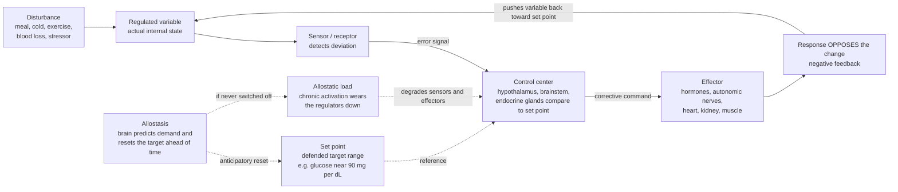

# ⚖️ Homeostasis and Human Physiology

> [!abstract] TL;DR
> **Homeostasis** is the body's active maintenance of a stable internal environment — temperature, glucose, pH, blood pressure, fluid balance — inside narrow safe ranges despite a constantly changing outside world. It runs on thousands of **negative-feedback loops** (sensor → control center → effector) coordinated by the nervous and endocrine systems. Viewed through a health lens, **health is robust regulation** and most chronic disease is **regulation failing**: diabetes is a broken glucose loop, hypertension a broken pressure loop, chronic stress an over-taxed one. **Allostasis** (stability *through* change) and its cost, **allostatic load**, explain why sustained stress erodes the very controllers that keep you alive, and why **aging is the progressive loss of homeostatic reserve** — the shrinking margin between "coping" and "failing."

---

## Intuition

**Analogy — the body as a smart, thermostat-rich building.** Picture a large building that must hold its lobby at a comfortable temperature, its water tanks at a safe pressure, its air at the right oxygen level, and its backup batteries charged — all while the weather outside swings from a blizzard to a heatwave and crowds pour in and out. It does this with hundreds of independent control loops: thermostats, pressure valves, CO₂ sensors, float switches. Each has a **target value** (a set point), a **sensor** watching the real value, a **controller** comparing the two, and **machinery** (heaters, pumps, vents) that pushes the value back toward target whenever it drifts. No single reading is ever perfectly constant — each hovers in a tight band, always being nudged back.

Your body is that building, but far smarter. It doesn't merely *react* once a room gets cold — a good building manager turns the heat up *before* the morning rush, anticipating demand. That anticipatory, brain-driven resetting of targets is **allostasis**. And just as constantly running the machinery at full tilt wears out the pumps, chronically firing your stress systems wears out *your* regulators — the wear-and-tear bill is **allostatic load**. When a building's systems degrade, it copes fine on mild days but fails in extremes; an old, worn body is the same. That fading safety margin is the physiology of **aging and frailty**.

> This note is the *applied-health* view of regulation. For the underlying cellular and neural mechanics (action potentials, the reflex arc, hormone-receptor detail), see [[Homeostasis_and_the_Nervous_System]] and [[The_Endocrine_System_and_Hormones]]; this note builds on them toward disease, stress, and longevity.

---

## How It Works

### The idea, historically

Claude **Bernard** (1865) observed that complex animals create a stable *milieu intérieur* — an internal sea of blood and interstitial fluid — that buffers their cells from the outside world, and that "the constancy of the internal environment is the condition for a free and independent life." Walter **Cannon** (1926, 1932) named this active constancy **homeostasis** (Greek *homoios*, "similar" + *stasis*, "standing"), stressing that it is not passive stillness but a *dynamic, energy-consuming balancing act*. Both intuitions are pure **systems thinking**: the body is a mesh of balancing feedback loops (see [[Feedback_Loops_and_Causality]]).

### The universal control loop

Every homeostatic variable is held by the same four-part loop, and the defining feature is that the **response opposes the disturbance** — that is what makes the feedback *negative* and the system self-correcting:

1. **Set point / reference** — the target value (or, more accurately, an acceptable *range*) the system defends.
2. **Sensor / receptor** — detects the current value and its deviation from target (thermoreceptors, baroreceptors, chemoreceptors, glucose-sensing β-cells, osmoreceptors).
3. **Control center (integrator)** — compares actual to set point and computes a corrective command (hypothalamus, brainstem medulla, endocrine glands).
4. **Effector** — executes the correction (hormones, autonomic nerves, sweat glands, kidney, heart, skeletal and smooth muscle).

The correction changes the variable, the sensor re-reads it, and the loop closes. **Positive feedback** is the rare exception — it *amplifies* change toward a decisive endpoint rather than defending a steady state — reserved for events that must go to completion: **childbirth** (oxytocin → contractions → more oxytocin), **blood clotting** (platelets recruit platelets), the action-potential upstroke, and ovulation's LH surge.

### The major regulated variables (the panel of loops)

| Variable | Normal range | Key sensors | Main effectors / controllers | Failure looks like |
|---|---|---|---|---|
| **Blood glucose** | ~70–140 mg/dL | Pancreatic α/β-cells | Insulin (lowers), glucagon (raises) | Diabetes, reactive hypoglycemia |
| **Core temperature** | ~36.5–37.5 °C | Skin + hypothalamic thermoreceptors | Sweat, vasomotor tone, shivering, thyroid | Heatstroke, hypothermia |
| **Blood pressure** | ~90/60–120/80 | Baroreceptors (carotid, aortic) | Autonomic tone, heart, vessels, RAAS, kidney | Hypertension, shock, syncope |
| **Blood pH** | 7.35–7.45 | Central + peripheral chemoreceptors | Ventilation (fast), kidney HCO₃⁻ (slow), buffers | Acidosis, alkalosis |
| **Fluid / osmolality** | ~275–295 mOsm/kg | Hypothalamic osmoreceptors | ADH, thirst, kidney, aldosterone | Dehydration, hyponatremia, edema |
| **Blood calcium** | ~8.5–10.5 mg/dL | Parathyroid chief cells | PTH, calcitonin, vitamin D, bone, gut, kidney | Tetany, arrhythmia, bone loss |

Note the recurring pattern: a **fast neural arm** (autonomic reflexes, seconds) layered over a **slow endocrine arm** (hormones, minutes to days), often with **antagonistic pairs** (insulin/glucagon, PTH/calcitonin, sympathetic/parasympathetic) that let the body correct in *both* directions.

### The integrating systems

Two control networks run the whole panel:

- **Nervous system** — fast, electrical, targeted. The **autonomic nervous system** (see [[Autonomic_Nervous_System]]) tunes heart rate, vessel diameter, gut, and glands continuously via its **sympathetic** ("mobilize") and **parasympathetic** ("restore") arms. The **hypothalamus** is the master homeostat, sitting at the junction of nerves and hormones.
- **Endocrine system** — slower, chemical, broadcast. The **HPA axis** (hypothalamus → pituitary ACTH → adrenal cortisol) is the central stress-and-metabolism controller; cortisol mobilizes glucose, modulates immunity, and — critically — feeds back to shut its own axis off. Losing that negative feedback (chronic stress) is where regulation starts to fail.

### Allostasis and allostatic load — regulation under chronic demand

Classic homeostasis defends a *fixed* set point reactively. **Allostasis** (Sterling & Eyer, 1988; McEwen, 1998) adds that the brain *predicts* upcoming demand and **resets set points in advance** — raising blood pressure before you stand or exercise, raising glucose before a stressor. This is efficient and adaptive *in bursts*. But if the stressor never ends — chronic psychological stress, poor sleep, constant caloric excess — the mediators (cortisol, catecholamines, inflammatory cytokines) stay switched on. The cumulative physiological cost of running the regulators too hard, too long, without recovery is **allostatic load**, and when it exhausts the system, **allostatic overload**: hypertension becomes fixed, glucose control degrades, immune regulation and mood systems fray. This is the mechanistic bridge from *stress* to *disease*.



*Read the solid loop as classic homeostasis: a disturbance moves the variable, the sensor reports the error to the control center, which commands effectors whose response pushes the variable back. The dashed additions are the health-critical layer: the brain resets the target in advance (allostasis), and if that anticipatory activation never resolves, the accumulated wear (allostatic load) degrades the loop itself.*

### The control-theory view of physiology

Physiology *is* closed-loop control (see [[Cybernetics_and_Control]] and [[State_Feedback_Control]]). Every regulated variable has a **set point (reference)**, an **error**, a **controller gain** (how hard the body corrects per unit error — think insulin sensitivity, baroreflex sensitivity), and **loop delays** (hormone secretion and action lags). This framing makes disease legible:

- **Low controller gain** (e.g. insulin resistance, blunted baroreflex) → large, slow excursions; the variable overshoots its safe range and drifts back sluggishly.
- **Long delays plus high gain** → **overshoot and oscillation** (the same instability that makes an over-eager thermostat "hunt"; see [[Stability_Frequency_Response]]).
- **Loss of a sensor or effector** (β-cell death in type 1 diabetes) → the loop is simply open on one side; the variable is no longer defended.

### Circadian rhythm as a temporal homeostat

Not every variable is held *flat*; some are held on a *schedule*. The **circadian clock** (a hypothalamic master oscillator, the SCN, entrained by light) is a **feed-forward temporal homeostat** that pre-positions physiology for day versus night: cortisol peaks near waking, core temperature and blood pressure dip at night, melatonin rises in darkness, and glucose tolerance is best in the morning. Health depends on defending the *right value at the right time*. **Circadian disruption** (shift work, jet lag, late-night eating, light at night) is homeostatic mistiming — and it independently raises risk of metabolic disease, hypertension, and mood disorders (see [[Sleep_and_Circadian_Rhythms]]).

---

## Key Concepts

### Secondary (intuitive)

- **Homeostasis** = your body keeping its "inside" steady (warm, watered, fueled, balanced) no matter what the outside does.
- **Negative feedback** = if something drifts too high, the body pushes it down; too low, it pushes it up. A thermostat, but biological.
- **Set point** = the target the body defends, like 37 °C for temperature — it wobbles gently around this, never dead-still.
- **Allostasis** = the brain planning ahead — turning systems up *before* you need them (heart racing at the start line).
- **Health vs disease** = health is the loops working; many chronic diseases are a loop that has broken or been overworked.

### Undergraduate (formal)

- **The four-component loop:** stimulus → **receptor** → **control center** (holds set point, computes error) → **effector** → response that opposes the stimulus.
- **Negative vs positive feedback:** negative *reduces* deviation (stability, the vast majority); positive *amplifies* it to an endpoint (childbirth, clotting, ovulatory LH surge).
- **Antagonistic control:** bidirectional correction via opposing effectors — insulin/glucagon for glucose, PTH/calcitonin for calcium, sympathetic/parasympathetic for cardiovascular tone.
- **Two-arm integration:** fast **neural** (autonomic reflex, seconds) + slow **endocrine** (hormones, minutes–days), unified at the **hypothalamus**; the **HPA axis** as the master stress/metabolic controller with cortisol self-feedback.
- **Allostasis / allostatic load:** predictive set-point regulation and its cumulative physiological cost; overload as the path from chronic stress to pathology.

### Graduate (dynamics, systems & clinical)

- **Physiology as feedback control:** each loop as reference − sensor − comparator − controller (gain $K$) − plant, with transport/secretion **delays** $\tau$. Stability depends on loop gain and phase margin; excessive gain plus delay crosses a stability margin into **sustained oscillation** (ultradian insulin–glucose oscillations, Cheyne–Stokes breathing, Mackey–Glass dynamics).
- **Set-point resetting vs rheostasis:** fever is a *regulated* upward shift of the thermal set point (not a control failure); hypertension can be a reset baroreflex operating point. Disease is often a *shifted* set point, not merely a *missed* one.
- **Homeostatic reserve & the loss-of-complexity theory of aging:** healthy regulation shows rich, fractal, multi-scale variability (e.g. high heart-rate variability); aging and disease bring **loss of complexity** and narrowed reserve (Lipsitz & Goldberger). **Frailty** is quantifiable depletion of reserve across systems — small perturbations now cause disproportionate, cascading failures (a loss of [[Resilience_and_Robustness]]).
- **Inflammation as a regulated variable:** Kotas & Medzhitov reframe many chronic diseases (obesity, type 2 diabetes, atherosclerosis) as **failures of homeostasis** in which control systems settle into a maladaptive stable state — a pathological set point the body now defends *against* correction.

---

## Python Demo

```python
# Blood-glucose homeostasis modeled as a DELAYED NEGATIVE-FEEDBACK control loop.
#   Plant      : glucose pool G(t), disturbed by a meal (rate of appearance d(t))
#   Controller : insulin acts as a PI controller that removes glucose; its
#                strength is scaled by insulin SENSITIVITY s (the loop gain).
#   Counter-reg: glucose effectiveness kg restores G toward the set point from
#                either side (glucagon / hepatic output when low, mass-action when high).
#
# Health   -> high sensitivity  -> tight, fast return to the set point.
# Disease  -> insulin resistance = low sensitivity (weak controller) -> the
#             variable OVERSHOOTS its safe range and DRIFTS back slowly:
#             disease as a failure of homeostatic control.
import numpy as np
import matplotlib.pyplot as plt

dt   = 0.5                 # min
T    = 300.0               # min
n    = int(T / dt)
t    = np.linspace(0, T, n)

Gset = 90.0                # defended set point, mg/dL
kg   = 0.010               # glucose effectiveness (insulin-independent restoring force)
Kp   = 0.050               # proportional insulin gain (nominal / healthy)
Ki   = 0.0009              # integral insulin gain     (nominal / healthy)
delay_min = 8.0            # insulin secretion + action lag
lag  = int(delay_min / dt)

def meal(tt, t0=30.0, load=3.0, tau=35.0):
    # glucose rate of appearance after a meal, mg/dL per min (a decaying pulse)
    return np.where(tt >= t0, load * np.exp(-(tt - t0) / tau), 0.0)

d = meal(t)

def simulate(sensitivity):
    """sensitivity = 1.0 healthy; < 1 = insulin resistance (weaker feedback)."""
    G = np.full(n, Gset)     # blood glucose
    I = np.zeros(n)          # integral of the error (insulin 'memory')
    u = np.zeros(n)          # insulin-driven glucose removal (controller effort)
    for i in range(n - 1):
        e = G[i] - Gset                       # current error (signed)
        I[i + 1] = I[i] + e * dt              # integral unwinds when G dips below set
        j = i - lag                           # controller acts on DELAYED information
        e_del = (G[j] - Gset) if j >= 0 else 0.0
        I_del = I[j] if j >= 0 else 0.0
        u[i] = max(sensitivity * (Kp * e_del + Ki * I_del), 0.0)  # insulin >= 0
        dG = d[i] - u[i] - kg * (G[i] - Gset)                     # net glucose flux
        G[i + 1] = G[i] + dG * dt
    return G

G_health = simulate(sensitivity=1.00)   # normal insulin sensitivity
G_resist = simulate(sensitivity=0.35)   # insulin resistance: weak controller

fig, ax = plt.subplots(figsize=(10, 5))
ax.axhspan(70, 140, color="#2ecc71", alpha=0.10, label="Healthy range (70-140)")
ax.axhline(Gset, color="grey", ls="--", lw=1, label="Set point (90 mg/dL)")
ax.plot(t, G_health, color="#27AE60", lw=2.2,
        label="Healthy: strong negative feedback -> quick return")
ax.plot(t, G_resist, color="#C0392B", lw=2.2,
        label="Insulin resistance: weak feedback -> overshoot & drift")
ax.axvline(30, color="black", ls=":", lw=1)
ax.text(31, 205, "meal", fontsize=9)
ax.set_xlabel("Time after meal (min)")
ax.set_ylabel("Blood glucose (mg/dL)")
ax.set_title("Blood glucose as a negative-feedback homeostat: health vs regulatory failure")
ax.legend(loc="upper right", fontsize=9)
ax.grid(alpha=0.3)
plt.tight_layout()
plt.show()

print(f"Healthy   -> peak {G_health.max():6.1f} mg/dL, end {G_health[-1]:6.1f} mg/dL")
print(f"Resistant -> peak {G_resist.max():6.1f} mg/dL, end {G_resist[-1]:6.1f} mg/dL")
```

**What you see.** The green (healthy) curve rises modestly after the meal and is driven promptly back to ~90 mg/dL — a well-damped negative-feedback loop. The red (insulin-resistant) curve, with the *same* meal but a weaker controller, **spikes far above the safe range and returns sluggishly**, because low loop gain cannot cancel the disturbance quickly; the delayed integral action can then over-correct into a late dip (reactive hypoglycemia). This is the control-theory picture of disease: not a new kind of physics, just a **degraded feedback loop** — lower gain, longer effective delay, narrowed reserve. The identical framing describes a blunted **baroreflex** in hypertension or an over-damped thermal response in the frail elderly.

---

## Real-World Applications

- **Continuous glucose monitors + insulin pumps (the "artificial pancreas").** Closed-loop devices literally *replace a broken homeostatic loop*: a CGM is the sensor, a control algorithm is the control center, and the pump is the effector — engineering the exact loop this note describes.
- **Vital signs as loop-health readouts.** Clinicians read blood pressure, temperature, respiratory rate, and **heart-rate variability** as windows onto how well the autonomic loops are regulating; falling HRV signals shrinking reserve.
- **Stress, sleep, and metabolic health.** Interventions that lower **allostatic load** — sleep, exercise, stress reduction — work by giving over-driven HPA and autonomic loops time to reset, improving glucose and blood-pressure regulation.
- **Frailty screening in geriatrics.** Frailty indices quantify **loss of homeostatic reserve**; a "frail" patient tolerates surgery, infection, or dehydration poorly because multiple loops have little margin left.
- **Fluid, electrolyte, and acid-base management.** ICU and dialysis medicine is applied homeostasis — externally supporting osmoregulation, pH, and volume loops the body can no longer defend.
- **Circadian medicine / chronotherapy.** Timing meals, light, and drugs to the body's temporal homeostat improves outcomes in metabolic and cardiovascular disease.

---

## Common Pitfalls

- **"Homeostasis means perfectly constant."** No — every defended variable *oscillates* within a range; the loop is always correcting, never frozen. Loss of that healthy variability (e.g. flat heart rate) is a *bad* sign, not a good one.
- **Confusing a shifted set point with a control failure.** Fever, adaptive blood-pressure resetting, and altitude acclimatization are *regulated changes*, not breakdowns. Treating a purposeful reset as an error (aggressively crushing a moderate fever) can be counterproductive.
- **"Positive feedback is good, negative feedback is bad."** The labels describe *direction of effect*, not desirability. Life-preserving control is overwhelmingly negative feedback; unchecked positive feedback (cytokine storm, runaway clotting) is usually dangerous.
- **Ignoring delays.** Chasing a lagged variable with an over-aggressive correction causes **overshoot and oscillation** — true for clinical dosing, thermoregulation, and glucose control alike. More correction is not always better.
- **Treating a symptom instead of the loop.** Persistently pushing one variable (a number on a chart) without addressing the loop's structure invites **policy resistance** — the body's other loops fight back. Think in loops, not single variables.
- **Forgetting reserve.** A young body compensates so well that early loop degradation is invisible until stressed. Disease often announces itself only when reserve runs out — which is why *provocation* tests (glucose tolerance, exercise stress) reveal what resting values hide.

---

## Related Concepts

- [[Homeostasis_and_the_Nervous_System]] — the cellular/neural mechanics this note assumes: action potentials, the reflex arc, and the worked thermoregulation and glucose loops.
- [[The_Endocrine_System_and_Hormones]] — the slow chemical control arm; insulin/glucagon, cortisol/HPA, PTH, ADH, and hormone-receptor detail behind the effectors here.
- [[Autonomic_Nervous_System]] — the fast sympathetic/parasympathetic controller that continuously tunes heart, vessels, glands, and gut.
- [[Feedback_Loops_and_Causality]] — the general systems-thinking grammar of balancing vs reinforcing loops, delays, and oscillation that physiology is a special case of.
- [[Cybernetics_and_Control]] — the abstract science of goal-seeking feedback systems; homeostasis is its founding biological example.
- [[State_Feedback_Control]] — the engineering formalization: gains, references, and stability margins are the quantitative version of set points and controller strength.
- [[Stability_Frequency_Response]] — why high gain plus delay pushes a corrective loop into overshoot and oscillation (physiological "hunting").
- [[Resilience_and_Robustness]] — homeostatic reserve and frailty are the health-specific face of a system's capacity to absorb perturbation.
- [[Aging_and_Regeneration]] — aging as the progressive erosion of homeostatic reserve and regenerative capacity.
- [[Sleep_and_Circadian_Rhythms]] — the temporal homeostat; circadian mistiming as a driver of metabolic and cardiovascular disease.

> Companion notes planned for this section — *Health and Wellbeing Overview* and *Metabolism and Energy Balance* — will link back here once created; they extend the glucose/energy loop and the "health as regulation" framing.

---

## Review Questions

**Secondary.** Explain, using body temperature, the four parts of a negative-feedback loop and why the response must *oppose* the disturbance. Give one everyday example where your body reset a target *in advance* (allostasis) rather than reacting after the fact.

**Undergraduate.** Blood glucose and blood calcium are both held by *antagonistic hormone pairs*. Name each pair, state which hormone raises and which lowers the variable, and explain why bidirectional (rather than one-directional) control is essential for a variable that can drift *either* too high or too low. Then contrast this with a variable defended by positive feedback and say why positive feedback is unsuitable for steady-state regulation.

**Graduate.** A patient's fasting glucose is normal but a glucose-tolerance test shows a high, prolonged excursion. Using the control-theory framing (set point, loop gain, delay, reserve), explain what this reveals that the resting value hid, why *low controller gain* produces overshoot-and-drift rather than tight regulation, and how this connects "loss of homeostatic reserve" to the clinical concept of frailty. What would you predict about this patient's heart-rate variability, and why?

---

## Sources

- Bernard, C. (1865). *Introduction à l'étude de la médecine expérimentale* (introducing the *milieu intérieur*).
- Cannon, W. B. (1932). *The Wisdom of the Body*. W. W. Norton (coining and developing "homeostasis").
- Sterling, P., & Eyer, J. (1988). "Allostasis: A New Paradigm to Explain Arousal Pathology." In *Handbook of Life Stress, Cognition and Health*. Wiley.
- McEwen, B. S. (1998). "Stress, Adaptation, and Disease: Allostasis and Allostatic Load." *Annals of the New York Academy of Sciences*, 840, 33–44.
- Lipsitz, L. A., & Goldberger, A. L. (1992). "Loss of 'Complexity' and Aging: Potential Applications of Fractals and Chaos Theory to Senescence." *JAMA*, 267(13), 1806–1809.
- Kotas, M. E., & Medzhitov, R. (2015). "Homeostasis, Inflammation, and Disease Susceptibility." *Cell*, 160(5), 816–827.

---

#health #homeostasis #physiology #feedback #allostasis
