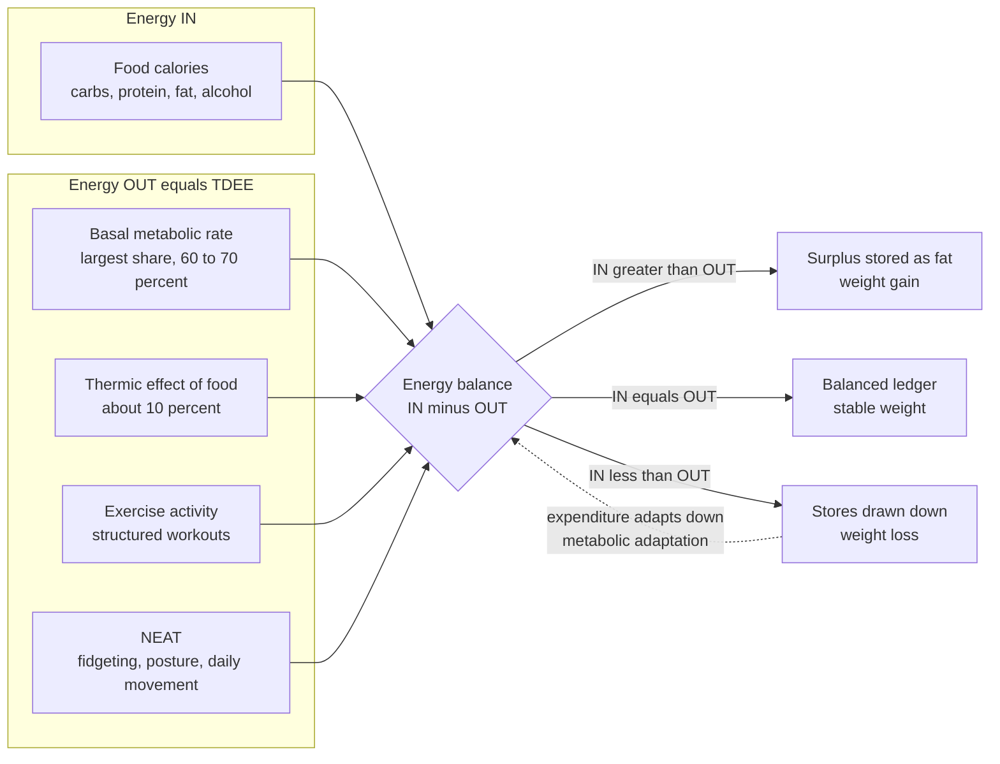

# 🔥 Metabolism and Energy Balance

> [!abstract] TL;DR
> **Metabolism** is the total set of chemical processes by which your body extracts energy from food and spends it staying alive and moving. **Energy balance** is the running ledger of energy *in* (calories from food) versus energy *out* (**total daily energy expenditure, TDEE**), whose four parts are **basal metabolic rate (BMR)** — the single biggest slice at roughly 60–70% — the **thermic effect of food (TEF)**, deliberate **exercise activity (EAT)**, and **non-exercise activity thermogenesis (NEAT)** like fidgeting and daily movement. The first law of thermodynamics guarantees that a surplus is stored and a deficit is drawn down — but the system is **dynamic and adaptive**, not a fixed calculator: expenditure itself *falls* as you lose weight and diet, which is why weight loss plateaus, why the naive "3,500 kcal per pound forever" rule is wrong, and why the body defends a **settling point**.

## Intuition — analogy first

Think of your body as a household running on a monthly energy budget. **Income** is the calories you eat; **spending** is everything the body pays for — keeping the lights on (your organs), the "transaction fee" of processing each purchase (digesting food), your gym membership (exercise), and a surprising amount of small, unconscious spending (pacing, fidgeting, standing). When income exceeds spending, the surplus goes into savings (body fat). When spending exceeds income, you dip into savings and the balance shrinks.

Here is the twist that trips up almost everyone: the household has a **smart, self-protective accountant**. The moment you cut your income (start a diet), the accountant quietly *reduces spending* — dimming the lights, cancelling small luxuries, moving less without your noticing — to defend the savings account. So the naive prediction "if I spend $500 less every month, my savings will fall by exactly $500 each month forever" is wrong. Spending drifts *down* to meet the new lower income, the account stops shrinking, and you hit a **plateau** at a new, lower equilibrium. Metabolism is that budget with an accountant who fights back against deficits.

---

## How It Works

Energy in the body obeys the **first law of thermodynamics**: energy is neither created nor destroyed, only converted or stored. The chemical energy locked in food is either (1) burned to power life, (2) lost as heat, or (3) stored — chiefly as fat, with a smaller glycogen buffer. The bookkeeping identity is:

$$\text{Energy stored} = \text{Energy in} - \text{Energy out}$$

**Energy in** comes from the macronutrients, each with a characteristic energy density (the "Atwater factors"):

| Macronutrient | Energy density | Notes |
|---|---|---|
| Carbohydrate | 4 kcal/g | Stored short-term as glycogen |
| Protein | 4 kcal/g | Highest thermic cost to process |
| Fat | 9 kcal/g | The body's dense long-term store |
| Alcohol | 7 kcal/g | Metabolised preferentially, cannot be stored as glycogen |

**Energy out (TDEE)** is the sum of four components:

1. **Basal / resting metabolic rate (BMR / RMR)** — the energy to keep you alive at complete rest: heartbeat, breathing, ion pumping, protein turnover, brain activity. This is the **largest component, ~60–70%** of TDEE, and it scales with **fat-free (lean) mass** far more than with body fat.
2. **Thermic effect of food (TEF)** — the cost of digesting, absorbing, and storing what you eat, about **10%** of intake. Protein is the most expensive to process (~20–30% of its own calories), fat the cheapest.
3. **Exercise activity thermogenesis (EAT)** — deliberate, structured movement (a run, a lift). Highly variable, but for most people a *smaller* slice than intuition suggests.
4. **Non-exercise activity thermogenesis (NEAT)** — everything else you move for: walking, posture, fidgeting, standing. NEAT can differ by **hundreds of kcal/day** between individuals and is one of the body's main hidden dials for adaptation.

The crucial subtlety: **energy out is not a constant.** As body mass falls, BMR falls (less tissue to run). And independently, dieting triggers **adaptive thermogenesis** — expenditure drops *more* than mass loss alone predicts, partly via falling **leptin** (a fat-derived hormone that signals energy stores to the brain), which increases appetite and quietly suppresses NEAT and resting metabolism. The body behaves as if defending a target fat mass.



---

## Key Concepts

### Secondary (school-level intuition)

- **Calories are a unit of energy.** A kilocalorie (kcal, the "Calorie" on food labels) is the energy to heat 1 kg of water by 1°C.
- **In vs out:** eat more energy than you burn and you store it; burn more than you eat and you lose stored energy. Simple in direction, subtle in dynamics.
- **BMR is the biggest cost.** Most of your calories are spent just *being alive*, not exercising — a common surprise.
- **Different foods pack different energy:** fat is the densest (9 kcal/g), carbs and protein less so (4 kcal/g). This is why fatty foods are "calorie-dense."
- **Exercise is a smaller slice than people think,** and you cannot reliably "out-run a bad diet" because intake is far easier to change than expenditure.

### Undergraduate (physiology and measurement)

- **Estimating BMR** — prediction equations from body size, age, and sex. The **Mifflin–St Jeor** equation (for men): `BMR = 10·weight_kg + 6.25·height_cm − 5·age + 5`; for women the constant is `−161`. Older **Harris–Benedict** equations exist but tend to overestimate.
- **TDEE = BMR × activity factor** — a physical activity level (PAL) multiplier from ~1.2 (sedentary) to ~1.9 (very active) rolls TEF, EAT, and NEAT into a single scaling of BMR.
- **Indirect calorimetry** — the gold standard for measuring metabolic rate in a lab: infer energy expenditure from **oxygen consumption (VO₂)** and **carbon-dioxide production (VCO₂)**. Their ratio, the **respiratory quotient (RQ)**, reveals *which fuel* is burning: RQ ≈ 0.7 means pure fat oxidation, RQ ≈ 1.0 means pure carbohydrate.
- **Doubly labeled water (DLW)** — the gold standard for *free-living* total expenditure over days to weeks: subjects drink water labeled with stable isotopes (²H and ¹⁸O); the different elimination rates of the two isotopes reveal CO₂ production and thus energy expenditure during normal life.
- **Fuel use:** carbohydrate is burned via [[Glycolysis]] and stored as glycogen; fat is oxidised (β-oxidation) for dense, slow energy; in prolonged fasting or very-low-carb states the liver makes **ketone bodies** (ketosis) as an alternative brain fuel. **Insulin** is the master switch that flips the body from burning to storing.
- **Metabolic flexibility** — a healthy metabolism switches fuels smoothly (fat at rest and fasting, carbohydrate at high intensity and after meals). Loss of this flexibility is an early sign of metabolic disease.

### Graduate (regulation, disease, and debate)

- **Adaptive thermogenesis / metabolic adaptation** — during energy restriction, measured expenditure falls *below* what the new (lower) body mass predicts, sometimes by 10–15%. This adaptation can **persist for years** even after weight regain (documented in *The Biggest Loser* follow-up), making weight loss maintenance biologically uphill.
- **Settling-point / defended-mass models** — rather than a rigid "set point," energy stores settle where multiple feedback loops balance. **Leptin** is central: as fat mass and leptin fall, the hypothalamus responds as if starving — raising appetite and hunger drive, lowering NEAT and thyroid-mediated resting metabolism. This is the mechanistic root of **weight regain**.
- **The "a calorie is a calorie" debate** — the **energy balance model** holds that total energy in vs out is what ultimately drives fat mass, and that macronutrients matter mainly through their effects on satiety, TEF, and adherence. The competing **carbohydrate–insulin model** argues that refined carbohydrates drive insulin, which partitions energy into fat and *causes* overeating. Current evidence broadly supports thermodynamics governing the *total*, while composition and hormones strongly shape *appetite, adherence, and body composition*.
- **Metabolic health and its disorders** — chronic energy surplus and ectopic fat drive **insulin resistance**, the shared root of **metabolic syndrome** (central obesity, hypertension, dyslipidemia, hyperglycemia), **type 2 diabetes**, and much cardiovascular and hepatic disease. Metabolic dysfunction is a central driver of chronic, age-related illness.
- **Metabolic rate and aging** — contrary to folklore, large-cohort DLW data show total and basal expenditure per kg of lean mass are remarkably stable from ~20 to ~60, then decline. Age-related weight gain owes more to falling activity and loss of lean mass (**sarcopenia**) than to an intrinsic "slowing metabolism" in midlife.

---

## Python Demo

This models body-weight dynamics under a diet three ways and shows why the naive static rule fails. The **naive "3,500 kcal per pound"** model freezes expenditure at baseline and therefore predicts weight falling *linearly forever*. A **dynamic mass-only** model lets expenditure fall as weight falls, producing a plateau. Adding **metabolic adaptation** (expenditure suppressed further while dieting) raises the plateau — the body defends more weight.

```python
# Dynamic energy-balance model: why weight loss plateaus at constant intake.
# Compares (1) naive static "3500 rule", (2) mass-dependent expenditure,
# (3) mass-dependent expenditure + metabolic adaptation.
import numpy as np
import matplotlib.pyplot as plt

# --- Model constants -------------------------------------------------
RHO        = 7700.0   # kcal to change 1 kg of body mass (~3500 kcal/lb)
K          = 30.0     # kcal/kg/day: expenditure scales with body mass (TDEE per kg)
TAU        = 20.0     # days: time constant over which adaptation develops
ADAPT_GAIN = 0.45     # how strongly metabolism adapts per unit of intake cut
ADAPT_CAP  = 0.20     # ceiling on fractional adaptive thermogenesis (20%)

# --- Scenario --------------------------------------------------------
W0      = 100.0        # starting weight (kg)
I_MAINT = K * W0       # maintenance intake at start = 3000 kcal/day
I_DIET  = 2000.0       # new constant intake during the diet (kcal/day)
DAYS    = 540
dt      = 1.0

# Size of the imposed intake cut drives how much the metabolism adapts.
cut_fraction = max(0.0, (I_MAINT - I_DIET) / I_MAINT)
a_final = min(ADAPT_CAP, ADAPT_GAIN * cut_fraction)

t = np.arange(0.0, DAYS + dt, dt)
n = len(t)

W_naive = np.zeros(n)   # static: expenditure frozen at baseline
W_mass  = np.zeros(n)   # dynamic: expenditure falls as mass falls
W_adapt = np.zeros(n)   # dynamic + metabolic adaptation
E_adapt = np.zeros(n)   # expenditure trajectory of the adaptive model
a = 0.0                 # current adaptation fraction

W_naive[0] = W_mass[0] = W_adapt[0] = W0
E_adapt[0] = K * W0

for i in range(1, n):
    # 1) Naive static model: expenditure never changes from baseline.
    W_naive[i] = W_naive[i-1] + dt * (I_DIET - I_MAINT) / RHO

    # 2) Dynamic mass-only: expenditure = K * current weight.
    E_m = K * W_mass[i-1]
    W_mass[i] = W_mass[i-1] + dt * (I_DIET - E_m) / RHO

    # 3) Dynamic + adaptation: fraction 'a' relaxes toward a_final over TAU days.
    a += dt * (a_final - a) / TAU
    E_a = K * W_adapt[i-1] * (1.0 - a)
    W_adapt[i] = W_adapt[i-1] + dt * (I_DIET - E_a) / RHO
    E_adapt[i] = E_a

# Analytic plateaus (where intake equals expenditure).
W_eq_mass  = I_DIET / K
W_eq_adapt = I_DIET / (K * (1.0 - a_final))

print(f"Intake cut: {cut_fraction*100:.0f}%  ->  adaptation a_final = {a_final*100:.1f}%")
print(f"Plateau, mass-only      : {W_eq_mass:5.1f} kg")
print(f"Plateau, with adaptation: {W_eq_adapt:5.1f} kg")
print(f"Naive rule at day {DAYS}: {W_naive[-1]:5.1f} kg  (keeps falling, never plateaus)")

# --- Plot ------------------------------------------------------------
fig, (ax1, ax2) = plt.subplots(2, 1, figsize=(9, 8), sharex=True)

ax1.plot(t, W_naive, '--', color='crimson',   label='Naive static "3500 kcal/lb forever"')
ax1.plot(t, W_mass,        color='steelblue',  label='Dynamic: expenditure falls with mass')
ax1.plot(t, W_adapt, lw=2,  color='seagreen',   label='Dynamic + metabolic adaptation')
ax1.axhline(W_eq_mass,  color='steelblue', ls=':', alpha=0.6)
ax1.axhline(W_eq_adapt, color='seagreen',  ls=':', alpha=0.6)
ax1.set_ylabel('Body weight (kg)')
ax1.set_title('Why weight loss plateaus at constant intake (2000 kcal/day)')
ax1.legend(loc='upper right', fontsize=9)
ax1.grid(alpha=0.3)

ax2.plot(t, E_adapt, lw=2, color='seagreen', label='Total expenditure (adaptive model)')
ax2.axhline(I_DIET,  color='black',   ls='--', label='Intake = 2000 kcal/day')
ax2.axhline(I_MAINT, color='crimson', ls=':',  label='Frozen expenditure (naive model)')
ax2.set_xlabel('Day')
ax2.set_ylabel('Energy (kcal/day)')
ax2.set_title('Expenditure falls to meet intake -> new equilibrium (plateau)')
ax2.legend(loc='upper right', fontsize=9)
ax2.grid(alpha=0.3)

plt.tight_layout()
plt.show()
```

**What it shows.** The naive model marches down at a fixed −0.13 kg/day and would drive weight absurdly to zero — the "3,500-rule extrapolated forever" fallacy. The dynamic models instead **decelerate and plateau**, because expenditure (bottom panel) glides down until it meets the 2,000 kcal intake, at which point energy balance closes and weight stops changing. Metabolic adaptation shifts the plateau *higher* (from ~66.7 kg to ~78.4 kg): by suppressing metabolism, the body preserves more mass. Same intake, different endpoint — the ledger is dynamic, not static.

---

## Real-World Applications

- **Clinical nutrition & weight management** — TDEE estimates set calorie targets for weight loss, maintenance, or clinical refeeding; understanding adaptation reframes plateaus as *expected physiology*, not failure, and motivates strategies like diet breaks and resistance training to protect lean mass and BMR.
- **Sports & performance nutrition** — athletes match intake to very high TDEE, periodise carbohydrate around training, and monitor RQ / fuel use; chronic under-fueling ("Relative Energy Deficiency in Sport") suppresses metabolism, hormones, and bone health.
- **Obesity and type 2 diabetes medicine** — the mismatch between naive expectations and adaptive biology explains why lifestyle-only weight loss so often regains, and underpins the rationale for GLP-1 drugs, bariatric surgery, and structured maintenance programs.
- **Metabolic monitoring & research** — indirect calorimetry guides ventilated ICU feeding; doubly labeled water is the reference standard behind national dietary energy requirements and studies of aging metabolism.
- **Public health and aging / longevity** — because chronic energy surplus and insulin resistance sit at the root of much cardiometabolic disease, energy balance is a central lever in preventing the diseases of aging (see [[Aging_and_Regeneration]]).

---

## Common Pitfalls

- **Treating the body as a static calculator.** "Cut 500 kcal/day and lose 1 lb/week indefinitely" ignores that expenditure falls as you shrink and adapt. Deficits erode over time; plateaus are built into the physiology.
- **Overestimating exercise, underestimating NEAT and intake.** People credit workouts with huge calorie burns, eat more to compensate, and unconsciously move less afterward (activity compensation), erasing the deficit.
- **Confusing "starvation mode" myths with real adaptation.** Adaptive thermogenesis is real but modest (typically 10–15%); metabolism does not "shut down" so that you gain weight while eating almost nothing. The direction of the effect is a *slower* deficit, not reversal of thermodynamics.
- **Ignoring lean mass.** BMR tracks fat-free mass. Crash diets that burn muscle lower BMR and worsen the plateau; resistance training and adequate protein defend it.
- **"Metabolism crashes in your 30s."** Large DLW cohorts show per-kg expenditure is stable through midlife; midlife weight gain is mostly less movement and lost muscle, not an intrinsically slowed engine.
- **Over-trusting BMR equations.** Mifflin–St Jeor and friends have ±10–20% error for a given person; they are starting estimates to be adjusted from real-world weight trends.

---

## Related Concepts

- [[Bioenergetics_and_ATP]] — the cellular currency underneath all metabolism; energy balance is this bookkeeping scaled to the whole organism.
- [[Glycolysis]] — the pathway that burns glucose; central to carbohydrate fuel use and metabolic flexibility.
- [[Oxidative_Phosphorylation]] — where the bulk of ATP (and heat) is generated; the mitochondrial engine behind BMR.
- [[Carbohydrates_and_Lipids]] — the macronutrient chemistry that sets energy densities (4 vs 9 kcal/g) and storage forms (glycogen vs fat).
- [[The_Endocrine_System_and_Hormones]] — insulin, leptin, thyroid hormones, and cortisol are the signals that regulate storage, appetite, and metabolic rate.
- [[Homeostasis_and_the_Nervous_System]] — the hypothalamic feedback loops that defend a settling point and drive metabolic adaptation.
- [[The_Digestive_and_Excretory_Systems]] — where food energy is actually extracted and absorbed, setting the "energy in" side of the ledger.
- [[Aging_and_Regeneration]] — links metabolic dysfunction and insulin resistance to the biology of aging and chronic disease.

---

## Review Questions

1. **(Secondary)** Name the four components of total daily energy expenditure and state which is the largest. Why can it be misleading to think of exercise as the main way to "burn calories"?
2. **(Undergraduate)** A lab measures a subject's respiratory quotient at 0.75 after an overnight fast and 0.95 shortly after a carbohydrate meal. What does each value tell you about the fuel being oxidised, and what property of a healthy metabolism does the shift between them demonstrate? How would indirect calorimetry and doubly labeled water differ in what they measure?
3. **(Graduate)** A person loses 20 kg on a diet and hits a plateau despite eating in what was originally a deficit. Using metabolic adaptation, leptin signaling, and the settling-point concept, explain both the plateau and the high risk of regain. How does this critique the static "3,500 kcal per pound" rule, and where does the "a calorie is a calorie" debate remain valid versus incomplete?

---

## Sources

- Hall, K.D., et al. (2012). "Energy balance and its components: implications for body weight regulation." *American Journal of Clinical Nutrition*, 95(4), 989–994. — [PubMed](https://pubmed.ncbi.nlm.nih.gov/22434603/)
- Fothergill, E., et al. (2016). "Persistent metabolic adaptation 6 years after *The Biggest Loser* competition." *Obesity*, 24(8), 1612–1619. — [PubMed](https://pubmed.ncbi.nlm.nih.gov/27136388/)
- Rosenbaum, M. & Leibel, R.L. (2010). "Adaptive thermogenesis in humans." *International Journal of Obesity*, 34(S1), S47–S55. — [PubMed](https://pubmed.ncbi.nlm.nih.gov/20935667/)
- Levine, J.A. (2002). "Non-exercise activity thermogenesis (NEAT)." *Best Practice & Research Clinical Endocrinology & Metabolism*, 16(4), 679–702. — [PubMed](https://pubmed.ncbi.nlm.nih.gov/12468415/)
- Mifflin, M.D., et al. (1990). "A new predictive equation for resting energy expenditure in healthy individuals." *American Journal of Clinical Nutrition*, 51(2), 241–247. — [PubMed](https://pubmed.ncbi.nlm.nih.gov/2305711/)

---

#health #metabolism #energy-balance #basal-metabolic-rate #weight-regulation
