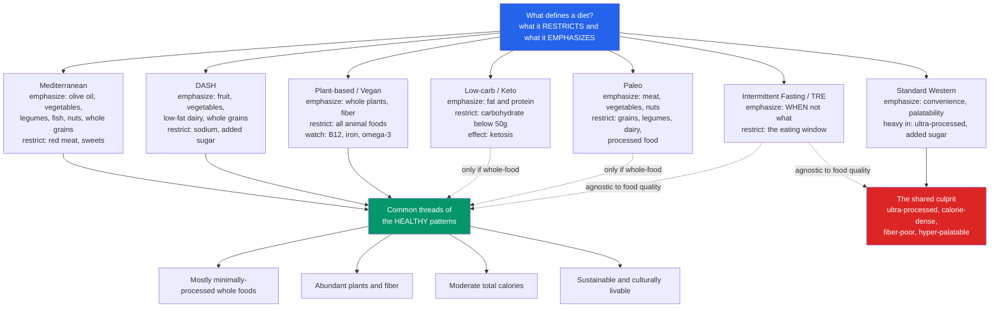

# 🥗 Dietary Patterns and Popular Diets

> [!abstract] TL;DR
> Modern nutrition science has shifted from arguing about single nutrients ("is fat bad? is sugar bad?") to judging **whole dietary patterns** — because you eat *meals and habits*, not isolated molecules. The patterns with the strongest evidence for living longer and better — the **Mediterranean diet** (the PREDIMED trial), the **DASH diet** for blood pressure, and largely **plant-forward, whole-food** patterns (the Blue Zones) — differ in their branding but **rhyme in their substance**: lots of plants and fiber, minimally processed food, and moderate total calories. The most robust, uncomfortable finding across head-to-head trials is that **adherence and overall diet quality matter more than the specific named diet**: almost any diet produces short-term weight loss, and most fail long-term for the same reason — people stop following them. The clearest single culprit that unifies the "bad" patterns is **ultra-processed food**. Everything else — keto vs low-fat, paleo vs vegan, fasting windows, personalized glycemic-response apps — is a second-order debate layered on top of those first principles.

## Intuition

**Analogy: you don't eat nutrients — you eat meals, and a diet is a whole song, not a single note.** Judging a way of eating by one nutrient ("saturated fat," "carbs," "cholesterol") is like judging a song by one note. A note is neither good nor bad in isolation; it only means something inside a melody, a rhythm, and a key. Saturated fat inside a burger-and-soda meal behaves nothing like the fat inside olive oil eaten with vegetables and legumes, because the *rest of the composition* — the fiber, the polyphenols, the absence of refined starch, the total calories, the eating pace — changes what that one note does.

For fifty years, nutrition advice lurched from one villain note to the next. The low-fat era of the 1980s and 90s demonized fat, so the food industry stripped fat out and replaced it with sugar and refined starch — and metabolic disease got worse, not better. Then the pendulum swung to blaming carbohydrate. Both crusades failed for the same reason: **a real diet is a chord of thousands of compounds eaten in combination, three times a day, for decades.** The unit that actually predicts your health is not the nutrient. It is the *pattern* — the repeated, sustainable composition of your plate over years. That single reframing organizes everything below.

---

## How It Works

### Core Mechanics

**1. The shift from nutrients to patterns (nutritional reductionism and why it failed).** Early nutrition science was necessarily reductionist: it discovered that scurvy is vitamin C deficiency, that too much sodium raises blood pressure. That success bred over-reach — the belief that health could be engineered by adding or subtracting one nutrient at a time. It could not. Foods contain hundreds of interacting compounds inside a physical **food matrix**, and nutrients eaten together behave differently than in isolation (the "food synergy" idea). Modern nutritional epidemiology therefore studies **dietary patterns** and scores diets with indices like the **Healthy Eating Index (HEI)**, the **Alternative Healthy Eating Index (AHEI)**, and the **Mediterranean Diet Score** rather than tallying single nutrients. This is the reigning consensus and the entry point for the rest of this Nutrition Science section.

**2. The evidence-backed patterns.**
- **Mediterranean diet.** The pattern with the most robust evidence for cardiovascular and all-cause benefit: abundant vegetables, fruit, legumes, nuts, whole grains, fish, and **olive oil as the primary fat**, with modest red meat and sweets. The landmark **PREDIMED** randomized trial (Spain) found that a Mediterranean diet supplemented with extra-virgin olive oil or nuts reduced major cardiovascular events versus a control low-fat diet in high-risk adults — one of the few *randomized* dietary results, not merely observational.
- **DASH (Dietary Approaches to Stop Hypertension).** Engineered specifically to lower **blood pressure**: rich in fruit, vegetables, low-fat dairy, and whole grains, deliberately low in sodium, added sugar, and saturated fat. In controlled feeding trials it lowers blood pressure within weeks, with effects comparable to a single antihypertensive medication in some patients.
- **Plant-forward / whole-food patterns and the Blue Zones.** Observational study of the world's longest-lived populations (Okinawa, Sardinia, Ikaria, Loma Linda, Nicoya) finds diets that are **mostly but not strictly plant-based**, high in legumes and vegetables, low in processed food and meat, with moderate calories — one thread in a broader lifestyle package of constant natural movement, social ties, and purpose (see [[Aging_and_Regeneration]] for the longevity biology beneath this).

**3. The common threads.** Strip away the branding and the healthy patterns converge on the same four principles, often summarized as Michael Pollan's "eat food, not too much, mostly plants":
- **Mostly minimally-processed whole foods.**
- **Abundant plants and fiber.**
- **Moderate total calories** (energy balance still governs body weight — see [[Metabolism_and_Bioenergetics]]).
- **Sustainable and culturally livable** — a diet you can eat for life, not for twelve weeks.

**4. The popular diets, analyzed even-handedly.**
- **Low-carbohydrate and ketogenic.** Restricting carbohydrate (keto pushes below roughly 50 g/day) shifts the body into **ketosis**, burning fat-derived ketone bodies. Real short-term effects are genuine: rapid initial weight loss (partly water/glycogen), improved glycemic control and triglycerides. It has a *proven* medical use in **drug-resistant pediatric epilepsy** and growing evidence for **type 2 diabetes management and remission**. The open debates are **long-term adherence** (very hard to sustain), **cardiovascular safety** (depends heavily on whether it is whole-food keto or bacon-and-butter keto), and whether benefits exceed those of any calorie-matched diet.
- **Low-fat.** The dominant guidance of the 1980s-90s. Works when it means whole grains, legumes, and vegetables; backfires when "low-fat" became a marketing label on sugar-laden processed products.
- **Plant-based / vegetarian / vegan.** Strong evidence for lower cardiovascular risk, lower body weight, and better glycemic profiles — but requires attention to nutrient adequacy: **vitamin B12 (must be supplemented on a vegan diet), iron, zinc, omega-3, and vitamin D** are the classic gaps (the micronutrient caveats covered in this section's micronutrients note).
- **Paleo.** Emphasizes meat, vegetables, nuts, and fruit; excludes grains, legumes, dairy, and processed food. The "ancestral" rationale is historically shaky, but by cutting ultra-processed food it often improves diet quality. Weak long-term evidence.
- **Carnivore.** Animal foods only. Essentially zero long-term evidence; nutritionally extreme; anecdote-driven.
- **Whole30 / elimination fads.** The 30-day-reset end of the spectrum — a short, restrictive protocol that resets habits and cuts processed food, but is explicitly not a long-term pattern.

**5. Intermittent fasting (IF) and time-restricted eating (TRE).** These specify **when** you eat, not what: alternate-day fasting, 5:2, or an 8-hour daily eating window. The central scientific question is whether IF is *anything more than* a convenient way to eat fewer total calories. Proposed extra mechanisms — **autophagy** (cellular self-cleaning), improved insulin sensitivity, and alignment with **circadian** metabolism (see [[Sleep_and_Circadian_Rhythms]]) — connect to the same nutrient-sensing pathways (mTOR, AMPK) implicated in caloric restriction and longevity (see [[Aging_and_Regeneration]]). The honest evidence state: IF reliably works for weight loss, but most controlled trials find it **roughly equivalent to continuous calorie restriction** — meal timing may add a modest, still-debated edge.

**6. Adherence beats the specific diet.** Head-to-head randomized trials (e.g., the A-TO-Z and **DIETFITS** trials) repeatedly find **little to no difference in long-term weight loss between named diets** — what predicts success is how well a person *sticks to* the plan and their overall **dietary quality**. This is why almost any diet "works" short-term (a novel rule cuts calories) and most fail long-term (adherence decays and lost weight returns). Behavior and environment — the same forces in [[Determinants_of_Health]] — dominate the outcome.

**7. Ultra-processed food as the unifying culprit.** The **NOVA classification** flags **ultra-processed foods (UPFs)** — industrially formulated products of refined ingredients, additives, and cosmetic components. **Hall's 2019 randomized controlled feeding trial** is pivotal: subjects on an ultra-processed diet ate roughly **500 more calories per day and gained weight** versus a calorie-and-nutrient-matched unprocessed diet, despite being told to eat as much as they wanted. UPFs are the common thread linking the "unhealthy" patterns; reducing them is arguably the single highest-leverage dietary change.

**8. Personalized nutrition and glycemic-response variability.** The **Weizmann Institute** study (Zeevi et al.) showed that the same food produces **very different blood-sugar responses in different people**, driven partly by the gut **microbiome** — motivating personalized apps (Zoe, DayTwo) that use continuous glucose monitors to tailor advice. The science is real but the commercial hype outruns it: whether personalized glycemic tweaking beats the boring basics (eat plants, cut UPFs) at improving hard health outcomes is **not yet established**.

### Flow / Architecture



The diagram's real lesson is in the arrows: the healthy patterns are *many roads to the same place*, and even keto or paleo can join that place **if** they are built on whole foods. Intermittent fasting is orthogonal — it can be layered onto either a good or a bad food pattern, which is exactly why its evidence is muddier.

---

## Key Concepts

### Secondary Level

- **You eat patterns, not nutrients.** The right unit is your whole habitual plate, not one "good" or "bad" ingredient.
- **The healthy diets all rhyme:** lots of plants and fiber, mostly whole foods, not too much. Mediterranean, DASH, and Blue-Zone eating are variations on one theme.
- **Almost any diet loses weight at first; keeping it off is the hard part.** The best diet is largely the one you can actually keep doing.
- **Ultra-processed food is the common villain** — the packaged, engineered stuff designed to be over-eaten.

### Undergraduate Level

- **Mediterranean diet and PREDIMED:** a randomized trial showing a Mediterranean pattern (plus olive oil or nuts) cut cardiovascular events versus a low-fat control — rare *causal* evidence in nutrition.
- **DASH and blood pressure:** a pattern engineered to lower BP through high potassium/fiber and low sodium; effect size rivals a single BP medication.
- **Ketosis and clinical low-carb:** restricting carbohydrate shifts metabolism to ketone bodies; proven use in refractory epilepsy and a strong tool for type 2 diabetes, with adherence and long-term-safety debates.
- **Plant-based benefits and caveats:** lower cardiometabolic risk, but B12 must be supplemented and iron, zinc, omega-3, and vitamin D need attention.
- **Adherence over diet type (DIETFITS, A-TO-Z):** trials show minimal long-term difference between named diets; adherence and overall quality drive results.
- **Ultra-processed food and the Hall RCT:** a controlled feeding trial where an ultra-processed diet drove ~500 extra kcal/day and weight gain versus a matched unprocessed diet.

### Graduate Level

- **Carbohydrate-insulin model vs energy-balance model:** the live scientific debate over *why* low-carb diets work — is it a hormonal effect of insulin on fat storage, or simply that whole-food, protein-rich, low-carb eating reduces total calorie intake? Rigorous metabolic-ward studies mostly favor energy balance, with carbohydrate quality mattering more than quantity per se.
- **Nutrient sensing, autophagy, and fasting:** IF and caloric restriction converge on mTOR/AMPK/sirtuin pathways and autophagy — the same longevity machinery in [[Aging_and_Regeneration]]. Whether TRE adds benefit *beyond* the calorie deficit and *beyond* circadian alignment is unresolved.
- **Diet-quality indices as the true unit of analysis:** HEI, AHEI, and MedDiet scores let epidemiology test *patterns* rather than nutrients, sidestepping the food-matrix problem — but they inherit the limits below.
- **The limits of nutritional epidemiology:** most diet-health evidence is observational and vulnerable to **confounding** and **healthy-user bias** (people who eat "well" differ in wealth, exercise, and health-seeking), plus measurement error in food-frequency questionnaires. This is where [[Scientific_Reasoning_and_Method]] and the evidence-critique skills from [[Health_and_Wellbeing_Overview]] become essential.
- **Personalized glycemic response and the microbiome (Weizmann/Zoe):** interindividual variability in postprandial glucose is real and partly microbiome-driven, but the leap from "personalized glucose curves" to "better long-term hard outcomes" is a hypothesis, not a demonstrated result — a case study in separating mechanism from proven benefit.
- **Evolutionary mismatch framing:** the modern food environment — abundant, cheap, hyper-palatable, engineered calories — collides with appetite-regulation systems evolved for scarcity, the deep driver behind the UPF problem (see [[Evolutionary_Mismatch]]).

---

## Python Demo

```python
# Two questions about diets, answered with numpy + matplotlib only:
#   (1) Score popular diets on a COMMON framework and show them as a heatmap.
#   (2) Simulate long-term outcomes to show ADHERENCE beats the specific diet.
import numpy as np
import matplotlib.pyplot as plt

rng = np.random.default_rng(42)

# ======================================================================
# PART 1 - Feature matrix: score diets on shared dimensions (5 = best)
# ======================================================================
diets = ["Mediterranean", "DASH", "Low-carb / Keto",
         "Plant-based / Vegan", "Paleo", "Standard Western",
         "Intermittent Fasting"]
dims = ["Limits\nadded sugar", "Limits\nultra-processed", "Fiber",
        "Protein\nadequacy", "Adherence /\nsustainability", "Evidence\nbase"]

# Scores 1 (poor) .. 5 (excellent). Higher is ALWAYS healthier/stronger,
# so "Limits added sugar" = 5 means the diet keeps added sugar very low.
scores = np.array([
    [4, 5, 5, 4, 5, 5],   # Mediterranean  - broad, robust, livable
    [4, 4, 5, 4, 4, 5],   # DASH           - strong BP evidence
    [5, 3, 2, 5, 2, 3],   # Low-carb/Keto  - low fiber, hard to sustain
    [4, 3, 5, 3, 3, 4],   # Plant/Vegan    - high fiber, B12/protein care
    [5, 4, 4, 5, 2, 2],   # Paleo          - cuts UPF, weak long-term data
    [1, 1, 2, 3, 5, 1],   # Standard West. - unhealthy but VERY sticky
    [3, 3, 3, 3, 3, 3],   # Interm. Fasting- agnostic to food quality
], dtype=float)

fig1, ax = plt.subplots(figsize=(10, 5.5))
im = ax.imshow(scores, cmap="RdYlGn", vmin=1, vmax=5, aspect="auto")
ax.set_xticks(range(len(dims)), labels=dims, fontsize=9)
ax.set_yticks(range(len(diets)), labels=diets, fontsize=10)
for i in range(len(diets)):
    for j in range(len(dims)):
        ax.text(j, i, int(scores[i, j]), ha="center", va="center",
                color="black", fontweight="bold")
ax.set_title("Popular diets on a common framework  (5 = best)")
cbar = fig1.colorbar(im, ax=ax, shrink=0.8)
cbar.set_label("Score: 1 poor .. 5 excellent")
plt.tight_layout()

# Composite QUALITY = mean of the health dimensions (exclude adherence col 4).
health_cols = [0, 1, 2, 3, 5]
quality = scores[:, health_cols].mean(axis=1)
print("Diet quality (health dimensions only), best first:")
for k in np.argsort(-quality):
    print(f"  {diets[k]:22s} quality={quality[k]:.2f}  adherence={scores[k,4]:.0f}")
# Note the paradox: Standard Western scores WORST on quality yet BEST on
# adherence -- it is the effortless default. That mismatch is the whole game.

# ======================================================================
# PART 2 - Adherence beats the specific diet
# ======================================================================
months = np.arange(0, 25)          # 24-month follow-up
n_per_diet = 200

# "If followed PERFECTLY" 24-month body-weight change (percent). The spread
# between real diets is small -- the classic head-to-head trial finding.
diet_max_effect = {
    "Mediterranean":        -9.0,
    "DASH":                 -8.5,
    "Low-carb / Keto":      -9.5,
    "Plant-based / Vegan":  -9.0,
    "Paleo":                -8.0,
    "Standard Western":     -2.0,   # barely a "diet" - the do-nothing baseline
    "Intermittent Fasting": -8.5,
}

def trajectory(max_effect, adherence):
    # Classic shape: fast early loss, then partial regain as adherence lapses.
    nadir  = max_effect * adherence                    # deeper if you comply
    loss   = nadir * (1 - np.exp(-months / 3.0))       # rapid initial drop
    regain = -nadir * 0.45 * (1 - adherence) * (months / 24.0)  # creeps back
    return loss + regain

fig2, (axA, axB) = plt.subplots(1, 2, figsize=(14, 5))
all_final, all_adh, all_diet = [], [], []
for name, mx in diet_max_effect.items():
    adh  = np.clip(rng.normal(0.55, 0.22, n_per_diet), 0.05, 1.0)
    traj = np.array([trajectory(mx, a) for a in adh])
    traj += rng.normal(0, 1.3, (n_per_diet, 1))        # individual variability
    axA.plot(months, traj.mean(axis=0), lw=2.2, label=name)
    all_final.append(traj[:, -1]); all_adh.append(adh)
    all_diet += [name] * n_per_diet

axA.axhline(0, color="k", lw=0.8)
axA.set_title("Mean weight change by diet\n(the real diets cluster together)")
axA.set_xlabel("Months"); axA.set_ylabel("Body-weight change (percent)")
axA.legend(fontsize=8); axA.grid(alpha=0.3)

final = np.concatenate(all_final)
adh   = np.concatenate(all_adh)
diet_arr = np.array(all_diet)

axB.scatter(adh, final, s=10, alpha=0.35, color="#7c3aed")
b, a = np.polyfit(adh, final, 1)
xs = np.linspace(0.05, 1.0, 50)
axB.plot(xs, a + b * xs, color="#dc2626", lw=2.5, label="linear fit")
r = np.corrcoef(adh, final)[0, 1]
axB.set_title(f"Outcome vs adherence, all diets pooled  (r = {r:.2f})")
axB.set_xlabel("Long-term adherence (0 to 1)")
axB.set_ylabel("24-month body-weight change (percent)")
axB.legend(fontsize=9); axB.grid(alpha=0.3)
plt.tight_layout()
plt.show()

# How much of the outcome does DIET CHOICE explain vs ADHERENCE?
between_diet_var = np.var([final[diet_arr == d].mean() for d in diet_max_effect])
frac_diet = between_diet_var / np.var(final)
print(f"\nVariance explained by DIET CHOICE : {frac_diet*100:4.1f} percent")
print(f"Adherence-outcome correlation     : r = {r:.2f} "
      f"(r-squared = {r**2*100:.0f} percent)")
# Typical result: diet choice explains only a small slice of the variance,
# while adherence alone tracks the majority of it -- why almost every diet
# "works" briefly and most fail long-term is a story about behavior, not macros.
```

**What it shows.** Part 1 renders the qualitative debate as a scannable heatmap and surfaces the central paradox: the **Standard Western** pattern scores worst on health but best on adherence because it is the effortless default — the exact mismatch that makes eating well hard. Part 2 encodes the trial evidence directly: the real diets' *average* trajectories overlap heavily (left panel), while a person's **adherence** — not which diet they were assigned — explains most of the variance in where they end up (right panel). The model is a caricature, but it captures the field's most reproducible result.

---

## Real-World Applications

- **Clinical prescription of patterns.** Cardiologists advise Mediterranean-style eating off the back of PREDIMED; hypertension guidelines explicitly recommend **DASH**; the **ketogenic diet is a standard therapy for drug-resistant pediatric epilepsy** (the Johns Hopkins protocol); and structured low-calorie / low-carb programs (the **DiRECT** trial, Virta Health) have driven **type 2 diabetes remission**.
- **National dietary guidelines.** Modern guidance (US Dietary Guidelines, EAT-Lancet) now frames advice around **healthy dietary patterns** rather than single-nutrient targets — a direct consequence of the nutrient-to-pattern shift.
- **Blue Zones community projects.** Municipal interventions in US cities (e.g., Albert Lea, Minnesota) redesigned food environments and social defaults to nudge whole populations toward the longevity-associated pattern — treating diet as an environmental, not just individual, variable.
- **Commercial personalized nutrition.** **Zoe** and **DayTwo** productize the Weizmann glycemic-response science, using continuous glucose monitors and microbiome sequencing to sell individualized food advice — the leading real-world test of whether personalization beats population basics.
- **Behavior-first weight programs.** Apps like Noom and modern WW have pivoted from prescribing specific macros toward **adherence, habit change, and food quality** — a commercial acknowledgment that adherence, not the diet's name, is the active ingredient (the behavior link to [[Determinants_of_Health]]).

---

## Common Pitfalls

- **Nutrient reductionism / single-villain thinking.** Blaming one nutrient (fat, then sugar, then carbs) and re-engineering food around it repeatedly backfired — cutting fat gave us sugar-laden "low-fat" products. Judge the *pattern*, not the note.
- **Mistaking short-term weight loss for a cure.** Almost every diet produces a quick drop; **regain is the statistical norm**. A twelve-week transformation says little about the two-year outcome that actually matters.
- **Choosing a diet without weighting adherence.** The theoretically "optimal" macros are worthless if you quit in a month. The best diet is heavily the one you will *actually keep doing* in your real life and culture.
- **The keto/low-carb quality trap.** "Low-carb" covers both a whole-food, vegetable-and-olive-oil version and a processed-meat-and-butter version with very different cardiovascular risk. The label hides the quality.
- **Neglecting nutrient adequacy on restrictive diets.** Vegan diets require **B12 supplementation** (non-negotiable) and attention to iron, zinc, omega-3, and vitamin D — see this section's micronutrients note. Carnivore and extreme elimination diets risk their own deficiencies and lack long-term safety data.
- **Conflating intermittent fasting's benefits with just eating less.** Much of IF's effect is the calorie deficit it produces; attributing everything to autophagy or "meal timing magic" overstates the current evidence.
- **Over-trusting nutritional epidemiology.** Headlines built on observational studies are riddled with **confounding and healthy-user bias**. "People who eat X live longer" rarely means X *causes* longevity (apply [[Scientific_Reasoning_and_Method]]).
- **Personalized-nutrition hype.** Glucose spikes from a continuous monitor look scientific, but in a metabolically healthy person their clinical meaning — and whether chasing flatter curves improves hard outcomes — is unproven.
- **"Ultra-processed = any processing" confusion.** Freezing vegetables or canning beans is processing that is fine; the NOVA target is *ultra*-processed formulations, not all food that has been touched by a machine.

---

## Related Concepts

- [[Health_and_Wellbeing_Overview]] — the healthspan-vs-lifespan frame, the six pillars, and the evidence-quality problem that this note applies to diet specifically.
- [[Determinants_of_Health]] — why adherence is not pure willpower: eating is socially patterned by food environments, income, and marketing, which is why "just eat better" fails.
- [[Aging_and_Regeneration]] — the mTOR/AMPK/sirtuin nutrient-sensing and autophagy biology behind caloric restriction and intermittent fasting's longevity claims.
- [[Metabolism_and_Bioenergetics]] — the biochemistry of ketosis, macronutrient oxidation, and the energy balance that ultimately governs body weight.
- [[Sleep_and_Circadian_Rhythms]] — the circadian metabolism that time-restricted eating tries to exploit; meal timing interacts with the body clock.
- [[Evolutionary_Mismatch]] — why appetite systems evolved for scarcity are overwhelmed by an abundant, hyper-palatable, ultra-processed food environment.
- [[Scientific_Reasoning_and_Method]] — the toolkit for filtering the confounded, hype-prone nutrition literature: correlation vs causation, RCTs vs cohorts, healthy-user bias.

---

## Review Questions

**Tier 1 — Recall / comprehension:**
1. Explain the shift "from nutrients to patterns." Why did the low-fat era's single-nutrient focus arguably worsen metabolic health, and what does the "you eat a song, not a note" analogy capture?
2. Name the defining features and primary evidence for the Mediterranean diet and the DASH diet. What single trial anchors the Mediterranean diet's cardiovascular claim?

**Tier 2 — Application / analysis:**
3. A friend has lost 8 kg in ten weeks on a strict keto diet and declares it "the best diet." Using the adherence finding and the typical weight-trajectory curve (and the Python demo's logic), explain why you would withhold judgment, and state what single piece of information you would want before evaluating the diet.
4. Design a head-to-head comparison between two named diets that would produce a *fair* test of which is healthier. What must you control for (adherence, calories, food quality, confounding) and why does most existing nutrition evidence fail this bar?

**Tier 3 — Synthesis / evaluation:**
5. Intermittent fasting, keto, and a Mediterranean diet can all produce similar weight loss. Argue whether the *mechanism* of a diet matters at all if the outcome is the same, and identify one situation where mechanism (not just weight) would change your recommendation.
6. Ultra-processed food is proposed as the "unifying culprit," while personalized nutrition claims the right diet is individual. Reconcile these two ideas: can a population-level villain (UPFs) and person-level variability (glycemic response) both be true, and which should drive public policy versus individual advice? Reference the Hall RCT and the Weizmann study.

---

## Sources

- Estruch, R., et al. (2018). "Primary Prevention of Cardiovascular Disease with a Mediterranean Diet Supplemented with Extra-Virgin Olive Oil or Nuts (PREDIMED)." *New England Journal of Medicine*, 378:e34. [https://www.nejm.org/doi/full/10.1056/NEJMoa1800389](https://www.nejm.org/doi/full/10.1056/NEJMoa1800389)
- Appel, L. J., et al. (1997). "A Clinical Trial of the Effects of Dietary Patterns on Blood Pressure (DASH)." *New England Journal of Medicine*, 336:1117-1124. [https://www.nejm.org/doi/full/10.1056/NEJM199704173361601](https://www.nejm.org/doi/full/10.1056/NEJM199704173361601)
- Hall, K. D., et al. (2019). "Ultra-Processed Diets Cause Excess Calorie Intake and Weight Gain: An Inpatient Randomized Controlled Trial of Ad Libitum Food Intake." *Cell Metabolism*, 30(1):67-77. [https://doi.org/10.1016/j.cmet.2019.05.008](https://doi.org/10.1016/j.cmet.2019.05.008)
- Gardner, C. D., et al. (2018). "Effect of Low-Fat vs Low-Carbohydrate Diet on 12-Month Weight Loss (DIETFITS)." *JAMA*, 319(7):667-679. [https://jamanetwork.com/journals/jama/fullarticle/2673150](https://jamanetwork.com/journals/jama/fullarticle/2673150)
- Zeevi, D., et al. (2015). "Personalized Nutrition by Prediction of Glycemic Responses." *Cell*, 163(5):1079-1094. [https://doi.org/10.1016/j.cell.2015.11.001](https://doi.org/10.1016/j.cell.2015.11.001)

---

#health #nutrition #diet #mediterranean-diet #intermittent-fasting
