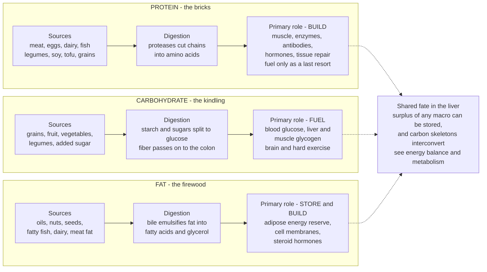

# 🍽️ Macronutrients: Protein, Carbohydrates, and Fats

> [!abstract] TL;DR
> The three **macronutrients** — **protein, carbohydrate, and fat** — are the only components of food that supply energy, and they do it at fixed rates: **4 kcal/g for protein, 4 kcal/g for carbohydrate, and 9 kcal/g for fat** (plus 7 kcal/g for alcohol). But treating them only as fuel misses the point. Each has a *primary job*: **protein is structural raw material** (muscle, enzymes, antibodies, hormones) and is a poor everyday fuel; **carbohydrate is the fast, preferred fuel** for the brain and high-intensity effort, and its fiber fraction is a major lever of gut and metabolic health; **fat is dense long-term energy storage plus essential structure** (every cell membrane and steroid hormone). Decades of "which macro is evil" wars — fat in the 1980s, carbs in the 2000s — have collapsed into a more mature consensus: **food quality and overall dietary pattern matter far more than the exact ratio.** A serving of salmon and a stick of margarine are both "fat," and lentils and a soda are both "carbs," yet their health effects are worlds apart.

## Intuition

**Analogy: think of feeding your body like running a house that both stays warm and slowly rebuilds itself — you need bricks, kindling, and firewood, and they are not interchangeable.**

- **Protein is the pile of bricks.** You do not burn bricks to heat the house — that would be absurdly wasteful and you would run out of the very thing you build walls with. Bricks are for *construction and repair*: replacing worn mortar, adding a room, fixing storm damage. Your body treats protein the same way. It is the raw material for muscle, skin, enzymes, and antibodies, and the body will only start burning it for heat as a desperate last resort (starvation, or when you simply eat far too little of everything else).
- **Carbohydrate is the kindling.** It catches instantly, burns hot and clean, and is exactly what you want when you need heat *right now* — a sprint, a hard set, or the brain's constant background demand. But kindling burns fast and you can only stack a little of it by the hearth (your glycogen stores are small).
- **Fat is the cord of firewood stacked out back.** It packs more than twice the energy per unit, stores compactly and indefinitely, and is what carries you through the long, quiet stretches. It lights slowly, which is fine — it is not for emergencies; it is the reserve.

The health lesson falls straight out of the analogy: a house that is fed **only kindling** burns hot then crashes (blood-sugar roller-coasters); a house **starved of bricks** slowly falls apart even while well-heated (muscle loss on a low-protein diet); and a house with **no firewood at all** cannot get through winter or build a proper roof (fat is structurally and hormonally essential). You need all three, in the right proportions, from good materials.

---

## How It Works

### Sources, digestion, and the primary role of each macro

Every macronutrient follows the same three-step arc — you eat a *food source*, your gut *digests it into a small absorbable unit*, and that unit is put to a *primary use*. The units are the key: protein becomes **amino acids**, carbohydrate becomes **glucose** (with fiber escaping digestion entirely), and fat becomes **fatty acids and glycerol**. What differs is what the body does with each once absorbed.



### Why the primary roles matter more than the calorie count

If you looked only at the 4/4/9 numbers, you might conclude that a calorie is a calorie and the macros are interchangeable fuels. Physiologically they are not:

1. **Protein is expensive to burn and precious to keep.** The body has no dedicated "protein store" the way it stores fat and glycogen — the closest thing to a protein reserve is your own functional tissue (muscle, organs). Burning protein for energy means dismantling machinery, and it carries a high **thermic effect** (roughly 20–30% of protein's calories are spent just digesting and processing it, versus about 5–10% for carbohydrate and 0–3% for fat). This is why protein is *satiating* and *metabolically costly* — a large part of why higher-protein diets help with weight control.
2. **Carbohydrate is the only fuel the body can burn fast enough for maximal effort, and the brain's default fuel.** During high-intensity exercise, glucose from glycogen is the dominant energy source because it can be broken down anaerobically for rapid ATP; fat oxidation is too slow. The brain normally runs almost entirely on glucose (it can shift partly to **ketones** during prolonged carbohydrate restriction).
3. **Fat is the body's strategic reserve and its structural backbone.** A lean adult stores tens of thousands of kilocalories as fat versus roughly 1,500–2,000 kcal as glycogen — the difference between weeks of reserve and less than a day. Beyond energy, fat is not optional: **phospholipids** build every cell membrane and **cholesterol** is the precursor to steroid hormones (cortisol, testosterone, estrogen) and vitamin D.

### The macros interconnect and interconvert

The three are not sealed silos. Surplus carbohydrate and protein can be converted to fat (**de novo lipogenesis**); amino acids and the glycerol backbone of fat can be turned into glucose (**gluconeogenesis**) when carbohydrate is scarce; and all three funnel their carbon into the same central pathways (glycolysis, the citric acid cycle) for ATP production. This interconversion is the domain of whole-body **energy balance and metabolism** — the macros are the *inputs* to that machinery, and understanding one without the other is incomplete.

---

## Key Concepts

### Secondary (explain to anyone)

- **There are three macronutrients** — protein, carbs, and fat — and they are the only things in food that give you energy: 4, 4, and 9 calories per gram respectively.
- **Each has a main job**: protein builds and repairs, carbs are quick fuel, fat is stored energy and body structure.
- **Fiber is a special carbohydrate you do not digest** — it feeds gut bacteria, slows blood sugar, and keeps you regular. Whole foods have it; processed foods have had it stripped out.
- **The type matters more than the label.** "Carbs" includes both broccoli and candy; "fat" includes both olive oil and a doughnut. Judge the *food*, not just the macro.
- **Trans fats are the one clear dietary villain** — industrially made and banned or restricted in many countries.

### Undergraduate (needs some background)

- **Essential vs non-essential amino acids.** Of the 20 amino acids, **9 are essential** (the body cannot make them: histidine, isoleucine, leucine, lysine, methionine, phenylalanine, threonine, tryptophan, valine) and must come from food. A **complete protein** supplies all nine in good proportion (animal foods, soy, quinoa); most single plant foods are **incomplete** (limiting in one, e.g., grains low in lysine, legumes low in methionine), which is fixed by **protein complementation** — combining foods like beans and rice across the day.
- **Protein quality scores.** **PDCAAS** (Protein Digestibility Corrected Amino Acid Score) and its successor **DIAAS** (Digestible Indispensable Amino Acid Score) rank protein sources by how well their amino-acid profile and digestibility match human needs; animal and soy proteins score high, most single plant proteins lower.
- **Protein requirements are contested.** The **RDA is 0.8 g/kg/day** — but that is a minimum to prevent deficiency, not an optimum. Evidence supports **1.2–2.0 g/kg** for muscle building, athletes, dieters preserving lean mass, and **older adults** fighting age-related muscle loss (sarcopenia and anabolic resistance).
- **Simple vs complex carbohydrates and the glycemic response.** Simple sugars (glucose, fructose, sucrose) and refined starches raise blood glucose fast; the **glycemic index (GI)** ranks a food's blood-sugar spike, and **glycemic load (GL)** scales GI by the actual carbohydrate amount in a serving — a more useful real-world measure.
- **Fatty-acid families.** **Saturated** (no double bonds, solid at room temperature), **monounsaturated** (one double bond, e.g., olive oil), and **polyunsaturated** (multiple double bonds, including the **essential omega-3 and omega-6** fats). Trans fats are an artificial category with double bonds in the "trans" configuration.
- **Dietary cholesterol is not the same as blood cholesterol.** For most people, dietary cholesterol has a modest effect on blood lipids; the body makes most of its own.

### Graduate (systems-level)

- **Muscle protein synthesis and the leucine threshold.** Feeding protein triggers a spike in **muscle protein synthesis (MPS)**, gated largely by the essential amino acid **leucine** acting through the **mTOR** pathway. There appears to be a per-meal **leucine threshold** (roughly 2.5–3 g leucine, delivered by ~20–40 g of high-quality protein) needed to maximally stimulate MPS — motivating **even distribution of protein across meals** rather than one large dose, especially in older adults who show **anabolic resistance** (a blunted MPS response requiring more protein per meal).
- **The protein-leverage hypothesis.** Simpson and Raubenheimer proposed that humans prioritize hitting an **absolute protein target** over regulating total energy. If the diet is **diluted in protein** (as ultra-processed diets tend to be), people keep eating carbohydrate and fat until the protein target is met — **overconsuming total calories in the process**. It reframes obesity partly as a *consequence of low dietary protein density*, and the Python demo below models the leverage arithmetic directly.
- **Soluble vs insoluble fiber and the microbiome.** **Soluble/fermentable fiber** (oats, legumes, psyllium) is fermented by colonic bacteria into **short-chain fatty acids (SCFAs)** like butyrate — fuel for colonocytes with anti-inflammatory and metabolic signaling roles; **insoluble fiber** (wheat bran, vegetable skins) mainly adds bulk and speeds transit. Fiber is arguably the single most under-consumed, health-relevant carbohydrate fraction, and it is where carbohydrate quality meets **gut health**.
- **The saturated-fat controversy, current state.** The mid-20th-century **diet-heart hypothesis** (saturated fat raises LDL, LDL drives heart disease) drove decades of low-fat guidance, which unintentionally pushed people toward refined carbohydrates. Later meta-analyses questioned a simple saturated-fat-to-heart-disease link, producing headline reversals. The **nuanced consensus now**: saturated fat *does* raise LDL on average, but the *replacement* matters most — swapping saturated fat for **polyunsaturated fat** lowers cardiovascular risk, while swapping it for **refined carbohydrate** does not. The villain framing (single evil macro) is the wrong model; **substitution and food matrix** are the right one.
- **Energy density and macronutrient satiety.** Because fat carries 9 kcal/g and fiber-rich carbohydrates carry water and bulk, **energy density (kcal per gram of food)** strongly predicts how many calories people eat before feeling full. A satiety hierarchy roughly ranks **protein > fiber-rich carbohydrate > fat** per calorie — a mechanistic reason whole-food, higher-protein, higher-fiber patterns curb intake without conscious restriction.
- **From "evil macro" to dietary patterns.** Modern nutrition science has largely abandoned the search for the one bad macronutrient in favor of **overall dietary patterns** (Mediterranean, DASH, plant-forward) and **degree of processing**, which capture the real variance in outcomes far better than macro ratios alone.

---

## Python Demo

```python
# A macronutrient / diet calculator.
# Part 1: hold PROTEIN adequate (grams per kg bodyweight), then partition the
#         SAME calorie budget three ways by varying the carb:fat ratio -
#         high-carb, balanced, and low-carb/keto - and show they all sum to
#         the identical total energy.
# Part 2: model the PROTEIN-LEVERAGE idea - if you must hit a fixed protein
#         target but the diet is diluted in protein, total intake balloons.
# Uses the Atwater 4/4/9 kcal-per-gram values. numpy + matplotlib only.
import numpy as np
import matplotlib.pyplot as plt

KCAL = {"protein": 4.0, "carb": 4.0, "fat": 9.0}   # kcal per gram

# ---- Person and targets ----
bodyweight_kg    = 75.0
protein_g_per_kg = 1.6      # adequate for an active adult (RDA minimum is 0.8)
target_kcal      = 2400.0

protein_g    = protein_g_per_kg * bodyweight_kg     # grams of protein, held FIXED
protein_kcal = protein_g * KCAL["protein"]
remaining    = target_kcal - protein_kcal           # split between carb and fat

# ---- Three diets: share of the NON-protein energy given to carbohydrate ----
diets = {"High-carb": 0.75, "Balanced": 0.50, "Low-carb / keto": 0.15}

print(f"Bodyweight {bodyweight_kg:.0f} kg | protein {protein_g:.0f} g "
      f"= {protein_kcal:.0f} kcal held fixed | budget {target_kcal:.0f} kcal\n")
print(f"{'Diet':16s} {'carb g':>7s} {'fat g':>7s} {'protein g':>10s} {'total kcal':>11s}")

labels, prot_k, carb_k, fat_k = [], [], [], []
for name, carb_share in diets.items():
    carb_kcal = remaining * carb_share
    fat_kcal  = remaining * (1.0 - carb_share)
    carb_g, fat_g = carb_kcal / KCAL["carb"], fat_kcal / KCAL["fat"]
    total = protein_kcal + carb_kcal + fat_kcal
    print(f"{name:16s} {carb_g:7.0f} {fat_g:7.0f} {protein_g:10.0f} {total:11.0f}")
    labels.append(name); prot_k.append(protein_kcal)
    carb_k.append(carb_kcal); fat_k.append(fat_kcal)

# ---- Plot ----
fig, (ax1, ax2) = plt.subplots(1, 2, figsize=(13, 5.5))
x = np.arange(len(labels))
p, c, f = np.array(prot_k), np.array(carb_k), np.array(fat_k)
ax1.bar(x, p,           color="#2563eb", label="Protein  4 kcal/g")
ax1.bar(x, c, bottom=p, color="#059669", label="Carbs    4 kcal/g")
ax1.bar(x, f, bottom=p + c, color="#d97706", label="Fat      9 kcal/g")
ax1.axhline(target_kcal, color="#334155", ls="--", lw=1.2)
ax1.text(-0.45, target_kcal + 30, "same 2400 kcal budget", fontsize=9, color="#334155")
ax1.set_xticks(x); ax1.set_xticklabels(labels)
ax1.set_ylabel("Energy (kcal)")
ax1.set_title("Same calories, protein fixed - carb:fat re-partitioned")
ax1.legend(loc="upper right", fontsize=8)

# Part 2: protein leverage. To reach the SAME protein target, total intake
# must equal protein_kcal / (protein's share of dietary energy).
protein_fraction = np.linspace(0.08, 0.35, 250)   # protein as share of energy
total_intake     = protein_kcal / protein_fraction
ax2.plot(protein_fraction * 100, total_intake, color="#7c3aed", lw=2.5)
ax2.axhline(target_kcal, color="#334155", ls="--", lw=1.0)
for pf, tag in [(0.10, "10% protein\n(diluted -> overeat)"),
                (0.20, "20% protein\n(on budget)"),
                (0.30, "30% protein\n(rich -> eat less)")]:
    ti = protein_kcal / pf
    ax2.scatter([pf * 100], [ti], color="#dc2626", zorder=5)
    ax2.annotate(tag, (pf * 100, ti), textcoords="offset points",
                 xytext=(8, -4), fontsize=8)
ax2.set_xlabel("Protein as % of dietary energy")
ax2.set_ylabel("Total energy eaten to hit protein target (kcal)")
ax2.set_title("Protein leverage: diluting protein drives overeating")
ax2.grid(alpha=0.25)
plt.tight_layout(); plt.show()

# Typical console output:
#   Diet              carb g   fat g  protein g  total kcal
#   High-carb            360      53        120        2400
#   Balanced             240     107        120        2400
#   Low-carb / keto       72     181        120        2400
# All three hit the identical 2400 kcal with identical protein - only the
# carb:fat split differs. In Part 2, diluting protein to 10% of energy forces
# 4800 kcal of eating to reach the same 480 kcal protein target: the leverage.
```

The left panel makes the "a calorie budget can be partitioned many ways" idea literal — high-carb, balanced, and keto here are the *same* energy and the *same* protein, differing only in the carb:fat trade. The right panel is the protein-leverage hypothesis in one line of arithmetic: because the body defends an absolute protein target, a protein-**dilute** diet (10% of energy from protein — typical of ultra-processed food) mathematically demands far more total eating to satisfy the same protein need, which is a compelling mechanistic story for overconsumption.

---

## Real-World Applications

- **Sports and physique nutrition.** Strength and endurance athletes deliberately target **1.6–2.2 g/kg protein**, timed across meals to keep muscle protein synthesis elevated, and **periodize carbohydrate** around training (high on hard days for glycogen, lower on rest days). This is macro management applied for performance, not just health.
- **Clinical management of blood sugar.** People with type 2 diabetes and insulin resistance use **glycemic load, fiber, and carbohydrate quality/quantity** to blunt post-meal glucose spikes; low-carbohydrate and Mediterranean patterns both show benefit, and continuous glucose monitors let individuals see the response in real time.
- **Aging and sarcopenia prevention.** Because older adults show **anabolic resistance**, geriatric nutrition pushes **higher per-meal protein (25–40 g)** with adequate leucine, combined with resistance training, to slow age-related muscle and strength loss — directly relevant to healthspan.
- **Food policy on trans fats.** The clearest macro-level public-health win: the **WHO REPLACE program** and national bans have driven industrial **trans fats** out of the food supply in many countries, preventing large numbers of cardiovascular deaths — a rare case of a nutrient being genuinely eliminated.
- **Ultra-processed food and the protein-leverage lens.** The protein-leverage hypothesis is used to explain why cheap, protein-dilute, energy-dense processed foods promote overeating, informing arguments to **reformulate for higher protein and fiber density** rather than simply telling people to eat less.

---

## Common Pitfalls

- **Treating a macro as good or evil regardless of the food.** "Carbs are bad" lumps lentils with soda; "fat is bad" lumps salmon with margarine. The single strongest predictor of health is **food quality and overall pattern**, not the macro label. This is the central lesson of the last 40 years of nutrition science.
- **Confusing dietary cholesterol with blood cholesterol.** They are loosely coupled at most for the majority of people; the body synthesizes most of its cholesterol. Fixating on the cholesterol content of an egg while ignoring saturated-fat *substitution* and overall pattern is the wrong focus.
- **Chasing a magic macro ratio.** Endless debate over "40/30/30" or "keto macros" obscures that, at matched calories and protein, **carb:fat ratio has a modest effect on body composition for most people** — adherence and food quality dominate. The Python demo shows three very different ratios hitting the same budget.
- **Under-eating protein while dieting.** Cutting calories without protecting protein means the body burns muscle alongside fat. Adequate protein (often **1.6 g/kg or more** in a deficit) plus resistance training preserves lean mass — dismantling bricks for heat is the failure mode to avoid.
- **Ignoring fiber.** Fiber is the most under-consumed health-relevant carbohydrate, yet it drives satiety, glycemic control, and the gut microbiome via short-chain fatty acids. "Low-carb" diets done carelessly can strip out fiber along with sugar.
- **Assuming plant protein cannot be complete or sufficient.** With variety and adequate total intake (and modest complementation), plant-based diets meet amino-acid needs; the old "you must combine proteins at every meal" rule is outdated — the body pools amino acids across the day.
- **Fearing all saturated fat while eating refined carbs.** The low-fat era's mistake: replacing saturated fat with refined starch and sugar did not help. The evidence favors **replacing saturated fat with unsaturated fat**, not with white bread.

---

## Related Concepts

- [[Carbohydrates_and_Lipids]] — the underlying biochemistry of sugars and fats: monosaccharides, glycogen, triglycerides, phospholipids, and cholesterol; the molecular basis of two of the three macros.
- [[Proteins_and_Amino_Acids]] — the chemistry of amino acids, essential vs non-essential, peptide bonds, and protein structure; why protein is structural raw material rather than fuel.
- [[Metabolism_and_Bioenergetics]] — how all three macros are oxidized and interconverted for ATP, and how surplus is stored; the machinery that consumes these inputs.
- [[The_Digestive_and_Excretory_Systems]] — how proteases, amylase, and bile break macronutrients into absorbable amino acids, glucose, and fatty acids; the digestion step in the diagram above.
- [[Bioenergetics_and_ATP]] — the ATP economy that macronutrient oxidation ultimately serves.
- [[Glycolysis]] — the pathway that makes carbohydrate the only fuel fast enough for maximal-intensity exercise.
- [[The_Endocrine_System_and_Hormones]] — insulin, glucagon, and the steroid hormones built from cholesterol; the hormonal control of macronutrient use and storage.
- [[Health_and_Wellbeing_Overview]] — nutrition as one of the six pillars of healthspan; where this note sits in the larger health picture.
- [[Determinants_of_Health]] — why the food environment (access to protein- and fiber-rich whole foods) shapes macronutrient intake beyond individual choice.

---

## Review Questions

**Tier 1 — Recall / comprehension:**
1. State the energy value (kcal per gram) of protein, carbohydrate, and fat, and give the *primary physiological role* of each beyond providing energy.
2. What makes an amino acid "essential," and what does it mean for a protein source to be "complete" versus "incomplete"? Give one example of protein complementation.

**Tier 2 — Application / analysis:**
3. Two people eat the same 2,000 kcal and the same protein, but one follows a high-carb split and the other a low-carb/keto split. Using the 4/4/9 values, sketch how their carbohydrate and fat *grams* differ, and explain why body-composition outcomes may nevertheless be similar.
4. A widely shared headline claims "saturated fat has been exonerated." Using the concepts of *substitution* and *food matrix*, explain what this claim gets right, what it oversimplifies, and what replacement for saturated fat the evidence actually favors.

**Tier 3 — Synthesis / evaluation:**
5. Using the protein-leverage hypothesis and the arithmetic in the Python demo, argue how the rise of protein-dilute, energy-dense ultra-processed foods could drive population-level overeating *without* anyone deciding to eat more. What food-reformulation lever does this suggest, and what is a weakness of the hypothesis?
6. An 80-year-old and a 25-year-old athlete both want to preserve or build muscle. Explain, using the leucine threshold and anabolic resistance, why their *per-meal* protein strategies should differ even if their daily gram totals are similar — and why total dietary pattern and resistance training still matter more than any single macro number.

---

## Sources

- Institute of Medicine (2005). *Dietary Reference Intakes for Energy, Carbohydrate, Fiber, Fat, Fatty Acids, Cholesterol, Protein, and Amino Acids.* National Academies Press. https://nap.nationalacademies.org/catalog/10490
- FAO (2013). *Dietary Protein Quality Evaluation in Human Nutrition* (the report introducing DIAAS). Food and Agriculture Organization. https://www.fao.org/3/i3124e/i3124e.pdf
- Simpson, S. J. & Raubenheimer, D. (2005). "Obesity: the protein leverage hypothesis." *Obesity Reviews*, 6(2):133-142. https://doi.org/10.1111/j.1467-789X.2005.00178.x
- Morton, R. W. et al. (2018). "A systematic review, meta-analysis and meta-regression of the effect of protein supplementation on resistance training-induced gains in muscle mass and strength." *British Journal of Sports Medicine*, 52:376-384. https://doi.org/10.1136/bjsports-2017-097608
- Ludwig, D. S. et al. (2018). "Dietary carbohydrates: role of quality and quantity in chronic disease." *BMJ*, 361:k2340. https://doi.org/10.1136/bmj.k2340
- Sacks, F. M. et al. (2017). "Dietary Fats and Cardiovascular Disease: A Presidential Advisory From the American Heart Association." *Circulation*, 136:e1-e23. https://doi.org/10.1161/CIR.0000000000000510

---

#health #nutrition #macronutrients #protein #dietary-fat
