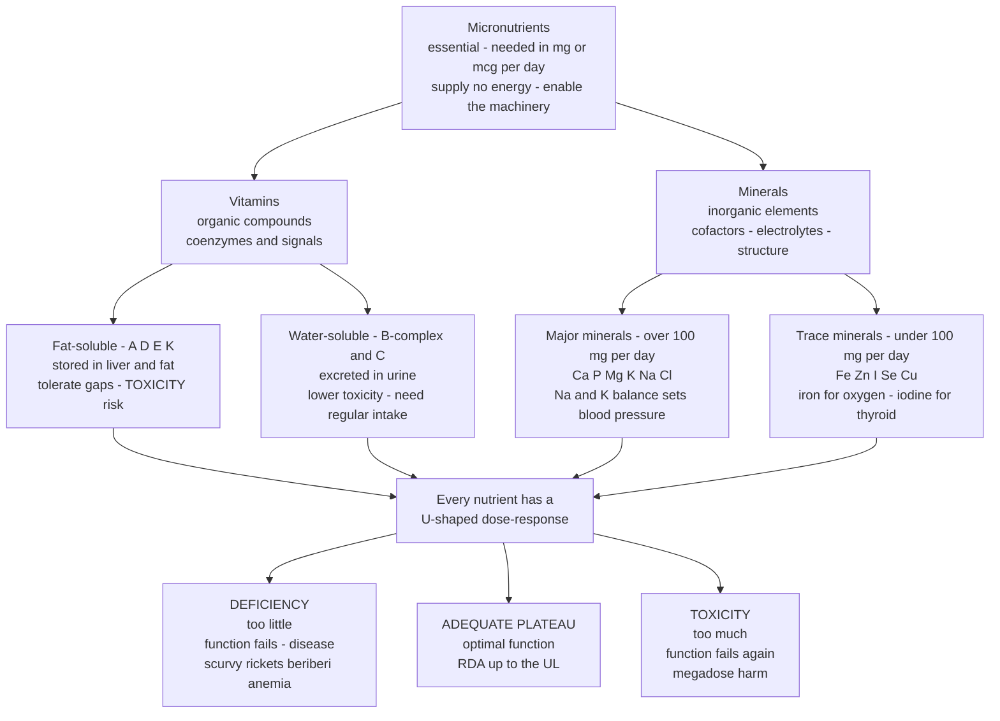

# 🧪 Micronutrients (Vitamins and Minerals)

> [!abstract] TL;DR
> **Micronutrients are the vitamins and minerals the body needs in tiny amounts — milligrams or micrograms per day — yet cannot make (or cannot make enough of), so they must come from the diet.** They do not supply energy; they *enable* the machinery that uses energy: vitamins act mostly as **coenzymes** and signalling molecules, minerals as **enzyme cofactors, electrolytes, and structural material**. The defining feature of every micronutrient is a **U-shaped dose-response**: too little causes a classic **deficiency disease** (scurvy, rickets, beriberi, pellagra, anemia, goiter), an intermediate range gives **optimal function**, and too much causes **toxicity**. The safe window between the **RDA** (enough) and the **Tolerable Upper Intake Level (UL)** is wide for water-soluble vitamins (surplus is excreted) but dangerously narrow for fat-soluble ones (they are stored). This is why "more is better" is false, why megadosing can harm, and why targeted supplementation for genuine at-risk groups beats the largely-ineffective multivitamin for the well-nourished.

## Intuition

**Analogy: micronutrients are the spark plugs and lubricants of your body's engine — needed in tiny amounts, but the whole engine seizes without them.**

A car's fuel is measured in litres; its spark plugs and oil are measured in grams and millilitres. Nobody would call the spark plug "the fuel," and yet a fully-fuelled engine with a dead spark plug or dry oil will not turn over — or will grind itself to scrap. **Macronutrients** (protein, carbs, fat) are the fuel: bulk energy and building material, measured in tens or hundreds of grams. **Micronutrients** are the spark and the lubrication: they carry no energy of their own, but without them the reactions that release energy from fuel simply do not fire, and the moving parts fail.

The analogy carries two more lessons. First, **more oil is not better oil** — overfill the crankcase and you foul the engine just as surely as running it dry. Every micronutrient has both a floor (deficiency) and a ceiling (toxicity). Second, **you cannot store spark the way you store fuel**: some micronutrients (the fat-soluble vitamins) *do* stockpile in the body's fat and liver — which is exactly why they can build up to toxic levels — while others (the water-soluble ones) leak away in the urine and must be topped up regularly.

---

## How It Works

### What counts as a micronutrient

A **micronutrient** is an **essential** dietary component required in small quantities — conventionally under a gram per day, often milligrams (mg) or micrograms (mcg). "Essential" is a precise word: it means the body cannot synthesise the compound at all, or cannot make it fast enough to meet demand, so a dietary source is obligatory. There are **13 recognised vitamins** and roughly **15 essential minerals**. They divide cleanly into four buckets, and the buckets predict behaviour.

### Vitamins — organic compounds, two solubility classes

**Fat-soluble vitamins (A, D, E, K)** dissolve in fat, are absorbed alongside dietary lipids, and are **stored** in the liver and adipose tissue. Storage is a double-edged sword: you can go weeks without them, but chronic overdose accumulates and becomes **toxic**.

- **Vitamin A (retinol):** vision (forms the retinal pigment rhodopsin), immune function, epithelial and skin integrity. Deficiency causes **night blindness** and **xerophthalmia** (a leading cause of preventable childhood blindness). Toxicity causes liver damage and, in pregnancy, birth defects.
- **Vitamin D (calciferol):** drives **calcium and phosphate absorption** and bone mineralisation. Deficiency causes **rickets** in children and **osteomalacia** in adults. The special case is discussed below.
- **Vitamin E (tocopherol):** the body's main lipid-phase **antioxidant**, protecting cell membranes. Deficiency is rare (neuropathy, hemolytic anemia in premature infants).
- **Vitamin K:** cofactor for **blood-clotting factors** and bone proteins. Deficiency causes bleeding; newborns are routinely given a dose because they are born deficient.

**Water-soluble vitamins (the B-complex and vitamin C)** dissolve in water, are generally **not stored** in large amounts, and surplus is **excreted in the urine**. This gives them a much lower toxicity risk but demands **regular intake**. Most B-vitamins are **coenzymes** in energy metabolism.

- **B1 (thiamine):** carbohydrate metabolism. Deficiency causes **beriberi** (nerve and heart failure) and, with alcohol, **Wernicke-Korsakoff syndrome**.
- **B2 (riboflavin):** forms FAD, a core electron carrier.
- **B3 (niacin):** forms NAD/NADH. Deficiency causes **pellagra** — the "three Ds": dermatitis, diarrhea, dementia.
- **B6 (pyridoxine):** amino-acid metabolism and neurotransmitter synthesis.
- **B9 (folate):** DNA synthesis and cell division. Deficiency causes **megaloblastic anemia** and, in early pregnancy, **neural tube defects** (spina bifida).
- **B12 (cobalamin):** DNA synthesis and myelin maintenance; found almost exclusively in **animal foods**. Deficiency causes **pernicious/megaloblastic anemia** and irreversible nerve damage — the classic risk for strict vegans and older adults.
- **Vitamin C (ascorbic acid):** collagen synthesis, antioxidant, and a powerful **enhancer of iron absorption**. Deficiency causes **scurvy** (bleeding gums, poor wound healing, collagen failure) — the disease that killed more sailors than combat until James Lind's 1747 citrus trial.

### Vitamin D — the sunlight-hormone and the supplementation debate

Vitamin D is unusual on three counts. First, it is **not truly a vitamin** but a **prohormone**: the skin synthesises it from cholesterol when hit by **UVB sunlight**, so a person with ample sun needs little dietary intake. Second, **insufficiency is widespread** — at high latitudes, in winter, with dark skin, indoor lifestyles, or heavy sunscreen use, endogenous production falls short. Third, it sits at the centre of a genuine scientific **debate**: observational studies link low blood vitamin D to almost every chronic disease, but large randomised trials (e.g. **VITAL**) have mostly **failed** to show that supplementing well-nourished people prevents cancer or cardiovascular events. The reconciliation: low vitamin D is often a **marker** of poor health (indoor, sick, inflamed) rather than its cause. Correcting true **deficiency** (bone health) is well-supported; megadosing an already-adequate person is not.

### Minerals — inorganic elements, major and trace

Unlike vitamins, minerals are **elements** — they cannot be created or destroyed, only supplied and excreted. They split by required quantity.

**Major (macro) minerals** are needed in amounts over ~100 mg per day: **calcium, phosphorus, magnesium, potassium, sodium, chloride**. Calcium and phosphorus build bone; magnesium is a cofactor in hundreds of enzymes and stabilises ATP. The most important *systemic* story is the **sodium-potassium balance** and blood pressure: the body defends a tight extracellular sodium concentration, and the **sodium-potassium pump** maintains the electrical gradients behind every nerve impulse and heartbeat (see the [[Homeostasis_and_Human_Physiology]] and [[Homeostasis_and_the_Nervous_System]] links). Diets high in **sodium** and low in **potassium** raise blood pressure by expanding fluid volume; shifting the ratio toward potassium (fruits, vegetables) lowers it — the mechanistic basis of the DASH dietary pattern.

**Trace (micro) minerals** are needed in amounts under ~100 mg per day — but "trace" does not mean "minor":

- **Iron:** the core of **hemoglobin**, which carries oxygen in the blood (see [[The_Circulatory_and_Respiratory_Systems]]). Deficiency is the world's **most common** nutritional disorder, causing **iron-deficiency anemia** — fatigue, pallor, impaired cognition. Bioavailability is central (below).
- **Iodine:** the raw material for **thyroid hormones** (T3, T4), which set the body's metabolic rate. Deficiency causes **goiter**, hypothyroidism, and — in a developing fetus — irreversible cognitive impairment (**cretinism**). **Iodised salt** is one of public health's great victories (see [[The_Endocrine_System_and_Hormones]]).
- **Zinc:** cofactor in ~300 enzymes; immune function, wound healing, growth. Deficiency impairs immunity and growth.
- **Selenium:** part of antioxidant enzymes (glutathione peroxidase) and thyroid metabolism; a textbook example of a narrow safe window.
- **Copper, manganese, chromium, molybdenum, fluoride** round out the essential trace set.

### The dose-response — the U-shaped curve and the RDA-to-UL bracket

Every micronutrient obeys the same law: **health rises out of deficiency, plateaus at optimal intake, then falls into toxicity.** Nutritionists bracket the safe plateau with two numbers. The **RDA (Recommended Dietary Allowance)** marks the *floor* — the intake that meets the needs of ~97.5 percent of people. The **Tolerable Upper Intake Level (UL)** marks the *ceiling* — the highest chronic intake unlikely to cause harm. Between them lies the safe window; the width of that window is what distinguishes a stored fat-soluble vitamin (narrow, easily overshot) from an excreted water-soluble one (wide). This biphasic shape — benefit at an intermediate dose, harm at both extremes — is the nutritional face of **hormesis**, and it is exactly what the Python demo below models.

### Categories and dose-response at a glance



---

## Key Concepts

**Secondary (explain to anyone):**
- **Micronutrients are needed in tiny amounts but are essential** — you get sick without them even though they carry no calories.
- **Vitamins vs minerals** — vitamins are organic compounds (can break down with heat/light); minerals are indestructible elements from soil and water.
- **Deficiency diseases have names** — scurvy (vitamin C), rickets (vitamin D), beriberi (B1), pellagra (B3), anemia (iron/B12), goiter (iodine).
- **More is not better** — every nutrient has a floor *and* a ceiling; megadosing can poison you, especially with stored fat-soluble vitamins.
- **Whole foods first** — a varied diet covers most needs; pills are for genuine gaps.

**Undergraduate (needs some science background):**
- **Fat-soluble (A, D, E, K) vs water-soluble (B, C)** — solubility predicts storage, excretion, toxicity risk, and dosing frequency.
- **Vitamins as coenzymes; minerals as cofactors and electrolytes** — B-vitamins form NAD, FAD, and CoA; minerals catalyse enzymes and carry charge.
- **RDA vs Tolerable Upper Intake Level** — the safe intake window; its width differs by nutrient class.
- **Bioavailability** — heme vs non-heme iron; enhancers (vitamin C) and inhibitors (phytates, tannins, calcium).
- **Sodium-potassium balance and blood pressure** — the electrolyte basis of hypertension and the DASH pattern.

**Graduate (systems-level thinking):**
- **Hormesis and the biphasic dose-response** — micronutrients as a special case of a general toxicological law; selenium as the archetype of a narrow therapeutic index.
- **Marker vs cause in nutrient epidemiology** — why low vitamin D correlates with disease yet supplementing well-nourished people fails in RCTs (VITAL, ATBC, CARET).
- **Nutrient-nutrient interactions** — competitive absorption (iron/calcium, zinc/copper), and single-nutrient supplements distorting the balance.
- **The exposome of deficiency** — how geography (iodine-poor soils, high latitude), life stage, and diet pattern determine population-level risk (see [[Determinants_of_Health]]).
- **Regulation and evidence** — post-DSHEA (1994) supplements are not pre-approved for safety or efficacy, decoupling market claims from trial evidence.

---

## Python Demo

```python
# The U-shaped dose-response of a micronutrient: health/function vs intake.
# We express intake as a MULTIPLE of the RDA so two very different nutrients
# share one x-axis. Every micronutrient has the SAME shape -- a rising limb out
# of DEFICIENCY, an OPTIMAL PLATEAU, then a falling limb into TOXICITY. What
# differs is the WIDTH of the safe window (RDA -> UL): narrow for a stored
# fat-soluble vitamin, wide for an excreted water-soluble one. This is hormesis.
import numpy as np
import matplotlib.pyplot as plt

intake = np.linspace(0.0, 30.0, 3000)     # intake in multiples of the RDA

def function_curve(x, rise_mid, rise_k, tox_mid, tox_k):
    rising  = 1.0 / (1.0 + np.exp(-(x - rise_mid) / rise_k))   # climb out of deficiency
    falling = 1.0 / (1.0 + np.exp( (x - tox_mid)  / tox_k))    # collapse into toxicity
    return 100.0 * rising * falling                            # product -> a plateau

# Fat-soluble vitamin (e.g. vitamin A): stored in the liver -> NARROW margin.
# Adequate near 1x RDA; toxicity sets in around ~3.3x RDA (vit A UL / RDA).
fat_soluble = function_curve(intake, rise_mid=0.5, rise_k=0.15, tox_mid=3.3, tox_k=0.6)

# Water-soluble vitamin (e.g. vitamin C): surplus excreted -> WIDE margin.
# Adequate near 1x RDA; UL ~22x RDA (2000 mg / 90 mg), toxicity only at extremes.
water_soluble = function_curve(intake, rise_mid=0.5, rise_k=0.15, tox_mid=22.0, tox_k=2.5)

# Report the safe window (function >= 90% of peak) for each nutrient.
def safe_window(curve):
    ok = curve >= 90.0
    return intake[ok].min(), intake[ok].max()
lo_f, hi_f = safe_window(fat_soluble)
lo_w, hi_w = safe_window(water_soluble)
print(f"Fat-soluble   safe window: {lo_f:4.1f}x to {hi_f:4.1f}x RDA  (width {hi_f-lo_f:4.1f})")
print(f"Water-soluble safe window: {lo_w:4.1f}x to {hi_w:4.1f}x RDA  (width {hi_w-lo_w:4.1f})")

# ---- Plot ----
fig, ax = plt.subplots(figsize=(11, 6))
ax.plot(intake, fat_soluble,   color="#b45309", lw=2.6, label="Fat-soluble (e.g. vitamin A) - stored")
ax.plot(intake, water_soluble, color="#0369a1", lw=2.6, label="Water-soluble (e.g. vitamin C) - excreted")

# Mark the RDA (adequate) and the fat-soluble UL (upper limit).
ax.axvline(1.0, color="#059669", ls="--", lw=1.3)
ax.text(1.1, 6, "RDA\n(adequate)", color="#059669", fontsize=9)
ax.axvline(3.3, color="#b45309", ls=":", lw=1.3)
ax.text(3.5, 52, "UL (fat-soluble)\nupper limit", color="#b45309", fontsize=9)

# Shade the three zones for the fat-soluble nutrient.
ax.axvspan(0.0, 0.5,  color="#dc2626", alpha=0.08)   # deficiency
ax.axvspan(0.5, 3.3,  color="#059669", alpha=0.08)   # adequate window
ax.axvspan(3.3, 30.0, color="#7c3aed", alpha=0.06)   # fat-soluble toxicity
ax.text(0.6, 104, "OPTIMAL PLATEAU", color="#059669", fontsize=9)
ax.text(0.02, 60, "DEFICIENCY", color="#dc2626", fontsize=9, rotation=90, va="center")
ax.text(9.0, 96, "TOXICITY (fat-soluble)", color="#7c3aed", fontsize=9)

ax.set_xlabel("Nutrient intake (multiples of the RDA)")
ax.set_ylabel("Biological function / health (arbitrary units)")
ax.set_title("U-shaped dose-response: why 'more is better' is false")
ax.set_xlim(0, 30); ax.set_ylim(0, 112)
ax.legend(loc="center right"); ax.grid(alpha=0.25)
plt.tight_layout()
plt.show()

# Typical output:
#   Fat-soluble   safe window:  0.7x to  2.7x RDA  (width  2.0)
#   Water-soluble safe window:  0.7x to 20.5x RDA  (width 19.8)
#
# Both nutrients FAIL at zero intake (deficiency) and both have a toxic ceiling.
# The fat-soluble ceiling is close (~3x RDA) -> a narrow window, so megadosing a
# stored vitamin (A, D) can poison you. The water-soluble ceiling is ~10x further
# out, because surplus washes away -- but note it is NOT infinite. The entire
# curve IS hormesis: benefit peaks in the middle and the SAME nutrient harms at
# BOTH extremes. The RDA -> UL bracket is simply the flat top of this curve.
```

The demo makes the headline claim quantitative: the "safe window" for the fat-soluble vitamin is only a few times the RDA, while the water-soluble vitamin tolerates an order of magnitude more before harm. That single geometric difference explains why vitamin A and D toxicity are real clinical entities, why water-soluble megadoses mostly produce "expensive urine," and — crucially — why *neither* nutrient rewards you for exceeding the plateau. There is no upside beyond adequacy, only a distant or nearby cliff.

---

## Real-World Applications

- **Food fortification — invisible public health at scale.** **Iodised salt** eliminated endemic goiter and cretinism across much of the world; **folic-acid fortification** of flour cut neural-tube-defect rates by roughly a third; milk is fortified with **vitamin D**, and cereals with **iron** and B-vitamins. These are population-wide corrections of the deficiency limb of the curve.
- **Targeted, evidence-based supplementation.** **Folate before and during early pregnancy** (prevents neural tube defects), **B12 for vegans and older adults** (no plant source; absorption declines with age), **vitamin D for the truly deficient**, and **iron for diagnosed anemia** are all supported by strong evidence — because they correct a documented gap.
- **The oral rehydration solution (ORS).** A precisely balanced mix of **sodium, potassium, chloride** and glucose exploits the sodium-glucose cotransporter to rehydrate; it has saved tens of millions of lives from diarrheal disease — applied electrolyte physiology.
- **Clinical deficiency screening.** Ferritin and hemoglobin for iron, TSH for iodine/thyroid status, serum B12 and folate for anemia workups, and 25-hydroxyvitamin D for bone health let clinicians place a patient on the dose-response curve before acting.
- **Cautionary trials on the toxicity limb.** The **ATBC** and **CARET** trials found that high-dose **beta-carotene** supplements *increased* lung cancer in smokers, and high-dose **vitamin E** trials showed no benefit or slight harm — hard evidence that pushing a single nutrient past the plateau backfires.

---

## Common Pitfalls

- **"More is better" / megadosing.** The single biggest error. Fat-soluble A and D accumulate to toxic levels; even water-soluble B6 causes nerve damage at chronic high doses. The plateau has no upside beyond it — only a cliff.
- **Treating the multivitamin as insurance.** For **well-nourished** people, large trials (e.g. Physicians' Health Study II) show little to no reduction in mortality, cancer, or heart disease. Broad multivitamins mostly help those with an actual deficiency; for everyone else they are, at best, inert (see [[Nutrition_Myths_and_Evidence]]).
- **Ignoring bioavailability.** *How much you eat is not how much you absorb.* **Heme iron** (meat) is absorbed at 15-35 percent; **non-heme iron** (plants) at 2-20 percent and is blocked by **phytates, tannins (tea/coffee), and calcium** — but boosted several-fold by **vitamin C** eaten in the same meal. Plant-based eaters must plan around this.
- **Nutrient-nutrient interactions from single pills.** High-dose **zinc** induces copper deficiency; **calcium** taken with meals blunts iron absorption; isolated single-nutrient supplements distort a balance that food naturally keeps.
- **Confusing marker with cause (the vitamin D trap).** Low blood vitamin D predicts poor health, but that is largely because sick, indoor, inflamed people have low levels — supplementing an already-adequate person does not buy the outcomes the correlations suggested.
- **Trusting supplement labels.** Under the US DSHEA (1994) framework, supplements are **not** pre-approved for safety, efficacy, or even label accuracy; independent testing routinely finds mislabeling and contamination. "Natural" is a marketing word, not a safety guarantee.
- **Destroying vitamins in the kitchen, then blaming the food.** Vitamin C and folate are heat- and water-sensitive; prolonged boiling leaches and degrades them. Steaming or minimal cooking preserves far more than the raw-vs-cooked debate suggests.

---

## Related Concepts

- [[Nutrition_Science_Overview]] — the parent note framing macronutrients, micronutrients, and dietary patterns as one system. *(Sibling note in this vault.)*
- [[Macronutrients_Protein_Carbs_and_Fats]] — the energy-supplying counterpart; micronutrients are the coenzymes and cofactors that let macronutrient metabolism actually run. *(Sibling note in this vault.)*
- [[Nutrition_Myths_and_Evidence]] — the supplement-industry hype, weak regulation, and "megadose" myths dissected with evidence standards. *(Sibling note in this vault.)*
- [[Homeostasis_and_Human_Physiology]] — the sodium-potassium balance, electrolyte regulation, and calcium homeostasis that many minerals serve. *(Sibling note in this vault.)*
- [[Health_and_Wellbeing_Overview]] — the foundations note; nutrition is one of the six pillars, and micronutrients sit inside it.
- [[The_Endocrine_System_and_Hormones]] — iodine builds thyroid hormone and vitamin D acts as a hormone; the endocrine link to trace minerals.
- [[The_Circulatory_and_Respiratory_Systems]] — iron in hemoglobin is the direct link between a trace mineral and oxygen transport / anemia.
- [[The_Digestive_and_Excretory_Systems]] — where absorption (bioavailability) and excretion (water-soluble surplus) physically happen.
- [[Enzymes_and_Catalysis]] — vitamins as coenzymes and minerals as metal cofactors are the molecular reason micronutrients are "essential."
- [[Organometallic_and_Bioinorganic_Chemistry]] — the metal-in-protein chemistry behind iron in heme and cobalt in vitamin B12.
- [[Transition_Metals_and_the_d_Block]] — the periodic-table home of the essential trace metals (Fe, Zn, Cu, Mn) and why their redox chemistry makes them both useful and toxic.
- [[Determinants_of_Health]] — geography, life stage, income, and diet pattern determine who is actually at risk of deficiency.

---

## Review Questions

**Tier 1 — Recall / comprehension:**
1. Name the four fat-soluble vitamins and state, for each, one key function and its classic deficiency disease. Why do these carry a higher toxicity risk than the B-complex and vitamin C?
2. Distinguish the **RDA** from the **Tolerable Upper Intake Level**. On a sketch of the U-shaped dose-response curve, mark the deficiency zone, the optimal plateau, and the toxicity zone.

**Tier 2 — Application / analysis:**
3. A strict vegan athlete has fatigue and pallor. Which two micronutrients are the most likely culprits, and *why do their food sources make a vegan diet specifically risky*? Design one meal that maximises absorption of the plant-based one, naming the enhancer and one inhibitor to avoid.
4. Using the Python demo's logic, explain why a person can safely take ten times the RDA of vitamin C but not ten times the RDA of vitamin A. Tie your answer to storage vs excretion and to the width of the RDA-to-UL window.

**Tier 3 — Synthesis / evaluation:**
5. Observational studies consistently link low blood vitamin D to higher rates of many diseases, yet large randomised trials of supplementation in well-nourished adults mostly show no benefit. Reconcile these findings using the concepts of **confounding** and **marker vs cause**, and state precisely when vitamin D supplementation *is* justified.
6. A wellness brand markets a high-dose "immune-boosting" multivitamin to healthy adults. Argue, using the U-shaped dose-response, the CARET/ATBC trial results, and the DSHEA regulatory framework, why this product is unlikely to help and could plausibly harm a subgroup of users. What single change to the target population would make supplementation defensible?

---

## Sources

- Institute of Medicine / National Academies. *Dietary Reference Intakes: The Essential Guide to Nutrient Requirements* (RDA and Tolerable Upper Intake Levels). https://www.nap.edu/catalog/11537
- Harvard T.H. Chan School of Public Health — *The Nutrition Source: Vitamins and Minerals*. https://www.hsph.harvard.edu/nutritionsource/vitamins/
- NIH Office of Dietary Supplements — *Vitamin and Mineral Fact Sheets* (bioavailability, deficiency, ULs). https://ods.od.nih.gov/factsheets/list-all/
- Manson, J. E. et al. (2019). "Vitamin D Supplements and Prevention of Cancer and Cardiovascular Disease" (the VITAL trial). *New England Journal of Medicine*, 380:33-44. https://www.nejm.org/doi/full/10.1056/NEJMoa1809944
- Calabrese, E. J. & Baldwin, L. A. (2003). "Hormesis: The Dose-Response Revolution." *Annual Review of Pharmacology and Toxicology*, 43:175-197. https://doi.org/10.1146/annurev.pharmtox.43.100901.140223

---

#health #nutrition #micronutrients #vitamins #minerals
