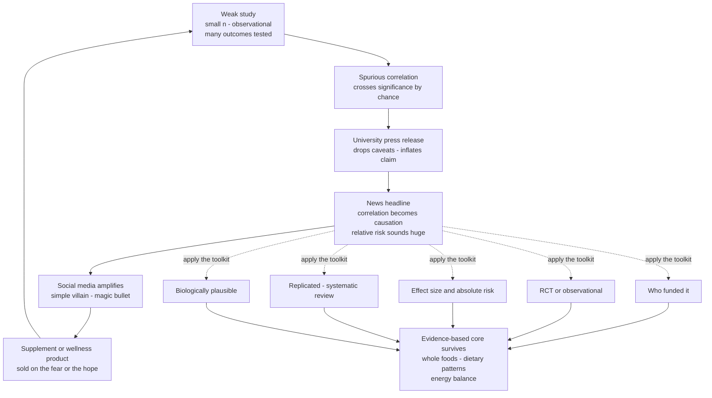

# 🕵️ Nutrition Myths and Evidence

> [!abstract] TL;DR
> Nutrition headlines flip-flop — **coffee cures you Monday and kills you Tuesday** — not because the science genuinely reverses, but because a **fragile evidence base** (small observational studies, confounding, multiple comparisons) is filtered through **incentives that reward drama** (press offices, media, and a lightly-regulated supplement industry). The result is a firehose of "significant" findings that mostly **fail to replicate**. This note is the applied critical-thinking capstone of the nutrition section: a **toolkit for spotting pseudoscience** — who funded it, RCT or observational, how big is the effect in *absolute* terms, is it biologically plausible, has it been *replicated in systematic reviews* — and a survey of the persistent myths (detox, superfoods, most supplements, sugar-as-poison, MSG and gluten fears, alkaline diets) that the toolkit dissolves. Underneath the noise sits a boring, robust core: **mostly whole foods, dietary patterns over single nutrients, and energy balance.**

## Intuition

**Analogy: nutrition news is a weathervane in a gusty field, and each gust is a weak study.**

A weathervane doesn't lie — it faithfully reports the wind it feels. But if the field is gusty and the vane is light, it spins wildly: north, then south, then north again, telling you almost nothing about the prevailing climate. Nutrition headlines are exactly this vane. Each new study is a **gust** — often a small, noisy, observational puff — and a light, attention-hungry media vane swings to point at whichever gust is loudest *this week*. "Eggs raise cholesterol." "Eggs are fine." "Red wine is heart-healthy." "No amount of alcohol is safe." The vane isn't broken; it's **over-responsive to noise**.

The skill this note builds is to stop watching the vane and start reading the **climate** — the settled pattern that emerges only when you average over hundreds of gusts (a **systematic review**), account for the fact that some gusts were never recorded because they were boring (**publication bias**), and ask whether the wind is even *real* or just the vane rattling on its post (a **spurious correlation** from chance). A single study is a gust. The climate is what you should eat.

---

## How It Works

### Why nutrition epidemiology is unusually fragile

Nutrition is one of the **hardest sciences to do well**, and understanding *why* is the whole game:

- **Most evidence is observational, not experimental.** You cannot ethically or practically randomize thousands of people to eat bacon daily for 30 years. So the field leans on **cohort studies** and **food-frequency questionnaires** — which can only reveal *correlation*, never establish *causation*. See [[Causal_Reasoning]].
- **Confounding is everywhere.** People who eat kale, take multivitamins, or drink red wine in moderation are systematically **wealthier, more educated, and more health-conscious** than those who don't. The *food* gets credit that belongs to the person's whole lifestyle (the "healthy-user bias"). Statistical adjustment helps but never fully removes it.
- **Measurement is terrible.** Self-reported diet is wildly inaccurate — people forget, lie, and misestimate portions. You are correlating a shaky exposure with a distant outcome.
- **Effects are small and outcomes are slow.** Real dietary effects on chronic disease are usually **modest and cumulative over decades**, drowned in the noise of everything else in a life.

### The myth machine: how a weak finding becomes a product

A myth is rarely a single lie; it is a **pipeline** where each stage strips caveats and adds confidence:

1. **A weak study finds a spurious signal.** A small study measures 20 nutrients against 15 diseases. By pure chance (multiple comparisons), one pairing crosses `p < 0.05`. This is a **false positive**, not a discovery.
2. **The press release inflates it.** The university communications office needs coverage; the hedged conclusion ("associated with, in this cohort, pending replication") becomes "Broccoli compound *slashes* cancer risk."
3. **The headline drops the hedges.** Journalists convert *correlation* into *causation* and quote **relative risk** ("50 percent higher risk") because it sounds enormous — even when the **absolute** change is trivial (from 2 in 1000 to 3 in 1000).
4. **Social media adds a villain and a hero.** Complex reality is compressed into a **simple villain** ("sugar is poison") or a **magic bullet** ("this berry detoxes you"). This is emotionally satisfying and shareable.
5. **Industry monetizes the fear or the hope.** A supplement, cleanse, or "superfood" product is sold on the manufactured anxiety or promise — and the cycle funds the next round.

### The fallacies that grease the wheels

Myths ride on predictable reasoning errors (see [[Logical_Fallacies_Overview]]):

- **Appeal to nature** — "natural" equals safe/good, "chemical" equals toxic. (Arsenic is natural; insulin is synthesized.) A [[Fallacies_of_Presumption_and_Ambiguity|fallacy of presumption]].
- **The "detox" fallacy** — an undefined promise to remove unnamed "toxins" your liver and kidneys already clear continuously.
- **False dichotomy** — foods sorted into "clean" and "toxic," ignoring **dose and context**.
- **Appeal to antiquity / anecdote** — "ancient wisdom" or one person's testimonial standing in for controlled evidence (see [[Fallacies_of_Relevance]]).
- **Cherry-picking** — quoting the one supportive study while ignoring the systematic review that contradicts it.

### The statistical roots of unreliable findings

The technical machinery behind the fragility (all detailed in [[Statistical_Inference_and_Hypothesis_Testing]]):

- **Underpowered studies.** Small samples have low power, so *true* effects are missed and the *significant* ones that survive are **overestimated in magnitude** (the "winner's curse").
- **Multiple comparisons / p-hacking.** Test enough nutrient-disease pairs, subgroups, and analysis choices ("the garden of forking paths") and a false positive is nearly guaranteed at `alpha = 0.05`.
- **Publication bias and the file-drawer problem.** Null results get filed away unpublished; only the exciting positives reach print, so the *published* literature is a **biased sample** of what was actually found.
- **Relative vs absolute risk inflation.** A "doubled risk" of a rare disease is often a meaningless absolute change, but it makes the better headline.
- **Surrogate endpoints.** A supplement moves a *biomarker* (e.g., an antioxidant blood level) without improving the outcome that matters (heart attacks, death) — and sometimes the two diverge dramatically.
- **Correlation vs causation.** The cardinal sin: an association is repackaged as a cause.



### Persistent myths, examined against the evidence

- **Detox diets and cleanses.** No cleanse has been shown to remove any defined toxin; the liver, kidneys, and gut already do this. Weight lost is water and glycogen, regained within days.
- **Multivitamins and most supplements for healthy people.** Large RCTs (e.g., PHS II, SELECT) show that for well-nourished adults, routine multivitamins do **not** reduce mortality, heart disease, or cancer; some antioxidants at high dose (beta-carotene in smokers) **increased** risk. Supplements matter for *documented deficiencies* (B12 in vegans, vitamin D in low-sun populations, folate in pregnancy), not as insurance.
- **"Superfoods."** A marketing term with no scientific definition. No single food carries outsized power; **dietary patterns** do the work.
- **"Clean eating" and orthorexia.** Framing foods as morally clean vs toxic can tip into **orthorexia**, an unhealthy fixation on dietary purity that harms wellbeing more than the foods ever would.
- **Sugar as uniquely "toxic."** Sugar is not a poison; the real issue is **excess calories and ultra-processed foods** engineered for overconsumption. The villain is the *pattern*, not the molecule.
- **MSG, gluten (for non-celiacs), and food fears.** "Chinese restaurant syndrome" never survived blinded trials. Gluten harms people with **celiac disease or genuine sensitivity**; for everyone else, avoidance is unnecessary and can worsen diet quality.
- **Alkaline diets.** The body tightly regulates blood pH regardless of food; you cannot "alkalinize" your blood by eating lemons. The diet is beneficial only incidentally (more vegetables).
- **The demonized/lionized single food.** Eggs, coffee, red wine, saturated fat, and butter have each swung between hero and villain — a signature of **weak, confounded evidence** being over-read one study at a time.

### The supplement industry and weak regulation

In the United States, the **1994 DSHEA** law classifies supplements as *foods*, not drugs. The consequence: manufacturers do **not** have to prove **safety or efficacy before sale**; the burden falls on the FDA to prove harm *after* the fact. Independent testing repeatedly finds **contamination, mislabeling, and doses that don't match the label**. Marketing claims ("supports immunity," "boosts metabolism") are deliberately vague structure-function statements that dodge the evidentiary bar a drug claim would face.

### The evidence-based core that survives the noise

Strip away the myths and a remarkably **short, stable** consensus remains:

- Eat **mostly whole, minimally processed foods** — plants, whole grains, legumes, nuts, with quality protein.
- Think in **dietary patterns** (Mediterranean, DASH), not individual "good" and "bad" nutrients.
- **Energy balance** governs body weight; no food is magic, and no food is poison in reasonable amounts.
- Everything else is refinement at the margins. The signal is quiet; the myths are loud.

---

## Key Concepts

**Secondary (explain to anyone):**
- **One study proves nothing.** Real knowledge comes from *many* studies agreeing, not the latest headline.
- **Correlation is not causation.** "Coffee drinkers live longer" doesn't mean coffee is why.
- **"Natural" doesn't mean safe; "chemical" doesn't mean dangerous.** Everything is chemicals; the **dose** makes the poison.
- **Beware simple villains and magic bullets.** No single food ruins or saves your health.
- **Detoxes and most supplements don't do what they promise** for a healthy person eating a decent diet.

**Undergraduate (needs some science background):**
- **Observational vs RCT evidence** — cohorts show correlation; randomized controlled trials are needed for causation.
- **Confounding and the healthy-user bias** — the food gets credit that belongs to the person's lifestyle.
- **Relative vs absolute risk** — a "50 percent increase" can be a trivial absolute change; always ask "of what baseline."
- **Surrogate endpoints** — a supplement moving a biomarker is not the same as improving a real outcome.
- **DSHEA and supplement regulation** — supplements are sold without pre-market proof of safety or efficacy.

**Graduate (systems-level thinking):**
- **Publication bias and the file-drawer problem** — the published literature is a censored sample; funnel-plot asymmetry and trim-and-fill try to detect it.
- **Multiple comparisons and the garden of forking paths** — researcher degrees of freedom inflate false-positive rates far above nominal alpha.
- **The winner's curse (effect-size inflation)** — in low-powered designs, statistically significant estimates systematically overestimate the true effect.
- **Pre-registration and registered reports** — committing to hypotheses and analysis before data collection is the structural fix for p-hacking and the file drawer.
- **Evidence hierarchies and GRADE** — systematic reviews and meta-analyses of RCTs sit atop the hierarchy; mechanistic and observational claims are downgraded accordingly.
- **Nutritional epidemiology's replication crisis** — the field's reliance on self-report, confounding, and low effect sizes makes it a poster child for irreproducibility.

---

## Python Demo

```python
# WHY SINGLE NUTRITION STUDIES MISLEAD: a simulation of the file-drawer effect.
#
# Setup (the honest truth): there is NO real link between the food and the disease
# (true effect = 0). Yet we simulate thousands of small studies, each quietly
# testing many nutrient-disease pairs (multiple comparisons), and then apply
# PUBLICATION BIAS: a study only gets published if SOMETHING came out significant,
# and it reports its single most dramatic significant finding.
#
# The result: a steady stream of "significant" but FALSE positives, with inflated
# effect sizes -- exactly the firehose of contradictory nutrition headlines. Only
# a meta-analysis of ALL conducted studies (including the file drawer) recovers
# the truth. This is the statistical case for systematic reviews + pre-registration.
import numpy as np
import matplotlib.pyplot as plt

rng = np.random.default_rng(7)

TRUE_EFFECT     = 0.0    # ground truth: this food has ZERO effect on the disease
N_STUDIES       = 3000   # small studies run worldwide
SAMPLE_N        = 40     # subjects per group -> underpowered
TESTS_PER_STUDY = 20     # nutrients / subgroups each study quietly tests
Z_CRIT          = 1.96   # two-sided significance at alpha = 0.05

# Standard error of a standardized effect (Cohen's d) for two groups of SAMPLE_N.
se = np.sqrt(2.0 / SAMPLE_N)

# Simulate every study x every test at once. All are drawn from the NULL.
d = rng.normal(TRUE_EFFECT, se, size=(N_STUDIES, TESTS_PER_STUDY))
z = d / se
sig = np.abs(z) >= Z_CRIT                      # which individual comparisons "hit"

per_test_fp   = sig.mean()                     # ~0.05: honest false-positive rate
study_hit     = sig.any(axis=1)                # a study is "positive" if ANY test hits
frac_published = study_hit.mean()              # ~0.64 thanks to 20 forks per study

# What actually reaches print: the single most dramatic significant effect per study.
published = []
for i in range(N_STUDIES):
    if study_hit[i]:
        candidates = d[i][sig[i]]              # the significant effects in this study
        published.append(candidates[np.argmax(np.abs(candidates))])
published = np.array(published)

all_conducted = d.ravel()                      # the full, unfiltered evidence base
meta_all = all_conducted.mean()                # ~0.0  -> TRUTH, if nothing is hidden
meta_pub = np.abs(published).mean()            # inflated magnitude of "findings"

print(f"True effect ................... {TRUE_EFFECT:+.3f}")
print(f"Per-test false-positive rate .. {per_test_fp:.3f}  (as expected ~0.05)")
print(f"Fraction of studies published . {frac_published:.3f}  (20 forks -> most 'find' something)")
print(f"Meta-analysis of ALL studies .. {meta_all:+.3f}  (recovers the null truth)")
print(f"Mean |published effect| ....... {meta_pub:.3f}  (winner's curse: inflated from 0)")

# ---- Plot: conducted (honest) vs published (censored + inflated) ----
fig, ax = plt.subplots(figsize=(10, 5.5))
bins = np.linspace(-1.0, 1.0, 61)
ax.hist(all_conducted, bins=bins, density=True, color="#94a3b8", alpha=0.55,
        label="All conducted comparisons (truth: centered at 0)")
ax.hist(published, bins=bins, density=True, color="#dc2626", alpha=0.75,
        label="Only PUBLISHED findings (biased, far from 0)")
ax.axvline(TRUE_EFFECT, color="#111827", ls="--", lw=1.6)
ax.text(0.02, ax.get_ylim()[1]*0.92, "true effect = 0", fontsize=9, color="#111827")
ax.set_xlabel("Observed effect size (Cohen's d)")
ax.set_ylabel("Density")
ax.set_title("The file-drawer effect: why a stream of 'significant' diet findings can all be false")
ax.legend(loc="upper right")
ax.grid(alpha=0.25)
plt.tight_layout()
plt.show()

# Typical output:
#   True effect ................... +0.000
#   Per-test false-positive rate .. 0.050  (as expected ~0.05)
#   Fraction of studies published . 0.641  (20 forks -> most 'find' something)
#   Meta-analysis of ALL studies .. +0.000  (recovers the null truth)
#   Mean |published effect| ....... 0.520  (winner's curse: inflated from 0)
```

The plot tells the whole story in one image. The gray histogram — **every comparison actually run** — is a clean bell curve centered on the truth (**zero effect**). The red histogram — **only the findings that got published** — has a *hole in the middle*: the truth (near zero) is systematically **excluded**, and the reported effects cluster in two humps far from zero. Nothing about the underlying biology changed; the distortion is created entirely by **multiple comparisons plus selective publication**. Any single "significant" study you read is a draw from the *red* distribution, which is why individual nutrition headlines mislead — and why **meta-analysis of all conducted studies** (the gray truth) and **pre-registration** (which shrinks the number of secret forks) are the only reliable fixes. This is the [[Scientific_Reasoning_and_Method|scientific method]] and [[Statistical_Inference_and_Hypothesis_Testing|statistical inference]] applied directly to your dinner plate.

---

## Real-World Applications

- **Reading a health headline critically.** Before sharing "Study links X to cancer," run the toolkit: observational or RCT, effect size in *absolute* terms, funding source, and whether a systematic review agrees. Most scary headlines evaporate at step one.
- **The Cochrane Collaboration and systematic reviews.** Cochrane's method — pooling *all* eligible trials, weighting by quality, and probing for publication bias — is the institutional embodiment of "read the climate, not the gust," and its reviews routinely deflate popular supplement claims.
- **Pre-registration and registered reports.** Journals and registries (ClinicalTrials.gov, OSF) now require researchers to declare hypotheses and analyses *in advance*, directly attacking p-hacking and the file drawer that this note's demo models.
- **Evaluating supplement marketing.** Recognizing structure-function claims ("supports immune health") as regulatory dodges under DSHEA, and checking third-party testing (USP, NSF) for contamination and label accuracy.
- **Public-health messaging and food policy.** Understanding *why* dietary guidelines change slowly and cautiously — they wait for convergent evidence rather than chasing each new study — and why "ultra-processed" (a pattern) is a more defensible target than any single demonized molecule.
- **Clinical nutrition practice.** Dietitians distinguish real indications for supplementation (documented deficiency, pregnancy, specific conditions) from the marketed "insurance policy" that healthy, well-fed people don't need.

---

## Common Pitfalls

- **Treating the latest study as the verdict.** Science is cumulative; a single paper — especially a small observational one — is a data point, not a conclusion. Wait for replication and reviews.
- **Confusing correlation with causation.** The most common error in reading diet news; an association in a cohort study can never, by itself, establish that the food *causes* the outcome. See [[Causal_Reasoning]].
- **Being fooled by relative risk.** "Doubles your risk" of a disease that afflicts 1 in 10,000 is almost nothing in absolute terms. Always ask "of what baseline?"
- **Falling for the appeal to nature.** "Natural," "chemical-free," and "toxin" are marketing words, not scientific categories. The dose makes the poison.
- **Chasing surrogate endpoints.** A pill that improves a blood marker has not been shown to prevent a heart attack or extend life; sometimes it does the opposite.
- **Assuming supplements are tested like drugs.** Under DSHEA they are not; safety and efficacy are not proven before sale, and contamination is common.
- **Moralizing food ("clean" vs "toxic").** This false dichotomy fuels anxiety and orthorexia while ignoring dose, context, and the overwhelming importance of the overall pattern.
- **Cherry-picking the study that agrees with you.** Confirmation bias — quoting the one supportive paper and ignoring the systematic review — is how everyone from wellness influencers to well-meaning friends spreads myths (see [[Media_Literacy_and_Source_Evaluation]]).

---

## Related Concepts

- [[Health_and_Wellbeing_Overview]] — the parent framing; its "evidence problem" section (confounding, observational vs RCT, hype) is the foundation this note operationalizes into a debunking toolkit.
- [[Determinants_of_Health]] — reminds us that diet is one input among many (income, environment, behavior), and that confounding by these determinants is exactly why single-food claims mislead.
- [[Scientific_Reasoning_and_Method]] — the core method (hypothesis, controls, falsifiability, replication) that separates a real dietary effect from a spurious one.
- [[Statistical_Inference_and_Hypothesis_Testing]] — p-values, power, multiple comparisons, and publication bias — the exact machinery the Python demo simulates.
- [[Causal_Reasoning]] — the correlation-vs-causation distinction and what it takes (RCTs, counterfactuals) to license a causal claim about food.
- [[Logical_Fallacies_Overview]] — the master list of reasoning errors that nutrition myths exploit.
- [[Fallacies_of_Relevance]] — appeals to nature, tradition, and anecdote that stand in for evidence in wellness marketing.
- [[Fallacies_of_Presumption_and_Ambiguity]] — false dichotomies ("clean vs toxic") and the vague, undefined "toxins" of detox claims.
- [[Media_Literacy_and_Source_Evaluation]] — how press releases and headlines distort research, and how to trace a claim back to its (weak) source.
- [[Cognitive_Biases_and_Heuristics]] — confirmation bias, the availability heuristic, and the appeal of simple stories that make myths sticky and shareable.

---

## Review Questions

**Tier 1 — Recall / comprehension:**
1. Explain, in one sentence each, why "correlation is not causation" and why "one study proves nothing" are the two most important rules for reading nutrition news.
2. What is a detox cleanse claiming to do, and what two organs already perform that function continuously?

**Tier 2 — Application / analysis:**
3. A headline reads: "People who drink diet soda have a 40 percent higher risk of stroke." List three specific questions from the toolkit you would ask before believing this, and explain how *confounding* (reverse causation) could produce this association even if diet soda is harmless.
4. Using the concepts of multiple comparisons and publication bias, explain how a stream of small studies testing a food with *zero* real effect can nonetheless produce a series of published "significant" findings — and why a meta-analysis of all conducted studies would reveal the truth.

**Tier 3 — Synthesis / evaluation:**
5. A supplement company cites a randomized trial showing its antioxidant pill *raises* participants' blood antioxidant levels, and markets it as "clinically proven to fight aging." Evaluate this claim using the concept of surrogate endpoints, the DSHEA regulatory context, and the distinction between statistical and clinical significance. What single piece of evidence would actually justify the marketing?
6. Saturated fat, eggs, coffee, and red wine have each swung from "healthy" to "harmful" and back over the decades. Construct an explanation for this pattern that relies on the *structure* of nutritional evidence (effect sizes, confounding, observational designs) rather than on any conspiracy or genuine biological reversal — and describe what kind of evidence would finally settle one of these debates.

---

## Sources

- Ioannidis, J. P. A. (2005). "Why Most Published Research Findings Are False." *PLoS Medicine*, 2(8):e124. https://doi.org/10.1371/journal.pmed.0020124
- Ioannidis, J. P. A. (2018). "The Challenge of Reforming Nutritional Epidemiologic Research." *JAMA*, 320(10):969-970. https://doi.org/10.1001/jama.2018.11025
- Schoenfeld, J. D., & Ioannidis, J. P. A. (2013). "Is everything we eat associated with cancer? A systematic cookbook review." *American Journal of Clinical Nutrition*, 97(1):127-134. https://doi.org/10.3945/ajcn.112.047142
- U.S. FDA. "Dietary Supplements" and the Dietary Supplement Health and Education Act of 1994 (DSHEA). https://www.fda.gov/food/dietary-supplements
- Guallar, E., et al. (2013). "Enough Is Enough: Stop Wasting Money on Vitamin and Mineral Supplements." *Annals of Internal Medicine*, 159(12):850-851. https://doi.org/10.7326/0003-4819-159-12-201312170-00011

---

#health #nutrition #evidence #pseudoscience #critical-thinking
