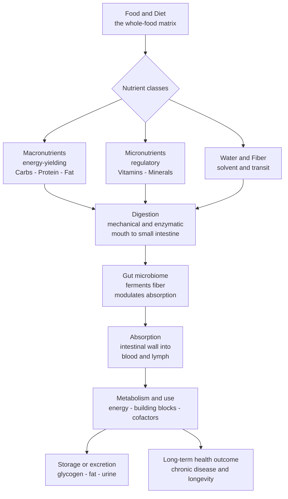

# 🥗 Nutrition Science Overview

> [!abstract] TL;DR
> Nutrition science studies how food and its constituent nutrients shape human health — and it is simultaneously one of the most consequential and least reliable sciences, because its strongest tool (long-term observational epidemiology) is drowning in confounding, measurement error, and small effect sizes. Master this note and you will hold two ideas at once: the broad-strokes evidence is actually clear and boring (eat mostly whole foods, enough protein and micronutrients, match energy to needs, minimize ultra-processed food), while the headline-grabbing specific-nutrient debates are mostly noise.

---

## Intuition

**Analogy:** Think of food as both **fuel and information**. A crude view treats a meal like petrol poured into a tank — calories in, work out. But every bite is also a *message*: it flips gene expression, feeds or starves trillions of gut microbes, spikes or steadies hormones, and tells the body whether to build, store, or repair. You are not just powering the machine; you are programming it. Nutrition science is humanity's noisy, error-prone attempt to reverse-engineer that instruction manual — reading the body's response to inputs we can barely measure, over decades we cannot afford to run as clean experiments.

Now stretch the analogy to the *research* problem. Imagine trying to reverse-engineer a program by watching millions of machines run different code — except you only get a fuzzy, self-reported log of what code each machine *thinks* it ran, the machines that chose the "healthy" code also happened to be better maintained in a hundred other ways, and any single instruction changes the output by a fraction of a percent. That is nutritional epidemiology. The instruction manual exists; our means of reading it are blurry, and the blur is systematically biased.

---

## How It Works

### Core Mechanics

**1. What "nutrients" even are.** Food decomposes into classes of chemicals the body needs. They split into three functional buckets:

- **Energy-yielding macronutrients** — **carbohydrates** (~4 kcal/g), **proteins** (~4 kcal/g), and **fats** (~9 kcal/g). These supply ATP and the raw building blocks for tissue. Alcohol (~7 kcal/g) provides energy but is not a nutrient. See [[Macronutrients_Protein_Carbs_and_Fats]].
- **Regulatory micronutrients** — **vitamins** (13 organic compounds) and **minerals** (inorganic elements like iron, calcium, zinc, iodine). They yield no energy but act as enzyme cofactors, structural components, and signalling molecules; deficiency causes specific, well-characterised diseases (scurvy, rickets, goitre). See [[Micronutrients_Vitamins_and_Minerals]].
- **Water and fiber** — water is the solvent and transport medium of all metabolism; fiber is indigestible carbohydrate that regulates transit, feeds the microbiome, and blunts glucose spikes.

**2. Essential vs non-essential.** A nutrient is **essential** if the body cannot synthesise it (or not fast enough) and it *must* come from diet: 9 essential amino acids, 2 essential fatty acids (linoleic and alpha-linolenic), all 13 vitamins, and the essential minerals. **Non-essential** nutrients can be built internally from other inputs. "Non-essential" does not mean unimportant — it means the body has a backup factory.

**3. The pipeline: food to function.** Nutrients do nothing until processed. Food is mechanically and enzymatically broken down (digestion), passed through the intestinal wall (absorption), distributed by blood and lymph, and then either burned for energy, assembled into tissue, used as cofactors, or stored/excreted. The gut microbiome sits in the middle, fermenting fiber and modulating what actually gets absorbed. See [[Metabolism_and_Energy_Balance]] and the microbiome cross-link below.

**4. From single nutrients to whole diets.** Twentieth-century nutrition was **reductionist**: isolate one nutrient, find the deficiency disease, fortify. This cured scurvy and pellagra brilliantly. But it fails for chronic disease, where **dietary patterns** — the whole matrix of foods eaten together over years — predict outcomes far better than any single nutrient. The field has shifted from "which vitamin?" to "which pattern?" (Mediterranean, DASH, plant-forward). See [[Dietary_Patterns_and_Popular_Diets]].

**5. Dietary guidelines and their politics.** Governments translate evidence into public advice: **RDAs** (Recommended Dietary Allowances) and the broader **DRIs** (Dietary Reference Intakes) set intake targets to prevent deficiency; consumer tools evolved from the 1992 **Food Pyramid** to the 2011 **MyPlate**. These are not pure science — they are negotiated documents shaped by agricultural lobbies, industry funding, and the difficulty of giving 300 million people one instruction. The 1977 low-fat guidance, later heavily criticised, is the cautionary tale.

**6. Why the science is uniquely hard.** This is the crux of the whole field:

- **Confounding.** People who eat "healthy" foods also exercise, smoke less, sleep more, and are richer. The food and the outcome share a hidden common cause — **healthy-user bias**. This is the same *common-cause* trap analysed in [[Causal_Reasoning]].
- **Measurement error.** Intake is mostly captured by **food-frequency questionnaires** — people mis-remember and under-report by 20–50%. Garbage-in exposure data produces confidently wrong estimates.
- **Tiny effect sizes.** A real dietary effect on mortality is often a relative risk of 1.1–1.3, easily swamped by the noise above.
- **RCTs are brutal.** The gold standard — randomise people to diets for decades — is prohibitively expensive, ethically constrained, and plagued by non-compliance (people eat what they want). So we rely on the weaker observational designs.
- **The result:** contradictory headlines, "coffee causes/prevents cancer" whiplash, and a genuine replication/hype crisis. Ioannidis showed that nearly every common ingredient has a published study linking it to *both* higher and lower cancer risk.

### Flow / Architecture



---

## Key Concepts

**Secondary / Foundational**
- The three macronutrients and their energy values; vitamins and minerals as non-energy regulators.
- Essential vs non-essential nutrients; deficiency diseases (scurvy, rickets, anaemia).
- The plate model: fill half with vegetables and fruit, favour whole grains and lean protein.
- Energy balance: calories in vs calories out drives weight change at the crudest level.

**Undergraduate**
- DRIs / RDAs / Upper Limits and how they are derived from deficiency and toxicity thresholds.
- The digestion–absorption pipeline and first-pass metabolism; the role of fiber and the microbiome.
- Observational study designs (cohort, case-control) vs randomised controlled trials, and the hierarchy of evidence.
- Confounding and **healthy-user bias**; why correlation in a cohort is not causation — see [[Causal_Reasoning]].
- The shift from single-nutrient reductionism to **dietary-pattern** analysis.

**Graduate / Advanced**
- Nutritional epidemiology's structural weaknesses: FFQ measurement error, residual confounding after adjustment, multiplicity of testing, publication bias, and small effect sizes (see [[Statistical_Inference_and_Hypothesis_Testing]]).
- Mendelian randomisation and pragmatic/factorial RCTs as attempts to strengthen causal inference in diet.
- The **food matrix** and **NOVA ultra-processing** classification: why the same nutrients behave differently depending on food structure and processing.
- Nutrient–gene interactions (nutrigenomics) and personalised nutrition; the microbiome as a metabolic intermediary.
- Distinguishing where evidence is robust (whole-food patterns, protein adequacy, ultra-processed harm signals) from where it is genuinely contested (most specific-nutrient claims).

---

## Python Demo

This demo shows **why nutrition epidemiology is so often wrong**. We simulate an observational study in which a hidden confounder — *health-conscious behaviour* — drives **both** a food choice and the health outcome. The food itself has **zero true effect**, yet the naive correlation "proves" it is protective. We then show that statistical adjustment (and a simulated RCT) recover the truth.

```python
# Nutrition epidemiology: how a confounder manufactures a fake "health food".
# numpy + matplotlib only.
import numpy as np
import matplotlib.pyplot as plt

rng = np.random.default_rng(42)
N = 5000

# --- The hidden confounder: "health-conscious behaviour" (exercise, non-smoking, wealth...) ---
H = rng.normal(0.0, 1.0, N)

# --- The food choice (e.g., weekly servings of "superfood X") is DRIVEN by H ---
# Health-conscious people eat more of it, plus random taste variation.
food = 0.9 * H + rng.normal(0.0, 1.0, N)

# --- The health outcome (higher = better). H helps a LOT; the food's TRUE effect is ZERO. ---
BETA_TRUE = 0.0          # food has no real causal effect
GAMMA     = 2.0          # health-consciousness strongly improves outcomes
health = BETA_TRUE * food + GAMMA * H + rng.normal(0.0, 1.0, N)

def ols(X, y):
    """Ordinary least squares via lstsq; returns coefficients including intercept."""
    Xd = np.column_stack([np.ones(len(y)), X])
    beta, *_ = np.linalg.lstsq(Xd, y, rcond=None)
    return beta

# 1) NAIVE observational estimate: regress health on food ONLY (ignores the confounder).
naive = ols(food, health)[1]

# 2) ADJUSTED estimate: include the confounder H as a covariate.
adjusted = ols(np.column_stack([food, H]), health)[1]

# 3) SIMULATED RCT: randomly ASSIGN the food, breaking its link to H.
food_rct = rng.normal(0.0, 1.0, N)                       # assignment independent of H
health_rct = BETA_TRUE * food_rct + GAMMA * H + rng.normal(0.0, 1.0, N)
rct = ols(food_rct, health_rct)[1]

print(f"Naive observational slope : {naive:+.3f}  (spurious 'protective' effect)")
print(f"Adjusted for confounder   : {adjusted:+.3f}  (collapses toward zero)")
print(f"Randomised trial estimate : {rct:+.3f}  (recovers the truth)")
print(f"TRUE causal effect        : {BETA_TRUE:+.3f}")

# ---------------- Plots ----------------
fig, (ax1, ax2) = plt.subplots(1, 2, figsize=(13, 5))

# LEFT: the confounded scatter, coloured by tertile of the hidden confounder.
tertile = np.digitize(H, np.quantile(H, [1/3, 2/3]))
colors = ["#d55e00", "#009e73", "#0072b2"]
labels = ["Low health-consciousness", "Medium", "High"]
xs = np.linspace(food.min(), food.max(), 100)
for t in range(3):
    m = tertile == t
    ax1.scatter(food[m], health[m], s=6, alpha=0.25, color=colors[t], label=labels[t])
    # within-stratum fit -> essentially FLAT (no real effect)
    b = ols(food[m], health[m])
    ax1.plot(xs, b[0] + b[1] * xs, color=colors[t], lw=2)
# the misleading pooled/naive line
bn = ols(food, health)
ax1.plot(xs, bn[0] + bn[1] * xs, "k--", lw=3, label="Naive pooled fit (spurious)")
ax1.set_xlabel("'Superfood X' intake")
ax1.set_ylabel("Health outcome (higher = better)")
ax1.set_title("Confounding: steep pooled line,\nflat lines within each stratum")
ax1.legend(fontsize=8, loc="upper left")

# RIGHT: the estimate under each method vs the truth.
methods = ["Naive\n(observational)", "Adjusted\n(for confounder)", "RCT\n(randomised)", "TRUE\neffect"]
vals = [naive, adjusted, rct, BETA_TRUE]
bar_colors = ["#d55e00", "#e69f00", "#009e73", "#000000"]
ax2.bar(methods, vals, color=bar_colors)
ax2.axhline(0, color="gray", lw=1)
ax2.set_ylabel("Estimated effect of the food")
ax2.set_title("Same data, different design =\nopposite conclusions")
for i, v in enumerate(vals):
    ax2.text(i, v + 0.02, f"{v:+.2f}", ha="center", fontweight="bold")

plt.tight_layout()
plt.show()
```

**What you should see.** The naive slope is strongly positive — a splashy headline that "Superfood X protects your health." But the lines *within* each health-consciousness stratum are flat, and both adjustment and the RCT drive the estimate back to ~0. The food never did anything; the *type of person* who eats it did. This is exactly the **common-cause** structure formalised in [[Causal_Reasoning]] and the reason the [[Scientific_Reasoning_and_Method]] literature flags nutrition as a poster child for the replication crisis: with weak designs and tiny true effects, a confounder can manufacture any story you like.

---

## Real-World Applications

> **Example — the vitamin E and beta-carotene reversal.** Decades of observational cohorts found people with high antioxidant intake had less cancer and heart disease, sparking a supplement boom. When finally tested in large RCTs (ATBC, CARET), beta-carotene supplements *increased* lung cancer in smokers and vitamin E showed no benefit. The observational signal was pure healthy-user confounding — the antioxidants were a marker for people who ate more vegetables and lived better, not a cause of health.

> **Example — the NOVA / ultra-processed food shift.** Rather than argue about single nutrients, the NOVA classification groups foods by *degree of industrial processing*. Large cohorts and a landmark 2019 controlled feeding trial (Hall et al., NIH) found people ate ~500 more kcal/day and gained weight on ultra-processed diets matched for macronutrients — evidence that the **food matrix and processing**, not just the nutrient label, drive outcomes.

> **Example — public guidelines (MyPlate, Dietary Guidelines for Americans).** The evolution from the fat-phobic 1977/1992 pyramid to the pattern-based 2020–2025 guidelines shows the field's methodological maturation and its political constraints: recommendations must survive both the evidence review and the agricultural lobby.

---

## Common Pitfalls

- **Treating cohort correlations as causal.** "People who eat X live longer" almost always carries healthy-user bias. Ask: could a *type of person* explain both the food and the outcome? This is [[Cognitive_Biases_and_Heuristics]] meeting bad study design.
- **Relative vs absolute risk theatre.** "50% higher risk!" of a disease affecting 2 in 10,000 is 1 extra case per 10,000 — often trivial. Headlines report relative risk to inflate importance; always demand the absolute numbers.
- **Single-nutrient tunnel vision.** Isolating "sugar" or "saturated fat" ignores the food matrix — nuts, cheese, and processed meat carry saturated fat with wildly different effects.
- **Ignoring industry funding.** Studies funded by a food or supplement maker are far more likely to report favourable results. Check the conflict-of-interest disclosure before the abstract.
- **Nutritional whiplash / novelty chasing.** Each new "superfood" or villain nutrient is usually a small, unreplicated observational finding. Weight of evidence beats the latest paper — the concern of [[Media_Literacy_and_Source_Evaluation]] and [[Research_Ethics_and_Human_Subjects]].
- **Confusing "no strong evidence" with "no effect."** Absence of a clean RCT does not mean a pattern is useless; it means we are uncertain. The robust priors (mostly-whole-foods, adequate protein/micronutrients, energy balance) remain the safe default.

---

## Related Concepts

**Within this vault (section roadmap):**
- [[Metabolism_and_Energy_Balance]] — where the nutrients go after absorption; the calories-in/calories-out engine and its hormonal nuance.
- [[Macronutrients_Protein_Carbs_and_Fats]] — deep dive on the energy-yielding trio and their quality dimensions.
- [[Micronutrients_Vitamins_and_Minerals]] — the 13 vitamins and essential minerals, deficiencies, and toxicity limits.
- [[Dietary_Patterns_and_Popular_Diets]] — the whole-diet lens (Mediterranean, DASH, keto, plant-forward) that outperforms single-nutrient thinking.
- [[Nutrition_Myths_and_Evidence]] — applying evidence-hierarchy tools to debunk specific claims.

**Cross-vault (verified):**
- [[Causal_Reasoning]] — the formal machinery of confounding, common causes, and counterfactuals that explains why nutrition correlations mislead.
- [[Scientific_Reasoning_and_Method]] — falsification, the hierarchy of evidence, and the replication crisis that nutrition science embodies.
- [[Statistical_Inference_and_Hypothesis_Testing]] — measurement error, multiplicity, small effect sizes, and why p-hacking thrives in dietary data.
- [[Cognitive_Biases_and_Heuristics]] — the halo effects and motivated reasoning behind "superfood" hype and healthy-user bias.
- [[Media_Literacy_and_Source_Evaluation]] — reading nutrition headlines critically and spotting relative-risk inflation.
- [[Research_Ethics_and_Human_Subjects]] — why long-term diet RCTs are so hard to run ethically and at scale.
- [[Metabolism_and_Bioenergetics]] — the biochemistry of how macronutrients become ATP.
- [[Metagenomics_and_Microbiome]] — the gut ecosystem that sits between what you eat and what you absorb.

---

## Review Questions

1. **Conceptual:** Explain, using the fuel-and-information analogy, why "a calorie is a calorie" is true for energy balance but misleading for metabolic health. What does the food matrix add beyond the calorie count?
2. **Scenario:** A new cohort study reports that people who drink kombucha daily have 25% lower rates of type 2 diabetes. A colleague wants to start selling it as a diabetes preventive. Walk through the specific biases (confounding, healthy-user bias, FFQ error, relative-vs-absolute risk) you would check before believing the claim, and describe what study design would actually settle it.
3. **Trade-off:** Long-term dietary RCTs give the cleanest causal answers but are rare because of cost, compliance, and ethics. Given that reality, how should a practitioner weigh a large well-adjusted observational cohort against a short, small RCT for a question like "does replacing red meat with legumes reduce cardiovascular events"? Where does each design fail?

---

## Sources

- Ioannidis JPA. "The Challenge of Reforming Nutritional Epidemiology Research." *JAMA* 320(10):969–970, 2018. https://doi.org/10.1001/jama.2018.11025
- Schoenfeld JD, Ioannidis JPA. "Is everything we eat associated with cancer? A systematic cookbook review." *American Journal of Clinical Nutrition* 97(1):127–134, 2013. https://doi.org/10.3945/ajcn.112.047142
- Monteiro CA, et al. "Ultra-processed foods: what they are and how to identify them." *Public Health Nutrition* 22(5):936–941, 2019. https://doi.org/10.1017/S1368980018003762
- Hall KD, et al. "Ultra-Processed Diets Cause Excess Calorie Intake and Weight Gain." *Cell Metabolism* 30(1):67–77, 2019. https://doi.org/10.1016/j.cmet.2019.05.008
- U.S. Department of Agriculture and HHS. *Dietary Guidelines for Americans, 2020–2025* / MyPlate. https://www.dietaryguidelines.gov

---

#health #nutrition #diet #nutrition-science #evidence
