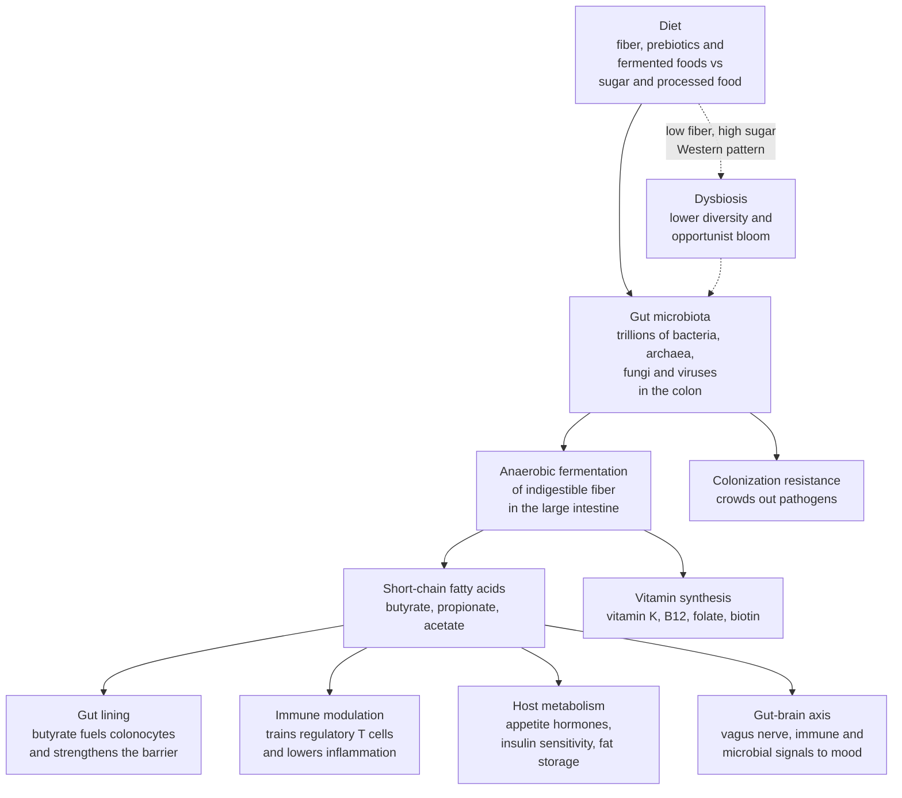

# 🦠 The Gut Microbiome and Nutrition

> [!abstract] TL;DR
> Your large intestine houses **trillions of microorganisms** — mostly bacteria, plus archaea, fungi, and viruses — collectively called the **gut microbiome**, sometimes the body's **"forgotten organ."** They earn their keep by doing chemistry your own cells cannot: they **ferment the dietary fiber you can't digest** into **short-chain fatty acids (SCFAs)** — chiefly **butyrate, propionate, and acetate** — which fuel your gut lining, calm your immune system, tune your metabolism, and even signal to your brain. **Diet is the single most powerful and fastest lever** over this community: **fiber and prebiotics feed the beneficial fermenters**, while a **Western low-fiber, high-processed diet starves them and collapses diversity** — a state called **dysbiosis**. The best way to understand the microbiome is as an **ecosystem** governed by competition, cooperation, and resilience — with **alternative stable states** just like a lake or a coral reef. The science is real and important, but the consumer market (probiotic pills, microbiome tests) is far ahead of the evidence, so the honest skill is separating **what is established** from **what is oversold**.

## Intuition

**Analogy: you are an ecosystem, and your fork is the gardener.**

Picture the inside of your colon not as plumbing but as a **dense, warm rainforest teeming with trillions of tiny tenants**. You did not hire them individually, yet they outnumber your own cells and carry roughly a hundred times more genes than your genome does. Like any rainforest, this one is a **community locked in competition and cooperation**: some species thrive on one kind of food, others on another, and the mix that flourishes depends almost entirely on **what rains down from above** — that is, on what you eat. Feed the forest a steady supply of **fibrous plants** and you cultivate a **lush, diverse canopy** of beneficial fermenters that, in return, produce chemicals that keep the whole system healthy. Feed it a monotonous diet of **sugar and refined, fiber-stripped food**, and the diverse canopy thins into a **weedy monoculture** — fewer species, more opportunists, less of the good chemistry.

The crucial twist is that this is a **two-way trade, not a one-way handout**. You feed the microbes the food you cannot use; they feed *you* back with vitamins, gut-lining fuel, immune training, and metabolic signals. You are not simply *hosting* an ecosystem — you are **entangled with it**, and every meal is an act of gardening whose harvest is your own health.

---

## How It Works

### What the gut microbiome *is*

The **gut microbiome** is the entire community of microorganisms living in the digestive tract — overwhelmingly in the **colon**, where oxygen is scarce and **anaerobic** fermenters dominate. Its members span every microbial kingdom:

- **Bacteria** — by far the dominant players, numbering on the order of **tens of trillions** of cells. Adult microbiomes are dominated by a handful of **phyla**, chiefly the **Bacillota** (formerly *Firmicutes*) and **Bacteroidota** (formerly *Bacteroidetes*), with smaller but important contributions from **Actinomycetota** (e.g. *Bifidobacterium*), **Pseudomonadota** (formerly *Proteobacteria*, which bloom in disease), and **Verrucomicrobiota** (e.g. *Akkermansia*).
- **Archaea** — methane-producing microbes such as *Methanobrevibacter smithii* that scavenge fermentation by-products.
- **Fungi** (the **mycobiome**) and **viruses** (mostly **bacteriophages**, the **virome**), which prey on and regulate the bacteria.

Two ideas frame its significance. First, the microbiome behaves like a **"forgotten organ"** — a metabolically active tissue we simply overlooked, encoding functions our own genome never evolved. Second, **diversity itself is a marker of health**: a rich, even community is generally more stable and resilient, while a **collapse in diversity** repeatedly shows up alongside disease.

### What the gut microbiome *does*

The microbiome is not a passenger; it runs a chemical factory with several product lines:

1. **Fiber fermentation into SCFAs — the headline function.** Your enzymes cannot break down most **dietary fiber and resistant starch**. Colonic bacteria can. They ferment this material anaerobically into **short-chain fatty acids**: **butyrate, propionate, and acetate**. These are not waste — they are the microbiome's currency of influence:
   - **Butyrate** is the **preferred fuel of the colonocytes** (the cells lining your colon). It strengthens the gut barrier and is broadly **anti-inflammatory**.
   - **Propionate** travels to the **liver**, feeding into gluconeogenesis and influencing cholesterol and appetite.
   - **Acetate** enters general circulation and affects peripheral metabolism and appetite signaling.
2. **Vitamin synthesis.** Gut bacteria manufacture **vitamin K** and several **B vitamins** (B12, folate, biotin, riboflavin) that supplement dietary intake.
3. **Immune training and regulation.** The microbiome **educates the immune system** from birth, calibrating the balance between tolerance and defense. SCFAs (especially butyrate) promote **regulatory T cells** that damp down inappropriate inflammation — a bridge between what you eat and how inflamed you are.
4. **Colonization resistance.** By occupying niches and consuming resources, resident microbes **crowd out invading pathogens** — a competitive-exclusion effect straight out of ecology.
5. **Metabolism of drugs and dietary compounds.** The microbiome activates, inactivates, or transforms **medications** (altering their efficacy and toxicity) and metabolizes dietary compounds — for example, converting choline and carnitine from red meat into **TMAO**, a molecule linked to cardiovascular risk.

### Diet as the primary lever

Of everything that shapes the microbiome — genetics, birth mode, antibiotics, age — **diet is the most powerful and the most controllable**:

- **Fiber and prebiotics are the key food.** **Prebiotics** are indigestible fibers (inulin, resistant starch, pectins, fructans) that **selectively feed beneficial fermenters**. More diverse plant fiber generally means a more diverse, SCFA-rich community.
- **Fermented foods and probiotics** (yogurt, kefir, sauerkraut, kimchi) introduce **live microbes**, and human trials suggest fermented-food-rich diets can **raise microbial diversity and lower inflammatory markers**.
- **The Western diet drives dysbiosis.** A pattern high in **refined sugar, fat, and processed food but low in fiber** starves the fermenters, **reduces diversity**, and shifts the community toward opportunists — the low-diversity, pro-inflammatory state called **dysbiosis**.
- **The microbiome reshapes fast.** Controlled feeding studies show the community's **composition and activity shift within days** of a major dietary change — though restoring lost diversity after long-term damage is far slower and harder.

### The gut-brain axis (with appropriate caution)

The gut and brain talk in **both directions** through the **gut-brain axis**, via three channels: the **vagus nerve** (a direct neural line), the **immune system** (inflammatory signaling), and **microbial metabolites** (SCFAs and neurotransmitter precursors — gut microbes influence serotonin and GABA-related pathways). Animal studies and early human data link the microbiome to **mood, stress, and behavior**. This is a genuinely exciting frontier — but it is also the area most inflated by hype: much of the strongest evidence is in mice, and human causal claims about "psychobiotics" curing depression remain **preliminary**.

### The ecology and disease view

Because the microbiome is a **competitive-cooperative ecosystem**, it inherits the properties of one: **resilience, diversity-stability relationships, and alternative stable states**. A healthy, high-diversity community resists invasion and bounces back from perturbation; a degraded one can get **stuck in a dysbiotic regime** that resists recovery — the same **hysteresis** seen in lakes and reefs (see [[Ecological_Resilience_and_Ecosystems]]).

The microbiome is **associated** with obesity, inflammatory bowel disease (IBD), type 2 diabetes, and even neurological conditions — but here **correlation-versus-causation caution is essential**. Disease changes diet and gut environment, which changes the microbiome, so most associations cannot tell us which way the arrow points. The **clearest causal case** is **fecal microbiota transplant (FMT)** for **recurrent *Clostridioides difficile* infection**, where transplanting a healthy donor community **cures** patients at high rates — a decisive demonstration that the community itself can be the therapeutic agent.



---

## Key Concepts

### Secondary (explain to anyone)
- **You host trillions of microbes** in your gut, and most of them help you.
- **Fiber is their food.** The parts of plants you can't digest are exactly what feeds the good bacteria.
- **They pay you back** with vitamins, gut-lining fuel, and a better-trained immune system.
- **Junk food starves the good microbes.** A low-fiber, high-sugar diet shrinks the diversity of your gut community — a state called **dysbiosis**.
- **More variety of plants means a healthier, more diverse gut garden.**

### Undergraduate (some biology background)
- **Short-chain fatty acids (SCFAs).** Fermentation products (butyrate, propionate, acetate) that fuel colonocytes, promote regulatory T cells, and signal to liver, fat, and brain.
- **Prebiotics vs probiotics.** Prebiotics are fibers that *feed* resident microbes; probiotics are *live* microbes you consume. Fermented foods deliver both plus their metabolites.
- **Dominant phyla and diversity as a marker.** Bacillota and Bacteroidota dominate; higher **alpha diversity** (richness and evenness within a person) generally tracks with health, and its loss with disease.
- **Colonization resistance.** Residents exclude pathogens by competitive exclusion — an ecological principle applied to the gut (see [[Community_Ecology]]).
- **Correlation vs causation.** Most microbiome-disease links are associations; disease alters the microbiome as much as the reverse. FMT for *C. difficile* is the cleanest causal exception.

### Graduate (systems-level thinking)
- **The microbiome as a complex adaptive system.** Locally interacting species self-organize into emergent, self-reinforcing regimes with **alternative stable states** and **hysteresis** — a healthy community and a dysbiotic one can both persist under similar diets depending on history (see [[Ecological_Resilience_and_Ecosystems]]).
- **Cross-feeding and functional redundancy.** Metabolic hand-offs (primary fermenters feed butyrate producers) create niches; **functional redundancy** means diversity buffers function even as species composition shifts — the ecological insurance effect applied to the gut.
- **The gut-brain-immune axis as bidirectional signaling.** Vagal afferents, cytokine signaling, and microbial metabolites form feedback loops linking the enteric and central nervous systems — mechanistically plausible, but human causal evidence remains thin.
- **Enterotypes and inter-individual variation.** Attempts to cluster humans into discrete community types are contested; variation is better viewed as a continuum shaped by long-term dietary patterns.
- **The evidence-versus-hype frontier.** Distinguishing established results (fiber raises SCFAs; FMT cures *C. difficile*) from oversold products (most consumer microbiome tests lack clinical validity; probiotic benefits are strain- and condition-specific) is itself a graduate-level skill in scientific reasoning.

---

## Python Demo

We model the gut microbiome as an **ecosystem** using a **generalized Lotka-Volterra competition model** — the same mathematics used for competing species in a rainforest or lake (see [[Community_Ecology]], [[Population_Ecology]]). Six microbial "guilds" compete for shared space: **three fiber-fermenting butyrate producers** and **three sugar-loving opportunists**. **Diet enters as the carrying capacity** of each guild — a high-fiber diet raises the fermenters' ceiling, while a low-fiber/high-sugar diet raises the opportunists'. We simulate the community under each diet and track two ecological readouts: **abundance over time** and the **Shannon diversity index** (richness *and* evenness). The result reproduces **dysbiosis** as an emergent property: starve the fermenters and the community collapses toward a low-diversity, opportunist-dominated regime. Uses only `numpy` and `matplotlib`.

```python
# The gut microbiome as an ecosystem: generalized Lotka-Volterra competition
# between fiber-fermenting "good" bacteria and sugar-loving opportunists, under
# two diets. Diet sets each guild's carrying capacity. We track abundance and
# Shannon diversity to show how a low-fiber diet drives dysbiosis.
# numpy + matplotlib only.
import numpy as np
import matplotlib.pyplot as plt

species = ["Bifido (fiber)", "Faecali (fiber)", "Roseburia (fiber)",
           "Bacteroides (mixed)", "Proteo (sugar)", "Entero (sugar)"]
n = len(species)
fiber_guild = np.array([True, True, True, False, False, False])

# Competition matrix A: self-limitation = 1 on the diagonal, weaker cross-species
# competition (niche overlap) off-diagonal, so coexistence is possible.
alpha = 0.20
A = np.full((n, n), alpha)
np.fill_diagonal(A, 1.0)

# Intrinsic growth rates: opportunists grow a touch faster (ecological "weeds").
r = np.array([1.00, 0.95, 0.90, 0.80, 1.10, 1.05])

# Diet-dependent carrying capacities = available substrate per guild.
#   High-fiber diet: fiber-fermenters have a high ceiling, opportunists low.
#   Low-fiber/high-sugar: reversed -- fermenters starve, opportunists bloom.
K_high_fiber = np.array([1.00, 0.90, 0.85, 0.45, 0.25, 0.20])
K_low_fiber  = np.array([0.08, 0.06, 0.05, 0.40, 1.10, 0.60])

def simulate(K, steps=5000, dt=0.01):
    """Euler-integrate dN_i/dt = r_i * N_i * (1 - (A @ N)_i / K_i)."""
    N = np.full(n, 0.05)                 # all guilds start small and equal
    traj = np.empty((steps, n))
    for t in range(steps):
        competition = A @ N
        dN = r * N * (1.0 - competition / K)
        N = np.clip(N + dt * dN, 0.0, None)   # abundances cannot go negative
        traj[t] = N
    return traj

def shannon(traj):
    """Shannon diversity H = -sum p_i ln p_i at each timestep (richness+evenness)."""
    totals = traj.sum(axis=1, keepdims=True)
    totals[totals == 0.0] = 1.0
    p = traj / totals
    terms = np.where(p > 0.0, p * np.log(p), 0.0)
    return -terms.sum(axis=1)

traj_hi = simulate(K_high_fiber)
traj_lo = simulate(K_low_fiber)
H_hi, H_lo = shannon(traj_hi), shannon(traj_lo)
time = np.arange(traj_hi.shape[0]) * 0.01

# Green shades = fiber-fermenters (good), warm shades = opportunists.
colors = ["#166534", "#16a34a", "#4ade80", "#f59e0b", "#dc2626", "#7f1d1d"]

fig, axes = plt.subplots(1, 3, figsize=(15, 4.6))

axes[0].stackplot(time, traj_hi.T, labels=species, colors=colors, alpha=0.9)
axes[0].set_title("High-fiber diet: diverse, fermenter-rich")
axes[0].set_xlabel("time"); axes[0].set_ylabel("abundance")
axes[0].legend(loc="upper right", fontsize=6)

axes[1].stackplot(time, traj_lo.T, labels=species, colors=colors, alpha=0.9)
axes[1].set_title("Low-fiber / high-sugar: opportunist bloom = dysbiosis")
axes[1].set_xlabel("time"); axes[1].set_ylabel("abundance")

axes[2].plot(time, H_hi, color="#166534", lw=2.4, label="high-fiber diet")
axes[2].plot(time, H_lo, color="#dc2626", lw=2.4, label="low-fiber diet")
axes[2].set_title("Shannon diversity over time")
axes[2].set_xlabel("time"); axes[2].set_ylabel("diversity index  H")
axes[2].legend(loc="lower left", fontsize=8); axes[2].grid(alpha=0.25)

plt.tight_layout()
plt.show()

def report(traj, H, label):
    final = traj[-1]
    survivors = int((final > 1e-3).sum())
    fiber_frac = final[fiber_guild].sum() / max(final.sum(), 1e-9)
    print(f"{label:16s} | surviving guilds={survivors} | "
          f"fiber-fermenter share={fiber_frac:5.1%} | Shannon H={H[-1]:.3f}")

print("Final community state:")
report(traj_hi, H_hi, "high-fiber")
report(traj_lo, H_lo, "low-fiber")
# Typical run: the high-fiber community settles into a richer, more even mix
# dominated by butyrate producers, with Shannon H around ~1.2; the low-fiber
# community loses its fermenters, an opportunist blooms, and H falls to ~0.9.
# Lower diversity + loss of the "good" guild is exactly what dysbiosis looks like.
```

The two stackplots make the ecology visible: under the **high-fiber diet** the three green fiber-fermenters dominate a broad, layered canopy, while under the **low-fiber/high-sugar diet** they **crash toward extinction** and a single warm-colored opportunist **blooms** to take over. The third panel quantifies the damage — **Shannon diversity is markedly lower** for the low-fiber diet. This is **dysbiosis emerging from first principles**: no single microbe "decided" to make you unhealthy; the *community structure* shifted because the *resource landscape* shifted, exactly as an ecosystem responds to a change in its environment (see [[Ecosystems_and_Energy_Flow]]).

---

## Real-World Applications

> **Example — Fecal microbiota transplant (FMT) for *C. difficile*.** This is the microbiome's clearest clinical win and the strongest causal proof that the community *itself* is therapeutic. In **recurrent *Clostridioides difficile* infection**, repeated antibiotics have wrecked colonization resistance, letting *C. diff* dominate. Transplanting a **whole healthy donor microbiome** restores a diverse, competitive community that **crowds the pathogen out**, curing patients at rates well above antibiotics — a direct application of ecological competitive exclusion.

- **Prebiotic and high-fiber dietary interventions.** Public-health nutrition increasingly targets **fiber diversity** ("eat 30 different plants a week") precisely because plant variety, not any single supplement, most reliably raises microbial diversity and SCFA production.
- **Fermented-food trials.** Stanford's controlled feeding study (Sonnenburg/Gardner, 2021) found that a **fermented-food-rich diet increased microbiome diversity and lowered inflammatory markers**, whereas a high-fiber diet alone did not in the same short window — evidence that intervention effects are specific and measurable.
- **Personalized nutrition.** The Zoe/Weizmann line of research showed that **post-meal glucose responses vary between individuals partly by microbiome composition**, motivating microbiome-informed dietary advice (still an emerging, commercially entangled area).
- **Pharmacomicrobiomics.** Because gut microbes metabolize drugs (e.g., inactivating the Parkinson's drug **levodopa**, or modulating **immunotherapy** response in cancer), the microbiome is being studied as a factor in **drug efficacy and dosing**.
- **Infant and early-life nutrition.** Breast milk contains **human milk oligosaccharides (HMOs)** the infant cannot digest — they exist specifically to feed *Bifidobacterium*, a striking evolutionary example of diet engineered to cultivate the microbiome.

---

## Common Pitfalls

- **Treating "probiotic" as a magic word.** Benefits are **strain-specific and condition-specific**; a random probiotic pill is not guaranteed to survive digestion, colonize, or do anything for *your* condition. Most marketed strains lack evidence for the claims on the label.
- **Buying consumer microbiome tests as diagnostics.** Direct-to-consumer "gut health" tests deliver a species readout dressed up as a medical verdict, but the science can't yet translate most results into validated, actionable advice. They are **oversold**.
- **Confusing correlation with causation.** "People with disease X have microbiome Y" almost never establishes that Y *causes* X — disease changes diet and gut chemistry, which changes the microbiome. Reversing the arrow without a trial is the field's most common error.
- **Extrapolating mouse gut-brain findings to humans.** Dramatic behavioral results in germ-free mice are mechanistically fascinating but **do not prove** that a supplement will change human mood. Treat "psychobiotic" cure claims with skepticism.
- **Chasing a single "good" bacterium.** Health is a property of the **whole community's diversity and function**, not the abundance of one hero species. Ecological thinking beats magic-bullet thinking.
- **Assuming diversity recovers as fast as it collapses.** Diet reshapes the microbiome within days, but **long-term low-fiber damage and antibiotic-driven extinctions can be slow or impossible to fully reverse** — the hysteresis of a degraded ecosystem.
- **Ignoring fiber while adding supplements.** The highest-leverage, best-evidenced move is boring: **eat more and more varied plant fiber**. No pill substitutes for feeding the community its actual food.

---

## Related Concepts

- [[Bacteria_and_Archaea]] — the prokaryotes that make up the bulk of the microbiome; this note applies their biology to the gut community.
- [[The_Digestive_and_Excretory_Systems]] — the anatomical and physiological context (the colon, absorption, the liver) in which the microbiome operates.
- [[The_Innate_Immune_System]] — the immune machinery the microbiome trains and regulates via SCFAs and regulatory T cells.
- [[The_Adaptive_Immune_System]] — how early microbial exposure calibrates tolerance versus defense across life.
- [[Community_Ecology]] — competitive exclusion, niches, and keystone species are exactly the dynamics that structure the gut community and provide colonization resistance.
- [[Population_Ecology]] — the logistic-growth and carrying-capacity models behind the Lotka-Volterra demo used here.
- [[Ecosystems_and_Energy_Flow]] — the flow of matter and energy (fiber to SCFAs) framing the microbiome as a functioning ecosystem.
- [[Ecological_Resilience_and_Ecosystems]] — alternative stable states, resilience, and hysteresis explain why dysbiosis can get "stuck" and resist recovery.
- [[Complex_Adaptive_Systems]] — the microbiome is a textbook CAS: locally interacting, self-organizing, emergent, with no controller.
- [[Feedback_Loops_and_Causality]] — the bidirectional diet-microbiome-host feedbacks (and the correlation-vs-causation trap) that make the field hard to interpret.
- [[Metagenomics_and_Microbiome]] — the DNA-sequencing methods (16S rRNA, shotgun metagenomics) that let us read the community without culturing it.
- [[Carbohydrates_and_Lipids]] — the biochemistry of dietary fiber and resistant starch, the substrates microbes ferment.
- [[Autonomic_Nervous_System]] — the vagus nerve is the direct neural channel of the gut-brain axis.
- [[Health_and_Wellbeing_Overview]] — nutrition is one of the vault's six health pillars; the microbiome is a key mechanism linking diet to health, and a showcase of the evidence-vs-hype problem.

---

## Review Questions

**Tier 1 — Recall / comprehension:**
1. What are short-chain fatty acids, which three dominate, and by what process does the microbiome produce them from your diet? Name one specific effect of butyrate.
2. Define **dysbiosis** and explain, in one sentence each, how a high-fiber diet and a Western low-fiber diet push the community in opposite directions.

**Tier 2 — Application / analysis:**
3. A study reports that people with obesity have a lower ratio of Bacteroidota to Bacillota than lean people. Using the correlation-versus-causation caution in this note, give two distinct reasons this does *not* establish that the microbiome causes obesity, and describe the kind of experiment that would strengthen a causal claim.
4. In the Python demo, the low-fiber diet drives the fiber-fermenters extinct and one opportunist blooms. Explain, in ecological terms (carrying capacity, competition, competitive exclusion), *why* changing only the "resource landscape" — not the species list — produces this collapse in diversity.

**Tier 3 — Synthesis / evaluation:**
5. FMT reliably cures recurrent *C. difficile* infection but has largely disappointed as a treatment for obesity or IBD. Using the ecology of alternative stable states and colonization resistance, argue why the *C. difficile* case is uniquely favorable to a "reset the community" intervention while the others are not.
6. A friend shows you a $200 consumer microbiome test recommending specific probiotic pills and forbidden foods based on their sample. Using the evidence-versus-hype distinctions in this note, evaluate what parts of this are defensible and what parts are oversold — and state the single highest-leverage, best-evidenced dietary change you would recommend instead.

---

## Sources

- Sonnenburg, J. L., & Sonnenburg, E. D. (2019). "The ancestral and industrialized gut microbiota and implications for human health." *Nature Reviews Microbiology, 17*, 383-390. — fiber, diversity loss, and the Western-diet effect. https://www.nature.com/articles/s41579-019-0191-8
- Wastyk, H. C., et al. (2021). "Gut-microbiota-targeted diets modulate human immune status." *Cell, 184*(16), 4137-4153. — the Stanford fermented-food-vs-fiber trial showing raised diversity and lower inflammation. https://www.cell.com/cell/fulltext/S0092-8674(21)00754-6
- Cryan, J. F., et al. (2019). "The Microbiota-Gut-Brain Axis." *Physiological Reviews, 99*(4), 1877-2013. — comprehensive review of gut-brain signaling, with appropriate limits on human causal claims. https://journals.physiology.org/doi/full/10.1152/physrev.00018.2018
- van Nood, E., et al. (2013). "Duodenal infusion of donor feces for recurrent *Clostridium difficile*." *New England Journal of Medicine, 368*, 407-415. — the landmark RCT establishing FMT's efficacy. https://www.nejm.org/doi/full/10.1056/NEJMoa1205037
- Valdes, A. M., Walter, J., Segal, E., & Spector, T. D. (2018). "Role of the gut microbiota in nutrition and health." *BMJ, 361*, k2179. — an accessible, evidence-calibrated overview of diet and the microbiome. https://www.bmj.com/content/361/bmj.k2179

---

#health #nutrition #gut-microbiome #fiber #microbiota
