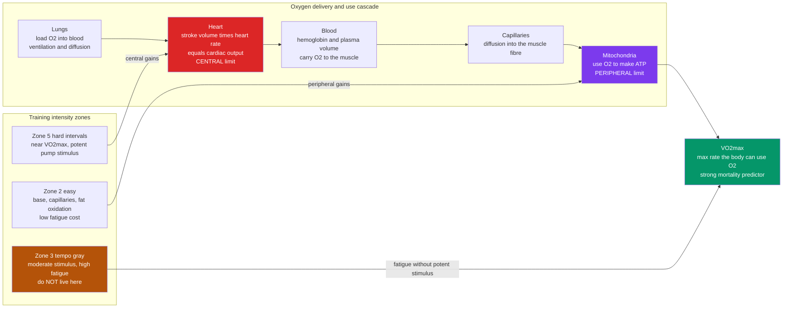

# 🏃 Cardiovascular Fitness and Aerobic Training

> [!abstract] TL;DR
> **Cardiorespiratory fitness (CRF)** is your capacity to sustain whole-body aerobic exercise, and its single best summary number is **VO2max** — the maximum rate at which your body can take in, deliver, and burn oxygen. VO2max is set by a chain that runs from the lungs, through the heart and blood, into the muscle's mitochondria, and it is one of the **strongest modifiable predictors of all-cause mortality** — a low-fit person carries risk comparable to a smoker or a diabetic. The good news is that this number is highly trainable: aerobic work grows a bigger, stronger heart, more blood, denser capillaries, and more mitochondria. The trainable levers are **volume** and **intensity distribution**, and the surprising, well-replicated finding is that **polarized training** — lots of genuinely easy work plus a little genuinely hard work, while *avoiding* the moderate "gray zone" — tends to raise VO2max more than a steady diet of moderate effort, for the *same* total load.

---

## Intuition

**Analogy: aerobic fitness is the size of your engine.**

Two cars merge onto a highway. A small four-cylinder engine has to rev to 5,000 rpm, roaring and straining, just to keep up. A big engine cruises at the same speed at 2,000 rpm — quiet, barely working, with huge reserve left for a sudden hill. Same road, same speed, wildly different **effort**, because one engine is simply larger.

Your cardiorespiratory system is that engine, and **VO2max is its displacement** — how much oxygen it can move and burn per minute at full throttle. A bigger aerobic engine does every ordinary task — climbing stairs, carrying groceries, recovering from a sprint for the bus — at a lower fraction of its maximum. It idles lower (a slower resting heart rate), it has more reserve for emergencies, and it lasts longer before wearing out. Training is **engine-building**: you cannot swap in a new motor, but you can bore it out — a larger pump, more fuel lines, more combustion chambers — so that the same daily life costs you less, and so that the physiological "warning lights" of chronic disease stay off far longer.

---

## How It Works

### The oxygen cascade: from lungs to mitochondria

Aerobic exercise is a **supply chain for oxygen**. Every link must move O2 forward, and the whole chain is only as fast as its rate-limiting step. Physiologists formalize this as the **Fick equation**:

> VO2 = cardiac output × arterio-venous oxygen difference = heart rate × stroke volume × the O2 the muscles extract from each litre of blood.

Read left to right, the cascade is:

1. **Lungs** — ventilation drives air to the alveoli, where oxygen diffuses into the blood and binds hemoglobin. In healthy people at sea level the lungs are rarely the bottleneck; they usually saturate the blood fully even at max effort (see [[The_Circulatory_and_Respiratory_Systems]]).
2. **Heart** — the pump. Cardiac output equals **heart rate × stroke volume** (blood ejected per beat). This is the classic **central limit** to VO2max: how much oxygenated blood the heart can push per minute.
3. **Blood** — hemoglobin concentration and total **blood/plasma volume** set how much oxygen the pump can actually carry and how well it fills between beats.
4. **Capillaries** — the delivery network in the muscle; more capillaries per fibre means shorter diffusion distances and more time for O2 to unload.
5. **Mitochondria** — the furnaces. They consume O2 to regenerate ATP via **oxidative phosphorylation** (see [[Oxidative_Phosphorylation]] and [[Mitochondria_and_Chloroplasts]]). Their density and enzyme content set the **peripheral limit** — how much oxygen the muscle can actually *use* once it arrives.

### VO2max: central vs peripheral limits

Which link caps VO2max? For **whole-body** exercise in trained people, the evidence points mostly at the **central** side — the heart's maximal stroke volume and cardiac output — because you can breathe supplemental oxygen or add muscle mass and still hit a ceiling set by the pump. The **peripheral** machinery (capillaries, mitochondria) matters enormously for **endurance at a given pace** and for **fat oxidation**, but it is usually not the hard ceiling on the single VO2max number. This central-vs-peripheral split explains a lot: interval work near max preferentially stresses the pump (central), while high-volume easy work preferentially builds the muscle's oxygen-using machinery (peripheral) — and you want both.

**How it is measured.** The gold standard is a **graded exercise test** on a treadmill or bike with a metabolic cart measuring inhaled and exhaled gases; VO2max is confirmed by a plateau in oxygen uptake despite rising workload. It is reported in **mL of O2 per kg of body mass per minute**. Field estimates (Cooper 12-minute run, the multistage "beep" test, submaximal heart-rate extrapolation, or wearable estimates from pace-versus-heart-rate) are cheaper but less accurate.

### How aerobic training remodels the body

Chronic aerobic work triggers a coordinated set of adaptations, each addressing a different link in the cascade (the general stress-recovery-adaptation logic is covered in [[Exercise_Physiology_Overview]]):

- **A larger, stronger heart (increased stroke volume).** The left ventricle enlarges and fills more completely (**eccentric hypertrophy**, the "athlete's heart"), so each beat ejects more blood. This is the headline central adaptation and the main driver of a rising VO2max and a **falling resting heart rate**.
- **Increased blood and plasma volume.** One of the *fastest* adaptations — plasma volume can expand within days. More blood means better ventricular filling, better stroke volume, and better temperature regulation.
- **Capillary and mitochondrial density.** More capillaries and more (and larger) mitochondria, with more oxidative enzymes, driven by signaling through **PGC-1α**. This is the peripheral engine growing.
- **Improved fat oxidation and metabolic flexibility.** A trained muscle burns a higher fraction of **fat** at any given submaximal pace, sparing limited glycogen and pushing the point at which lactate accumulates to a higher intensity — the metabolic core of endurance (links to [[Metabolism_and_Energy_Balance]]).

### Measuring intensity: heart-rate zones, thresholds, and RPE

You cannot manage intensity you cannot measure. Three ladders are used:

- **Heart-rate zones.** The most practical proxy. The naive "percent of HRmax" method ignores individual resting heart rate, so the better tool is the **Karvonen / heart-rate-reserve (HRR)** method: work with the *range* you actually have, HRR = HRmax − HRrest, and target `HRrest + fraction × HRR`. A fit person with a low resting heart rate has a wider reserve, so the same percentage lands at a very different absolute pace.
- **Physiological thresholds.** The truth beneath the proxies. The **first ventilatory / aerobic threshold** marks the top of comfortable "all-day" effort; the **lactate threshold** (or second ventilatory threshold) marks the intensity above which blood lactate rises steeply and duration collapses. These thresholds, not fixed heart-rate numbers, are what training zones are really trying to bracket.
- **RPE (Rating of Perceived Exertion).** The subjective 6–20 Borg scale or a simple 1–10. Crude but robust — it needs no device, self-corrects for heat, fatigue, and caffeine, and correlates well with the physiological load.

### Training methods and the polarized model

- **Long slow distance / Zone 2 base.** High-volume easy work below the aerobic threshold. It builds mitochondria, capillaries, plasma volume, and fat oxidation at a **low fatigue cost**, so you can accumulate a lot of it. This is the aerobic "base" everything else sits on.
- **Tempo / threshold work.** Sustained effort right around the lactate threshold. Useful and specific for racing, but expensive in fatigue — the heart of the **"gray zone"** danger below.
- **High-Intensity Interval Training (HIIT).** Short, hard bouts near VO2max (for example, four minutes hard, three minutes easy, repeated). Its selling point is **time-efficiency** — it drives strong *central* adaptations and meaningful VO2max gains in far less total time than steady-state work, which is why it dominates the "minimum effective dose" literature.
- **The polarized model.** Analysis of what elite endurance athletes actually do reveals a lopsided distribution: roughly **80 percent of sessions easy** (below the aerobic threshold) and **~20 percent genuinely hard** (near or above the lactate threshold), with **very little in the moderate middle**. The claim, supported by controlled trials, is that this beats spending your time in the gray zone: the easy work builds the base without draining recovery, and the brief hard work delivers the potent VO2max stimulus — while moderate "gray zone" work is *too hard to recover from easily, yet too easy to maximally stimulate the pump.*



---

## Key Concepts

### Secondary Level

- **Cardio fitness is the size of your engine.** A fitter heart and lungs do everyday work with less strain and more reserve.
- **VO2max** is the top speed of your oxygen engine — how much oxygen you can use at maximum effort. Higher is better, and it strongly predicts living longer.
- **It is trainable.** Regular aerobic exercise grows a bigger heart, more blood, and more "furnaces" in your muscles; your resting heart rate drops as proof.
- **Easy and hard, not medium.** The best plans are mostly easy sessions plus a few really hard ones — not a constant medium slog.
- **The guideline** is about **150 minutes of moderate or 75 minutes of vigorous** activity per week.

### Undergraduate Level

- **The Fick equation and the oxygen cascade:** VO2 = cardiac output × arterio-venous O2 difference; every link (lungs → heart → blood → capillaries → mitochondria) can limit oxygen delivery and use.
- **Central vs peripheral limits:** whole-body VO2max is capped mainly by maximal **cardiac output** (central, the pump), while endurance at a given pace depends heavily on **mitochondrial and capillary density** (peripheral).
- **Karvonen / heart-rate-reserve method:** target heart rate = HRrest + fraction × (HRmax − HRrest); accounts for individual fitness in a way that plain percent-of-max does not.
- **Lactate and ventilatory thresholds:** the physiological intensities that zones approximate; the lactate threshold is a better endurance predictor than VO2max alone.
- **Key adaptations:** increased stroke volume (athlete's heart), expanded plasma volume, capillary and mitochondrial density, and a rightward shift in fat oxidation and the lactate curve (metabolic flexibility).
- **HIIT vs Zone 2:** intervals are time-efficient and central-adaptation-heavy; Zone 2 is high-volume, low-fatigue, and peripheral-adaptation-heavy.

### Graduate Level

- **CRF as a clinical vital sign:** the American Heart Association argues VO2max should be measured like blood pressure. In the dose-response, each ~1-MET increase in fitness is associated with a large reduction in mortality risk; the gap between the *least* fit quintile and the next is enormous — the steepest part of the curve is at the bottom.
- **The polarized-training hypothesis (Seiler):** the ~80/20 easy-to-hard session distribution observed in elite endurance athletes outperforms threshold-dominant training in controlled trials, plausibly because it maximizes total stimulus while minimizing accumulated sympathetic and autonomic fatigue — the mechanism the Python demo formalizes.
- **VO2max trainability and ceilings:** improvements are substantial but bounded; there is a strong genetic component to *baseline* VO2max and to *responsiveness*, with high-responders and low-responders to identical programs.
- **The extreme-endurance / U-shaped-curve debate:** while more activity is better across almost the entire population, some observational work suggests possible attenuation or even reversal of benefit at the extreme high end of lifelong endurance volume (atrial fibrillation, coronary artery calcification, myocardial remodeling). The evidence is **contested and confounded**, and for the overwhelming majority of people the risk is *too little*, not too much.
- **Monitoring adaptation and readiness:** resting heart rate, **heart-rate variability (HRV)**, and **pace or power at a fixed heart rate** are longitudinal markers of both fitness gain and accumulated fatigue / overreaching (see [[Biomarkers_and_Measuring_Health]]).

---

## Python Demo

```python
# Cardiovascular fitness: (1) compute heart-rate training zones with the
# Karvonen / heart-rate-reserve method, and (2) model WHY polarized training
# (mostly easy + a little very hard) tends to raise VO2max more than a
# "gray zone" / threshold-heavy plan for the SAME total weekly hours.
# numpy + matplotlib only.
import numpy as np
import matplotlib.pyplot as plt

# ----------------------------------------------------------------------
# 1. HEART-RATE ZONES (Karvonen method)
#    target_HR = HRrest + fraction * (HRmax - HRrest)
# ----------------------------------------------------------------------
HRmax  = 190          # e.g. a ~30 y/o; you can also estimate 208 - 0.7*age
HRrest = 55           # a reasonably fit resting heart rate
HRR    = HRmax - HRrest                       # heart-rate reserve

zones      = ["Z1 Recovery", "Z2 Aerobic base", "Z3 Tempo/gray",
              "Z4 Threshold", "Z5 VO2max"]
hrr_low    = np.array([0.50, 0.60, 0.70, 0.80, 0.90])   # fraction of HRR
hrr_high   = np.array([0.60, 0.70, 0.80, 0.90, 1.00])
zone_color = ["#22c55e", "#0ea5e9", "#b45309", "#f97316", "#dc2626"]

bpm_low  = HRrest + hrr_low  * HRR
bpm_high = HRrest + hrr_high * HRR

print("Karvonen zones  (HRmax=%d, HRrest=%d, HRR=%d)" % (HRmax, HRrest, HRR))
for z, lo, hi in zip(zones, bpm_low, bpm_high):
    print("  %-16s %3.0f - %3.0f bpm" % (z, lo, hi))

# ----------------------------------------------------------------------
# 2. WHY POLARIZED BEATS THE GRAY ZONE (same total hours)
# ----------------------------------------------------------------------
# Model assumptions (stated so they can be argued with):
#   * VO2max-specific stimulus is STRONGLY convex in intensity: the pump
#     (stroke volume / cardiac output) is best driven near VO2max, so hard
#     intervals give outsized central stimulus while easy work gives little.
#   * Fatigue cost is convex but far shallower, so the moderate "gray zone"
#     costs meaningful fatigue while delivering little VO2max stimulus.
#   * Actual adaptation = total stimulus DISCOUNTED by accumulated fatigue
#     (an overreached athlete adapts less than a fresh one).
i_mid = (hrr_low + hrr_high) / 2.0            # zone midpoint intensities

def vo2_stimulus(i):   # convex: mostly generated near maximum effort
    return np.exp(12.0 * (i - 1.0))

def fatigue_cost(i):   # convex but shallow: the gray zone is not "free"
    return i ** 2

TOTAL_HOURS = 10.0
F0 = 5.0                                        # recoverable-fatigue scale

# Two plans with IDENTICAL total hours, different intensity distributions:
plan_polarized = np.array([0.10, 0.70, 0.03, 0.07, 0.10]) * TOTAL_HOURS
plan_gray_zone = np.array([0.05, 0.35, 0.45, 0.15, 0.00]) * TOTAL_HOURS

def adaptation(hours):
    stim  = np.sum(hours * vo2_stimulus(i_mid))
    fatig = np.sum(hours * fatigue_cost(i_mid))
    recovery = 1.0 / (1.0 + (fatig / F0) ** 2)  # penalty for accumulated load
    return stim * recovery, stim, fatig

adapt_pol, s_pol, f_pol = adaptation(plan_polarized)
adapt_gray, s_gray, f_gray = adaptation(plan_gray_zone)

print("\nSame %.0f h/week, different distribution:" % TOTAL_HOURS)
print("  Polarized : stimulus=%.2f fatigue=%.2f -> VO2max gain=%.3f"
      % (s_pol, f_pol, adapt_pol))
print("  Gray zone : stimulus=%.2f fatigue=%.2f -> VO2max gain=%.3f"
      % (s_gray, f_gray, adapt_gray))
print("  Polarized advantage: %.0f%%" % (100 * (adapt_pol/adapt_gray - 1)))

# ----------------------------------------------------------------------
# 3. PLOTS
# ----------------------------------------------------------------------
fig, ax = plt.subplots(1, 3, figsize=(16, 4.8))

# Panel A: heart-rate zone bands
for lo, hi, c, z in zip(bpm_low, bpm_high, zone_color, zones):
    ax[0].axhspan(lo, hi, color=c, alpha=0.75)
    ax[0].text(0.5, (lo + hi) / 2, z + "\n%.0f-%.0f bpm" % (lo, hi),
               ha="center", va="center", fontsize=8.5, color="white",
               fontweight="bold")
ax[0].set_ylim(HRrest, HRmax)
ax[0].set_xlim(0, 1)
ax[0].set_xticks([])
ax[0].set_ylabel("Heart rate (bpm)")
ax[0].set_title("Karvonen HR Zones")

# Panel B: the two training distributions
x = np.arange(len(zones))
w = 0.38
ax[1].bar(x - w/2, plan_polarized, w, label="Polarized", color="#059669")
ax[1].bar(x + w/2, plan_gray_zone, w, label="Gray zone",  color="#b45309")
ax[1].set_xticks(x)
ax[1].set_xticklabels(["Z1", "Z2", "Z3", "Z4", "Z5"])
ax[1].set_ylabel("Hours per week")
ax[1].set_title("Same total load, different shape")
ax[1].legend()

# Panel C: modeled VO2max response
ax[2].bar(["Polarized", "Gray zone"], [adapt_pol, adapt_gray],
          color=["#059669", "#b45309"])
ax[2].set_ylabel("Modeled VO2max gain (arb. units)")
ax[2].set_title("More gain for the same hours")
for xi, v in enumerate([adapt_pol, adapt_gray]):
    ax[2].text(xi, v + 0.005, "%.3f" % v, ha="center", fontweight="bold")

plt.tight_layout()
plt.savefig("cardiovascular_fitness.png", dpi=120)
print("\nAssertion (polarized should win):",
      adapt_pol > adapt_gray)
```

**What it shows.** Panel A turns the abstract "zones" into concrete beats-per-minute using *your* reserve, not a one-size heart rate. Panels B and C are the argument: two plans carry the **identical** ten weekly hours, but the polarized plan piles almost everything into easy Zone 2 and spends a small, potent dose in Zone 5, while the gray-zone plan lives in the moderate Zone 3 middle. Because the VO2max stimulus is modeled as strongly concentrated near maximum effort while fatigue is not, the polarized plan produces both **higher total stimulus and lower accumulated fatigue** — and therefore a larger modeled VO2max gain for free. The model is a caricature, but it captures the real, replicated finding: *where* you spend your intensity matters as much as how much you do.

---

## Real-World Applications

- **Fitness as a clinical vital sign.** The American Heart Association (Ross et al., 2016) recommends assessing cardiorespiratory fitness alongside blood pressure and cholesterol, because a low VO2max predicts mortality more powerfully than most traditional risk factors — and unlike genetics, it is directly trainable.
- **Elite endurance programming.** Rowing, cross-country skiing, cycling, and distance-running programs are built explicitly on the polarized 80/20 template — most training easy, a deliberate minority hard — the pattern that emerged from analyzing what world-class athletes actually do.
- **Cardiac and pulmonary rehabilitation.** Supervised aerobic training is a cornerstone of recovery after heart attacks and in heart failure and COPD, measurably raising functional capacity, reducing readmissions, and improving quality of life.
- **Type 2 diabetes and metabolic health.** Aerobic training improves **insulin sensitivity** and glucose disposal partly independent of weight loss — a direct lever on the metabolic diseases at the heart of the epidemiological transition (see [[Metabolism_and_Energy_Balance]]).
- **Wearables and consumer fitness.** Watches estimate VO2max from the pace-versus-heart-rate relationship, compute Karvonen-style zones, and track **resting heart rate and HRV** as day-to-day readouts of fitness and recovery — bringing lab concepts to the wrist ([[Biomarkers_and_Measuring_Health]]).

---

## Common Pitfalls

- **Living in the gray zone.** The most common amateur error: running every session at a moderate, uncomfortable-but-sustainable pace. It is hard enough to accumulate fatigue but not hard enough to maximally drive VO2max — the worst of both worlds. Make easy days truly easy and hard days truly hard.
- **Easy days too hard, hard days too easy.** Ego turns the recovery run into a tempo run and turns the interval session into something you can "survive," collapsing the intended polarization back into the gray zone.
- **Using percent-of-HRmax instead of heart-rate reserve.** Ignoring resting heart rate makes zones systematically wrong, especially for fit people with a low resting pulse; the **Karvonen/HRR** method fixes this.
- **Trusting formula HRmax.** "220 − age" has a large error band (±10–12 bpm). Use a measured max or, better, anchor zones to perceived effort and breathing/talking tests rather than a possibly-wrong number.
- **All intensity, no base.** HIIT is seductive because it is time-efficient, but VO2max-only training without an aerobic base burns out and neglects the peripheral and metabolic adaptations that come from volume. Intensity is the icing; volume is the cake.
- **Chasing VO2max while ignoring recovery.** Progress is the *net* of stimulus and recovery. Rising resting heart rate, falling HRV, and a worsening pace-at-fixed-heart-rate are signs of **overreaching** — back off before it becomes overtraining.
- **Assuming more is always better (or that a little is dangerous).** The extreme-endurance U-shape debate gets sensational coverage, but for almost everyone the health risk is doing **too little**. Do not use a contested high-volume debate as an excuse for the couch.

---

## Related Concepts

- [[Exercise_Physiology_Overview]] — the section map: the stress-recovery-adaptation cycle, energy systems, and training principles that this note applies to the aerobic domain.
- [[Strength_Resistance_Training_and_Muscle]] — the anaerobic counterpart; a complete program needs both cardio and resistance work, and they interact (concurrent training).
- [[The_Circulatory_and_Respiratory_Systems]] — the underlying anatomy and physiology of the oxygen cascade (heart, blood, lungs, hemoglobin) that VO2max is built on.
- [[Oxidative_Phosphorylation]] — the mitochondrial process that actually *uses* the delivered oxygen to make ATP; the peripheral end of the cascade.
- [[Mitochondria_and_Chloroplasts]] — the organelles whose density and enzyme content are the key trainable peripheral adaptation to aerobic work.
- [[Metabolism_and_Energy_Balance]] — fat oxidation, metabolic flexibility, insulin sensitivity, and the energy cost of exercise all connect directly to aerobic training.
- [[Biomarkers_and_Measuring_Health]] — VO2max, resting heart rate, and HRV as trackable markers of fitness, recovery, and mortality risk.
- [[Homeostasis_and_Human_Physiology]] — the regulatory and reserve-capacity framing that explains why a bigger aerobic engine buffers stressors.
- [[Health_and_Wellbeing_Overview]] — physical activity as one of the six core pillars of health and healthspan.
- [[Aging_and_Regeneration]] — declining VO2max is a central marker of biological aging, and aerobic fitness is a leading modifiable lever on it.
- [[Stress_and_Coping]] — aerobic exercise's effects on mood and stress physiology, and the autonomic-fatigue side of overtraining.

---

## Review Questions

**Tier 1 — Recall / comprehension:**
1. Define VO2max in one sentence and name the five links of the oxygen cascade from air to ATP. Which single link is usually the *central* limit for whole-body VO2max, and why?
2. A runner has HRmax 195 and resting HR 50. Using the Karvonen method, compute her heart-rate range for a Zone 2 session defined as 60–70 percent of heart-rate reserve.

**Tier 2 — Application / analysis:**
3. Two athletes train the exact same total hours per week. One does mostly moderate "tempo" sessions; the other does mostly easy running plus two hard interval sessions. Using the central-vs-peripheral distinction and the idea of accumulated fatigue, explain why the second athlete is likely to raise VO2max more.
4. A new client can only train three hours a week and wants the biggest health return. Justify a specific mix of Zone 2 and HIIT, referencing time-efficiency, the aerobic base, and the dose-response relationship between fitness and mortality.

**Tier 3 — Synthesis / evaluation:**
5. Cardiorespiratory fitness is one of the strongest predictors of all-cause mortality, yet it is not routinely measured in clinics. Argue for or against adopting VO2max as a standard "clinical vital sign," addressing measurement cost, the shape of the fitness-mortality dose-response (where is the steepest benefit?), and the difference between an *association* and a *causal* target for intervention.
6. Evaluate the "extreme endurance / U-shaped curve" claim that very high lifelong exercise volume may harm the heart. What confounders threaten the observational evidence, what would a stronger study design look like, and how should a clinician weigh this against the far larger population risk of inactivity?

---

## Sources

- Ross, R., et al. (2016). "Importance of Assessing Cardiorespiratory Fitness in Clinical Practice: A Case for Fitness as a Clinical Vital Sign." *Circulation*, 134(24), e653–e699. [https://www.ahajournals.org/doi/10.1161/CIR.0000000000000461](https://www.ahajournals.org/doi/10.1161/CIR.0000000000000461)
- Kodama, S., et al. (2009). "Cardiorespiratory Fitness as a Quantitative Predictor of All-Cause Mortality and Cardiovascular Events in Healthy Men and Women." *JAMA*, 301(19), 2024–2035. [https://jamanetwork.com/journals/jama/fullarticle/183916](https://jamanetwork.com/journals/jama/fullarticle/183916)
- Stöggl, T., & Sperlich, B. (2014). "Polarized training has greater impact on key endurance variables than threshold, high intensity, or high volume training." *Frontiers in Physiology*, 5:33. [https://www.frontiersin.org/articles/10.3389/fphys.2014.00033/full](https://www.frontiersin.org/articles/10.3389/fphys.2014.00033/full)
- Bassett, D. R., & Howley, E. T. (2000). "Limiting factors for maximum oxygen uptake and determinants of endurance performance." *Medicine & Science in Sports & Exercise*, 32(1), 70–84. [https://journals.lww.com/acsm-msse/fulltext/2000/01000/limiting_factors_for_maximum_oxygen_uptake_and.12.aspx](https://journals.lww.com/acsm-msse/fulltext/2000/01000/limiting_factors_for_maximum_oxygen_uptake_and.12.aspx)
- U.S. Department of Health and Human Services (2018). *Physical Activity Guidelines for Americans, 2nd edition* — the 150 min moderate / 75 min vigorous per week recommendation. [https://health.gov/paguidelines](https://health.gov/paguidelines)

---

#health #exercise #cardio #vo2max #aerobic-training
