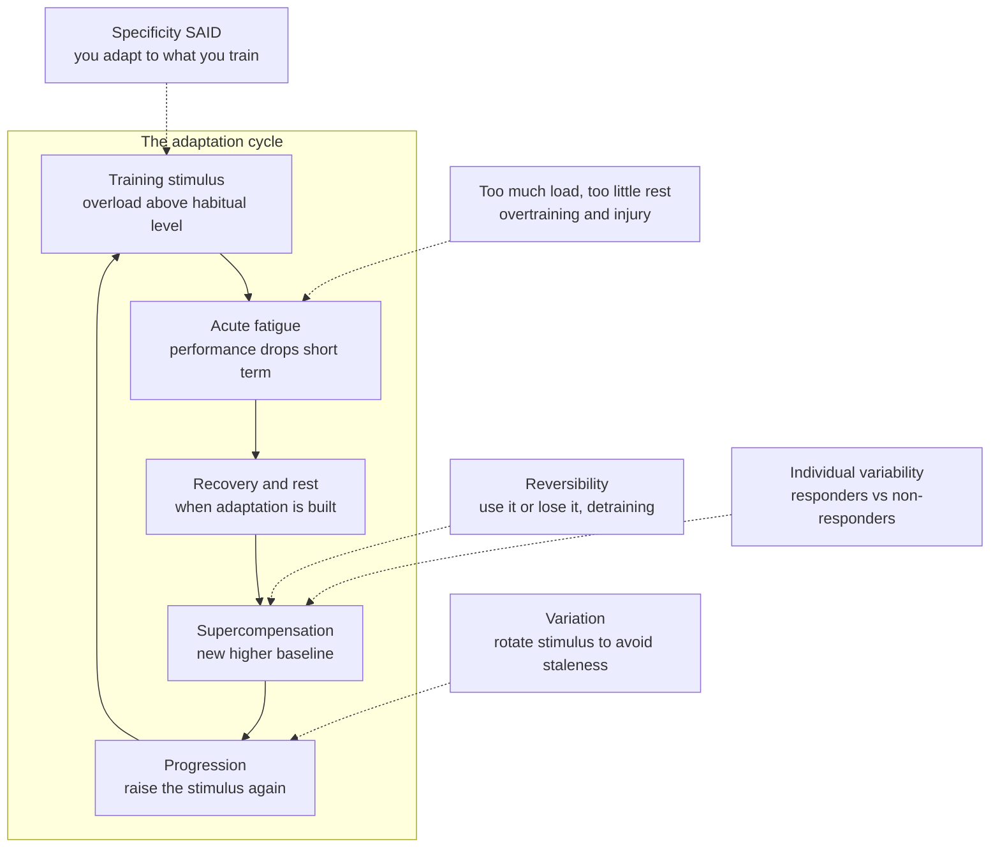

# 🏋️ Exercise Adaptation and Programming

> [!abstract] TL;DR
> **Programming** is the craft of turning exercise science into a *plan* — deciding what to do, how hard, how often, and in what order over weeks and months so the body adapts in the direction you want. It rests on a small set of **training principles**: **progressive overload** (the master principle — the stimulus must keep rising or adaptation stalls), **specificity / SAID** (you adapt specifically to what you train), **recovery** (adaptation happens *between* sessions, not during them), **reversibility** (use it or lose it — detraining), plus **variation** and large **individual variability**. The **FITT** knobs — Frequency, Intensity, Time, Type — are the levers you actually turn. The **fitness–fatigue model** explains why training simultaneously builds a slow-decaying *fitness* and a fast-decaying *fatigue*, and why **tapering** (cutting load before a goal) peaks performance. **Periodization** organizes all of this over time (mesocycles, macrocycles, deloads), while **autoregulation** (RPE, the acute:chronic workload ratio) keeps load matched to readiness and away from injury. The deepest practical truth: the best program is the one you will actually *do* — **consistency beats optimization**.

## Intuition — analogy first

Training is a **conversation with your body**. Every workout is a *message*: "this level of effort is now normal — get ready to handle it again." Your body, being efficient and lazy, only upgrades itself when the message is *louder than what it is already comfortable with*. Whisper the same thing every day (do the identical easy jog forever) and the body stops listening — it has already adapted, so nothing changes. To keep the conversation going you must **keep raising your voice**: a little more weight, a few more reps, another mile. That is **progressive overload**.

But there are three catches in this conversation. First, the body only *acts on* the message while it **rests** — the upgrade is built during sleep and recovery days, not while you are straining. Second, if you shout constantly and never let it reply, the relationship **breaks** — that is overtraining and injury; you have to pause, vary the topic, and listen back. Third, if you go silent for weeks, the body **forgets** the whole conversation and downgrades itself back to baseline — reversibility, "use it or lose it." Good programming is simply managing this dialogue skillfully: raise the signal enough to be heard, vary it so it stays interesting, and rest enough that the body can actually answer.

---

## How It Works

Programming is applied control theory for a self-modifying system. You inject a **stimulus** (training load), the body responds with a temporary loss of function (**fatigue**) followed — if you rest — by a rebound to a *higher* baseline (**supercompensation**, covered in [[Exercise_Physiology_Overview]]). The art is timing the *next* stimulus to land on top of the rebound, not on top of the fatigue, and to keep nudging the target upward. A handful of principles govern the whole enterprise.

**1. Progressive overload — the master principle.** Adaptation is a response to a demand that *exceeds* what the tissue is currently accustomed to. Once the body has adapted, that same load is no longer a stimulus — it is maintenance. So the load must **increase over time**: more weight, more reps, more sets, more distance, more speed, or less rest. Without progression, you plateau. This is the single non-negotiable of every effective program.

**2. Specificity — the SAID principle.** *Specific Adaptation to Imposed Demand.* You get good at exactly what you practice. Heavy low-rep lifting builds maximal strength; high-rep work builds hypertrophy and local endurance; long slow running builds aerobic capacity. Adaptations are specific to the muscle groups, energy systems, velocities, and ranges of motion you actually train. A marathon does not build a bench press, and vice versa.

**3. Recovery — where adaptation actually happens.** The workout is the *stimulus*; the adaptation is *synthesized during rest* (protein synthesis, glycogen restoration, neural consolidation, connective-tissue remodeling). Train the same tissue again before it has recovered and you dig a deeper hole instead of building a taller peak. Sleep, nutrition, and rest days are not the opposite of training — they are *part* of it. See [[Recovery_Mobility_and_Injury_Prevention]].

**4. Reversibility — use it or lose it.** Adaptations are expensive to maintain, so the body sheds them when the stimulus disappears. **Detraining** erodes fitness within weeks: aerobic capacity and glycogen stores fade fastest (days to weeks), strength and muscle more slowly (weeks to months), and connective-tissue and neural changes last longer still. This is why *consistency* matters more than any single heroic session.

**5. Variation.** Rotating exercises, rep ranges, and intensities staves off staleness (physiological and psychological), spreads stress across tissues, and exposes you to a broader stimulus. Too little variation causes plateaus and overuse injury; too much prevents the *repeated* exposure any single adaptation needs. Programming balances the two.

**6. Individual variability — responders vs non-responders.** The *same* program produces wildly different results across people. Genetics, training history, age, sleep, and stress mean that a dose that overreaches one person barely stimulates another. There is no universal optimal program — only a good *starting template* that you then **autoregulate** to the individual.

**The FITT levers.** Every one of these principles is applied by adjusting four dials — the **FITT** framework:

| Lever | Meaning | Example knob |
|---|---|---|
| **F**requency | How often you train | 3 vs 5 sessions per week |
| **I**ntensity | How hard | percent of 1-rep-max, percent of max heart rate, RPE |
| **T**ime | Duration / volume | sets and reps, minutes, distance |
| **T**ype | Modality | lifting, running, cycling, intervals |

Progressive overload is nothing more than **nudging one or more FITT dials upward over time**.



**The fitness–fatigue model and the taper.** The recovery cycle above is captured quantitatively by the **fitness–fatigue (impulse–response) model**: each dose of training raises *two* internal states — a **fitness** that is large and slow to fade, and a **fatigue** that is smaller in memory but decays *fast*. Your measurable **performance is fitness minus fatigue**. During a hard block, fatigue masks fitness, so you feel flat even as you are getting fitter underneath. If you then **cut the load** before a goal event — a **taper** — the fast-decaying fatigue drains away while the slow-decaying fitness barely drops, and performance **surges to a peak**. This is the mathematical backbone of **peaking** and one of the most reliable findings in sport science. The Python demo below simulates it.

**Periodization — organizing it over time.** You cannot push all FITT dials up forever, so training is structured into cycles:

- **Microcycle** — roughly a week; the arrangement of individual sessions (hard/easy days).
- **Mesocycle** — a block of a few weeks aimed at one quality (e.g., a hypertrophy block, a base-building block), usually ending in a **deload week** (reduced load to shed fatigue and consolidate gains).
- **Macrocycle** — the season-long arc that sequences mesocycles toward a peak event.

The two classic schemes are **linear periodization** (gradually rising intensity / falling volume across a macrocycle — e.g., high-volume hypertrophy → strength → peaking) and **undulating / non-linear periodization** (varying intensity and volume *within each week*). For competitive athletes chasing a peak on a date, periodization is essential. For general health and fitness, evidence suggests the *presence* of progressive overload and consistency matters far more than the *specific* periodization model — a live debate discussed in Key Concepts.

**Managing load and staying healthy.** The same overload that drives adaptation, applied too fast, causes **overtraining** and **injury**. Modern practice monitors load and *autoregulates*:

- **Acute:chronic workload ratio (ACWR)** — this week's load divided by the rolling ~4-week average. Ratios far above 1 (a sudden spike) flag elevated injury risk; the guidance is to change load *gradually*, not lurch.
- **Autoregulation via RPE** — **Rating of Perceived Exertion** (and "reps in reserve") lets you adjust today's load to today's readiness. Feeling strong? Add a set. Slept badly, stressed, sore? Pull back. The plan bends to the body rather than the reverse. See [[Recovery_Mobility_and_Injury_Prevention]].

**Programming for different goals.** Because of specificity, the template changes with the target — **endurance** (high frequency, mostly low-intensity volume with some intervals), **strength** (heavy loads, low reps, long rests, high recovery), **hypertrophy** (moderate loads, moderate-to-high reps and volume near failure), or **general health** (a modest blend of all). Combining strength and endurance in one program invites the **interference effect**: heavy concurrent endurance work can blunt strength and hypertrophy gains (competing molecular signals — very roughly, endurance-driven **AMPK** vs strength-driven **mTOR** pathways), so concurrent programs separate the modalities in time and prioritize the primary goal.

---

## Key Concepts

### Secondary (school-level intuition)

- **Overload to improve.** To get fitter or stronger you must do a bit *more* than your body is used to; doing the same thing forever stops working.
- **Rest is part of training.** Muscles and fitness are built while you recover, not while you strain. No rest means no gains — and eventually breakdown.
- **Use it or lose it.** Stop training and you drift back toward where you started, faster than you would like.
- **You get good at what you practice.** Running builds running; lifting builds lifting. Train the thing you actually want to improve.
- **FITT.** You have four dials — how *often*, how *hard*, how *long*, and what *type* — and a program is just a plan for turning them.

### Undergraduate (mechanisms and structure)

- **Progressive overload in practice** — double progression (add reps within a range, then add weight and reset reps), linear load increases for beginners, and slower percentage-based schemes for advanced trainees whose adaptations come harder.
- **The fitness–fatigue (Banister impulse–response) model** — performance = baseline + gain·fitness − gain·fatigue, where fitness and fatigue are each the sum of past training loads convolved with decaying exponentials of *different* time constants (fitness slow, fatigue fast). It reframes training as a *dynamical system* and is the quantitative core of the [[Exercise_Physiology_Overview]] supercompensation idea — and mathematically it is a two-component [[Impulse_Response]].
- **Periodization models** — linear (block) vs daily/weekly undulating; mesocycle → deload → next mesocycle; the taper as a planned, temporary detraining-of-fatigue.
- **Volume, intensity, and their trade-off** — total work (sets × reps × load) drives hypertrophy up to a point; intensity (proximity to max) drives maximal strength; you cannot maximize both simultaneously, which is why blocks emphasize one at a time.
- **Autoregulation tools** — RPE, reps-in-reserve, velocity-based training (bar speed as a fatigue/intensity proxy), and the acute:chronic workload ratio for load monitoring.
- **The interference effect** — the empirical blunting of strength/hypertrophy when high-volume endurance is trained concurrently; managed by sequencing, modality separation, and goal prioritization.

### Graduate (debate and system-level nuance)

- **Is periodization necessary for general fitness?** For elite athletes peaking on a date, structured periodization clearly helps. But meta-analyses comparing periodized vs non-periodized resistance training for general strength/hypertrophy show *modest and inconsistent* advantages once total volume and progressive overload are equated — suggesting that **progression and consistency are the active ingredients**, and elaborate periodization is often optimization at the margin.
- **Minimum effective dose.** A large fraction of health and even strength benefit comes from a surprisingly small dose (e.g., a couple of hard sets per muscle per week, or ~150 min/week of moderate activity). The dose–response curve has **sharply diminishing returns**: the gap from *nothing* to *a little* dwarfs the gap from *a lot* to *a bit more*. This argues for adherence-first programming — see [[Health_Behavior]].
- **Overtraining vs functional overreaching.** A planned, temporary overreach followed by recovery (or a taper) can *supercompensate* into a peak; the same load without recovery slides into non-functional overreaching and then true overtraining syndrome, with hormonal, immune, and mood disruption that takes weeks to months to resolve. The line between the two is *recovery*, not the load itself.
- **Model limitations.** The classic fitness–fatigue model is a linear, single-input abstraction: real training has multiple, interacting adaptations (neural, muscular, metabolic, tendinous) on different timescales, non-linear ceilings, and heavy individual variability. It is a superb *conceptual* and *coaching* tool, and a fragile *predictive* one — useful for explaining tapering, not for prescribing an athlete's exact loads.
- **Training as a control system.** Programming is closed-loop control of a self-modifying plant: the coach injects load, senses the output (performance, RPE, HRV, ACWR), and adjusts — a direct instance of a biological [[Feedback_Loops_and_Causality]] and of [[Adaptation_and_Learning_in_Systems]]. Autoregulation is simply making the loop tighter and faster.
- **Individual response distribution.** "Non-responders" to a given program are often responders to a *different* dose or modality; heterogeneity of response is a feature of complex adaptive systems, not a failure of the trainee.

---

## Python Demo

This implements the **fitness–fatigue (Banister impulse–response) model** — the quantitative heart of periodization and tapering. Each day's training load leaves two decaying traces: a **fitness** trace (large benefit, *slow* to decay) and a **fatigue** trace (also builds, but *fast* to decay and with a bigger per-unit hit). Modeled **performance = baseline + fitness − fatigue**. We simulate a realistic block — progressive overload with periodic deload weeks — and compare an athlete who **tapers** (cuts load before the goal) against a counterfactual twin who keeps training hard. The taperer sheds fatigue faster than fitness and **peaks on race day**.

```python
# Fitness-Fatigue (Banister impulse-response) model of training.
# Each training dose w[i] adds to two exponentially-decaying internal states:
#   fitness g : big benefit, SLOW decay  (long time constant tau1)
#   fatigue h : also builds,  FAST decay (short time constant tau2), bigger gain
# Performance = baseline + k1*fitness - k2*fatigue.
# Because fatigue decays faster, CUTTING load before a goal (a TAPER) drains
# fatigue while fitness lingers -> performance rises to a PEAK.
import numpy as np
import matplotlib.pyplot as plt

# --- Model parameters (arbitrary units) ---------------------------------
tau1, tau2 = 45.0, 15.0    # days: fitness decays slowly, fatigue quickly
k1,   k2   = 1.0,  2.0     # gains: fatigue hits harder per unit than fitness
p0         = 50.0          # baseline performance

# --- Season structure ----------------------------------------------------
build_weeks, taper_weeks = 13, 3
n_weeks = build_weeks + taper_weeks
week_shape = np.array([1.0, 0.5, 0.9, 0.0, 0.8, 1.1, 0.0])  # Mon..Sun loads

def build_week_scale(wk):
    """Progressive overload ramp with a lighter DELOAD every 4th week."""
    ramp = 6.0 + 4.0 * wk / (build_weeks - 1)      # mean load ramps up
    if (wk + 1) % 4 == 0:                          # deload weeks 4, 8, 12
        ramp *= 0.55
    return ramp

final_build = build_week_scale(build_weeks - 1)     # hardest sustained week

loads_taper, loads_hard = [], []
for wk in range(n_weeks):
    if wk < build_weeks:                            # identical build for both
        s = build_week_scale(wk)
        loads_taper.append(week_shape * s)
        loads_hard.append(week_shape * s)
    else:                                           # the divergence
        ti = wk - build_weeks
        s_taper = final_build * np.exp(-(ti + 1) / 1.3)   # taper: cut the load
        loads_taper.append(week_shape * s_taper)
        loads_hard.append(week_shape * final_build)       # twin: keep hammering

w_taper = np.concatenate(loads_taper)
w_hard  = np.concatenate(loads_hard)
n       = len(w_taper)
days    = np.arange(n)
taper_start = build_weeks * 7
goal_day    = n - 1                                 # the race is the last day

def integrate(w):
    """Recursively integrate the two exponential impulse responses."""
    g = np.zeros(len(w)); h = np.zeros(len(w))
    d1, d2 = np.exp(-1.0 / tau1), np.exp(-1.0 / tau2)
    for i in range(1, len(w)):
        g[i] = g[i-1] * d1 + w[i-1]                 # fitness accumulates + decays slowly
        h[i] = h[i-1] * d2 + w[i-1]                 # fatigue accumulates + decays fast
    return g, h, p0 + k1 * g - k2 * h

gt, ht, pt = integrate(w_taper)    # tapering athlete
gh, hh, ph = integrate(w_hard)     # no-taper twin

peak_idx = taper_start + int(np.argmax(pt[taper_start:]))
print(f"Race-day performance, TAPER   : {pt[goal_day]:6.1f}")
print(f"Race-day performance, NO taper: {ph[goal_day]:6.1f}")
print(f"Taper advantage on race day   : {pt[goal_day] - ph[goal_day]:+5.1f} units")
print(f"Peak performance occurs on day {peak_idx} (taper starts day {taper_start})")

# --- Plot ---------------------------------------------------------------
fig, (ax1, ax2) = plt.subplots(2, 1, figsize=(10, 8), sharex=True)

ax1.bar(days, w_taper, width=1.0, color='0.75', label='Daily load (taper)')
ax1.plot(days, w_hard, color='crimson', lw=1.2, drawstyle='steps-mid',
         label='Daily load (no-taper twin)')
ax1.axvspan(taper_start, n - 1, color='gold', alpha=0.25, label='Taper phase')
ax1.set_ylabel('Training load')
ax1.set_title('Schedule: progressive overload with deloads, then a taper')
ax1.legend(loc='upper left', fontsize=9)
ax1.grid(alpha=0.3)

ax2.plot(days, k1 * gt, color='steelblue', lw=2, label='Fitness (slow decay)')
ax2.plot(days, k2 * ht, color='darkorange', lw=2, label='Fatigue (fast decay)')
ax2.plot(days, pt, color='seagreen', lw=2.6, label='Performance (taper)')
ax2.plot(days, ph, color='seagreen', lw=1.6, ls='--', label='Performance (no taper)')
ax2.axhline(p0, color='0.5', ls=':', lw=1)
ax2.axvspan(taper_start, n - 1, color='gold', alpha=0.25)
ax2.axvline(peak_idx, color='seagreen', ls='--', alpha=0.6)
ax2.scatter([peak_idx], [pt[peak_idx]], color='seagreen', zorder=5)
ax2.annotate('peak', (peak_idx, pt[peak_idx]),
             textcoords='offset points', xytext=(8, 8), color='seagreen')
ax2.set_xlabel('Day')
ax2.set_ylabel('Model units')
ax2.set_title('Fatigue decays faster than fitness -> the taper peaks performance')
ax2.legend(loc='lower left', fontsize=9)
ax2.grid(alpha=0.3)

plt.tight_layout()
plt.show()
```

**What it shows.** During the hard build, **fatigue (orange) rides high and masks fitness (blue)**, so performance (green) is suppressed and choppy — you are getting fitter underneath but feel flat. When the taper begins (gold band), the tapering athlete's load falls; fatigue drains away on its short 15-day time constant while fitness lingers on its long 45-day one, so **performance climbs to a distinct peak**. The dashed twin who keeps hammering carries fatigue right into race day and finishes *below* the taperer. Same accumulated training, better result — purely from the *timing* of load. This single mechanism — two states, two decay rates — is why every serious endurance and strength peaking plan ends in a taper, and it is the mathematical face of supercompensation.

---

## Real-World Applications

- **Endurance peaking (running, cycling, triathlon, swimming).** Marathon and Ironman plans build volume for months, then taper for 2–3 weeks — cutting volume ~40–60% while keeping some intensity — to arrive on race day fresh but fit. The fitness–fatigue model is the textbook rationale.
- **Strength sport peaking (powerlifting, weightlifting).** Meet prep periodizes from high-volume hypertrophy blocks toward heavy, low-volume peaking and a final deload/taper so the lifter expresses maximal strength on platform day.
- **Team-sport load management.** Coaches monitor the acute:chronic workload ratio and session-RPE across a season to progress fitness while avoiding the load *spikes* most associated with soft-tissue injury — a direct application of controlled progressive overload.
- **Rehabilitation and return-to-play.** Physiotherapists apply graded progressive overload to reload injured tissue (tendon, bone, muscle) at a rate it can adapt to, using autoregulation to avoid re-injury — programming principles in a clinical setting; see [[Recovery_Mobility_and_Injury_Prevention]].
- **General health and longevity.** Public-health guidelines (e.g., ~150 min/week moderate activity plus 2 resistance sessions) are a **minimum-effective-dose** program: modest, consistent, and adherable, aimed at the steep early part of the dose-response curve where most of the mortality and metabolic benefit lives (linking to [[Metabolism_and_Energy_Balance]] and healthy [[Aging_and_Regeneration]]).
- **Wearable-driven autoregulation.** Consumer devices estimate "readiness/recovery" from heart-rate variability and sleep, nudging users to push or back off — a mass-market, if noisy, version of RPE-based autoregulation.

---

## Common Pitfalls

- **No progression (junk consistency).** Repeating the same weights, pace, and volume forever. It feels like training but delivers only maintenance — the body already adapted. Every effective program must nudge a FITT dial upward over time.
- **Too much, too soon (load spikes).** Jumping volume or intensity to chase faster results overshoots the body's ability to adapt, spiking the acute:chronic ratio and causing overuse injury or overtraining. Progression must be *gradual*.
- **Treating recovery as optional.** Skipping rest days, sleep, or deloads assumes adaptation happens *during* work. It happens *after*. Under-recovery converts a good stimulus into accumulating fatigue and stalls or reverses progress.
- **Program-hopping.** Switching plans every few weeks before any adaptation completes. Specificity and progressive overload both need *repeated exposure*; constant novelty prevents the very consistency that drives results.
- **Optimization over adherence.** Chasing the theoretically perfect periodization scheme you will not sustain, instead of the "good enough" plan you will actually follow for years. Adherence dominates the outcome — the best program is the one you will do (see [[Health_Behavior]]).
- **Ignoring specificity.** Training a proxy (e.g., only machines, or only long slow distance) and expecting transfer to a different demand (free-weight strength, a fast 5k). You adapt to what you actually impose.
- **Never tapering — or tapering wrong.** Arriving at a goal event buried in fatigue, or conversely dropping load so long that fitness itself detrains. The taper is a *timed* shedding of fatigue, not an open-ended vacation.

---

## Related Concepts

- [[Exercise_Physiology_Overview]] — the physiological substrate (energy systems, supercompensation) that these programming principles *organize*; programming is applied physiology. *(planned sibling note in this section)*
- [[Cardiovascular_Fitness_and_Aerobic_Training]] — endurance programming: the high-volume, mostly-easy modality where tapering and periodization were first formalized. *(planned sibling note)*
- [[Strength_Resistance_Training_and_Muscle]] — resistance programming: sets, reps, load, and the volume-vs-intensity trade-off that hypertrophy and strength blocks navigate. *(planned sibling note)*
- [[Recovery_Mobility_and_Injury_Prevention]] — recovery is *when* adaptation happens and the counterweight to overload; autoregulation and load management live at this boundary. *(planned sibling note)*
- [[Health_Behavior]] — consistency and adherence, the real limiting factor; the best program is the one you will actually do. *(planned sibling note)*
- [[Metabolism_and_Energy_Balance]] — training load interacts with energy availability; under-fueling suppresses adaptation and recovery.
- [[Homeostasis_and_Human_Physiology]] — adaptation is the body defending and resetting homeostasis in response to a repeated challenge.
- [[Impulse_Response]] — the fitness–fatigue model *is* a two-component exponential impulse-response system; training load is the input, performance the convolved output.
- [[Feedback_Loops_and_Causality]] — programming with RPE and load monitoring is closed-loop feedback control of a self-modifying system.
- [[Adaptation_and_Learning_in_Systems]] — training adaptation as a specific case of how complex adaptive systems restructure in response to sustained perturbation.
- [[Aging_and_Regeneration]] — progressive overload is a potent anti-aging stimulus, preserving muscle, bone, and metabolic health across the lifespan.

---

## Review Questions

1. **(Secondary)** State progressive overload and reversibility in your own words, and explain why doing the identical workout every week for a year would eventually stop improving your fitness. When, in the whole training process, does the adaptation actually get built?
2. **(Undergraduate)** In the fitness–fatigue model, fitness and fatigue both rise with each training dose but decay with *different* time constants (fitness slow, fatigue fast). Using this, explain mechanistically why a 2–3 week taper *raises* race-day performance even though the athlete trains less during it — and what would go wrong if the taper were extended to 8 weeks.
3. **(Graduate)** A recreational lifter asks whether they need a formally periodized program to get stronger and healthier. Given the evidence that volume-equated periodized vs non-periodized programs differ only modestly, the concept of minimum effective dose, and the dominance of adherence, construct a reasoned recommendation. Where does structured periodization genuinely earn its complexity, and where is it optimization at the margin?

---

## Sources

- Banister, E.W., et al. (1975). "A systems model of training for athletic performance." *Australian Journal of Sports Medicine*, 7(3), 57–61. — [foundational impulse-response model](https://scholar.google.com/scholar?q=Banister+systems+model+of+training+for+athletic+performance)
- Bosquet, L., Montpetit, J., Arvisais, D., & Mujika, I. (2007). "Effects of tapering on performance: a meta-analysis." *Medicine & Science in Sports & Exercise*, 39(8), 1358–1365. — [PubMed](https://pubmed.ncbi.nlm.nih.gov/17762369/)
- Gabbett, T.J. (2016). "The training-injury prevention paradox: should athletes be training smarter and harder?" *British Journal of Sports Medicine*, 50(5), 273–280. — [PubMed](https://pubmed.ncbi.nlm.nih.gov/26758673/)
- American College of Sports Medicine (2009). "Progression models in resistance training for healthy adults." *Medicine & Science in Sports & Exercise*, 41(3), 687–708. — [PubMed](https://pubmed.ncbi.nlm.nih.gov/19204579/)
- Williams, T.D., et al. (2017). "Comparison of periodized and non-periodized resistance training on maximal strength: a meta-analysis." *Sports Medicine*, 47(10), 2083–2100. — [PubMed](https://pubmed.ncbi.nlm.nih.gov/28497285/)

---

#health #exercise #programming #periodization #progressive-overload
