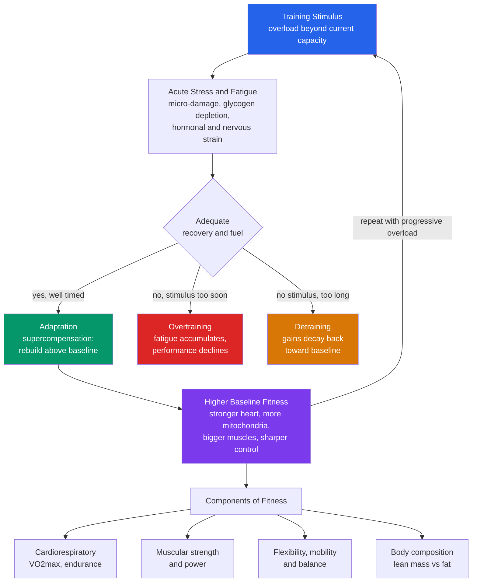

# 🏃 Exercise Physiology Overview

> [!abstract] TL;DR
> **Exercise physiology** is the study of how the body responds to a single bout of movement (**acute responses**) and how it remodels itself when that movement is repeated over weeks and months (**chronic adaptations**). Its central and slightly counterintuitive lesson is that **you do not get fitter by resting — you get fitter by being stressed and then allowed to recover.** A training session is a controlled dose of damage; the improvement happens afterward, during recovery, as the body rebuilds *above* its previous level. Framed as a public-health intervention, physical activity is arguably **the single most powerful lever we have**: cardiorespiratory fitness (VO2max) is one of the strongest known predictors of all-cause mortality, and regular exercise lowers the risk of nearly every major chronic disease — cardiovascular disease, type 2 diabetes, several cancers, depression, and dementia — while improving mood, cognition, and healthspan. This note is the map of the section: it lays out the components of fitness, the stress-recovery-adaptation cycle, the energy systems, the core training principles, and the "exercise as medicine" case.

---

## Intuition

**Analogy: think of your body as a construction crew that only upgrades a building *after* an earthquake — and only if you give it time and materials to rebuild.**

Imagine a structure that is stress-tested by a controlled tremor. During the tremor itself the building is *weaker*: beams crack, joints loosen, the whole thing sways. If you measured its strength in that moment you would conclude the earthquake made it worse. But if you now leave the crew alone with enough concrete and steel, they do not merely patch it back to the original spec — they **over-build**, reinforcing exactly the beams that took the most strain, so that the next tremor of the same size barely registers. The building ends up stronger than before, and stronger *specifically where it was loaded*.

That is the whole logic of training. The workout is the tremor: during and right after it you are fatigued and temporarily weaker. The adaptation — the actual gain — happens in the hours and days of recovery that follow, when the body **super-compensates**, rebuilding above baseline. Two failure modes fall straight out of the analogy. Send in a new earthquake before the crew has finished rebuilding, again and again, and the building never recovers — it degrades. That is **overtraining**. Wait months between tremors and the crew, seeing no reason to keep the extra reinforcement, quietly removes it. That is **detraining**. Fitness lives in the narrow, well-timed window between too much and too little.

---

## How It Works

Exercise physiology has two clocks running at once. On the **fast clock** (seconds to hours) the body mounts *acute responses* to keep muscles supplied during a bout. On the **slow clock** (weeks to years) repeated bouts drive *chronic adaptations* that permanently raise capacity. Almost every important idea in this section is about how a stimulus on the fast clock, correctly dosed and recovered, writes a durable change onto the slow clock.

### Acute responses versus chronic adaptations

When you start exercising, the body reacts within seconds across four systems:

- **Cardiovascular** — heart rate rises, stroke volume increases, and cardiac output can climb four- to six-fold; blood is shunted from the gut toward working muscle and skin.
- **Respiratory** — ventilation increases to deliver oxygen and clear carbon dioxide; breathing rate and depth both rise.
- **Metabolic** — the muscle switches on fuel pathways (below), mobilizing glucose and fatty acids; heat production spikes and core temperature rises.
- **Hormonal** — catecholamines (adrenaline, noradrenaline), cortisol, and growth hormone surge to mobilize fuel and prepare tissue for repair.

Repeat the stimulus for weeks and the *transient* responses become *structural*:

- A **stronger, larger heart** with a bigger stroke volume, so resting heart rate falls and each beat does more work.
- **More capillaries and more mitochondria** in trained muscle (mitochondrial biogenesis driven by the PGC-1-alpha pathway), raising the ceiling on aerobic energy production and VO2max.
- **Bigger, stronger muscle** through hypertrophy plus improved neural recruitment; stronger tendons and denser bone.
- **Better insulin sensitivity** as muscles express more glucose transporters and pull glucose from the blood more readily — a direct mechanism behind exercise's power against type 2 diabetes (see [[The_Endocrine_System_and_Hormones]] and [[Oxidative_Phosphorylation]]).
- **Neuroplasticity** — exercise raises BDNF and supports hippocampal function, linking movement to memory, mood, and dementia risk (see [[Neuroplasticity_and_Rehabilitation]]).

### The general adaptation syndrome and the stress-recovery-adaptation cycle

The organizing theory comes from endocrinologist **Hans Selye**, whose **General Adaptation Syndrome (GAS)** described how any stressor drives a three-phase response: an **alarm** reaction, a **resistance** (adaptation) phase, and — if the stressor never relents — **exhaustion**. Training applies GAS on purpose. A workout is a deliberate stressor; the body alarms (fatigue, soreness, hormonal strain), then adapts during recovery, becoming more resistant to that specific stress. Push the stressor without recovery and you reach exhaustion — the maladaptive state of overtraining.

Two complementary models formalize this:

- **The supercompensation model** — after a session, performance dips (fatigue dominates), then during recovery rebounds *above* the starting level before slowly drifting back. Training again at the top of that rebound stacks gain on gain.
- **The fitness-fatigue (impulse-response) model** — Banister's insight that each session simultaneously deposits a slow-decaying **fitness** effect and a fast-decaying **fatigue** effect. What you can actually express on a given day is `fitness minus fatigue`. Because fatigue clears faster than fitness, a well-timed rest reveals the fitness you built. This is exactly what the Python demo below simulates.

### The energy systems: which fuel powers which effort

Muscle runs on ATP, but it makes ATP three different ways, matched to intensity and duration:

1. **Phosphocreatine (ATP-PCr) system** — instantaneous, oxygen-free, maximal power for roughly the first **10 seconds**. Powers a heavy lift or a short sprint. Tiny tank, refills in a couple of minutes.
2. **Glycolytic (anaerobic) system** — breaks down glucose without oxygen, dominant from about **10 seconds to 2 minutes** of hard effort. High power, but produces the metabolic byproducts that force you to slow down. Powers a 400 m run.
3. **Oxidative (aerobic) system** — burns carbohydrate and fat *with* oxygen inside mitochondria, the near-limitless supply for anything longer than a couple of minutes, from a jog to a marathon. Lower peak power, enormous capacity (see [[Bioenergetics_and_ATP]], [[Glycolysis]], [[Mitochondria_and_Chloroplasts]]).

The systems overlap and hand off continuously — intensity, not a switch, decides the mix.

### Core training principles

- **Specificity (the SAID principle — Specific Adaptations to Imposed Demands):** you adapt to exactly what you do. Endurance training builds mitochondria and capillaries; heavy lifting builds force. Training must resemble the target quality.
- **Progressive overload:** adaptation only continues if the stimulus keeps rising. Once the body has adapted, the same load stops driving change — you must add weight, reps, distance, or intensity.
- **Individual variability:** identical programs yield very different results; genetics, age, sleep, and history make some people high responders and others low responders for a given quality.
- **Reversibility (use it or lose it):** stop training and adaptations decay — the detraining branch of the cycle.

### The components of fitness

Fitness is not one thing. The branches are trained differently and adapt semi-independently:

- **Cardiorespiratory / aerobic endurance** — the capacity of heart, lungs, and muscle to sustain effort; summarized by VO2max, the strongest fitness-linked predictor of longevity ([[Cardiovascular_Fitness_and_Aerobic_Training]]).
- **Muscular strength and endurance** — maximal force and the ability to repeat it ([[Strength_Resistance_Training_and_Muscle]]).
- **Power** — force delivered fast (strength times speed); the quality that fades first with age and predicts falls.
- **Flexibility, mobility, and balance** — range of motion and control that protect against injury and preserve independence ([[Recovery_Mobility_and_Injury_Prevention]]).
- **Body composition** — the ratio of lean mass to fat, an outcome of training, nutrition, and metabolism.

### The stress-recovery-adaptation cycle and the branches of fitness



### Roadmap of this section

This overview is the hub. The rest of *03 Exercise and Physical Activity* zooms into each branch:

- [[Cardiovascular_Fitness_and_Aerobic_Training]] — VO2max, the aerobic energy system, zone-based endurance training, and why cardiorespiratory fitness dominates the longevity data.
- [[Strength_Resistance_Training_and_Muscle]] — hypertrophy, neural adaptation, muscle as a metabolic and anti-frailty organ, and how to program resistance work.
- [[Exercise_Adaptation_and_Programming]] — turning the principles here (specificity, progressive overload, periodization, individual variability) into an actual plan.
- [[Recovery_Mobility_and_Injury_Prevention]] — the recovery half of the cycle: sleep, mobility, load management, and avoiding the overtraining branch.
- Companion foundations: [[Health_and_Wellbeing_Overview]] and [[Determinants_of_Health]] situate movement among the health pillars; [[Aging_and_Regeneration]] supplies the biology of why fitness and longevity are so tightly coupled.

---

## Key Concepts

### Secondary Level

- **You get fitter during recovery, not during the workout.** The session is the stress; the improvement is the rebuild afterward.
- **Supercompensation:** after training you dip, then bounce back higher than before — train again at the top of the bounce.
- **Two ways to fail:** too much, too often with no rest is **overtraining**; too little for too long is **detraining** (use it or lose it).
- **Fitness has several parts:** heart-and-lung endurance, strength, power, flexibility and balance, and body composition — you have to train each.
- **Movement is medicine.** Regular activity lowers the risk of heart disease, diabetes, some cancers, depression, and dementia, and helps you live longer and better.

### Undergraduate Level

- **Acute responses vs chronic adaptations:** transient changes during a bout (heart rate, ventilation, hormones) versus lasting structural remodeling (bigger heart, more mitochondria and capillaries, muscle hypertrophy, better insulin sensitivity).
- **General Adaptation Syndrome (Selye):** alarm, resistance/adaptation, exhaustion — the stress-biology backbone of the stress-recovery-adaptation cycle.
- **The three energy systems:** phosphocreatine (seconds, maximal power), glycolytic (seconds to ~2 min, high power), oxidative (minutes to hours, aerobic capacity) — intensity and duration set the mix.
- **Core training principles:** specificity (SAID), progressive overload, reversibility, and individual variability.
- **VO2max as a longevity marker:** cardiorespiratory fitness is inversely and dose-dependently associated with all-cause mortality, with no clear upper limit of benefit.

### Graduate Level

- **Fitness-fatigue (Banister impulse-response) model:** performance equals a slow-decaying fitness trace minus a fast-decaying fatigue trace; tapering removes fatigue to reveal accumulated fitness — the formal basis of peaking and periodization.
- **Molecular signaling of adaptation:** endurance work activates AMPK and the PGC-1-alpha axis driving mitochondrial biogenesis and angiogenesis; resistance work activates the mTOR pathway driving muscle protein synthesis — divergent, partly competing signals that explain the *interference effect* between concurrent endurance and strength training.
- **Overtraining and non-functional overreaching:** chronic imbalance between load and recovery producing autonomic, endocrine, and immune dysregulation and a sustained performance decrement that rest, not more training, reverses.
- **Responders and non-responders:** substantial heritable variation in trainability (for example the HERITAGE Family Study) means dose-response is individual; low response in one quality can often be rescued by manipulating modality or intensity.
- **Exercise as an endocrine event:** contracting muscle secretes **myokines** (such as IL-6 and irisin) that act on liver, fat, brain, and immune tissue — a mechanistic bridge from local muscle work to system-wide, anti-inflammatory, disease-modifying effects.

---

## Python Demo

```python
# Fitness-fatigue / supercompensation model (Banister impulse-response).
# Each training session deposits a slow-decaying FITNESS trace and a
# fast-decaying FATIGUE trace. What you can express on any day is
#     performance = baseline + k1*fitness - k2*fatigue
# We (A) visualize the supercompensation curve after a single session and
# (B) simulate three training schedules -- well-timed, overtraining, and
# detraining -- to show why TIMING, not just effort, builds fitness.
# numpy + matplotlib only.
import numpy as np
import matplotlib.pyplot as plt

DAYS = 140
t = np.arange(DAYS)

# --- model parameters -------------------------------------------------
p0   = 50.0    # baseline performance
k1   = 1.0     # weight of the (slow) fitness trace
k2   = 2.0     # weight of the (fast) fatigue trace; k2>k1 -> short-term dip
tau1 = 30.0    # fitness decays slowly (days)  -> gains persist
tau2 = 7.0     # fatigue decays fast (days)    -> soreness clears quickly
w    = 1.0     # magnitude of one training impulse
F_cap = 3.5    # recovery ceiling: adaptation is gated by how tired you are

def simulate(session_days, gated=True):
    """Return performance, fitness, fatigue for a list of session days.
    Every session ALWAYS adds full fatigue, but the FITNESS (adaptation)
    it yields is scaled by how recovered you were -- train chronically
    fatigued and sessions pile on fatigue while returning little fitness."""
    fit_impulse, fat_impulse = [], []   # (day, magnitude)
    for d in session_days:
        fat_now = sum(m * np.exp(-(d - d0) / tau2) for d0, m in fat_impulse)
        gate = max(0.0, 1.0 - fat_now / F_cap) if gated else 1.0
        fit_impulse.append((d, w * gate))   # adaptation gated by recovery
        fat_impulse.append((d, w))           # fatigue always accrues
    fitness = np.zeros(DAYS)
    fatigue = np.zeros(DAYS)
    for d0, m in fit_impulse:
        seg = t >= d0
        fitness[seg] += m * np.exp(-(t[seg] - d0) / tau1)
    for d0, m in fat_impulse:
        seg = t >= d0
        fatigue[seg] += m * np.exp(-(t[seg] - d0) / tau2)
    performance = p0 + k1 * fitness - k2 * fatigue
    return performance, fitness, fatigue

# --- (A) single session: the supercompensation curve ------------------
perf1, fit1, fat1 = simulate([0], gated=False)

# --- (B) three schedules over the same 140-day block ------------------
optimal   = list(range(0, DAYS, 7))    # well-timed: one session per week-ish
overtrain = list(range(0, DAYS, 2))    # too frequent: no time to recover
detrain   = list(range(0, DAYS, 21))   # too sparse: gains decay between sessions

perf_opt, _, _ = simulate(optimal)
perf_over, _, _ = simulate(overtrain)
perf_det, _, _  = simulate(detrain)

# --- plot -------------------------------------------------------------
fig, ax = plt.subplots(1, 2, figsize=(14, 5))

# Panel A: anatomy of one session
ax[0].axhline(p0, color="#334155", ls="--", lw=1, label="baseline")
ax[0].plot(t, p0 + k1 * fit1, color="#2563eb", lw=2, label="fitness trace")
ax[0].plot(t, p0 - k2 * fat1, color="#dc2626", lw=2, label="fatigue trace")
ax[0].plot(t, perf1, color="#059669", lw=3, label="net performance")
ax[0].fill_between(t, p0, perf1, where=perf1 >= p0,
                   color="#059669", alpha=0.15)
ax[0].annotate("dip:\nfatigue wins early", xy=(3, perf1[3]),
               xytext=(18, 47), fontsize=9, color="#dc2626",
               arrowprops=dict(arrowstyle="->", color="#dc2626"))
ax[0].annotate("supercompensation:\nrebuild above baseline",
               xy=(20, perf1[20]), xytext=(45, 51.2), fontsize=9,
               color="#059669", arrowprops=dict(arrowstyle="->", color="#059669"))
ax[0].set_title("A) One session: fatigue, then supercompensation")
ax[0].set_xlabel("Days after session")
ax[0].set_ylabel("Performance")
ax[0].set_xlim(0, 70)
ax[0].legend(loc="lower right", fontsize=8)

# Panel B: timing decides the outcome
ax[1].axhline(p0, color="#334155", ls="--", lw=1, label="baseline")
ax[1].plot(t, perf_opt,  color="#059669", lw=2.5, label="well-timed (every 7d)")
ax[1].plot(t, perf_over, color="#dc2626", lw=2.5, label="overtraining (every 2d)")
ax[1].plot(t, perf_det,  color="#d97706", lw=2.5, label="detraining (every 21d)")
ax[1].set_title("B) Same effort, different timing")
ax[1].set_xlabel("Day of training block")
ax[1].set_ylabel("Performance")
ax[1].legend(loc="upper left", fontsize=8)

plt.tight_layout()
plt.savefig("supercompensation.png", dpi=120)

# --- summary ----------------------------------------------------------
print(f"Single session low point : {perf1.min():.2f} (below baseline {p0})")
print(f"Single session peak      : {perf1.max():.2f} (supercompensated)")
print("End-of-block performance:")
print(f"  well-timed  : {perf_opt[-1]:.2f}")
print(f"  overtraining: {perf_over[-1]:.2f}")
print(f"  detraining  : {perf_det[-1]:.2f}")
# Ordering is the lesson: well-timed > detraining (near baseline) > overtraining
# (suppressed by chronic fatigue). More sessions did NOT mean more fitness.
```

**What it shows.** Panel A is the supercompensation curve for a single bout: performance first dips below baseline (the fast fatigue trace dominates), then rebounds *above* baseline as fatigue clears while the slow fitness trace persists, before drifting back. Panel B runs three schedules with the *same* per-session effort and only the *timing* changed. The **well-timed** block (roughly weekly) lands each new stimulus while the previous one is still supercompensating, so fitness compounds upward. The **overtraining** block trains every two days — fatigue never clears, sessions keep piling on fatigue while returning almost no adaptation, and measured performance is chronically suppressed. The **detraining** block trains too rarely — fitness decays most of the way back before the next session, so it hovers near baseline and never accumulates. The punchline of exercise physiology in one figure: **more sessions is not more fitness; correctly timed recovery is what turns stress into adaptation.**

---

## Real-World Applications

- **Cardiorespiratory fitness as a vital sign.** A large retrospective cohort (Mandsager et al., JAMA Network Open 2018, over 120,000 patients) found VO2max inversely associated with mortality with **no observed upper limit of benefit** — the least-fit had risk comparable to or exceeding that of smoking, coronary disease, or diabetes. Some clinicians now argue fitness should be measured like blood pressure.
- **Exercise prescribed to prevent diabetes.** The Diabetes Prevention Program showed a structured lifestyle intervention (diet plus ~150 min/week of activity) cut progression to type 2 diabetes by ~58 percent, *outperforming* metformin — the insulin-sensitivity adaptation made concrete at population scale.
- **Periodization and tapering in elite sport.** Coaches use the fitness-fatigue model directly: athletes train hard to bank fitness, then **taper** (reduce load) before competition so fast-decaying fatigue clears and slow-decaying fitness is revealed — peaking on the day that matters.
- **Exercise as antidepressant and cognitive therapy.** Meta-analyses show aerobic and resistance exercise produce clinically meaningful reductions in depressive symptoms, comparable to medication for mild-to-moderate depression, while activity is associated with lower dementia risk and better cognition via BDNF and hippocampal support (see [[Mood_Disorders]], [[Neuroplasticity_and_Rehabilitation]]).
- **Cardiac and pulmonary rehabilitation.** Supervised, progressively overloaded exercise is a cornerstone of recovery after heart attack, heart failure, and COPD — turning the same stress-recovery-adaptation cycle into a clinical treatment that lowers rehospitalization and mortality.

---

## Common Pitfalls

- **Believing rest alone builds fitness.** Recovery is necessary but not sufficient — without a *stimulus* there is nothing to adapt to, and fitness decays (the detraining branch). Rest completes training; it does not replace it.
- **Chasing soreness and fatigue as the goal.** Feeling wrecked measures *stress*, not *adaptation*. The gain is downstream in recovery. Chronic soreness usually signals you are stuck in the fatigue trace, not building fitness.
- **No progressive overload.** Repeating the exact same workout indefinitely stalls progress once the body has adapted; the stimulus must keep rising in load, volume, or intensity.
- **Ignoring specificity.** Training one quality and expecting another to improve — long slow cardio will not build maximal strength, and heavy singles will not build endurance. Adaptations are specific to the demand imposed.
- **Doing only one component.** Cardio-only or lifting-only leaves strength, mobility, or aerobic capacity underdeveloped. Longevity data favor *both* cardiorespiratory fitness and muscular strength; they protect against different failure modes.
- **Assuming everyone responds the same.** Copying an elite athlete's or a friend's program ignores individual variability, training history, age, sleep, and recovery capacity — the same dose can under- or over-shoot for you.
- **Treating "150 minutes a week" as a ceiling instead of a floor.** Guidelines are a public-health minimum; the dose-response curve keeps improving well beyond it, and — crucially — *any* movement beats none, especially for the sedentary.

---

## Related Concepts

- [[Health_and_Wellbeing_Overview]] — physical activity is one of the six core health pillars; this note supplies the mechanistic depth behind the "movement" pillar.
- [[Determinants_of_Health]] — behavior (including activity) is the single largest modifiable determinant of health, but it is socially patterned, not freely chosen.
- [[Cardiovascular_Fitness_and_Aerobic_Training]] — the aerobic branch in depth: VO2max, endurance zones, and the longevity evidence.
- [[Strength_Resistance_Training_and_Muscle]] — the strength branch: hypertrophy, neural adaptation, and muscle as an anti-frailty organ.
- [[Exercise_Adaptation_and_Programming]] — turns the principles here (overload, specificity, periodization) into a concrete training plan.
- [[Recovery_Mobility_and_Injury_Prevention]] — the recovery half of the cycle that makes adaptation possible and avoids overtraining.
- [[The_Musculoskeletal_System]] — the muscle, bone, and joint anatomy that strength and mobility training remodel.
- [[The_Circulatory_and_Respiratory_Systems]] — the cardiovascular and respiratory hardware behind acute exercise responses and aerobic adaptation.
- [[The_Endocrine_System_and_Hormones]] — the hormonal responses (catecholamines, cortisol, growth hormone) and improved insulin sensitivity central to adaptation.
- [[Bioenergetics_and_ATP]] — the ATP economy that the three energy systems supply during effort.
- [[Oxidative_Phosphorylation]] — the mitochondrial aerobic pathway whose capacity expands with endurance training.
- [[Glycolysis]] — the anaerobic pathway that fuels high-intensity efforts of seconds to minutes.
- [[Mitochondria_and_Chloroplasts]] — the organelle whose proliferation (mitochondrial biogenesis) is a signature endurance adaptation.
- [[Aging_and_Regeneration]] — why fitness and healthspan are coupled; exercise counteracts several hallmarks of aging.
- [[Neuroplasticity_and_Rehabilitation]] — the brain-remodeling side of exercise (BDNF, cognition, rehabilitation).
- [[Mood_Disorders]] — depression, one of the conditions exercise measurably improves.
- [[Stress_and_Coping]] — the general-stress physiology (HPA axis, Selye's GAS) that the training stress-recovery cycle is a special case of.

---

## Review Questions

**Tier 1 — Recall / comprehension:**
1. Distinguish an *acute response* from a *chronic adaptation*, giving one cardiovascular example of each. Why does measuring performance immediately after a hard session *understate* the training benefit?
2. Name the three energy systems and match each to the intensity and duration it primarily fuels (a 100 m sprint, a 400 m run, a marathon).

**Tier 2 — Application / analysis:**
3. Using the supercompensation and fitness-fatigue models, explain in mechanistic terms why an athlete who trains every single day without variation can end up *slower* than one who trains hard three or four times a week. What does "tapering" before a competition actually remove, and what does it reveal?
4. A previously sedentary adult and a trained runner both add the same new interval workout. Using the principles of specificity, progressive overload, and individual variability, predict how their adaptations differ and why the same absolute dose is "too much" for one and "too little" for the other.

**Tier 3 — Synthesis / evaluation:**
5. Cardiorespiratory fitness (VO2max) is one of the strongest predictors of all-cause mortality, yet it is rarely measured in routine care while cholesterol and blood pressure always are. Argue for or against treating VO2max as a standard vital sign, addressing causality-versus-correlation, feasibility, and what the "no upper limit of benefit" finding does and does not prove.
6. The public-health guideline is 150 minutes of moderate activity per week, but the dose-response for mortality keeps improving beyond it and *any* movement helps the sedentary most. Design a single message for a population health campaign that is honest about the dose-response curve without discouraging beginners, and justify your framing using the determinants-of-health idea that behavior is socially patterned.

---

## Sources

- Selye, H. (1956). *The Stress of Life.* McGraw-Hill — the General Adaptation Syndrome (alarm, resistance, exhaustion) underpinning the stress-recovery-adaptation cycle.
- American College of Sports Medicine. (2021). *ACSM's Guidelines for Exercise Testing and Prescription* (11th ed.). Wolters Kluwer — the standard reference on acute responses, chronic adaptations, and training principles.
- Mandsager, K., et al. (2018). "Association of Cardiorespiratory Fitness With Long-term Mortality Among Adults Undergoing Exercise Treadmill Testing." *JAMA Network Open*, 1(6):e183605. https://jamanetwork.com/journals/jamanetworkopen/fullarticle/2707428
- World Health Organization. (2020). *WHO Guidelines on Physical Activity and Sedentary Behaviour.* https://www.who.int/publications/i/item/9789240015128
- Booth, F. W., Roberts, C. K., & Laye, M. J. (2012). "Lack of Exercise Is a Major Cause of Chronic Diseases." *Comprehensive Physiology*, 2(2):1143-1211. https://doi.org/10.1002/cphy.c110025
- Banister, E. W., et al. (1975). "A systems model of training for athletic performance." *Australian Journal of Sports Medicine*, 7:57-61 — the fitness-fatigue impulse-response model behind the Python demo.

---

#health #exercise #physical-activity #fitness #supercompensation
