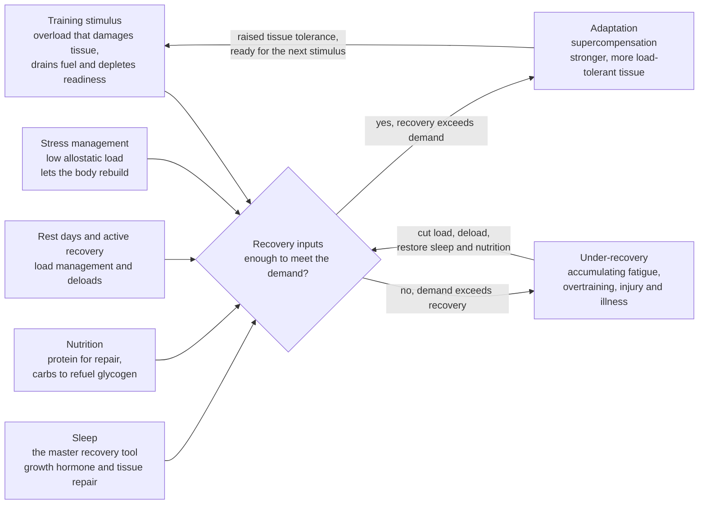

# 🛌 Recovery, Mobility and Injury Prevention

> [!abstract] TL;DR
> **You do not get fit during the workout — you get fit during the recovery that follows it.** Training is only a *stimulus*: it damages tissue, drains energy stores, and stresses the nervous and hormonal systems. The actual gain — stronger muscle, denser bone, more mitochondria — is *built afterward*, and only if the body is given the raw materials and time to build it. The dominant recovery levers, ranked by evidence, are **sleep** (by far the strongest), **nutrition** (protein for repair, carbohydrate to refuel), **load management** (progressing training gradually, not in dangerous spikes), and **stress management** (psychological stress spends the same recovery budget as physical stress). Most popular "recovery tools" — foam rolling, static stretching, massage, ice baths — range from modestly helpful to actively counterproductive, and some (routine post-workout icing and anti-inflammatory drugs) can *blunt* the very adaptation you trained for. The single biggest driver of injury is not bad form or skipped stretching but **rapid increases in training load** relative to what the tissue is prepared for.

---

## Intuition

**Analogy — training is a withdrawal, recovery is the deposit-plus-interest.** Imagine your fitness is a bank account. Every hard session is a *withdrawal*: you spend down glycogen, tear muscle fibers, fatigue the nervous system, and dip into your reserves. If you did nothing else, you would simply get poorer — weaker and more broken over time. The reason athletes get *stronger* is that the body responds to a withdrawal by making an *over-sized deposit* during recovery — repairing the damaged tissue and then adding a little extra on top, so it can handle that stress more easily next time. Physiologists call that extra margin **supercompensation**. But the deposit only clears if the bank is open: sleep, food, and rest are what *let the transaction settle*. Train again before the deposit clears — chronically withdraw faster than you deposit — and the account spirals into overdraft. That overdraft has a name: **overtraining**, and its interest is paid in fatigue, illness, stalled progress, and injury.

Stretch the analogy one step further. Psychological stress, a poor night's sleep, and under-eating are all *silent withdrawals* from the same account. The body has one recovery budget, not separate ledgers for "gym stress" and "life stress." A brutal week at work spends the same reserve that a hard training block does — which is why the athlete who trains identically but sleeps five hours and lives on deadlines breaks down while their well-rested twin adapts. This is the health-and-physiology reason recovery deserves at least as much planning as the workout itself: see [[Exercise_Adaptation_and_Programming]] for how deliberate periodization schedules the deposits, and [[Exercise_Physiology_Overview]] for the acute mechanics of the withdrawal.

---

## How It Works

### The stimulus–recovery–adaptation cycle

Fitness improvement follows a strict three-beat rhythm, and the middle beat is the one everyone skips:

1. **Stimulus (the workout).** An overload greater than what the body is used to disturbs homeostasis — micro-damage to muscle fibers, depleted glycogen, connective-tissue strain, endocrine and autonomic stress. Nothing has improved yet. If anything, you are *temporarily weaker*.
2. **Recovery (the repair).** Given rest and raw materials, the body clears metabolic byproducts, refills fuel, repairs the damaged proteins, and remodels connective tissue. This is where the work of getting fit physically happens — during sleep and rest, not during the set.
3. **Adaptation / supercompensation.** The rebuild overshoots the previous baseline, leaving the tissue slightly *more* capable than before. Timing the next stimulus to land on this raised baseline is the entire art of programming.

The failure mode is not mysterious: apply the next stimulus **before** recovery completes, repeatedly, and baselines trend *down* instead of up. A little of this on purpose — **functional overreaching** — is a deliberate training tool that supercompensates strongly after a planned rest. Too much, unplanned, becomes **non-functional overreaching** and finally **overtraining syndrome**, which can take weeks to months to reverse.

### The pillars of recovery (ranked by evidence)

Not all recovery inputs are equal. The honest hierarchy, strongest first:

- **Sleep — the single most powerful recovery tool there is.** Deep (slow-wave) sleep is when the largest pulse of growth hormone is released, when protein synthesis and tissue repair run hardest, and when the brain and autonomic nervous system reset. Sleep restriction (even to ~5–6 hours) measurably reduces strength and endurance performance, raises perceived effort, impairs glucose handling and appetite regulation, and elevates injury risk — one landmark study of adolescent athletes found those sleeping under 8 hours were roughly **1.7× more likely to be injured**. No supplement, cold plunge, or massage comes close. See [[Sleep_and_Circadian_Rhythms]] for the underlying architecture of sleep stages and the circadian timing that governs them.
- **Nutrition — the raw materials for the rebuild.** Muscle cannot be repaired without amino acids: adequate daily **protein** (broadly ~1.6–2.2 g/kg body mass for those training hard) supplies the building blocks, and **carbohydrate** refills the glycogen the session drained, restoring the fuel for the next effort. Under-eating — chronically supplying less energy than training demands (relative energy deficiency, RED-S) — degrades bone, hormones, and immunity regardless of how "clean" the diet is. See [[Macronutrients_Protein_Carbs_and_Fats]] and [[Metabolism_and_Energy_Balance]].
- **Load management — rest days and active recovery.** Recovery is not only what you add (sleep, food) but what you *withhold* (training stress). Programmed **rest days** and lighter **deload weeks** let accumulated fatigue dissipate so fitness can surface. **Active recovery** (easy movement — a walk, a gentle spin) can modestly aid circulation and feel restorative without adding meaningful stress.
- **Stress management — protecting the shared recovery budget.** Psychological stress is not separate from physical recovery: a chronically activated **HPA axis** keeps cortisol and sympathetic tone elevated, which suppresses tissue repair and immune function. This is the exercise-specific face of **allostatic load** — the cumulative wear of running the stress systems without a break (see [[Homeostasis_and_Human_Physiology]]). A stressed, under-slept athlete recovers slower from an identical workout than a calm, rested one. See [[Stress_and_Coping]] and [[Autonomic_Nervous_System]] for the sympathetic-vs-parasympathetic balance that recovery depends on.

### What actually aids recovery vs recovery-theater

A large industry sells recovery. The evidence is far less flattering than the marketing:

| Intervention | What the evidence actually shows |
|---|---|
| **Sleep** | Strongest, most consistent benefit of anything on this list. Non-negotiable. |
| **Load management / deloads** | Strong: managing how fast load rises is the best-supported injury and overtraining prevention lever. |
| **Adequate protein and energy** | Well-supported for repair and adaptation. |
| **Foam rolling** | Small, short-term reductions in perceived soreness and brief range-of-motion gains; little effect on actual performance recovery. Harmless, mostly a comfort tool. |
| **Massage** | Modest reduction in perceived soreness; weak evidence for improved performance recovery. Feels good, low downside. |
| **Static stretching (post-workout)** | Does **not** meaningfully reduce next-day soreness or prevent injury. |
| **Cold-water immersion / ice baths** | Reduces perceived soreness in the short term — but routine use *after strength training may blunt muscle hypertrophy and strength adaptation* by suppressing the inflammatory signaling that drives the rebuild. |
| **Routine NSAIDs / icing after training** | Same caution: the acute inflammation after training is partly a *repair signal*; chronically suppressing it with anti-inflammatories or ice can attenuate long-term gains. Use for genuine injury, not as a daily habit. |

The uncomfortable takeaway: the things people *feel* are recovering them (the pleasant soreness relief of a foam roller or ice bath) are largely acting on *perceived* soreness, while the interventions that actually move adaptation and injury risk (sleep, load management, nutrition) are the boring, unsexy ones. And some popular tools carry a real cost — blunting the adaptation you paid for in the gym. See [[Strength_Resistance_Training_and_Muscle]] for why post-workout inflammation is part of the hypertrophy pathway.

### Mobility and flexibility — the distinction and the myth

**Flexibility** is the passive range of motion available at a joint (how far a limb *can* be moved). **Mobility** is the *usable, controlled* range under active muscular control — flexibility you can actually produce and stabilize through a movement. Mobility is the more functionally relevant target: it is what lets you squat to depth, reach overhead, or absorb a landing safely.

Two kinds of stretching, used for different jobs:

- **Dynamic stretching** — controlled movements taking joints through their range (leg swings, lunges with rotation). Done as part of a **warm-up**, it raises tissue temperature, primes the nervous system, and generally *improves* subsequent performance. This is the right pre-workout tool.
- **Static stretching** — holding a lengthened position. Prolonged static holds *before* explosive or strength work can transiently *reduce* power output, so it is better placed away from performance efforts (e.g., separate mobility sessions) if the goal is to increase long-term range.

The stubborn myth is that **stretching prevents injury**. Multiple systematic reviews and Cochrane analyses find that pre-exercise stretching does **not** meaningfully reduce injury risk or delayed-onset muscle soreness. What *does* build injury resilience is training the tissue to tolerate load through its range — **strength training taken through a full range of motion** builds both strength and usable mobility, and is one of the best-supported injury-prevention interventions in all of sports science.

### Injury prevention — it is mostly load management

The largest, most modifiable risk factor for non-contact injury is not poor flexibility, bad shoes, or a skipped stretch — it is **doing too much, too soon**. Tissues (tendon, bone, muscle) have a **tolerance** that adapts *slowly* to load. Increase load faster than tolerance can keep up and the tissue is overwhelmed. This is captured by the **acute:chronic workload ratio (ACWR)**: the ratio of recent load (the last ~7 days, "acute") to the load the body is chronically prepared for (the last ~28 days, "chronic").

- **ACWR ≈ 0.8–1.3 (the "sweet spot"):** load matches preparedness — the safest zone, and where fitness builds.
- **ACWR > 1.5 (the "danger zone"):** a load spike the tissue is not ready for — injury risk climbs sharply, often in the following one to two weeks.
- **Very low ACWR (detraining):** chronically undertraining also raises injury risk on return, because tissue tolerance has faded — being fit and robustly loaded is itself protective.

Hence the *training–injury prevention paradox*: high chronic loads, built up gradually, are **protective**, while rapid spikes are dangerous. The prevention toolkit follows directly: **progressive overload** (small, steady increases), **strength training as prophylaxis** (the meta-analytic evidence shows it roughly halves overuse injuries), sensible **warm-ups**, and monitoring load so acute spikes are caught before they cause harm. See [[Exercise_Adaptation_and_Programming]] for how progression is planned.

### Overtraining and under-recovery — reading the gauges

Overtraining is under-recovery that has been allowed to accumulate. It sits on a continuum: **acute fatigue → functional overreaching (planned, recovers in days with supercompensation) → non-functional overreaching (unplanned, recovers in weeks, no gain) → overtraining syndrome (months, performance stuck or falling)**. The warning signs are readable if you watch:

- **Performance decline** despite continued (or increased) training — the definitive sign.
- **Mood and motivation drop**, irritability, disturbed sleep despite fatigue.
- **Elevated resting heart rate** and, most usefully, **reduced heart-rate variability (HRV)** — a low HRV signals a nervous system stuck in sympathetic "mobilize" mode, unable to shift into parasympathetic "restore." Trends in resting HR and HRV are practical daily **readiness** gauges (see [[Biomarkers_and_Measuring_Health]] and [[Autonomic_Nervous_System]]).
- **Frequent minor illness** as chronic stress suppresses immunity.

### DOMS — what soreness does and does not mean

**Delayed-onset muscle soreness (DOMS)** is the stiffness and tenderness peaking ~24–72 hours after unfamiliar or eccentric-heavy training. It reflects micro-damage and the inflammatory repair response — a normal reaction to a *novel* stimulus, and it fades as the muscle adapts (the "repeated-bout effect"). Crucially, **DOMS is a poor proxy for the quality of a workout or the size of adaptation.** Little soreness does not mean the session was useless; brutal soreness does not mean it was productive — often it just means the movement was new. Chasing soreness for its own sake is a mistake, and severe soreness that does not fade (or comes with dark urine) can signal genuine muscle breakdown (rhabdomyolysis) needing medical attention.

### The aging athlete

Recovery capacity declines with age. Older trainees show blunted muscle-protein-synthesis responses to a given dose of protein and exercise (**anabolic resistance**), slower connective-tissue repair, and reduced sleep depth — so the *same* training load takes *longer* to clear. The practical adjustments: slightly **higher per-meal protein** to overcome anabolic resistance, **more recovery time** between hard sessions, non-negotiable prioritization of **sleep**, and continued **strength training**, which remains the most powerful defense against age-related muscle loss (sarcopenia), falls, and frailty (see [[Strength_Resistance_Training_and_Muscle]]).

### Flow — turning a stimulus into adaptation



*Read it as a loop: a stimulus is only converted into adaptation when the four recovery inputs collectively cover its cost. When they do, tissue tolerance rises and the athlete can absorb a larger next stimulus. When they chronically fall short, fatigue accumulates and the loop tips into under-recovery, overtraining, and injury — reversible only by cutting load and restoring recovery.*

---

## Key Concepts

### Secondary (intuitive)

- **You get fit while resting, not while training.** The workout is the trigger; the improvement is built during sleep and rest afterward.
- **Sleep is the most important recovery tool** — more than any supplement, stretch, or ice bath.
- **Eat enough, and enough protein**, to give the body materials to repair.
- **Increase training gradually.** The fastest way to get hurt is to suddenly do far more than you are used to.
- **Being sore is not the goal.** Soreness mostly means a movement was new, not that the session was good.

### Undergraduate (formal)

- **Stimulus → recovery → supercompensation**: adaptation overshoots baseline only if recovery completes before the next stimulus; the training–adaptation timing problem.
- **The recovery hierarchy**: sleep and load management (strong evidence) > nutrition (strong) > massage/foam rolling (small, mostly perceptual) > static stretching/ice baths (little benefit, sometimes counterproductive).
- **Flexibility vs mobility**; dynamic stretching in warm-ups (helps) vs prolonged static stretching before power work (transiently hurts); stretching does **not** prevent injury or DOMS.
- **Acute:chronic workload ratio (ACWR)**: sweet spot ~0.8–1.3, danger above ~1.5; the training–injury prevention paradox that high, gradually built chronic loads are protective.
- **Overreaching vs overtraining continuum**; readiness monitoring via resting HR, **HRV**, mood, sleep, and performance.
- **DOMS** as the repair response to novel/eccentric load and the repeated-bout effect; its weakness as a proxy for adaptation.

### Graduate (mechanistic and applied)

- **Inflammation as a required repair signal**: post-exercise inflammatory and satellite-cell signaling drives remodeling; chronic suppression via routine cold-water immersion or NSAIDs attenuates hypertrophy and strength adaptation (Roberts et al.), the mechanistic basis for "do not ice for adaptation."
- **Allostatic load and shared recovery budget**: psychological and physical stressors converge on the HPA axis and autonomic balance; cortisol and sympathetic dominance suppress protein synthesis and immunity, coupling life stress to physical recovery (see [[Homeostasis_and_Human_Physiology]]).
- **Tissue-tolerance modeling**: tendon and bone adapt on slower timescales than the training stimulus that loads them; ACWR is a coarse proxy for the mismatch between imposed load and current tolerance, and its exponentially-weighted variants improve predictive value.
- **Autonomic readiness**: HRV as a window on parasympathetic reactivation; chronically depressed HRV reflects incomplete recovery and predicts non-functional overreaching.
- **Anabolic resistance and aging**: blunted muscle-protein-synthesis response to leucine/exercise with age, motivating higher per-meal protein and longer inter-session recovery.

---

## Python Demo

This models the central claim of the note: **recovery, not the workout, determines adaptation.** We run the *same* training block through two athletes who differ only in **recovery capacity** (think good sleep, nutrition, and stress management vs poor). Each day, training depletes a **readiness** reserve; recovery restores it. When readiness stays high, the same training produces **adaptation**; when recovery chronically falls short of demand, readiness spirals down (accumulating fatigue) and **injury/illness risk** climbs. We also compute the **acute:chronic workload ratio (ACWR)** from the shared load to show how spikes coincide with risk.

```python
# Recovery capacity vs training load: why the SAME program adapts one athlete and breaks another.
# numpy + matplotlib only.
import numpy as np
import matplotlib.pyplot as plt

rng = np.random.default_rng(1)

# ---------- Build a shared 12-week training block ----------
days  = 84
day   = np.arange(days)
week  = day // 7

# 7-day microcycle (a rest day = 0); progressive ~5% weekly ramp; a deload every 4th week.
micro   = np.array([1.0, 0.6, 1.0, 0.3, 0.7, 1.2, 0.0])   # hard/mod/hard/easy/mod/long/rest
ramp    = 1 + 0.05 * week                                  # progressive overload
deload  = np.where((week % 4) == 3, 0.55, 1.0)             # planned recovery week
base    = 48.0
load    = base * micro[day % 7] * ramp * deload
load    = np.clip(load * (1 + 0.05 * rng.standard_normal(days)), 0, None)

# ---------- Acute:chronic workload ratio (ACWR) ----------
def rolling_mean(x, w):
    out = np.empty_like(x, dtype=float)
    for i in range(len(x)):
        out[i] = x[max(0, i - w + 1): i + 1].mean()
    return out

acute   = rolling_mean(load, 7)     # ~last week
chronic = rolling_mean(load, 28)    # ~last month (what tissue is prepared for)
acwr    = acute / chronic

# ---------- Readiness reservoir + adaptation ----------
C_LOAD     = 0.85     # how much a unit of load costs the readiness reserve
ADAPT_RATE = 0.020    # fitness gained per unit load, SCALED by current readiness
FIT_DECAY  = 0.008    # slow loss of fitness

def simulate(recovery_capacity):
    """recovery_capacity = daily restoration (sleep + nutrition + stress mgmt)."""
    R = np.empty(days); F = np.empty(days)     # readiness (0-100), fitness (arb.)
    R[0], F[0] = 100.0, 0.0
    for t in range(days - 1):
        cost   = C_LOAD * load[t]
        R[t+1] = np.clip(R[t] - cost + recovery_capacity, 0.0, 100.0)
        # You only ADAPT to the load in proportion to how recovered you are:
        gain   = ADAPT_RATE * load[t] * (R[t] / 100.0)
        F[t+1] = F[t] * (1 - FIT_DECAY) + gain
    return R, F

R_adeq, F_adeq = simulate(recovery_capacity=30.0)   # adequate: good sleep/food/low stress
R_poor, F_poor = simulate(recovery_capacity=22.0)   # inadequate: under-recovered

# ---------- Daily injury/illness hazard -> cumulative risk ----------
def cumulative_risk(R):
    acwr_excess = np.clip(acwr - 1.3, 0, None)          # danger above the sweet spot
    low_ready   = np.clip((60.0 - R) / 60.0, 0, None)   # risk rises as readiness falls
    hazard = np.clip(0.0015 + 0.06 * acwr_excess + 0.02 * low_ready, 0, 0.9)
    return (1 - np.cumprod(1 - hazard)) * 100.0         # cumulative % chance of an event

risk_adeq = cumulative_risk(R_adeq)
risk_poor = cumulative_risk(R_poor)

# ---------- Report ----------
print("Same training block, two recovery capacities")
print(f"  Adequate  : min readiness {R_adeq.min():5.1f} | final fitness {F_adeq[-1]:5.1f} | injury risk {risk_adeq[-1]:5.1f}%")
print(f"  Inadequate: min readiness {R_poor.min():5.1f} | final fitness {F_poor[-1]:5.1f} | injury risk {risk_poor[-1]:5.1f}%")

# ---------- Plots ----------
fig, (ax1, ax2, ax3) = plt.subplots(3, 1, figsize=(11, 11), sharex=True)

# (1) Shared training load + ACWR
ax1.bar(day, load, color="#7f8c8d", alpha=0.5, label="Daily training load")
axb = ax1.twinx()
axb.axhspan(0.8, 1.3, color="#2ecc71", alpha=0.12)
axb.axhline(1.5, color="#c0392b", ls="--", lw=1.2, label="ACWR danger (>1.5)")
axb.plot(day, acwr, color="#2c3e50", lw=2, label="ACWR")
axb.set_ylabel("Acute:chronic ratio")
axb.set_ylim(0, 2.2)
ax1.set_ylabel("Load (a.u.)")
ax1.set_title("Shared 12-week block: identical load, with progressive ramp + deloads")
axb.legend(loc="upper left", fontsize=8)

# (2) Readiness: the recovery reserve
ax2.axhspan(0, 40, color="#e74c3c", alpha=0.10)
ax2.text(1, 6, "under-recovered / high-risk zone", fontsize=8, color="#c0392b")
ax2.plot(day, R_adeq, color="#27AE60", lw=2.2, label="Adequate recovery")
ax2.plot(day, R_poor, color="#C0392B", lw=2.2, label="Inadequate recovery")
ax2.set_ylabel("Readiness (0-100)")
ax2.set_title("Readiness reserve: same training, drained faster than it is restored when recovery is poor")
ax2.legend(loc="lower left", fontsize=9)
ax2.grid(alpha=0.3)

# (3) Cumulative injury / illness risk
ax3.plot(day, risk_adeq, color="#27AE60", lw=2.2, label="Adequate recovery")
ax3.plot(day, risk_poor, color="#C0392B", lw=2.2, label="Inadequate recovery")
ax3.set_ylabel("Cumulative injury/illness risk (%)")
ax3.set_xlabel("Day of training block")
ax3.set_title("Chronic under-recovery compounds into rising injury/illness risk")
ax3.legend(loc="upper left", fontsize=9)
ax3.grid(alpha=0.3)

plt.tight_layout()
plt.show()
```

**What you see.** Both athletes run the *identical* load program (top panel), so their ACWR — and its spike into the danger zone during the ramp weeks — is the same. The difference is purely recovery capacity. The well-recovered athlete's readiness (green, middle panel) dips during hard weeks but is topped back up by sleep, food, and deloads, staying out of the red zone; their fitness accumulates and cumulative injury risk stays low (bottom panel). The under-recovered athlete (red) withdraws faster than they deposit: readiness trends downward into the high-risk zone, the *same* training yields *less* adaptation (because you only adapt in proportion to how recovered you are), and injury/illness risk compounds steeply — especially where low readiness coincides with an ACWR spike. This is the whole thesis in one figure: adaptation is not bought in the gym, it is bought in recovery, and the acute:chronic spike is only dangerous *because* the reserve to absorb it is finite.

---

## Real-World Applications

> **Elite team sport — GPS load monitoring and the ACWR.** Professional soccer, rugby, and Australian-rules clubs track training load per player (via GPS/accelerometer) and compute acute:chronic workload ratios to flag athletes whose recent load has spiked beyond preparedness, throttling their week before a spike becomes a hamstring tear. Gabbett's "training–injury prevention paradox" reframed the goal from *training less* to *training more, but progressed gradually*.

> **Wearables and readiness scores.** Consumer devices (Whoop, Oura, Garmin) estimate daily "readiness"/"recovery" primarily from **overnight HRV and resting heart rate** — exactly the autonomic gauges in this note. A low HRV trend nudges the user toward an easier day. The science is real (HRV tracks autonomic recovery) even if the single-day precision is noisy; the value is in the *trend*.

> **Injury-prevention warm-up programs.** Structured neuromuscular warm-ups such as **FIFA 11+** — combining running, strength, plyometric and balance drills — cut lower-limb injuries by roughly a third in youth soccer. Note what makes them work: progressive strength and control loading, *not* static stretching.

> **Post-workout ice-bath caution in strength sport.** Because routine cold-water immersion can blunt hypertrophy signaling, many strength and physique coaches now reserve ice baths for in-season competition recovery (where performing tomorrow matters more than adapting) and avoid them in hypertrophy blocks — a direct application of the "inflammation is a repair signal" finding.

---

## Common Pitfalls

- **Treating the workout as the whole job.** Programming hard sessions while ignoring sleep, food, and rest is spending without letting deposits clear — the account trends down. Recovery deserves as much planning as training.
- **Chasing soreness as a scoreboard.** DOMS mostly signals *novelty*, not adaptation. Escalating training just to feel sore drives up injury risk with no extra benefit.
- **Icing and popping anti-inflammatories after every session.** The post-exercise inflammation is partly the repair signal; blunting it routinely can *reduce* the strength and muscle you trained for. Save it for genuine injury.
- **Believing stretching prevents injury.** The evidence does not support it. Build injury resilience with full-range strength work and gradual load progression, and use dynamic (not prolonged static) stretching in warm-ups.
- **Load spikes after a break.** Returning from holiday, illness, or off-season and immediately resuming prior volumes is the classic ACWR danger — tolerance has faded. Ramp back up.
- **One recovery budget, two ledgers fallacy.** Ignoring that a stressful, sleep-deprived life spends the *same* reserve as training. Under stress, the smart move is to *reduce* training load, not push through.
- **Confusing perceived recovery with real recovery.** Foam rolling and massage make you *feel* better (reduced perceived soreness) without much changing the physiological recovery that sleep and nutrition drive. Feeling recovered is not being recovered.

---

## Related Concepts

**Within this vault (Exercise section roadmap):**
- [[Exercise_Physiology_Overview]] — the acute mechanics of the training *stimulus* (energy systems, muscle damage, endocrine and autonomic stress) that recovery then repairs.
- [[Exercise_Adaptation_and_Programming]] — how periodization deliberately schedules stimulus and recovery so supercompensation lands on a rising baseline.
- [[Strength_Resistance_Training_and_Muscle]] — why full-range strength work is the best injury-prevention tool, and why post-exercise inflammation is part of the hypertrophy pathway.

**Within this vault (verified):**
- [[Macronutrients_Protein_Carbs_and_Fats]] — protein for tissue repair and carbohydrate for glycogen refueling: the nutritional pillar of recovery.
- [[Metabolism_and_Energy_Balance]] — the energy budget behind recovery; chronic energy deficiency (RED-S) as a recovery failure.
- [[Homeostasis_and_Human_Physiology]] — allostatic load: why chronic stress spends the same recovery budget and erodes the regulators that repair tissue.
- [[Biomarkers_and_Measuring_Health]] — resting HR and HRV as practical readiness and recovery gauges.
- [[Health_and_Wellbeing_Overview]] — recovery as a component of overall health, not just athletic performance.

**Cross-vault (verified):**
- [[Sleep_and_Circadian_Rhythms]] — the architecture of the single most important recovery tool; deep sleep, growth hormone, and circadian timing.
- [[Stress_and_Coping]] — psychological stress that competes for the physical recovery budget and slows tissue repair.
- [[Autonomic_Nervous_System]] — the sympathetic "mobilize" vs parasympathetic "restore" balance that HRV measures and recovery depends on.

> Companion notes for this Exercise section — *Exercise Physiology Overview*, *Exercise Adaptation and Programming*, and *Strength, Resistance Training and Muscle* — and the Nutrition note *Macronutrients, Protein, Carbs and Fats* will resolve these links once created; they are the intended siblings of this note.

---

## Review Questions

**Secondary.** Using the bank-account analogy, explain why an athlete who trains hard every single day with no rest can actually get *weaker* over time. What are the two most important "deposits" they are probably missing?

**Undergraduate.** Two runners follow the identical 12-week plan. One sleeps 8+ hours, eats enough protein, and manages stress; the other sleeps 5 hours and is under constant work pressure. Predict how their readiness, adaptation, and injury risk will diverge, and name the specific physiological mechanisms (HPA axis, HRV, protein synthesis, allostatic load) that explain the difference. Why is the *same* training safe for one and dangerous for the other?

**Graduate.** A strength athlete uses daily post-workout ice baths and ibuprofen and cannot understand why their hypertrophy has stalled despite excellent sleep and nutrition. Explain the mechanism by which these interventions could be blunting adaptation, distinguish this from their (real) benefit for acute soreness and in-season performance, and describe how you would redesign their recovery strategy across a hypertrophy block versus a competition week. Then connect this to the general principle that post-exercise inflammation is a *signal*, not merely damage.

---

## Sources

- Gabbett, T. J. (2016). "The training—injury prevention paradox: should athletes be training smarter and harder?" *British Journal of Sports Medicine*, 50(5), 273–280. https://doi.org/10.1136/bjsports-2015-095788
- Kellmann, M., et al. (2018). "Recovery and Performance in Sport: Consensus Statement." *International Journal of Sports Physiology and Performance*, 13(2), 240–245. https://doi.org/10.1123/ijspp.2017-0759
- Fullagar, H. H. K., et al. (2015). "Sleep and Athletic Performance: The Effects of Sleep Loss on Exercise Performance, and Physiological and Cognitive Responses to Exercise." *Sports Medicine*, 45(2), 161–186. https://doi.org/10.1007/s40279-014-0260-0
- Roberts, L. A., et al. (2015). "Post-exercise cold water immersion attenuates acute anabolic signalling and long-term adaptations in muscle to strength training." *The Journal of Physiology*, 593(18), 4285–4301. https://doi.org/10.1113/JP270570
- Lauersen, J. B., Bertelsen, D. M., & Andersen, L. B. (2014). "The effectiveness of exercise interventions to prevent sports injuries: a systematic review and meta-analysis of randomised controlled trials." *British Journal of Sports Medicine*, 48(11), 871–877. https://doi.org/10.1136/bjsports-2013-092538

---

#health #exercise #recovery #mobility #injury-prevention
