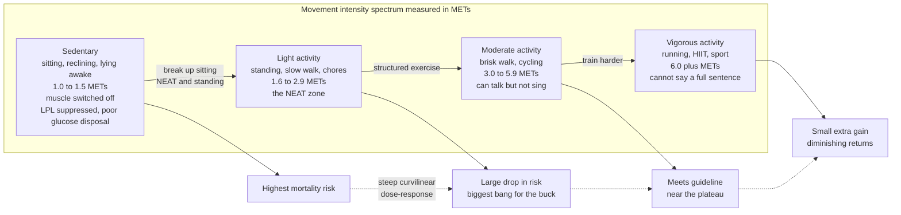

# 🚶 Sedentary Behavior and Physical Activity Guidelines

> [!abstract] TL;DR
> **Physical inactivity** (not meeting exercise guidelines) and **sedentary behavior** (prolonged sitting or reclining at very low energy cost) are **two distinct, independently harmful exposures** — you can tick the "I exercise" box and still injure your health by sitting for ten hours a day, the so-called **"active couch potato."** The physiology is separate: prolonged muscular stillness suppresses **lipoprotein lipase** and blunts **glucose disposal** in a way that a single workout does not fully undo. The **dose-response of activity to mortality is steeply curvilinear** — the biggest health return by far comes from moving a completely sedentary person to *a little* activity, with strong diminishing returns after that. Modern guidelines recommend **150 to 300 minutes per week of moderate** or **75 to 150 of vigorous** aerobic activity plus **muscle strengthening twice a week**, and now insist that **any movement counts** (the old 10-minute-bout rule is gone). The famous **"10000 steps"** target was a **1960s marketing slogan**, not science; the mortality benefit largely **plateaus around 7000 to 8000 steps**.

---

## Intuition

**Analogy:** "**Sitting is the new smoking.**" The phrase overstates the magnitude, but it captures the crucial idea: **prolonged stillness is its own risk factor**, distinct from whether you also exercise — just as smoking harms you regardless of how healthy the rest of your lifestyle is. Think of a car left idling in a cold garage for hours: even a good engine that gets driven hard every morning gathers sludge if it sits motionless the rest of the day. Your metabolism is similar. The morning run is real and valuable, but it does not neutralize the eight hours your muscles then spend switched off. **Movement is not a single daily deposit you make at the gym — it is a background hum your body expects all day long.**

A second, more hopeful intuition governs *how much* activity you need. The benefit of movement is not a straight line where more is proportionally better. It is an **L-shape**: the jump from **zero to a little** buys you enormous health, while the jump from **a lot to even more** buys you almost nothing. The couch-to-walking transition is the single best deal in preventive medicine; the marathoner shaving another hour off weekly training is bargaining in the flat tail of the curve.

---

## How It Works

### Two different exposures, two different physiologies

The field's foundational distinction is between **physical inactivity** and **sedentary behavior**:

- **Physical inactivity** means *failing to accumulate enough moderate-to-vigorous activity* to meet guidelines. It is defined by what you **don't** do.
- **Sedentary behavior** means *time spent in sitting, reclining, or lying postures during waking hours at an energy cost near rest* — technically **≤1.5 METs** (metabolic equivalents). It is defined by what you **do** do, and it is measured in hours of accumulated sitting, not in workouts skipped.

These are only weakly correlated. Someone can run 45 minutes each morning (guideline-compliant, not physically inactive) and then sit for the remaining 15 waking hours (highly sedentary). That person is the **"active couch potato,"** and large accelerometer cohorts show they still carry elevated mortality risk relative to equally-exercising people who *also* sit less.

The physiology explains why one cannot substitute for the other. When large postural muscles (quadriceps, glutes, back) sit inactive:

1. **Lipoprotein lipase (LPL) activity collapses.** LPL is the enzyme anchored on capillary walls that pulls triglycerides out of the bloodstream into muscle for oxidation. Muscular *contraction* is a primary stimulus for its expression; hours of stillness suppress skeletal-muscle LPL sharply (Hamilton's rat and human work). The result is higher circulating triglycerides and lower HDL.
2. **Glucose disposal is impaired.** Muscle contraction recruits **GLUT4** transporters to the cell membrane *independently of insulin*, letting working muscle mop up blood glucose. Sitting removes this contraction-driven uptake, so post-meal glucose spikes are larger and insulin has to work harder — a step toward insulin resistance.
3. **Reduced overall energy expenditure and blood flow**, with downstream effects on endothelial function and inflammation.

Crucially, these are **local, contraction-dependent** effects. A single bout of morning exercise raises LPL and GLUT4 recruitment *during and shortly after* the bout, but the enzyme activity and glucose-handling drift back down during the long sedentary hours that follow. This is the mechanistic root of the "active couch potato" — the workout and the sitting act through overlapping but non-identical pathways, so meeting the exercise guideline does not fully cancel the harm of prolonged sitting.

### The dose-response curve and the "steps" evidence

Plotted against all-cause mortality, weekly activity produces a **steep, curvilinear (L-shaped) dose-response**. Moving from the bottom (essentially no activity) to even light or modest activity delivers the **largest single reduction in risk**; each additional increment beyond that buys progressively less. In relative terms, the couch-to-active transition can cut mortality risk on the order of 20 to 30 percent, while doubling an already-high training volume moves it by a rounding error.

The **step-count** literature makes this concrete. Meta-analyses (Paluch and colleagues) find mortality falling as daily steps rise but **plateauing around 7000 to 8000 steps** (lower, near 6000 to 8000, in older adults; somewhat higher in younger). The iconic **"10000 steps"** figure has *no original scientific basis*: it came from the brand name **"manpo-kei"** ("10000-step meter"), a Japanese pedometer marketed around the 1964 Tokyo Olympics. It is a fine motivational round number, but the evidence says most of the benefit is already banked well before 10000.

There is a live debate at the **high end**: does *extreme* endurance volume carry any harm? Some observational data (the Copenhagen City Heart Study on "strenuous joggers"; markers of atrial fibrillation and coronary calcium in lifelong extreme athletes) hint at a possible flattening or faint uptick — a **reverse-J or U-shape**. The mainstream reading is that for the general population this is irrelevant: nearly everyone lives on the steep left side of the curve where more is better, and the theoretical high-end risk (if real) is small and confined to a tiny, very-high-volume tail.

### The guidelines, NEAT, and the population view

The **WHO 2020** and **US Physical Activity Guidelines (2018, 2nd ed.)** converge on:

- **150 to 300 minutes/week** of **moderate** aerobic activity, **or 75 to 150 minutes/week vigorous**, or an equivalent mix;
- **muscle-strengthening** activity on **2 or more days/week**;
- and, for the first time, **"any movement counts"** — the earlier rule that activity had to come in **≥10-minute bouts** was **removed** because even short, sporadic movement contributes.
- A separate, explicit message to **"sit less and move more"** — reduce sedentary time and break it up — treated as a *distinct* recommendation from the aerobic target.

Below the exercise threshold lies **NEAT — non-exercise activity thermogenesis** — the energy of fidgeting, standing, walking to the printer, taking stairs, pacing on calls. NEAT can differ by **hundreds of kcal/day** between people and is the main lever for *breaking up sitting*: standing desks, walking meetings, and a two-minute movement snack every 30 minutes measurably blunt post-meal glucose spikes. NEAT is the same construct that appears on the expenditure side of [[Metabolism_and_Energy_Balance]].

At the **population level**, physical inactivity is one of the leading modifiable causes of death worldwide (comparable in order of magnitude to major traditional risk factors) and imposes tens of billions of dollars in annual healthcare cost and lost productivity. Because activity is powerfully shaped by the **built environment** — walkable neighborhoods, transit, parks, safety — it is not a purely individual choice but a **determinant of health** patterned by geography and income (see [[Determinants_of_Health]]).



---

## Key Concepts

### Secondary (school-level intuition)

- **Two different problems.** "Not exercising" and "sitting too much" are **not the same thing**, and each is bad on its own. You can exercise *and* sit too much.
- **Any movement counts.** You do not need a gym or a 30-minute block. Taking the stairs, walking to the shop, standing up during ads — it all adds up. The old "must be at least 10 minutes" rule was dropped.
- **A little beats nothing by a lot.** The biggest health jump is from doing *nothing* to doing *something*. Going from couch to a daily walk helps far more than a fit person adding one more hard workout.
- **10000 steps is a slogan, not a law.** It came from a **pedometer brand name**, not research. Most of the benefit shows up by about **7000 to 8000 steps**.
- **The weekly target:** roughly **150 minutes** of brisk activity a week, plus **strength work twice a week**.

### Undergraduate (definitions, dose-response, physiology)

- **METs (metabolic equivalents).** 1 MET is resting energy expenditure. **Sedentary ≤1.5 METs**; **light 1.6 to 2.9**; **moderate 3.0 to 5.9**; **vigorous ≥6.0**. Guidelines can be expressed as **~500 to 1000 MET-minutes/week**, the equivalent of 150 to 300 min of moderate activity.
- **Physical inactivity vs sedentary behavior — operational definitions.** Inactivity = below the MVPA (moderate-to-vigorous physical activity) threshold; sedentary behavior = accumulated waking sitting/reclining time at ≤1.5 METs. Measured differently (min/week of MVPA vs hours/day sitting) and only weakly correlated.
- **The "active couch potato."** Meeting the aerobic guideline while sitting many hours; accelerometer cohorts show residual elevated risk, i.e., **sedentary time predicts mortality partly independently of MVPA.**
- **Contraction-dependent physiology.** Muscle contraction stimulates **LPL** (clears blood triglycerides) and recruits **GLUT4** to take up glucose **without insulin**. Prolonged sitting suppresses both; a morning workout only transiently reverses them, hence the independence.
- **Breaking up sitting.** Interrupting sitting every 20 to 30 minutes with 2 to 5 minutes of light walking or standing measurably lowers post-prandial glucose and insulin excursions — an intervention distinct from a single continuous workout.
- **Steps evidence.** Mortality falls with steps and **plateaus ~7000 to 8000** (lower in older adults). Cadence/intensity adds modest extra benefit. The **10000 origin** is the **"manpo-kei"** pedometer (~1965).
- **NEAT.** Non-exercise activity thermogenesis — the incidental-movement component of energy expenditure (see [[Metabolism_and_Energy_Balance]]); the primary target of standing desks and movement snacks.

### Graduate (epidemiology, mechanisms, debate)

- **Harmonized meta-analyses.** Ekelund et al. (Lancet 2016) pooled >1 million people with device or self-report data and showed that **high MVPA (~60 to 75 min/day) largely attenuates the mortality hazard of prolonged sitting**, whereas guideline-*minimum* activity does not fully abolish it — nuancing the "active couch potato" claim: sitting risk is **dose-dependent on how active you are**, not simply on/off.
- **Reverse causation and confounding.** Much of this is observational: sick people move less, so illness can *cause* both low activity and death (reverse causation). Studies mitigate with landmark analyses, exclusion of early follow-up, and objective accelerometry (less biased than self-report, which overstates MVPA and understates sitting).
- **The high-end / extreme-volume debate.** Whether very high endurance volumes flatten benefit or add cardiac risk (atrial fibrillation, coronary artery calcification, myocardial fibrosis in some lifelong extreme athletes; the Copenhagen "strenuous joggers" signal) remains contested. Consensus: irrelevant for the general population, who almost all sit on the steep beneficial slope.
- **Molecular mechanisms of inactivity physiology.** Beyond LPL/GLUT4: reduced shear stress and endothelial nitric-oxide signaling, low-grade systemic inflammation, mitochondrial and vascular deconditioning, and altered lipid metabolism — a distinct "inactivity physiology" (Hamilton) rather than merely the *absence* of exercise physiology.
- **Population attributable burden and economics.** Physical inactivity is estimated to cause a large share of coronary heart disease, type 2 diabetes, and certain cancers globally (Lee et al., Lancet 2012), with direct healthcare costs on the order of **~USD 54 to 68 billion/year** worldwide (Ding et al., Lancet 2016) — motivating population and environmental interventions over purely individual advice (see [[Determinants_of_Health]]).
- **Lifespan and special populations.** Older adults gain especially from **strength and balance** work (sarcopenia, falls); pregnancy, chronic disease, and disability have tailored but still substantial activity recommendations. The guideline principle "**some is better than none, and more is generally better up to a point**" holds across groups.

---

## Python Demo

```python
# Dose-response of physical activity to all-cause mortality, plus the
# "active couch potato" effect. numpy + matplotlib only.
#
# Panel 1: relative mortality risk vs weekly activity volume (MET-hours/week).
#          Curvilinear / L-shaped: huge gain from zero -> a little, then a
#          long flat tail. Guideline threshold overlaid.
# Panel 2: relative mortality risk vs daily step count, showing the
#          ~7000-8000 step plateau and the mythical 10000 marker.
# Panel 3: sedentary time carries risk PARTLY INDEPENDENT of exercise -
#          three activity strata vs daily sitting hours.
import numpy as np
import matplotlib.pyplot as plt

# ----- Panel 1: activity dose-response (MET-hours/week) -----------------
# HR = floor + (1 - floor) * exp(-k * dose). Floor = maximal risk reduction.
dose      = np.linspace(0, 40, 400)     # MET-hours per week
hr_floor  = 0.60                        # ~40% max reduction at high volume
k         = 0.18
hr        = hr_floor + (1 - hr_floor) * np.exp(-k * dose)

guideline = 8.75   # ~150 min/week moderate ~ 525 MET-min ~ 8.75 MET-hours

def risk(d):
    return hr_floor + (1 - hr_floor) * np.exp(-k * d)

# Compare the "first little bit" vs "already a lot" increments (each +7.5).
drop_low  = risk(0.0)  - risk(7.5)      # couch -> lightly active
drop_high = risk(30.0) - risk(37.5)     # already high -> even higher
print(f"Risk drop, 0 -> 7.5 MET-hr/wk : {drop_low*100:5.1f} percentage points")
print(f"Risk drop, 30 -> 37.5 MET-hr/wk: {drop_high*100:5.1f} percentage points")
print(f"The first increment buys ~{drop_low/drop_high:.0f}x more benefit.")

# ----- Panel 2: steps-per-day dose-response ----------------------------
steps      = np.linspace(2000, 14000, 400)
step_dose  = np.clip(steps - 2000, 0, None)   # 2000 steps ~ baseline HR 1.0
hr_sfloor  = 0.50
ks         = 0.00045
hr_steps   = hr_sfloor + (1 - hr_sfloor) * np.exp(-ks * step_dose)

# ----- Panel 3: active couch potato ------------------------------------
sitting        = np.linspace(4, 12, 200)      # waking sitting hours/day
hr_inactive    = 1.05 + 0.075 * (sitting - 4) # below guideline: steep rise
hr_guideline   = 0.82 + 0.030 * (sitting - 4) # meets 150 min/wk: still rises
hr_veryactive  = 0.70 + 0.005 * (sitting - 4) # ~60-75 min/day: nearly flat

# ----- Plot ------------------------------------------------------------
fig, ax = plt.subplots(1, 3, figsize=(16, 4.8))

# Panel 1
ax[0].plot(dose, hr, color="#7c3aed", lw=2.6)
ax[0].axvline(guideline, color="#059669", ls="--",
              label="Guideline: 150 min/wk moderate")
ax[0].axhline(hr_floor, color="grey", ls=":", alpha=0.7,
              label="Risk floor (max benefit)")
ax[0].scatter([0, 7.5], [risk(0), risk(7.5)], color="#dc2626", zorder=5)
ax[0].annotate("biggest bang\nfor the buck",
               xy=(4, risk(4)), xytext=(11, 0.90),
               arrowprops=dict(arrowstyle="->", color="#dc2626"))
ax[0].set_title("Activity dose-response (L-shaped)")
ax[0].set_xlabel("Weekly activity (MET-hours/week)")
ax[0].set_ylabel("Relative all-cause mortality risk")
ax[0].set_ylim(0.55, 1.02)
ax[0].legend(fontsize=8)
ax[0].grid(alpha=0.3)

# Panel 2
ax[1].plot(steps, hr_steps, color="#0369a1", lw=2.6)
ax[1].axvline(7500,  color="#059669", ls="--", label="~7500 steps: plateau")
ax[1].axvline(10000, color="#dc2626", ls=":",  label="10000: marketing myth")
ax[1].set_title("Steps/day: benefit plateaus early")
ax[1].set_xlabel("Steps per day")
ax[1].set_ylabel("Relative all-cause mortality risk")
ax[1].set_ylim(0.45, 1.02)
ax[1].legend(fontsize=8)
ax[1].grid(alpha=0.3)

# Panel 3
ax[2].plot(sitting, hr_inactive,   color="#dc2626", lw=2.4,
           label="Below guideline (inactive)")
ax[2].plot(sitting, hr_guideline,  color="#f59e0b", lw=2.4,
           label="Meets guideline (active couch potato)")
ax[2].plot(sitting, hr_veryactive, color="#059669", lw=2.4,
           label="Very active ~60-75 min/day")
ax[2].set_title("Sitting risk is partly independent of exercise")
ax[2].set_xlabel("Daily sitting time (hours)")
ax[2].set_ylabel("Relative all-cause mortality risk")
ax[2].legend(fontsize=8)
ax[2].grid(alpha=0.3)

plt.tight_layout()
plt.savefig("sedentary_dose_response.png", dpi=120)
print("Guideline dose in MET-hours:", guideline,
      "-> risk", round(float(risk(guideline)), 3))
```

**What it shows.** Panel 1 is the headline: the curve plunges over the first few MET-hours and then flattens into a long tail. The printed numbers make it quantitative — the **0 to 7.5 MET-hour** step removes roughly **30 percentage points** of relative risk while the **30 to 37.5** step removes a fraction of one; the first increment is worth **hundreds of times more**. The green guideline line sits at the *knee* of the curve, right where most of the benefit has already been captured. Panel 2 reproduces the **steps plateau near 7500** and shows the **10000 marker** sitting out on the flat, adding almost nothing — the myth's origin visualized. Panel 3 encodes the **"active couch potato"**: meeting the guideline (amber) shifts the whole curve *down* versus being inactive (red), but it still **slopes upward** with sitting hours — the sedentary hazard is only fully flattened at **very high** activity (green). Exercise attenuates, but does not automatically abolish, the cost of prolonged sitting.

---

## Real-World Applications

- **WHO and national public-health campaigns.** The WHO 2020 guidelines' twin messages — hit the aerobic/strength targets *and* "sit less, move more" — drive slogans, workplace policy, and "Exercise is Medicine" clinical prescribing. The removal of the 10-minute-bout rule reframed movement as accumulable throughout the day.
- **Wearables and step goals.** Fitbit, Apple Watch, and smartphone pedometers operationalize the dose-response into nudges. Informed products now temper the "10000" default toward evidence-based, age-adjusted targets and reward *breaking up* sitting (hourly "stand" prompts) rather than only total steps.
- **Sedentary-behavior workplace interventions.** Sit-stand desks, walking meetings, treadmill desks, and "movement snack" reminders target the LPL/glucose physiology directly — the payoff is post-meal metabolic, not just calorie burn. Cardiac and diabetes rehab programs likewise prescribe *frequent light movement* alongside structured exercise.
- **Urban planning and the built environment.** Walkable street grids, protected bike lanes, transit access, parks, and stairs-before-elevators design treat activity as a **determinant of health** shaped by geography and policy (see [[Determinants_of_Health]]) — shifting whole populations leftward on the dose-response curve where the biggest gains live.
- **Clinical risk stratification.** Because activity independently predicts cardiometabolic outcomes, it feeds into how clinicians read and act on glucose, lipid, and blood-pressure biomarkers (see [[Biomarkers_and_Measuring_Health]]) and into healthspan/longevity counseling (see [[Aging_and_Regeneration]]).

---

## Common Pitfalls

- **Conflating inactivity with sedentary behavior.** They are different exposures with different physiology and different remedies. "I ran this morning" answers the *inactivity* question but says nothing about the *sitting* question.
- **Believing a workout cancels a day of sitting.** The "active couch potato" data say it does not fully — LPL and glucose-disposal benefits of a single bout fade, while sedentary hours keep accumulating harm. The fix is *also* breaking up sitting, not a bigger workout.
- **Chasing 10000 steps as a magic threshold.** It is a **1965 pedometer brand name**, not a target derived from outcomes. Most benefit lands by **7000 to 8000**; treating 10000 as a pass/fail line demoralizes people who would benefit hugely from going from 2000 to 5000.
- **Assuming "more is always proportionally better."** The dose-response is **curvilinear**: the person with the most to gain is the *least* active, not the athlete adding volume. Public-health effort should target the sedentary left tail, not push the already-fit further.
- **Trusting self-reported activity.** People overstate MVPA and understate sitting; accelerometry tells a harsher, more accurate story. Conclusions built on questionnaires can misjudge the true dose-response.
- **Ignoring strength and balance.** Aerobic minutes get the headlines, but the **2x/week muscle-strengthening** component (and balance work in older adults) independently reduces mortality, sarcopenia, and falls — omitting it is a half-measure.
- **Over-reading reverse causation.** Observed links between low activity and death are partly because sick people move less. This tempers, but does not erase, the causal signal — which is why trials and mechanism (LPL, GLUT4) matter alongside cohorts.

---

## Related Concepts

- [[Metabolism_and_Energy_Balance]] — NEAT is a component of total daily energy expenditure here; sitting suppresses the movement side of the ledger and impairs glucose disposal.
- [[Determinants_of_Health]] — activity is patterned by the built environment, income, and policy, making it a population-level determinant, not merely an individual choice.
- [[Biomarkers_and_Measuring_Health]] — the glucose, triglyceride, HDL, and blood-pressure markers through which inactivity physiology becomes measurable disease risk.
- [[Homeostasis_and_Human_Physiology]] — muscle contraction, insulin, and glucose regulation are the homeostatic loops that prolonged sitting disrupts.
- [[Habits_and_Behavior_Change]] — the practical engine for "sit less, move more": habit and environment design that turns the guidelines into daily behavior.
- [[Nutrition_Science_Overview]] — diet and activity together drive cardiometabolic health; post-meal glucose control links what you eat to whether you move after eating.
- [[Health_and_Wellbeing_Overview]] — situates physical activity among the pillars of overall health and wellbeing.
- [[Aging_and_Regeneration]] — activity is one of the strongest modifiable levers on healthspan, sarcopenia, and age-related disease.

---

## Review Questions

1. **(Secondary)** Explain, to someone who runs every morning, why they might still be described as an "active couch potato." What extra advice would you give beyond "keep running"?
2. **(Undergraduate)** The dose-response of activity to mortality is L-shaped. Using the ideas of the risk floor and diminishing returns, explain why a public-health program should prioritize a completely sedentary population over encouraging already-active people to train more. Where does the "10000 steps" target come from, and what does the evidence say the plateau actually is?
3. **(Graduate)** Prolonged sitting suppresses lipoprotein lipase and contraction-driven GLUT4 recruitment. Use these mechanisms to argue why sedentary time can predict mortality *partly independently* of meeting the aerobic guideline. Then critique that claim: how do reverse causation, self-report bias, and the Ekelund (2016) finding that ~60 to 75 min/day of activity attenuates sitting risk complicate the simple "sitting is independent" story?

---

## Sources

- Bull, F. C., et al. (2020). "World Health Organization 2020 guidelines on physical activity and sedentary behaviour." *British Journal of Sports Medicine*, 54(24), 1451–1462. — [BJSM](https://bjsm.bmj.com/content/54/24/1451)
- Ekelund, U., et al. (2016). "Does physical activity attenuate, or even eliminate, the detrimental association of sitting time with mortality? A harmonised meta-analysis of over 1 million men and women." *The Lancet*, 388(10051), 1302–1310. — [PubMed](https://pubmed.ncbi.nlm.nih.gov/27475271/)
- Paluch, A. E., et al. (2022). "Daily steps and all-cause mortality: a meta-analysis of 15 international cohorts." *The Lancet Public Health*, 7(3), e219–e228. — [PubMed](https://pubmed.ncbi.nlm.nih.gov/35247352/)
- Hamilton, M. T., Hamilton, D. G., & Zderic, T. W. (2007). "Role of low energy expenditure and sitting in obesity, metabolic syndrome, type 2 diabetes, and cardiovascular disease." *Diabetes*, 56(11), 2655–2667. — [PubMed](https://pubmed.ncbi.nlm.nih.gov/17827399/)
- Lee, I-M., et al. (2012). "Effect of physical inactivity on major non-communicable diseases worldwide: an analysis of burden of disease and life expectancy." *The Lancet*, 380(9838), 219–229. — [PubMed](https://pubmed.ncbi.nlm.nih.gov/22818936/)
- Ding, D., et al. (2016). "The economic burden of physical inactivity: a global analysis of major non-communicable diseases." *The Lancet*, 388(10051), 1311–1324. — [PubMed](https://pubmed.ncbi.nlm.nih.gov/27475266/)

---

#health #physical-activity #sedentary-behavior #exercise-guidelines #NEAT
