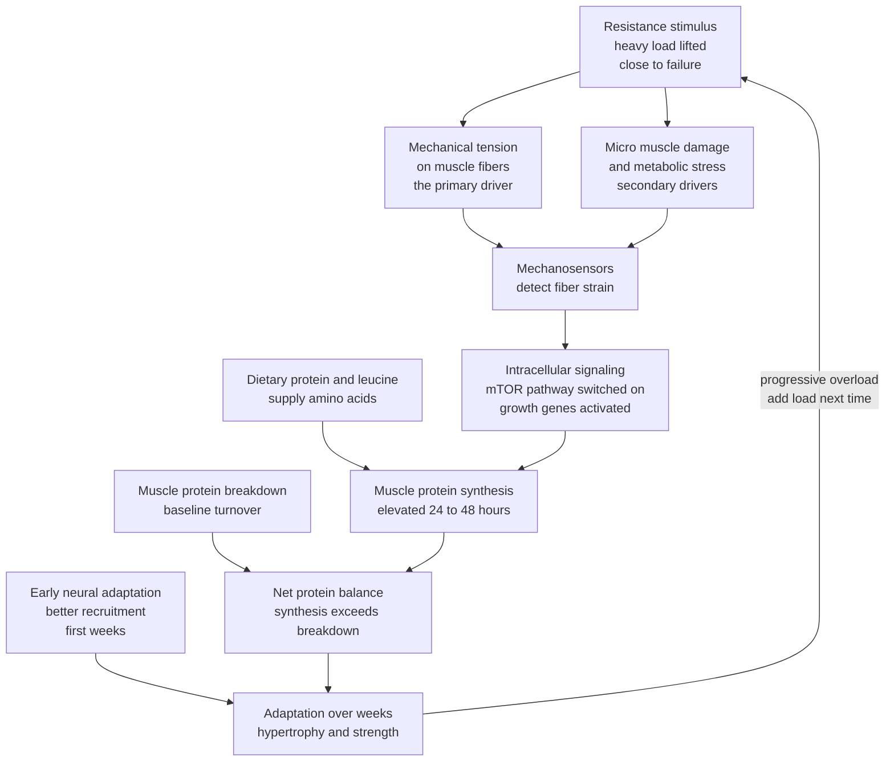

# 💪 Strength, Resistance Training and Muscle

> [!abstract] TL;DR
> **Resistance training** is exercise against a load that forces muscles to produce high force, and skeletal muscle is the tissue that responds by getting **stronger** and, over time, **bigger**. This matters far beyond appearance or sport: muscle is the body's largest **glucose sink**, its main defense against the **falls, frailty, and disability** of aging, and its strength — measured as simply as a **grip test** — is one of the cleanest predictors of how long and how well you will live. Two mechanisms do the work: **early neural adaptations** (your nervous system learns to recruit fibers harder) followed by **structural hypertrophy** driven mainly by **mechanical tension**, which trips intracellular signaling that pushes **muscle protein synthesis** above breakdown for roughly a day or two after each bout. Because that anabolic window is short and gains taper as you approach a **genetic ceiling**, the whole practice reduces to one master principle — **progressive overload**, applied often enough, with enough protein, and enough recovery.

---

## Intuition

**Analogy:** Muscle is a **retirement account for your body**, governed by a strict "use it or lose it" bank. Every heavy set is a **deposit** of strength and tissue; the bigger the balance you build in your 20s, 30s, and 40s, the more **principal** you have to draw down when aging starts making its inevitable **withdrawals**. And this account has an unusual rule: the bank actively **charges you** for balance you do not use. Skeletal muscle is metabolically expensive to maintain, so the body ruthlessly sheds any mass that mechanical demand does not justify — stop lifting, stop moving, and the balance drains.

In the technical domain, this is why bed rest, a desk job, or a cast melts muscle within weeks, while a lifelong lifter reaches old age still above the **disability threshold** — the strength level below which you can no longer rise from a chair or catch yourself in a fall. You are not training to look good today; you are pre-funding your ability to be independent at 80.

---

## How It Works

### Muscle physiology in brief

- **Fiber types.** Skeletal muscle is a mix of **slow-twitch (Type I)** fibers — fatigue-resistant, aerobic, built for endurance and posture — and **fast-twitch (Type II)** fibers — powerful, glycolytic, quick to fatigue, and the ones with the greatest growth potential. Everyone has both; the ratio is largely genetic, but training shifts the *character* of fibers.
- **The motor unit.** A single motor neuron plus every muscle fiber it controls is one **motor unit**. Force is graded two ways: recruiting **more** motor units, and firing them **faster** (rate coding). Under the **size principle** (Henneman), small, weak, slow units are recruited first; only heavy loads or maximal effort call up the large, high-threshold fast-twitch units — which is precisely why intensity and proximity to failure matter for strength.
- **How force is produced.** Inside each fiber, the **sliding-filament mechanism** has myosin heads pull actin filaments past each other, shortening the sarcomere — the molecular basis covered in [[The_Musculoskeletal_System]]. More force means more of those cross-bridges engaged at once, fueled by ATP.

### The mechanisms of adaptation

1. **Strength: neural first, structural later.** For the first several weeks a beginner's strength climbs fast with little visible size change — this is **neural adaptation**: better motor-unit recruitment, higher firing rates, less antagonist co-contraction, improved coordination. The muscle is not much bigger; the nervous system is simply *using* it better. Structural growth then takes over as the slower, longer-term contributor.
2. **Hypertrophy: mechanical tension is king.** The primary driver of muscle growth is **high mechanical tension** sustained across a challenging set. **Muscle damage** and **metabolic stress** (the "pump," lactate accumulation) are secondary, modulating contributors. Tension is maximized by lifting reasonably heavy loads and — critically — by taking sets close to **momentary failure**, which forces the high-threshold fibers into play.
3. **Volume, intensity, proximity to failure.** Growth scales with **volume** (roughly, hard sets per muscle per week) up to a point, then plateaus and eventually turns into junk. **Intensity** (load relative to your max) sets which fibers are recruited. **Proximity to failure** ensures the last, growth-relevant reps actually happen. These three are the levers you turn.
4. **Net protein balance.** Muscle is in constant turnover: **muscle protein synthesis (MPS)** builds, **muscle protein breakdown (MPB)** tears down. Growth requires **net positive balance** — MPS greater than MPB summed over days. A training bout raises MPS for ~24-48 hours; **dietary protein**, and specifically the amino acid **leucine** that trips the anabolic switch, supplies the substrate. Roughly **1.6 g of protein per kg body weight per day** maximizes training-induced gains for most people; the relationship to protein and amino-acid biology is covered in [[Proteins_and_Amino_Acids]].

### The training variables

- **Load / intensity** — expressed as a percentage of your one-rep max, the heaviest weight you can lift once. Heavier loads bias strength and neural gains.
- **Volume** — sets times reps; the main dial for hypertrophy within a sane range.
- **Frequency** — how often each muscle is trained per week. Because MPS is only elevated for a day or two, hitting each muscle **2-3 times per week** keeps it more consistently anabolic than a single weekly hammering.
- **Rest, tempo, exercise selection** — longer rest preserves force for strength work; controlled tempo increases time under tension; **compound movements** (squat, hinge, press, pull) train more muscle per unit time than isolation.
- **The rep continuum** — very heavy loads for low reps favor **strength**; moderate loads for moderate reps favor **hypertrophy**; light loads for high reps favor **muscular endurance**. The boundaries are blurry, but the poles are real.
- **Progressive overload — the master principle.** Muscle only adapts to a stimulus it has not already conquered. Over time you must add load, reps, sets, or better execution. Without progression, you maintain; with it, you grow — the through-line of any sound program.



---

## Key Concepts

### Secondary

- **Skeletal muscle** — the voluntary, striated tissue that moves your skeleton; it is also a metabolic organ that stores and burns fuel, not just an engine for movement.
- **Resistance training** — any exercise where muscles work against an external load: free weights, machines, bands, or body weight. The load is what drives adaptation.
- **Strength vs size** — strength is how much force you can produce; size (hypertrophy) is how much muscle tissue you have. Related but not identical: early strength gains come with little size change.
- **Progressive overload** — gradually increasing the demand so the body keeps adapting. The single non-negotiable principle of getting stronger.
- **Sarcopenia** — the age-related loss of muscle **mass**; **dynapenia** is the age-related loss of muscle **strength**, which happens even faster. Both drive frailty and falls, and resistance training is the primary countermeasure.

### Undergraduate

- **Motor unit and the size principle** — force is graded by recruiting more and larger motor units; high-threshold fast-twitch units only join under heavy load or near failure, which is why intensity and effort matter for full development.
- **Mechanical tension as primary hypertrophy driver** — sustained high tension across a hard set, sensed by mechanotransduction, is the dominant growth signal; muscle damage and metabolic stress are supporting actors, not the leads.
- **MPS vs MPB and the leucine threshold** — net muscle balance is the running difference between synthesis and breakdown; a training bout plus a protein feed containing enough leucine pushes the balance positive. Around 1.6 g/kg/day of protein maximizes gains for most trainees.
- **The rep continuum and percentage of 1RM** — loads near your one-rep max, done for few reps, bias strength; moderate loads for moderate reps bias hypertrophy; light loads for many reps bias endurance. Load selection is how you aim the adaptation.
- **Volume-frequency interaction** — because MPS is elevated only ~24-48 h per bout, distributing weekly volume across 2-3 sessions per muscle sustains a higher time-averaged anabolic signal than one weekly session.

### Graduate

- **Neural-then-structural time course** — beginners' rapid early strength gains are dominated by learning and recruitment; the hypertrophic contribution is slower and becomes the limiting factor as neural efficiency saturates. This is why untrained people gain fast and advanced lifters grind for small increments.
- **Diminishing returns toward a genetic ceiling** — trainable strength approaches an asymptote set by genetics, limb lengths, muscle-fiber makeup, and tendon insertions. Gains follow an exponential-approach curve: large at first, ever-smaller near the ceiling, which reframes "plateaus" as an expected feature, not a failure.
- **Muscle as an endocrine and metabolic organ** — contracting muscle secretes **myokines** and expresses **GLUT4** transporters; training increases insulin-independent and insulin-mediated glucose uptake, improving whole-body **insulin sensitivity** and glucose disposal, linking to [[Metabolism_and_Energy_Balance]].
- **Mechanotransduction and mTOR** — mechanical strain is converted into a biochemical signal that activates the **mTORC1** pathway, upregulating ribosomal translation and, with adequate amino acids, elevating MPS. This is the molecular hinge between "lifting heavy" and "building tissue."
- **Strength as a longevity biomarker** — grip and leg strength predict all-cause and cardiovascular mortality, often more strongly than blood pressure. They index whole-body neuromuscular integrity and reserve, making them cheap, powerful metrics discussed in [[Biomarkers_and_Measuring_Health]]. The biology of the underlying age-related decline is covered in [[Aging_and_Regeneration]].

---

## Python Demo

```python
# Two core ideas about resistance training, modeled with numpy + matplotlib:
#   1. Strength rises toward a GENETIC CEILING with DIMINISHING returns
#      (an exponential-approach curve); the training stimulus sets the rate.
#   2. Muscle protein synthesis (MPS) is elevated for ~24-48 h after a bout,
#      which is why hitting each muscle 2-3x/week beats one weekly session.
import numpy as np
import matplotlib.pyplot as plt

# ---------- 1. Strength progression: exponential approach to a ceiling -------
weeks = np.linspace(0, 52, 400)

def strength(weeks, ceiling, start, rate):
    """Strength approaches a genetic ceiling; gains shrink as you near it."""
    return ceiling - (ceiling - start) * np.exp(-rate * weeks)

CEILING = 140.0   # genetic 1RM ceiling for this lift (arbitrary kg)
START   = 60.0    # untrained starting 1RM

# Training stimulus (volume x intensity x proximity to failure) sets the rate.
stimuli = {
    "Low volume / easy sets":      0.030,
    "Moderate (recommended)":      0.075,
    "High volume, near failure":   0.130,
}

# ---------- 2. MPS time-course after a training bout -------------------------
hours = np.linspace(0, 168, 600)   # one full week
BASELINE = 1.0                     # fasted MPS rate, normalized to 1.0

def mps_response(hours, peak_h=18.0, amplitude=1.2):
    """Fractional MPS elevation above baseline: a gamma-like pulse that
    rises fast, peaks near peak_h, and decays back toward baseline by ~72 h."""
    t = np.clip(hours, 1e-6, None)
    return amplitude * (t / peak_h) * np.exp(1.0 - t / peak_h)

def repeated_bouts(hours, period_h, n_bouts):
    """Superpose MPS pulses from bouts spaced period_h apart."""
    total = np.zeros_like(hours)
    for k in range(n_bouts):
        onset = k * period_h
        total += np.where(hours >= onset, mps_response(hours - onset), 0.0)
    return BASELINE + total

freq_high = repeated_bouts(hours, 48.0, n_bouts=4)   # every 48 h -> 4x/week
freq_low  = repeated_bouts(hours, 168.0, n_bouts=1)  # once per week

# Time-averaged MPS over the week quantifies the frequency advantage.
avg_high = np.trapz(freq_high, hours) / hours[-1]
avg_low  = np.trapz(freq_low,  hours) / hours[-1]

# ---------- Plot -------------------------------------------------------------
fig, (ax1, ax2) = plt.subplots(1, 2, figsize=(13, 5))

for label, rate in stimuli.items():
    ax1.plot(weeks, strength(weeks, CEILING, START, rate), linewidth=2.3, label=label)
ax1.axhline(CEILING, color="black", linestyle="--", linewidth=1.3, label="Genetic ceiling")
ax1.axvspan(0, 6, color="gold", alpha=0.15)
ax1.text(3, START + 6, "early\nneural\ngains", ha="center", fontsize=8)
ax1.set_xlabel("Weeks of consistent training")
ax1.set_ylabel("Estimated 1RM strength (kg)")
ax1.set_title("Progressive overload: fast early gains,\nthen diminishing returns toward a ceiling")
ax1.legend(loc="lower right", fontsize=8)
ax1.grid(alpha=0.3)

ax2.plot(hours, freq_high, color="seagreen", linewidth=2.3,
         label=f"Train every 48 h  (avg MPS {avg_high:.2f}x)")
ax2.plot(hours, freq_low,  color="crimson", linewidth=1.8, linestyle="--",
         label=f"Train once per week  (avg MPS {avg_low:.2f}x)")
ax2.axhline(BASELINE, color="black", linewidth=1.0)
ax2.axvspan(24, 48, color="steelblue", alpha=0.12)
ax2.text(36, 2.05, "elevated\n24-48 h", ha="center", fontsize=8)
ax2.set_xlabel("Hours across one week")
ax2.set_ylabel("Muscle protein synthesis (x baseline)")
ax2.set_title("MPS is elevated ~24-48 h per bout,\nso 2-3 sessions per muscle keep it high")
ax2.legend(loc="upper right", fontsize=8)
ax2.grid(alpha=0.3)

plt.tight_layout()
plt.savefig("strength_and_mps.png", dpi=110, bbox_inches="tight")
plt.show()

# ---------- Numeric look at diminishing returns (moderate stimulus) ----------
mod = stimuli["Moderate (recommended)"]
print("Diminishing returns toward the ceiling (moderate training):")
for w in [0, 4, 12, 26, 52]:
    s = strength(np.array([w]), CEILING, START, mod)[0]
    used = 100 * (s - START) / (CEILING - START)
    print(f"  week {w:2d}: 1RM ~ {s:5.1f} kg   ({used:4.1f}% of headroom used)")
print(f"\nWeekly time-averaged MPS: every-48h = {avg_high:.2f}x  vs  weekly = {avg_low:.2f}x")
```

**What it shows.** The left panel is the shape every honest lifter recognizes: strength climbs steeply at first, then bends toward a genetic ceiling, so the *same effort* buys ever-smaller gains — plateaus are a feature of the curve, not a personal failure, and a bigger stimulus mostly changes *how fast* you approach the ceiling, not where it sits. The right panel shows why **frequency** matters: because each bout lifts MPS for only about a day or two, spreading training across the week keeps the muscle in a positive-balance state far more of the time (higher time-averaged MPS) than a single weekly session that leaves days of wasted anabolic potential.

---

## Real-World Applications

1. **Reversing frailty in older adults.** Landmark trials showed that even nonagenarians in nursing homes doubled or tripled leg strength and improved walking speed after weeks of progressive resistance training — the single most effective intervention against sarcopenia, falls, and loss of independence. It is never too late to start, and older adults respond robustly.
2. **Type 2 diabetes and metabolic health.** Muscle is the body's largest disposal site for blood glucose via GLUT4 transporters. Resistance training improves insulin sensitivity and glycemic control, which is why the ADA and ACSM prescribe it alongside aerobic exercise for prediabetes and diabetes management.
3. **Osteoporosis prevention.** Bone remodels in response to load (Wolff's law). Heavy, progressive resistance training and impact loading increase or preserve bone mineral density at the hip and spine, cutting fracture risk — a benefit drugs alone do not fully replicate.
4. **Grip strength as a clinical vital sign.** A cheap handgrip dynamometer predicts all-cause and cardiovascular mortality across 17 countries in the PURE study — more strongly than systolic blood pressure. Clinicians increasingly use it to screen frailty and stratify surgical and geriatric risk.
5. **Debunking the "bulk" myth for women and beginners.** Women have far lower testosterone and will not accidentally become bulky; they gain strength, bone density, and metabolic health while typically getting *leaner*. Resistance training benefits essentially everyone — its returns are largest precisely in the populations (older adults, women, the sedentary) most likely to avoid it.

---

## Common Pitfalls

- **Ego lifting and broken form** — chasing a heavier number by cheating range of motion or spinal position trades adaptation for injury. Load should progress only when execution stays clean; tension, not weight on the bar, drives growth.
- **No progressive overload (program hopping)** — endlessly switching routines or lifting the same weights forever leaves the muscle nothing new to adapt to. Track your lifts and force a small, consistent progression.
- **Junk volume and always training to failure** — piling on sets past the useful range, or grinding every set to failure, degrades recovery and MPS without extra growth. Stop most sets one to three reps shy of failure and keep weekly volume in a sane band.
- **Neglecting protein and total calories** — training is the signal; protein is the material. Under-eating protein (well below ~1.6 g/kg/day) or being in a large calorie deficit caps how much muscle you can build or even preserve.
- **Insufficient recovery and frequency mismatch** — hammering the same muscle daily never lets net balance stay positive, while training it once a week wastes the 24-48 h MPS window. Aim for roughly 2-3 quality sessions per muscle per week with real rest between.
- **Using soreness (DOMS) as a progress meter** — muscle soreness reflects unfamiliar or damaging work, not growth. Chasing soreness leads to random, damaging training; measurable strength and volume progression is the honest signal.
- **Older adults training too timidly** — fear of "too heavy" leads to loads too light to recruit fast-twitch fibers. Under supervision, older trainees need genuinely challenging, progressive resistance — and often *more* protein — to fight sarcopenia effectively.

---

## Related Concepts

- [[The_Musculoskeletal_System]] — the fiber, sarcomere, and sliding-filament machinery that resistance training adapts; force production at the molecular level.
- [[Proteins_and_Amino_Acids]] — the leucine and amino-acid substrate that turns elevated MPS into actual new muscle tissue.
- [[Aging_and_Regeneration]] — the biology of aging and satellite-cell decline underlying sarcopenia and the loss of regenerative capacity.
- [[Metabolism_and_Energy_Balance]] — muscle as the body's largest glucose sink and a key determinant of resting metabolic rate and insulin sensitivity.
- [[Biomarkers_and_Measuring_Health]] — grip and leg strength as validated longevity biomarkers; how strength predicts mortality.
- [[Nutrition_Science_Overview]] — the broader nutritional context for protein intake, energy balance, and supporting training adaptation.
- [[Homeostasis_and_Human_Physiology]] — the hormonal and physiological regulation that frames muscle turnover and adaptation.
- [[Bioenergetics_and_ATP]] — the ATP that powers cross-bridge cycling and the energy systems that fuel a set.

---

## Review Questions

### Secondary

1. Explain in plain terms why a beginner can get noticeably **stronger** in the first few weeks without their muscles looking much **bigger**.
2. What is **progressive overload**, and why will you stop making progress without it?
3. Name two health benefits of resistance training that have nothing to do with appearance or sport, and briefly say why muscle provides each.

### Undergraduate

1. Using the **size principle** of motor-unit recruitment, explain why training close to failure (or with heavy loads) is important for developing the muscle's growth potential.
2. Distinguish **muscle protein synthesis** from **breakdown**, and explain how training frequency and protein intake combine to keep net balance positive. Why does the ~24-48 h MPS window argue for 2-3 sessions per muscle per week?
3. What are **sarcopenia** and **dynapenia**, and why is resistance training considered the primary countermeasure rather than aerobic exercise or diet alone?

### Graduate

1. Strength gains follow an exponential approach to a genetic ceiling. Given this, construct an argument for how you would program the training of a rank beginner versus an advanced lifter differently, and justify it in terms of neural-versus-structural adaptation and diminishing returns.
2. Grip strength predicts mortality more strongly than blood pressure in large cohorts. Distinguish the claim that strength *causes* longevity from the claim that it *marks* it, describe what could confound the association, and outline the evidence that would be needed to establish causation. Connect this to how [[Biomarkers_and_Measuring_Health]] treats predictive versus causal markers.
3. Explain, at the level of mechanotransduction and mTORC1 signaling, why "mechanical tension" is considered the primary driver of hypertrophy while metabolic stress and muscle damage are secondary. What experimental design could separate these drivers, and what would confound it?

---

## Sources

- [Schoenfeld, B. J. "The Mechanisms of Muscle Hypertrophy and Their Application to Resistance Training." *Journal of Strength & Conditioning Research*, 2010; 24(10):2857-2872](https://journals.lww.com/nsca-jscr/fulltext/2010/10000/the_mechanisms_of_muscle_hypertrophy_and_their.40.aspx)
- [Morton, R. W., et al. "A systematic review, meta-analysis and meta-regression of the effect of protein supplementation on resistance training-induced gains in muscle mass and strength in healthy adults." *British Journal of Sports Medicine*, 2018; 52(6):376-384](https://pubmed.ncbi.nlm.nih.gov/28698222/)
- [Leong, D. P., et al. "Prognostic value of grip strength: findings from the Prospective Urban Rural Epidemiology (PURE) study." *The Lancet*, 2015; 386(9990):266-273](https://pubmed.ncbi.nlm.nih.gov/25982160/)
- [Cruz-Jentoft, A. J., et al. "Sarcopenia: revised European consensus on definition and diagnosis (EWGSOP2)." *Age and Ageing*, 2019; 48(1):16-31](https://academic.oup.com/ageing/article/48/1/16/5205337)
- [Fiatarone, M. A., et al. "Exercise Training and Nutritional Supplementation for Physical Frailty in Very Elderly People." *New England Journal of Medicine*, 1994; 330:1769-1775](https://www.nejm.org/doi/full/10.1056/NEJM199406233302501)

---

#health #exercise #strength-training #hypertrophy #sarcopenia
