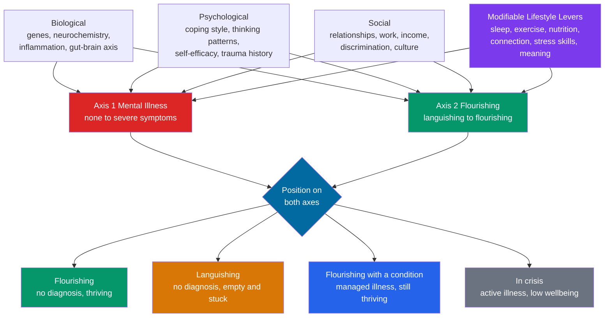

# 🧠 Mental Health and Psychological Wellbeing

> [!abstract] TL;DR
> **Mental health is not merely the absence of mental illness** — just as physical health is more than the absence of disease. The modern evidence supports a **two-continua model** (Keyes): one axis measures **psychopathology and distress** (none to severe), and a *separate* axis measures **flourishing versus languishing** (feeling good and functioning well versus feeling empty and stuck). Because the axes are only partly correlated, you can be **free of any diagnosable illness yet languishing**, or living **with a managed condition yet flourishing**. This note treats mental health as **applied whole health**: it is produced by the same **biopsychosocial determinants** as physical health, it is tightly and *bidirectionally* coupled to **sleep, exercise, nutrition, social connection, and stress**, and it responds to a short list of **modifiable lifestyle levers** — the domain now called **lifestyle psychiatry**. Individual levers matter, but they sit inside a social terrain that individual effort alone cannot fully overcome.

---

## Intuition

**Analogy: mental health has two dials, not one switch.**

Most people picture mental health as a single on-off switch: you are either "fine" or you are "ill." But that is like judging a car by whether the check-engine light is on. The absence of a warning light tells you the engine has not *failed* — it says nothing about whether the engine is running smoothly, has power in reserve, and pulls strongly up a hill. A car can have no fault code and still be sluggish, rough, and joyless to drive; another car can have a managed, known issue and still run beautifully day to day.

Mental health works the same way, and it takes **two dials** to read it. The first dial is **distress and symptoms** — how much anxiety, low mood, or disorder is present. The second, entirely separate dial is **flourishing** — how much positive emotion, engagement, meaning, and good functioning is present. Turning the symptom dial down to zero does **not** automatically turn the flourishing dial up. A person with no diagnosable disorder can still feel flat, empty, and directionless — a state Keyes named **languishing**. And a person carrying a treated condition can still be turning the flourishing dial high — connected, purposeful, and functioning well. Whole-health thinking means watching **both dials**, because most of what moves them is not the clinic but how the machine is *operated day to day*: how it sleeps, moves, eats, connects, and recovers.

---

## How It Works

### Core mechanics

**1. Mental health is part of health, not a separate category.** The WHO defines health as *"a state of complete physical, mental and social well-being and not merely the absence of disease,"* and defines mental health as *"a state of wellbeing in which the individual realises their own abilities, can cope with the normal stresses of life, can work productively, and is able to contribute to their community."* Both definitions insist mental wellbeing is a *positive capacity*, not just the absence of symptoms — the same move the [[Health_and_Wellbeing_Overview]] makes for physical health with the idea of **positive health**.

**2. The two-continua model (Keyes).** Corey Keyes's work overturned the single-axis view with a decisive empirical finding: measures of **mental illness** and measures of **mental wellbeing** load onto *two correlated but distinct factors*, not one. This produces four states:

- **Flourishing** — low symptoms, high wellbeing. Feeling good and functioning well.
- **Languishing** — low symptoms, low wellbeing. No diagnosis, but stuck, hollow, "quietly not okay." Keyes showed languishing carries elevated risk of future major depression and functional impairment comparable to some diagnosed states.
- **Flourishing with a condition** — high symptoms, high wellbeing. Living with a managed illness yet thriving.
- **In crisis / struggling** — high symptoms, low wellbeing. Active illness *and* low functioning.

The key clinical and public-health implication: **reducing illness and building flourishing are two different jobs.** Treatment that removes symptoms may leave a person languishing; promotion that builds wellbeing can protect people who never meet a diagnostic threshold.

**3. What "wellbeing" actually means — two traditions.** Positive functioning splits into two philosophical lineages, both measurable:

- **Hedonic wellbeing** — *feeling good*. Frequent positive affect, infrequent negative affect, and life satisfaction (Diener's **subjective wellbeing**). Covered in depth in [[Happiness_and_Wellbeing]].
- **Eudaimonic wellbeing** — *functioning well and living meaningfully* (Aristotle's flourishing). Operationalized by **Ryff's six dimensions** — self-acceptance, positive relations, autonomy, environmental mastery, purpose in life, personal growth — and by **Seligman's PERMA** (Positive emotion, Engagement, Relationships, Meaning, Accomplishment), detailed in [[Positive_Psychology]].

**4. Common conditions and their scale.** Globally, roughly **1 in 8 people** live with a mental disorder. **Depression** (about 280 million people) and **anxiety disorders** (about 300 million) are among the **leading causes of disability worldwide** measured in years lived with disability. The clinical detail of these lives in Psychology — [[Mood_Disorders]], [[Anxiety_and_OCD_Disorders]], and the map in [[Psychological_Disorders_Overview]] — and this note deliberately does not duplicate it.

**5. Biopsychosocial determinants and the lifestyle levers.** Mental health is produced by the **same biopsychosocial system** as physical health (see [[Determinants_of_Health]]): **biological** factors (genes, neurochemistry, inflammation, the gut-brain axis), **psychological** factors (coping style, thinking patterns, self-efficacy, trauma history), and **social** factors (relationships, work, income, discrimination, culture). Crucially, a subset of these is **modifiable**, and their links to mental health are strong and **bidirectional**:

- **Sleep** — disrupted sleep both predicts and worsens depression and anxiety; treating insomnia improves mood.
- **Exercise** — physical activity has a **moderate antidepressant and anxiolytic effect**, partly via BDNF-driven [[Neuroplasticity]], endorphins, and reduced inflammation; for mild-to-moderate depression it can rival medication or therapy as an adjunct.
- **Nutrition and the gut** — dietary patterns and the [[The_Gut_Microbiome_and_Nutrition|gut microbiome]] influence mood via the gut-brain axis and systemic inflammation ("inflammatory hypothesis of depression").
- **Social connection** — belonging is one of the strongest predictors of wellbeing; isolation rivals smoking as a mortality risk.
- **Stress skills** — chronic stress and HPA-axis overactivation drive both mental and physical disease; regulation skills buffer it (see [[Stress_and_Coping]]).
- **Meaning and purpose** — having a "why" predicts resilience, lower mortality, and slower cognitive decline.

This clustering of modifiable inputs is the basis of **lifestyle psychiatry / lifestyle medicine for mental health** — treating the "causes of the causes" alongside symptom-focused care.

### Flow / Architecture



The diagram's core lesson: the **same biopsychosocial inputs and lifestyle levers feed two independent axes**, and only their *combined* position produces the lived state. Because the axes move semi-independently, "no illness" and "flourishing" are different targets — which is why languishing (top-left of the four states) is a real, treatable problem even with a clean bill of clinical health.

---

## Key Concepts

### Secondary Level

- **Mental health is not just "not being ill."** You can have no diagnosis and still feel flat and stuck. Being *well* means more than not being sick.
- **Two dials, not one switch:** one dial is how much distress or symptoms you have; a separate dial is how much you are *flourishing* — feeling good and doing well. Watch both.
- **Languishing** is the name for "no diagnosis but empty and going through the motions." It matters because it can slide into illness if ignored.
- **The everyday levers** that move mental wellbeing are the same boring, powerful ones that move physical health: sleep, movement, food, friends, managing stress, and having a purpose.

### Undergraduate Level

- **The two-continua (dual-continua) model — Keyes.** Mental illness and mental wellbeing form *two correlated but distinct dimensions*, producing four states (flourishing, languishing, flourishing-with-condition, in crisis). Contrast with the older **single-continuum** view where wellbeing is simply the opposite end of illness.
- **Hedonic vs eudaimonic wellbeing.** Hedonic = feeling good (positive affect, life satisfaction — Diener's SWB); eudaimonic = functioning well and meaning (Aristotle; **Ryff's six dimensions**; **Seligman's PERMA**). See [[Happiness_and_Wellbeing]] and [[Positive_Psychology]].
- **Biopsychosocial model of mental health (Engel).** Mental states emerge from interacting biological, psychological, and social systems — the same framework used for physical health in [[Determinants_of_Health]]. "It's just a chemical imbalance" is an oversimplified biomedical caricature.
- **Prevalence and burden.** Depression and anxiety are among the world's **leading causes of disability** (years lived with disability). Roughly **1 in 8** people live with a mental disorder — clinical specifics in [[Mood_Disorders]] and [[Anxiety_and_OCD_Disorders]].
- **The care spectrum.** From **self-care** (sleep, exercise, connection, routine) → **social and peer support** → **psychological therapy** (CBT, ACT, IPT — see [[Cognitive_Behavioral_Therapy]]) → **medication** (SSRIs and others, acting on neurotransmitter systems — see [[Neurotransmitters_and_Psychopharmacology]]). Severity and preference guide the step, and steps combine.

### Graduate Level

- **Complete state model and axioms of mental health (Keyes 2005).** Keyes formalized testable axioms — that mental health and mental illness are distinct latent factors, that flourishing predicts outcomes independent of illness, and that *complete mental health* requires both low illness **and** high flourishing. Flourishing predicts lower all-cause mortality, fewer missed workdays, and reduced future risk of mental illness even after controlling for baseline symptoms.
- **Lifestyle psychiatry as an evidence base (Firth et al. 2020).** Meta-reviews establish exercise, diet, sleep, and smoking cessation as having replicable effects on the prevention and treatment of mental disorders — with **exercise** the strongest evidence (moderate effect sizes for depression; effective adjunct). Mechanisms span BDNF and hippocampal neurogenesis ([[Neuroplasticity]]), HPA-axis regulation, anti-inflammatory effects, and self-efficacy.
- **The inflammation and gut-brain hypotheses.** A subset of depression is associated with elevated inflammatory cytokines (IL-6, CRP); the microbiota-gut-brain axis modulates mood via vagal signalling, microbial metabolites, and immune pathways ([[The_Gut_Microbiome_and_Nutrition]]). This reframes some mental illness as partly a systemic, whole-body condition — the essence of the **mind-body connection** and psychosomatic health.
- **Protective factors and the "why" effect.** Meaning, purpose, and social integration are not soft extras: purpose-in-life scores predict reduced mortality and slower cognitive decline; strong social ties are among the most robust longevity predictors, echoed in the lifestyle patterns of long-lived **Blue Zone** populations (movement, plant-forward diets, dense social networks, purpose).
- **The structural ceiling on individual solutions.** Lifestyle levers are necessary but not sufficient. Poverty, discrimination, unsafe housing, precarious work, and trauma are *upstream* drivers of mental illness; prescribing "sleep and exercise" to someone in an unsafe, insecure environment can shade into victim-blaming. As with physical health ([[Determinants_of_Health]]), individual-level and structural interventions are complementary, not substitutes — and individual-only framing can *widen* inequities.

---

## Python Demo

```python
# Mental health as whole health, two visualizations, numpy + matplotlib only:
#   Panel 1 - Keyes' two-continua model as a 2D space with example states.
#   Panel 2 - Lifestyle levers as an additive "waterfall" onto a wellbeing score,
#             showing lifestyle medicine's cumulative effect.
import numpy as np
import matplotlib.pyplot as plt

fig, ax = plt.subplots(1, 2, figsize=(14, 6))

# ---------------------------------------------------------------------------
# Panel 1: the dual-continua model (Keyes)
#   x-axis = mental illness severity   0 = none ... 1 = severe
#   y-axis = flourishing               0 = languishing ... 1 = flourishing
# ---------------------------------------------------------------------------
ax[0].axvline(0.5, color="black", lw=1, ls="--")
ax[0].axhline(0.5, color="black", lw=1, ls="--")

# Quadrant background labels (the four states)
ax[0].text(0.25, 0.95, "FLOURISHING\nno illness, thriving",
           ha="center", va="top", color="#059669", fontweight="bold")
ax[0].text(0.75, 0.95, "FLOURISHING\nWITH A CONDITION\nmanaged illness, thriving",
           ha="center", va="top", color="#2563eb", fontweight="bold")
ax[0].text(0.25, 0.18, "LANGUISHING\nno illness, empty & stuck",
           ha="center", va="center", color="#d97706", fontweight="bold")
ax[0].text(0.75, 0.18, "IN CRISIS\nactive illness, low wellbeing",
           ha="center", va="center", color="#6b7280", fontweight="bold")

# Example individuals placed in the space: (illness, flourishing, label)
states = [
    (0.10, 0.85, "Flourishing"),
    (0.20, 0.20, "Languishing\nbut not ill"),
    (0.70, 0.75, "Struggling\nbut coping"),
    (0.85, 0.15, "In crisis"),
]
for illness, flourish, label in states:
    ax[0].scatter(illness, flourish, s=220, zorder=5,
                  edgecolor="black", color="#7c3aed")
    ax[0].annotate(label, (illness, flourish),
                   textcoords="offset points", xytext=(0, -34),
                   ha="center", fontsize=9)

ax[0].set_xlim(0, 1); ax[0].set_ylim(0, 1)
ax[0].set_xlabel("Mental illness axis  (none -> severe symptoms)")
ax[0].set_ylabel("Flourishing axis  (languishing -> flourishing)")
ax[0].set_title("Two-Continua Model of Mental Health (Keyes)")

# ---------------------------------------------------------------------------
# Panel 2: lifestyle levers additively shift a wellbeing score (0-100)
#   A baseline, then each modifiable lever floats the score upward,
#   illustrating the cumulative logic of lifestyle medicine.
# ---------------------------------------------------------------------------
labels = ["Baseline", "Sleep", "Exercise", "Nutrition",
          "Connection", "Stress\nskills", "Meaning", "Total"]
# Baseline score, then evidence-inspired (illustrative) increments per lever.
deltas = np.array([38, 9, 11, 5, 12, 7, 8], dtype=float)
cum = np.cumsum(deltas)                 # running total after each lever
starts = np.concatenate(([0.0], cum[:-1]))   # each bar starts where prior ended

colors = ["#6b7280", "#0369a1", "#dc2626", "#059669",
          "#7c3aed", "#d97706", "#db2777"]

for i in range(len(deltas)):
    ax[1].bar(i, deltas[i], bottom=starts[i], color=colors[i],
              edgecolor="black", width=0.65)
    ax[1].text(i, starts[i] + deltas[i] + 1.2, f"+{int(deltas[i])}"
               if i > 0 else f"{int(deltas[i])}",
               ha="center", fontsize=9, fontweight="bold")

# Final "Total" summary bar
ax[1].bar(len(deltas), cum[-1], color="#111827", edgecolor="black", width=0.65)
ax[1].text(len(deltas), cum[-1] + 1.2, f"{int(cum[-1])}",
           ha="center", fontsize=9, fontweight="bold")

ax[1].set_xticks(range(len(labels)))
ax[1].set_xticklabels(labels)
ax[1].set_ylim(0, 100)
ax[1].set_ylabel("Wellbeing score  (0-100)")
ax[1].set_title("Lifestyle Levers Accumulate (Lifestyle Medicine)")
ax[1].axhline(50, color="gray", lw=0.8, ls=":")

plt.tight_layout()
plt.savefig("mental_health_two_continua.png", dpi=120)

# Console summary
print("Baseline wellbeing score :", int(deltas[0]))
print("After all lifestyle levers:", int(cum[-1]))
print("Total lift from levers    :", int(cum[-1] - deltas[0]), "points")
assert cum[-1] > deltas[0], "levers should raise wellbeing above baseline"
```

**What it shows.** Panel 1 makes the two-continua model spatial: the four example people occupy four *different* regions, and the crucial cases are off the diagonal — "languishing but not ill" (bottom-left, no diagnosis yet low wellbeing) and "struggling but coping" (top-right, real symptoms yet high flourishing). A single-axis view cannot represent them. Panel 2 makes the lifestyle-medicine logic visible: no single lever is a cure, but sleep, exercise, nutrition, connection, stress skills, and meaning **stack additively**, moving a baseline score well past the mid-line. The point is *cumulative*, not magical — each lever is modest, but together they shift the whole distribution.

---

## Real-World Applications

- **Population mental-health promotion (not just treatment).** Governments and the WHO increasingly fund **flourishing promotion** — school wellbeing curricula, workplace mental-health programs, loneliness strategies — precisely because reducing illness and building flourishing are different jobs. Keyes's model reframed prevention around **languishing** as a target in its own right.
- **Lifestyle psychiatry in clinical care.** Guidelines now list **structured exercise** as a recommended treatment for mild-to-moderate depression, and clinicians "prescribe" sleep repair, activity, and social prescribing (referral to community activities, groups, nature) alongside or before medication.
- **Screening for the social determinants.** As with physical health, health systems screen for isolation, food insecurity, and housing instability, recognizing these as upstream drivers of mental illness rather than separate "social" issues.
- **Corporate and product design.** Wellbeing apps and workplaces operationalize PERMA and Ryff dimensions; the honest ones acknowledge (as [[Happiness_and_Wellbeing]] notes) that structural factors — autonomy, workload, fair managers — move wellbeing more than individual wellness activities.
- **Stigma reduction and help-seeking.** Public campaigns reframing mental health as *health* — treatable, common, on a spectrum everyone sits on — measurably increase help-seeking and reduce the delay between symptom onset and care.

---

## Common Pitfalls

- **Treating "not ill" as "well."** The single most common error, and exactly what the two-continua model corrects. Removing symptoms can leave someone languishing; a screening that only rules out disorder misses the person who is quietly not okay.
- **Reducing mental health to "a chemical imbalance."** The serotonin-deficit story is an oversimplified biomedical caricature; mental health is biopsychosocial. Overselling the neurochemical frame both distorts the science and, paradoxically, can *increase* prognostic pessimism in patients.
- **Prescribing lifestyle to people trapped by structure.** Telling someone in an unsafe, insecure, or discriminatory environment to "just sleep and exercise" ignores the upstream determinants and can become victim-blaming. Lifestyle levers complement, they do not replace, action on social conditions ([[Determinants_of_Health]]).
- **Toxic positivity.** Flourishing is not forced cheerfulness. Genuine wellbeing includes room for negative emotion; suppressing distress ("just think positive") is itself linked to worse outcomes. Positive psychology explicitly rejects this (see [[Positive_Psychology]]).
- **Confusing hedonic feeling-good with eudaimonic functioning.** Chasing pleasure alone hits the hedonic treadmill and adapts away; meaning, engagement, and relationships are the durable, non-adapting components ([[Happiness_and_Wellbeing]]).
- **Ignoring bidirectionality.** Poor sleep worsens mood *and* low mood worsens sleep; inactivity deepens depression *and* depression reduces activity. These loops mean small first steps can compound — in either direction.

---

## Related Concepts

- [[Health_and_Wellbeing_Overview]] — the parent framing: health as positive, function-based capacity across physical, mental, and social dimensions, of which this note is the mental pillar.
- [[Determinants_of_Health]] — the biopsychosocial and social-determinants machinery that produces mental health, and the structural limits on purely individual solutions.
- [[Positive_Psychology]] — the science of flourishing, PERMA, and character strengths; the *building* side of the two-continua model.
- [[Happiness_and_Wellbeing]] — hedonic vs eudaimonic wellbeing, subjective wellbeing, set point, and hedonic adaptation; the wellbeing axis in detail.
- [[Cognitive_Behavioral_Therapy]] — the leading evidence-based psychological treatment referenced in the care spectrum (deferred to for clinical depth).
- [[Psychological_Disorders_Overview]] — the clinical map of mental disorders this note points to rather than duplicates.
- [[Mood_Disorders]] — depression and bipolar disorder in clinical detail (the illness axis, low mood pole).
- [[Anxiety_and_OCD_Disorders]] — anxiety-spectrum conditions in clinical detail (the illness axis, anxiety pole).
- [[Stress_and_Coping]] — chronic stress and the HPA axis as a shared driver of mental and physical illness, and the coping skills that buffer it.
- [[The_Gut_Microbiome_and_Nutrition]] — the gut-brain and inflammation links between diet and mood.
- [[Neurotransmitters_and_Psychopharmacology]] — the neurochemical systems that medications act on in the care spectrum.
- [[Neuroplasticity]] — BDNF-driven brain change, the mechanism behind exercise's antidepressant effect and recovery.

---

## Review Questions

1. **Conceptual.** Explain the two-continua model of mental health. Why is it possible to be "free of any diagnosable illness yet languishing," and what does this imply for a screening program that only measures symptoms?
2. **Scenario.** A primary-care patient with mild-to-moderate depression, no suicidality, prefers to avoid medication. Using the lifestyle-psychiatry evidence and the care spectrum, outline a first-line plan, name the strongest-evidence lever and why, and state the bidirectional loops you would try to break first.
3. **Trade-off / evaluative.** A workplace launches a mindfulness-and-gratitude app to "fix" rising staff burnout. Drawing on the determinants of health and the structural-limits critique, argue for and against relying on individual lifestyle interventions here, and describe what a combined individual-plus-structural approach would add.

---

## Sources

- Keyes, C. L. M. (2002). "The Mental Health Continuum: From Languishing to Flourishing in Life." *Journal of Health and Social Behavior*, 43(2), 207–222.
- Keyes, C. L. M. (2005). "Mental Illness and/or Mental Health? Investigating Axioms of the Complete State Model of Health." *Journal of Consulting and Clinical Psychology*, 73(3), 539–548.
- World Health Organization (2022). *World Mental Health Report: Transforming Mental Health for All.* WHO. [https://www.who.int/publications/i/item/9789240049338](https://www.who.int/publications/i/item/9789240049338)
- Firth, J., et al. (2020). "A meta-review of 'lifestyle psychiatry': the role of exercise, smoking, diet and sleep in the prevention and treatment of mental disorders." *World Psychiatry*, 19(3), 360–380.
- Ryff, C. D. (1989). "Happiness is everything, or is it? Explorations on the meaning of psychological well-being." *Journal of Personality and Social Psychology*, 57(6), 1069–1081.

---

#health #mental-health #wellbeing #flourishing #lifestyle-medicine
