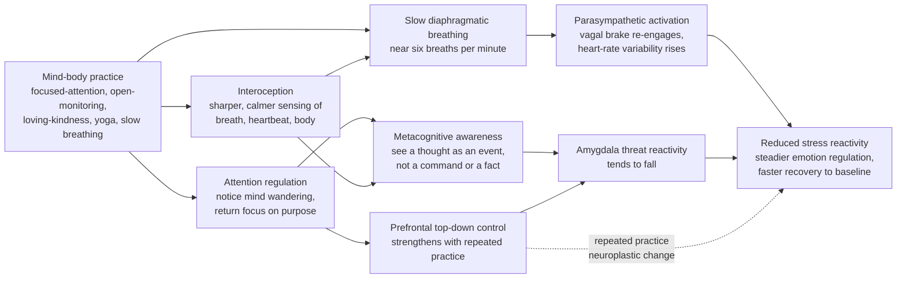

# 🧘 Mindfulness, Meditation and Mind-Body Practices

> [!abstract] TL;DR
> **Mindfulness** is present-moment, **non-judgmental** awareness — noticing what is happening, in the body and mind, without immediately reacting to it. **Meditation** is the family of practices that train this: **focused-attention** (anchor on one object), **open-monitoring** (watch whatever arises), and **loving-kindness** (cultivate warmth). Secular programs — **MBSR** and **MBCT** — package these for clinics. Assessed honestly, the **evidence is real but modest**: moderate support for reducing stress, anxiety, depression *relapse* (MBCT), and chronic pain, with effect sizes **comparable to other active treatments** and a research literature weakened by weak controls, publication bias, and over-hyped neuroscience. The **clearest, fastest, most mechanistic lever** is not mystical at all — it is **slow breathing**: breathing near **6 breaths per minute** hits the cardiovascular system's **resonance frequency**, maximizing **heart-rate variability** and **vagal (parasympathetic) tone**, which is the body's physiological "brake" on the stress response. Yoga, tai chi, and qigong combine movement, breath, and attention with good evidence for **balance, stress, and function in older adults**. Treat all of it as a *skill and a tool*, not a cure — and never as a substitute for treating serious illness.

---

## Intuition

**Analogy 1 — attention as a trainable muscle.** Your attention is not a fixed trait; it behaves like a muscle. Sit down to focus on your breath and, within seconds, the mind wanders — to a memory, a worry, a plan. The practice is *not* "keeping a blank mind" (that never happens). The practice is the **rep**: noticing you have wandered, and gently bringing attention back. Every time you notice-and-return, you have done one repetition of the exact circuit that controls focus and dampens rumination. You are not failing when the mind wanders — the wandering *is* the equipment. A hundred returns is a hundred reps.

**Analogy 2 — the breath as a dial wired to the nervous system's brake.** Most of your autonomic nervous system runs without a steering wheel: you cannot *will* your blood pressure down or *decide* to lower your cortisol. But breathing is the one autonomic function that also has a **manual override** — you can consciously speed it up or slow it down. And the breathing rate is wired straight into the **vagus nerve**, the main cable of the **parasympathetic** ("rest-and-restore") system. Slow the breath and you turn a dial that **downshifts the whole stress response**: heart rate falls on each exhale, the vagal "brake" re-engages, and the body's fight-or-flight arousal eases. Fast, shallow, upper-chest breathing turns the dial the other way. This is why "just breathe" is not a platitude — it is the single most direct, evidence-backed handle any of us has on our own physiology.

> This note is the **applied-health, evidence-first** view of mind-body practice. It builds on the autonomic mechanics in [[Autonomic_Nervous_System]], the appraisal-and-coping model in [[Stress_and_Coping]], and the resonance idea in [[Stability_Frequency_Response]]. Companion notes for this section — *Stress and the Stress Response*, *Mental Health and Psychological Wellbeing*, and *Sleep Science and Circadian Rhythms* — will link back here once created.

---

## How It Works

### What "mindfulness" actually names

Mindfulness is often mystified, but the operational definition is dry and useful: **paying attention, on purpose, to the present moment, non-judgmentally** (Kabat-Zinn's phrasing). Two ingredients do the work: (1) **self-regulation of attention** onto immediate experience, and (2) an **orientation of curiosity and acceptance** toward whatever appears. Crucially, "non-judgmental" does not mean *approving* of everything — it means **not adding a second layer of reactivity** ("I shouldn't feel this," "this is unbearable") on top of the raw experience. That second layer is where much suffering is manufactured, and it is exactly what the practice loosens.

### The main families of practice

- **Focused-attention (FA)** — hold attention on a single anchor (breath, a word, a candle). Every wander-and-return trains attentional control and monitoring. This is the beginner scaffold.
- **Open-monitoring (OM)** — drop the single anchor and instead *watch the field* of experience: thoughts, sounds, sensations arise and pass without being grabbed. This trains **metacognitive awareness** — seeing a thought *as a thought* rather than as reality or a command.
- **Loving-kindness / compassion (LKM)** — deliberately generate goodwill toward self and others. Targets the **affective / social** system rather than pure attention; the strongest signal is on positive affect and social connectedness.

### Secular clinical programs

- **MBSR (Mindfulness-Based Stress Reduction)** — Kabat-Zinn's 8-week group program (body scan, sitting meditation, gentle yoga, daily home practice). Originally for chronic pain and stress; the template for the whole field.
- **MBCT (Mindfulness-Based Cognitive Therapy)** — grafts mindfulness onto cognitive therapy specifically to **prevent relapse in recurrent depression**. Its logic: teach recovered patients to spot the early ruminative spiral and *decenter* from it before it re-ignites a full episode. This is its best-evidenced use.

### The proposed mechanisms

Meditation is not one mechanism but a *stack*, and they act on different timescales:

1. **Attention regulation** — repeatedly detecting mind-wandering and re-orienting strengthens fronto-parietal control networks (see [[Attention_and_Executive_Function]]).
2. **Interoception** — sharper, calmer sensing of internal bodily signals (breath, heartbeat, tension). Better interoception underlies both emotion awareness and the breath-as-lever effect below.
3. **Metacognitive awareness / decentering** — experiencing thoughts and feelings as **transient mental events**, not literal truths, which weakens rumination and reactivity.
4. **Emotion regulation and reduced amygdala reactivity** — with practice, threat-related limbic responses tend to fall and top-down prefrontal regulation strengthens (a form of use-dependent change; see [[Neuroplasticity_and_Rehabilitation]]).
5. **Default-mode-network (DMN) modulation** — the DMN supports self-referential, mind-wandering thought; meditation is associated with altered DMN activity and connectivity. *Caveat:* this is the area most prone to **overhyped neuroscience** — real but small, inconsistent, and often over-interpreted.
6. **Parasympathetic activation via slow breathing** — the fastest and most robust mechanism, engaged directly by breath control and elaborated below.

### The breath as an autonomic lever (the clearest mechanism)

Here the physiology is unusually clean. On each **inhale**, vagal (parasympathetic) outflow to the heart is briefly withdrawn and heart rate **rises**; on each **exhale**, vagal tone returns and heart rate **falls**. This breathing-driven oscillation in heart rate is **respiratory sinus arrhythmia (RSA)** — a direct readout of vagal control. The size of that oscillation depends on breathing *rate*, because the cardiovascular control loop (the **baroreflex**) is a **resonant second-order system** with a natural frequency near **0.1 Hz = 6 breaths per minute**. Breathe at that resonance and the RSA swing — and thus **heart-rate variability (HRV)** and vagal tone — is **maximized**. This is a physical resonance, exactly like driving a swing at its natural frequency; the Python demo below makes it concrete, and it ties straight to [[Stability_Frequency_Response]]. Practical forms: **slow diaphragmatic breathing** (~5–6/min), **box breathing** (equal inhale-hold-exhale-hold), and the **physiological sigh** (a double inhale then long exhale, the fastest way to offload arousal).



### The evidence, assessed honestly

Two truths sit side by side. **First: the effects are real.** The most-cited rigorous review — Goyal et al. (2014, *JAMA Internal Medicine*), restricted to trials with **active** control conditions — found **moderate evidence** that mindfulness-meditation programs reduce **anxiety, depression, and pain**, and low or insufficient evidence for many other claimed benefits. MBCT has solid support for **preventing depression relapse**, roughly on par with maintenance antidepressants for recurrent cases. Slow-breathing / HRV-biofeedback has consistent short-term effects on stress physiology.

**Second: the field is methodologically messy, and hype outruns data.** The landmark critique — Van Dam et al. (2018), *"Mind the Hype"* — catalogs the problems: inconsistent definitions of "mindfulness," many trials with **weak or passive controls** (waitlists inflate effects because they do not control for attention, expectation, and group support), **publication bias**, small samples, and **over-interpreted neuroimaging**. The honest summary: effect sizes are **modest and comparable to other active treatments**, not miraculous, and the confident brain-based marketing claims are largely unearned. Reading this literature well is a case study in [[Scientific_Reasoning_and_Method]] — always ask *"compared to what control?"*.

### Yoga, tai chi, qigong, and the relaxation response

**Yoga** and **tai chi / qigong** combine **movement + breath + attention**. Evidence is strongest for **balance and fall prevention, functional fitness, and stress reduction in older adults**, plus modest benefits for low-back pain and mood — best understood as **exercise plus breathwork plus mindfulness bundled together**. Historically, Herbert **Benson's "relaxation response"** (1975) demystified all of this: he showed that any technique combining a mental focus with a passive attitude elicits a common **physiological down-regulation** (lower metabolic rate, heart rate, breathing) — the mirror image of the fight-or-flight response, and the same parasympathetic shift that slow breathing drives directly.

---

## Key Concepts

### Secondary (intuitive)

- **Mindfulness** = noticing what is happening right now — in your body and mind — without instantly reacting or judging.
- **Meditation** = the exercise that trains this; the mind wandering and coming back is the workout, not a failure.
- **The breath as a brake** = breathing *slowly* calms the body because it switches on the "rest-and-restore" nervous system; breathing *fast* winds it up.
- **It is a skill and a tool** = helpful for stress, sleep, and mood — but not magic, and not a replacement for medical or psychological treatment.

### Undergraduate (formal)

- **Three practice families:** **focused-attention** (single anchor), **open-monitoring** (watch the whole field), **loving-kindness** (cultivate warmth) — each trains partly different systems.
- **Clinical programs:** **MBSR** (8-week stress/pain program) and **MBCT** (mindfulness + cognitive therapy for **depression-relapse prevention**).
- **Mechanistic stack:** attention regulation, **interoception**, **metacognitive decentering**, reduced **amygdala** reactivity with stronger prefrontal control, **default-mode-network** modulation, and **parasympathetic** activation via slow breathing.
- **Respiratory sinus arrhythmia (RSA):** heart rate rises on inhale, falls on exhale — a direct index of **vagal tone**; slow breathing amplifies it.
- **Evidence literacy:** moderate, treatment-comparable effects for stress/anxiety/depression/pain; interpret against **active controls**, watch for **publication bias** and **neuro-hype**.

### Graduate (mechanistic and critical)

- **Resonance-frequency breathing:** the baroreflex is a delayed negative-feedback loop with a resonance near **0.1 Hz**; breathing at ~5–6/min drives RSA at that resonance, maximizing HRV amplitude and short-term **baroreflex gain**. This is a physical resonance (a second-order system with low damping), formally the same phenomenon as a resonant peak in a transfer function (see [[Stability_Frequency_Response]]).
- **Vagal tone and the polyvagal / neurovisceral-integration framing:** high resting HRV indexes flexible prefrontal-to-vagal regulation and predicts better emotion regulation and stress resilience; low HRV tracks chronic stress, and correlates with (but does not simply prove) autonomic dysregulation.
- **Construct-validity problem:** "mindfulness" spans a *state*, a *trait*, and a *set of interventions* with different measures (e.g., self-report scales that correlate poorly with behavior) — a live psychometric hazard behind inconsistent findings.
- **Effect-size realism and moderators:** meta-analytic $g \approx 0.3$ for many outcomes against active controls; dosage, home-practice adherence, teacher competence, and population (clinical vs healthy) moderate results more than the "brand" of meditation.
- **Placebo, expectation, and the control problem:** demand characteristics, therapeutic ritual, and group support are potent; strong designs use **active** comparators (e.g., health-education, relaxation, sham biofeedback) precisely to net these out.

---

## Python Demo

```python
# Slow breathing as a lever on the AUTONOMIC NERVOUS SYSTEM.
#
# The cardiovascular control loop (baroreflex + vagal tone) behaves like a
# resonant SECOND-ORDER system with a natural frequency near 0.1 Hz -- that is,
# ~6 breaths per minute. Breathing AT that resonance frequency drives the
# largest heart-rate oscillation (respiratory sinus arrhythmia, RSA), and hence
# the largest heart-rate variability (HRV) and vagal / parasympathetic tone.
# Fast, shallow breathing sits far from resonance -> small HRV -> weaker vagal brake.
#
# This is the SAME physics as a resonant peak in a transfer function
# (see the Signals note "Stability and Frequency Response"): breath control is a
# tunable driver, and the body has a preferred frequency it responds to most.
import numpy as np
import matplotlib.pyplot as plt

# ---- Baroreflex resonance: magnitude of a 2nd-order system ----
f0   = 0.10                     # resonance frequency in Hz  (0.1 Hz = 6 breaths / min)
zeta = 0.12                     # damping ratio: small -> sharp resonant peak
wn   = 2 * np.pi * f0

def rsa_gain(f_breath):
    """Heart-rate swing per unit breathing drive at breathing frequency f_breath (Hz)."""
    w = 2 * np.pi * np.asarray(f_breath, dtype=float)
    return wn**2 / np.sqrt((wn**2 - w**2)**2 + (2 * zeta * wn * w)**2)

# ---- 1) Time-domain heart rate: a fast breather vs a resonant breather ----
fs    = 10.0                    # sampling rate, Hz
t     = np.arange(0, 60, 1/fs)  # 60 seconds
HR0   = 65.0                    # mean heart rate, bpm
drive = 8.0                     # breathing drive strength (arbitrary units)

def heart_rate(f_breath):
    amp = drive * rsa_gain(f_breath)                 # HR oscillation amplitude, bpm
    return HR0 + amp * np.sin(2 * np.pi * f_breath * t), amp

f_slow, f_fast = 0.10, 0.25     # 6 vs 15 breaths / min
hr_slow, amp_slow = heart_rate(f_slow)
hr_fast, amp_fast = heart_rate(f_fast)

# ---- 2) HRV vs breathing rate: the resonance curve ----
bpm      = np.linspace(3, 24, 400)
f_breath = bpm / 60.0
hrv_curve = drive * rsa_gain(f_breath) / np.sqrt(2)  # RMS of HR oscillation ~ SDNN-like HRV

fig, (axL, axR) = plt.subplots(1, 2, figsize=(13, 5))

axL.plot(t, hr_slow, color="#27AE60", lw=2.2,
         label=f"6 breaths/min resonant  -> swing {amp_slow:.1f} bpm")
axL.plot(t, hr_fast, color="#C0392B", lw=2.0,
         label=f"15 breaths/min fast     -> swing {amp_fast:.1f} bpm")
axL.axhline(HR0, color="grey", ls="--", lw=1, label="mean heart rate")
axL.set_xlabel("Time in seconds")
axL.set_ylabel("Instantaneous heart rate (bpm)")
axL.set_title("Respiratory sinus arrhythmia:\nslow breathing drives bigger HR swings")
axL.legend(loc="upper right", fontsize=8)
axL.grid(alpha=0.3)

axR.plot(bpm, hrv_curve, color="#2C3E50", lw=2.4)
peak_bpm = bpm[np.argmax(hrv_curve)]
axR.axvspan(5, 7, color="#2ecc71", alpha=0.12, label="resonance zone 5-7 per min")
axR.axvline(peak_bpm, color="#27AE60", ls="--", lw=1.5,
            label=f"peak near {peak_bpm:.1f} breaths/min")
axR.set_xlabel("Breathing rate (breaths per minute)")
axR.set_ylabel("HRV index (RMS of HR oscillation, bpm)")
axR.set_title("HRV / vagal tone peaks at the\nbaroreflex resonance frequency")
axR.legend(loc="upper right", fontsize=8)
axR.grid(alpha=0.3)

plt.tight_layout()
plt.show()

print(f"HR swing at  6 breaths/min : {amp_slow:5.2f} bpm   (resonant -> high vagal tone)")
print(f"HR swing at 15 breaths/min : {amp_fast:5.2f} bpm   (fast     -> low vagal tone)")
print(f"HRV is maximized near      : {peak_bpm:5.2f} breaths per minute")
```

**What you see.** The left panel shows instantaneous heart rate for the *same person* breathing at two rates. At **15 breaths/min** the heart-rate swing is small; at **6 breaths/min** it is far larger — the exhale-driven vagal return is fully expressed. The right panel plots the **HRV index against breathing rate** and reveals a sharp **resonance peak near 6 breaths/min**: this is not a metaphor but the literal frequency response of a lightly damped second-order control loop. Practically, it explains why nearly every effective breathing protocol converges on **~5–6 breaths per minute**, and why "breath control" is the one manual override we have on the [[Autonomic_Nervous_System]] and thus on the stress response (see [[Stress_and_Coping]]). Change `zeta` to see a *sharper* (lower damping) or *broader* (higher damping) tuning curve — the physiological analog of how tightly an individual's baroreflex is tuned.

---

## Real-World Applications

- **Clinical stress, anxiety, and pain programs.** MBSR is delivered in hospitals and pain clinics; the 2014 JAMA review supports moderate benefit for stress, anxiety, and chronic pain against active controls.
- **Depression-relapse prevention (MBCT).** Recommended in several national guidelines (e.g., UK NICE) for people with recurrent depression — teaching decentering from early ruminative spirals.
- **HRV biofeedback and resonance-frequency breathing.** Used in performance psychology, cardiac rehab, and anxiety treatment; patients breathe at their individual resonance frequency (~4.5–6.5/min) while watching real-time HRV, directly training the mechanism in the demo.
- **Tactical / acute down-regulation.** Box breathing (military, first responders) and the **physiological sigh** (double inhale, long exhale) are taught for fast, in-the-moment arousal control before high-stakes performance.
- **Older-adult health.** Tai chi and qigong have solid evidence for **balance, fall prevention, and function** — bundling gentle exercise, breath, and attention.
- **Workplace and app-based mindfulness.** Widely deployed (Headspace, Calm, corporate programs); useful for many, but effects are typically small and adherence-dependent — not a fix for structural causes of stress like overload.
- **Sleep and pre-sleep routines.** Slow breathing and body-scan practices lower pre-sleep arousal, a common adjunct in insomnia care (links to circadian and sleep-onset physiology).

---

## Common Pitfalls

- **Believing the hype instead of the effect size.** Marketing promises transformation; the data show **modest, treatment-comparable** benefits. Overselling breeds disappointment and dropout. Judge claims by *active-controlled* evidence, not testimonials.
- **The waitlist-control illusion.** Many impressive trials compare meditation to *doing nothing*. That confounds the technique with attention, expectation, and group support. "Better than a waitlist" is a low bar (see [[Scientific_Reasoning_and_Method]]).
- **Treating it as a substitute for real treatment.** Mind-body practice is an *adjunct*, not a replacement, for medication or psychotherapy in serious depression, psychosis, bipolar disorder, PTSD, or physical illness. Framing it as a cure can be dangerous.
- **Meditation adverse effects are real.** A meaningful minority experience anxiety, depersonalization, intrusive memories, or worse — especially in intensive retreats or with trauma histories. "Meditation is always safe" is false; screening and graded exposure matter.
- **Spiritual bypassing.** Using practice to *avoid* problems (grief, conflict, needed action) rather than face them. Calm is not the same as resolution.
- **Chasing a blank mind.** The goal is not to stop thoughts but to change your *relationship* to them. "I can't stop thinking, so I'm bad at this" is the single most common reason people quit — and it misunderstands the exercise entirely.
- **Over-breathing / forcing it.** Deliberate deep breathing done too forcefully can cause hyperventilation, lightheadedness, or tingling. Slow and *gentle*, nasal, low-and-slow diaphragmatic breathing is the target — not big gulping breaths.
- **Ignoring adherence.** Benefits track **home practice**. A one-off app session does little; the effect, like the muscle analogy, is dose-dependent (link to habit formation and [[Neuroplasticity_and_Rehabilitation]]).

---

## Related Concepts

- [[Autonomic_Nervous_System]] — the sympathetic/parasympathetic machinery that slow breathing acts on; the vagal "brake" is the direct target of breathwork.
- [[Stress_and_Coping]] — appraisal, the stress response, and coping; mind-body practice is an emotion-focused and physiological coping tool that lowers reactivity.
- [[Emotion_Theories]] — appraisal and interoception in emotion; decentering and reduced amygdala reactivity are emotion-regulation mechanisms.
- [[Attention_and_Executive_Function]] — the fronto-parietal control networks that focused-attention practice trains; attention regulation is the core cognitive mechanism.
- [[Neuroplasticity_and_Rehabilitation]] — use-dependent, dose-dependent brain change; why *repeated* practice, not one session, is what shifts prefrontal control and reactivity.
- [[Stability_Frequency_Response]] — the second-order resonance and damping ratio that make ~6 breaths/min the HRV-maximizing "resonance frequency" of the baroreflex.
- [[Scientific_Reasoning_and_Method]] — how to read this literature: active vs passive controls, publication bias, effect sizes, and neuro-hype.
- [[Cognitive_Behavioral_Therapy]] — the cognitive-therapy backbone that MBCT grafts mindfulness onto for depression-relapse prevention.
- [[Mood_Disorders]] — recurrent depression, the population where MBCT has its strongest, best-evidenced use.
- [[Anxiety_and_OCD_Disorders]] — a primary target of both mindfulness programs and slow-breathing / HRV biofeedback.
- [[States_of_Consciousness]] — meditation as a trained, self-induced state; useful for placing "altered states" claims in a psychological frame.
- [[Sleep_and_Circadian_Rhythms]] — pre-sleep arousal reduction via slow breathing and body scans; a common adjunct in insomnia care.
- [[Pain_and_Nociception]] — chronic pain is one of the better-evidenced targets of MBSR; attention and appraisal modulate the pain experience.

---

## Review Questions

**Secondary.** In one or two sentences each: what does "non-judgmental awareness" mean, and why is the mind wandering during meditation *not* a sign you are doing it wrong? Then explain, using the "breath as a brake" idea, why breathing slowly helps you calm down.

**Undergraduate.** Name the three main families of meditation and the different systems each mainly trains. Distinguish **MBSR** from **MBCT**, including the specific clinical use where MBCT has its strongest evidence. Then explain **respiratory sinus arrhythmia** and why it is used as an index of **vagal tone**.

**Graduate.** (a) Using the resonance model in the Python demo, explain *why* breathing at ~6 breaths/min maximizes HRV, and connect the damping ratio to how sharply tuned an individual's response is. (b) A news headline says "brain scans prove meditation rewires the brain and beats antidepressants." Using the Goyal (2014) and Van Dam (2018) critiques, list three specific reasons to be cautious, and state what study design would be needed to support such a claim. (c) Under what circumstances would you *not* recommend an intensive meditation retreat, and why?

---

## Sources

- Kabat-Zinn, J. (1990). *Full Catastrophe Living: Using the Wisdom of Your Body and Mind to Face Stress, Pain, and Illness.* Delacorte (the founding MBSR text and definition of mindfulness).
- Goyal, M., et al. (2014). "Meditation Programs for Psychological Stress and Well-being: A Systematic Review and Meta-analysis." *JAMA Internal Medicine*, 174(3), 357–368.
- Van Dam, N. T., et al. (2018). "Mind the Hype: A Critical Evaluation and Prescriptive Agenda for Research on Mindfulness and Meditation." *Perspectives on Psychological Science*, 13(1), 36–61.
- Lehrer, P. M., & Gevirtz, R. (2014). "Heart Rate Variability Biofeedback: How and Why Does It Work?" *Frontiers in Psychology*, 5, 756.
- Zaccaro, A., et al. (2018). "How Breath-Control Can Change Your Life: A Systematic Review on Psycho-Physiological Correlates of Slow Breathing." *Frontiers in Human Neuroscience*, 12, 353.
- Kuyken, W., et al. (2016). "Efficacy of Mindfulness-Based Cognitive Therapy in Prevention of Depressive Relapse: An Individual Patient Data Meta-analysis." *JAMA Psychiatry*, 73(6), 565–574.
- Benson, H. (1975). *The Relaxation Response.* William Morrow.

---

#health #mindfulness #meditation #breathwork #mind-body
