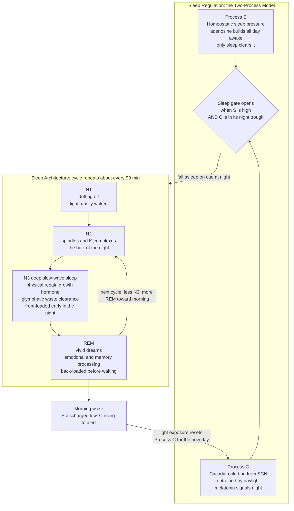

# 😴 Sleep Science and Circadian Rhythms

> [!abstract] TL;DR
> Sleep is not idle downtime — it is a nightly, actively-scheduled **maintenance shift** during which the brain files memories, flushes metabolic waste, and the whole body recalibrates hormones, glucose, immunity, and mood. Its timing and quality are governed by two clocks: a **homeostatic pressure (Process S)** that builds with every waking hour (adenosine) and a **circadian rhythm (Process C)** set by the brain's master clock and daylight. Chronically short or mistimed sleep is causally linked to weight gain, insulin resistance, cardiovascular disease, impaired learning, low mood, accidents, and higher dementia risk — and "getting by" on little sleep is mostly the loss of insight into your own impairment. The highest-leverage fixes are behavioral: **consistent timing, morning light, a cool dark room, a caffeine and alcohol curfew, and CBT-I for chronic insomnia** — not sleeping pills or obsessing over tracker scores. *(For the molecular clock, VLPO flip-flop switch, spindle-ripple replay, and glymphatics, see the neuroscience note; this note is the applied, health-and-behavior layer.)*

## Intuition — analogy first

Picture a busy 24-hour factory. All day the machines run and the floor fills with the day's industrial waste, worn parts, and unfiled paperwork. You cannot clean and repair while production is roaring — so the factory schedules a **night maintenance shift**. During that shift the cleaning crew flushes out the accumulated grime, the archive team files the day's records into long-term storage, technicians repair and recalibrate the machines, and the whole plant is retuned for tomorrow. Skip the maintenance shift and the machines still *run* the next day — but slower, sloppier, and one broken part closer to a breakdown. Cut the shift short every night for months and the factory quietly falls apart.

That maintenance shift is sleep. The "filing" is memory consolidation, the "flushing" is the glymphatic system clearing brain waste, the "repair" is tissue growth and hormonal reset. Two independent supervisors decide when the shift can start: a **fatigue gauge** that gets louder the longer the plant runs (Process S / adenosine) and a **shift-schedule clock** on the wall that says when night *should* be (Process C / your circadian clock). When those two agree, you sleep deeply on cue. When they disagree — jet lag, night shifts, doom-scrolling under bright light at midnight — the factory tries to run maintenance during production hours, and the quality of both collapses.

---

## How It Works

Sleep-for-health rests on three practical facts that follow from the biology.

**1. Sleep is architected, and each stage does a different job.** A night is not uniform unconsciousness. You cycle roughly every **90 minutes** through light sleep (N1, N2), **deep slow-wave sleep (N3)**, and **REM**. The mix is deliberately front-and-back loaded: **deep N3 dominates the first half of the night** (physical restoration, growth-hormone release, brain waste clearance, and consolidation of facts and skills), while **REM dominates the last third before waking** (emotional processing, integrating memories, creative recombination). This is why cutting sleep short by waking two hours early is not "losing 25% of sleep" — it disproportionately amputates your REM, and why a consolidated 7–8 hours beats the same total broken into fragments.

**2. Two processes decide when you sleep and how good it is.** *Process S* is homeostatic **sleep pressure**: adenosine accumulates as a byproduct of the brain burning energy while you are awake, and only sleep clears it (caffeine merely *blocks the receptor*, hiding the debt without paying it). *Process C* is the **circadian alerting signal** from the suprachiasmatic nucleus, entrained each day by **light hitting the eye**; darkness releases **melatonin**, the body's "it is night now" signal. You fall asleep easily when S is high *and* C has dropped into its night-time trough. Sleep is best when your sleep window sits on top of your circadian night — which is exactly what shift work and jet lag destroy.

**3. Individuals differ, and the differences are real.** **Chronotype** (lark vs. owl) is roughly 50% heritable — teenagers are biologically shifted late, older adults early. Forcing an owl onto a lark's schedule creates **social jet lag**: the recurring gap between your body clock and your alarm clock, associated with worse metabolic and mood outcomes even at "normal" sleep durations. Genuine short-sleepers who thrive on six hours are rare (a few percent, carrying specific mutations); most self-described short-sleepers are simply chronically deprived and have lost the ability to notice.

The diagram shows the two-process control system feeding into the nightly stage cycle.



---

## Key Concepts

### Secondary (the essentials everyone should know)

- **Sleep is active, not passive.** During sleep the brain files memories, clears waste, and the body repairs — you are paying down a real biological debt, not "doing nothing."
- **Two dials set your sleep:** how *long* you have been awake (sleep pressure) and what *time* your body thinks it is (the circadian clock). Both must line up for good sleep.
- **Light is the master switch.** Morning daylight sets your clock earlier and wakes you up; bright light and screens at night push your clock later and delay sleep.
- **Caffeine hides tiredness, it does not remove it.** It blocks the "sleepy" signal for hours; the debt is still there when it wears off, which is the caffeine crash.
- **Most adults need about 7–9 hours.** Feeling fine on five usually means you have lost the ability to feel how impaired you are.
- **Consistency beats heroics.** A regular sleep and wake time — even on weekends — is one of the single most effective things you can do.

### Undergraduate (mechanisms with a health lens)

- **Sleep debt is cumulative and self-masking.** Sleeping 6 h/night for two weeks produces cognitive impairment equal to two nights of total deprivation, yet subjects *report feeling used to it*. One weekend of "catch-up" does not fully repay it.
- **The metabolic toll.** Even a few nights of short sleep lowers **leptin** (satiety) and raises **ghrelin** (hunger), tilting appetite toward calorie-dense food, while impairing insulin sensitivity — a direct behavioral bridge to [[Metabolism_and_Energy_Balance]] and weight gain.
- **Alcohol and deep sleep.** A "nightcap" helps you fall asleep but **suppresses REM and fragments the second half of the night**; it sedates rather than restores. Alcohol is a common hidden cause of unrefreshing sleep.
- **The circadian night is not just about sleep.** Body temperature, cortisol, blood pressure, glucose handling, and immune activity all follow the clock. Eating or being active at the wrong circadian phase carries metabolic costs *even if you sleep normally*.
- **Social jet lag.** The chronic misalignment between biological chronotype and social schedule (school/work start times) predicts higher BMI, smoking, and depressive symptoms — an argument for later school start times and flexible hours.
- **Sleep and mental health are bidirectional.** Poor sleep amplifies amygdala reactivity and blunts prefrontal control, worsening mood and stress; conversely, stress and rumination fragment sleep (see [[Stress_and_Coping]]). Insomnia is both a symptom and a *cause* of depression and anxiety.

### Graduate (applied depth and controversy)

- **CBT-I is the gold standard for chronic insomnia**, not medication. Its core is counter-intuitive: **sleep restriction** (temporarily shrinking time-in-bed to concentrate homeostatic pressure and rebuild sleep efficiency), **stimulus control** (bed only for sleep, get up if awake >~20 min), and cognitive work on sleep-related catastrophizing. Meta-analyses show durable improvements exceeding those of hypnotics, without dependence.
- **The case against routine sleeping pills.** Benzodiazepine-receptor agonists (zolpidem, etc.) increase *time asleep* but degrade sleep *architecture* — suppressing N3 and REM — so the sleep is less restorative than it looks. They carry tolerance, dependence, next-day impairment, fall/accident risk in the elderly, and associations with worse long-term outcomes. Useful short-term or situationally; a poor chronic solution.
- **The overselling of sleep-tracker data.** Consumer wearables estimate stages from heart rate and motion with modest accuracy against polysomnography and can *manufacture* anxiety — **"orthosomnia,"** where the pursuit of a perfect sleep score itself causes insomnia. Trackers are decent trend and consistency tools, poor per-night stage arbiters, and should never override how you actually feel.
- **Circadian misalignment as an independent disease driver.** Controlled forced-desynchrony studies show that eating and sleeping out of circadian phase raises glucose and blood pressure and lowers leptin *even with adequate total sleep*. The IARC classifies shift work involving circadian disruption as a **probable carcinogen (Group 2A)**. Countermeasures are timed light and dark, strategic melatonin (a chronobiotic, ~0.5 mg, not a sedative), and, where possible, forward-rotating shifts.
- **Glymphatic clearance and dementia risk.** Deep NREM sleep drives cerebrospinal-fluid flushing of interstitial waste including amyloid-β; short and fragmented sleep is prospectively associated with higher dementia risk, and the relationship is likely **bidirectional** — a vicious cycle where amyloid disrupts the very deep sleep that clears it. This makes sleep a candidate modifiable risk factor for Alzheimer's.
- **Sleep and learning.** Consolidation is real and stage-specific (slow-wave sleep for facts/skills, REM for integration and emotional memory), which is why sleeping between study sessions outperforms cramming — the applied bridge to [[Memory_and_the_Learning_Brain]] and [[Spaced_Repetition_and_the_Spacing_Effect]].

---

## Python Demo

This models the **two-process model of sleep regulation (Borbély, 1982)** with a *health-and-lifestyle* framing. Unlike a free-running simulation, here the **sleep window is socially imposed** (an alarm, a shift, a jet-lag schedule) — so we can watch what happens when your fixed schedule fights your clock. We build **Process S** (homeostatic pressure, rising while awake and falling while asleep), **Process C** (the circadian sleep drive, a sinusoid pinned to *body* time), and their **combination**, across four days for three lifestyles: a well-aligned sleeper, a chronically sleep-restricted sleeper, and a night-shift worker whose sleep sits on the wrong side of the clock. The desynchronization — high sleep pressure while awake, or trying to sleep when the circadian clock is screaming "day" — is exactly the misery of jet lag and shift work.

```python
# Two-process model of sleep regulation (Borbely, 1982), health framing.
# Process S: homeostatic sleep pressure -- rises awake, falls asleep.
# Process C: circadian sleep drive -- sinusoid fixed to BODY time (the SCN clock).
# Sleep window is imposed by lifestyle; we watch S, C, and their combination
# align (healthy) or desynchronize (restriction / night-shift misalignment).
import numpy as np
import matplotlib.pyplot as plt

# --- Time grid: 4 days at 6-minute resolution ------------------------
dt = 0.1
DAYS = 4
t = np.arange(0.0, 24 * DAYS, dt)
hod = t % 24.0  # hour of day (body-clock time; the clock does not move)

# --- Process C: circadian SLEEP drive from the SCN -------------------
# Peaks in the biological night (~05:00), lowest mid-afternoon.
# Fixed to body time -- it does NOT follow your behavior. That is the point.
C = 0.5 * (1.0 + np.cos(2.0 * np.pi * (hod - 5.0) / 24.0))   # range 0..1

# --- Three lifestyles: same body clock, different imposed schedules ---
def asleep_mask(start, end):
    # in-bed window by hour-of-day; handles windows crossing midnight
    if start < end:
        return (hod >= start) & (hod < end)
    return (hod >= start) | (hod < end)

schedules = {
    "Aligned  23:00-07:00 (8h)":     asleep_mask(23, 7),
    "Restricted 01:00-06:00 (5h)":   asleep_mask(1, 6),
    "Night shift 08:00-14:00 (day)": asleep_mask(8, 14),
}

# --- Process S: homeostatic sleep pressure ---------------------------
def simulate_S(asleep):
    S = np.zeros_like(t)
    S[0] = 0.35
    S_wake_asymptote, S_sleep_asymptote = 1.0, 0.10
    tau_rise, tau_fall = 18.0, 3.0   # slow build awake, faster discharge asleep
    for i in range(1, len(t)):
        if asleep[i - 1]:
            S[i] = S[i - 1] + dt * (S_sleep_asymptote - S[i - 1]) / tau_fall
        else:
            S[i] = S[i - 1] + dt * (S_wake_asymptote - S[i - 1]) / tau_rise
    return S

results = {name: simulate_S(mask) for name, mask in schedules.items()}
colors = {"Aligned  23:00-07:00 (8h)": "#2E7D32",
          "Restricted 01:00-06:00 (5h)": "#EF6C00",
          "Night shift 08:00-14:00 (day)": "#C62828"}

# --- Plot: S, C, and combined sleep propensity per lifestyle ---------
fig, axes = plt.subplots(3, 1, figsize=(12, 10), sharex=True)

for ax, (name, mask) in zip(axes, schedules.items()):
    S = results[name]
    P = S + C  # combined sleep propensity: high when tired AND biologically night
    # shade the imposed in-bed window
    ax.fill_between(t, 0, 2.1, where=mask, color="#90A4AE", alpha=0.25,
                    step="mid", label="In bed (imposed schedule)")
    ax.plot(t, S, color=colors[name], lw=2.2, label="Process S (sleep pressure)")
    ax.plot(t, C, color="#6A1B9A", lw=1.6, ls="--", label="Process C (circadian sleep drive)")
    ax.plot(t, P, color="#455A64", lw=1.2, alpha=0.7, label="S + C (combined propensity)")

    # health metrics: residual pressure at wake, and circadian alignment of sleep
    wake_up = np.where((~mask) & (np.roll(mask, 1)))[0]
    residual = S[wake_up].mean() if len(wake_up) else np.nan     # grogginess/debt proxy
    align = C[mask].mean()                                       # 1 = sleep at biological night
    ax.set_title(f"{name}   |   residual pressure at wake = {residual:.2f}"
                 f"   |   circadian alignment of sleep = {align:.2f}", fontsize=10)
    ax.set_ylabel("Signal (a.u.)")
    ax.set_ylim(0, 2.1)
    ax.grid(alpha=0.3)

axes[0].legend(loc="upper right", fontsize=8, ncol=2)
axes[-1].set_xlabel("Time (hours; body-clock time is fixed)")
axes[-1].set_xticks(range(0, 24 * DAYS + 1, 12))
plt.tight_layout()
plt.savefig("two_process_health.png", dpi=150)
plt.show()

# --- Console summary -------------------------------------------------
print("Lifestyle                        residual@wake   sleep-alignment")
for name, mask in schedules.items():
    S = results[name]
    wake_up = np.where((~mask) & (np.roll(mask, 1)))[0]
    residual = S[wake_up].mean()
    align = C[mask].mean()
    print(f"{name:32s}   {residual:6.2f}          {align:6.2f}")
print("\nHigher residual@wake  = more unpaid sleep debt (groggier mornings).")
print("Higher sleep-alignment = sleeping when the body clock says NIGHT (better quality).")
```

**What it shows.** For the **aligned** sleeper, Process S drains to a low floor every morning (small residual, well-rested) and the sleep window sits neatly on the circadian night (high alignment) — S and C reinforce each other. For the **restricted** sleeper, the 5-hour window never lets S fully discharge, so residual pressure at wake creeps up night after night: a visible, *accumulating sleep debt* that subjective feeling underestimates. For the **night-shift** worker, the tragedy is misalignment: they try to sleep at 08:00–14:00 when the circadian sleep drive (C) has collapsed toward its daytime minimum, so **S and C pull in opposite directions** — low alignment, poor discharge, and the combined propensity (S + C) is out of phase with the actual sleep window. Same total hours, radically different restoration — which is precisely why "just sleep during the day" fails to fix shift work and jet lag.

---

## Real-World Applications

- **Sleep as a training pillar for athletes and desk workers alike** — deep N3 drives growth-hormone release and tissue repair, so extending sleep measurably improves reaction time, accuracy, and injury resistance; sleep is the cheapest, most under-used recovery tool there is.
- **Fatigue risk management** — aviation, medicine, trucking, and the military schedule shifts and mandatory rest using the two-process model, because 17–19 hours awake impairs performance like a blood-alcohol level of 0.05%. Rostering, nap policies, and light exposure are engineered around Process S and C.
- **Metabolic and cardiovascular prevention** — because short and misaligned sleep tilts appetite hormones and glucose handling, sleep is now a target in obesity, type 2 diabetes, and hypertension management alongside diet and exercise ([[Metabolism_and_Energy_Balance]]).
- **Clinical insomnia care** — CBT-I delivered in person or via app is first-line; sleep restriction and stimulus control produce durable gains without the dependence and architecture-damage of hypnotics.
- **Jet-lag and shift-work protocols** — timed bright light, evening light avoidance, and low-dose melatonin at the target bedtime re-entrain the clock faster than toughing it out; forward-rotating shifts are gentler than backward.
- **Learning and exam prep** — because consolidation happens in sleep, the evidence-based move is to sleep normally between study sessions rather than cram all-night — a direct lever in [[Memory_and_the_Learning_Brain]].

---

## Common Pitfalls

- **"I can train myself to need less sleep."** Sleep debt is a real, measurable deficit that keeps worsening with chronic restriction; the feeling of "getting used to it" is *loss of insight into impairment*, not adaptation. Genuine short-sleepers are a rare genetic minority.
- **The weekend catch-up illusion.** Sleeping in on Saturday partially offsets acute debt but does not undo a week of restriction, and swinging your schedule by hours re-creates social jet lag every Monday. Consistency of *timing* matters as much as total hours.
- **Alcohol as a sleep aid.** It shortens sleep latency but suppresses REM and fragments the back half of the night; you are sedated, not restored. Same trap with cannabis over time.
- **Late caffeine.** Caffeine's half-life is ~5–6 hours, so an afternoon coffee still occupies adenosine receptors at midnight — blocking the sleepy signal without erasing the underlying pressure. A caffeine curfew ~8–10 hours before bed protects deep sleep.
- **Bright light and screens at night.** Evening blue-rich light suppresses melatonin and pushes Process C later, delaying sleep onset. Dim, warm light in the last hours and morning daylight are the two highest-yield circadian levers.
- **Chasing the sleep-tracker score (orthosomnia).** Wearable stage estimates are imprecise, and fixating on them can itself cause insomnia. Use trackers for consistency trends; trust how you feel and function over a nightly number.
- **Reaching for sleeping pills first.** Hypnotics degrade sleep architecture and carry dependence, next-day impairment, and fall risk; CBT-I outperforms them for chronic insomnia and should be tried first.
- **"REM is the only sleep that matters."** Deep N3 and REM do *different* essential jobs — physical repair and waste clearance vs. emotional and memory integration — and cutting sleep short preferentially robs you of the REM-rich final cycles.

---

## Related Concepts

- [[Sleep_and_Circadian_Rhythms]] — the neuroscience companion: SCN molecular clock, VLPO flip-flop sleep switch, spindle-ripple memory replay, and glymphatics; read it for the *mechanisms* this note applies to health.
- [[Metabolism_and_Energy_Balance]] — short and mistimed sleep shifts leptin/ghrelin and impairs insulin sensitivity, tying sleep directly to appetite, weight, and metabolic disease.
- [[Memory_and_the_Learning_Brain]] — consolidation during slow-wave and REM sleep is why sleeping between study sessions beats cramming; the learning-side application of sleep's filing function.
- [[Spaced_Repetition_and_the_Spacing_Effect]] — spacing works partly *because* sleep consolidates between sessions; sleep is the biological substrate that makes distributed practice pay off.
- [[Stress_and_Coping]] — sleep and stress are bidirectional: stress and rumination fragment sleep, and sleep loss amplifies emotional reactivity and impairs coping.
- [[Homeostasis_and_Human_Physiology]] — Process S is a homeostatic drive, and sleep restores dozens of regulated variables (temperature, cortisol, glucose) to their circadian set points.
- [[Health_and_Wellbeing_Overview]] — situates sleep as one of the non-negotiable pillars of health alongside nutrition, activity, and social connection.
- [[Biomarkers_and_Measuring_Health]] — frames the promise and limits of consumer sleep trackers and clinical measures like polysomnography and melatonin phase.

---

## Review Questions

1. **(Secondary)** Your friend says, "I only sleep five hours and I feel totally fine." Using the ideas of sleep debt and loss of insight, explain why "feeling fine" is weak evidence, and name two practical habits that would most improve their sleep.
2. **(Undergraduate)** A night-shift nurse sleeps a full eight hours during the day yet feels chronically exhausted and is gaining weight. Using the two-process model and the concept of circadian misalignment, explain why *total hours* is not the whole story, and describe two evidence-based countermeasures (specifying *when* each is applied).
3. **(Graduate)** A patient with chronic insomnia asks for a long-term prescription of a Z-drug hypnotic. Argue the case for offering CBT-I instead: address (a) what sleep restriction and stimulus control do mechanistically in terms of Process S and conditioned arousal, (b) how hypnotics affect sleep *architecture* versus sleep *duration*, and (c) how you would use, but not over-trust, a patient's wearable data during treatment.

---

## Sources

- Walker, M. (2017). *Why We Sleep: Unlocking the Power of Sleep and Dreams.* Scribner. — [Publisher](https://www.simonandschuster.com/books/Why-We-Sleep/Matthew-Walker/9781501144325)
- Borbély, A.A. (1982). "A two process model of sleep regulation." *Human Neurobiology*, 1(3), 195–204. — [PubMed](https://pubmed.ncbi.nlm.nih.gov/7185792/)
- Hirshkowitz, M., et al. (2015). "National Sleep Foundation's sleep time duration recommendations." *Sleep Health*, 1(1), 40–43. — [PubMed](https://pubmed.ncbi.nlm.nih.gov/29073412/)
- Trauer, J.M., et al. (2015). "Cognitive Behavioral Therapy for Chronic Insomnia: A Systematic Review and Meta-analysis." *Annals of Internal Medicine*, 163(3), 191–204. — [PubMed](https://pubmed.ncbi.nlm.nih.gov/26054060/)
- Roenneberg, T., et al. (2012). "Social jetlag and obesity." *Current Biology*, 22(10), 939–943. — [PubMed](https://pubmed.ncbi.nlm.nih.gov/22578422/)
- Spiegel, K., et al. (2004). "Sleep curtailment reduces leptin and increases ghrelin and hunger." *Annals of Internal Medicine*, 141(11), 846–850. — [PubMed](https://pubmed.ncbi.nlm.nih.gov/15583226/)

---

#health #sleep #circadian-rhythm #sleep-hygiene #two-process-model
